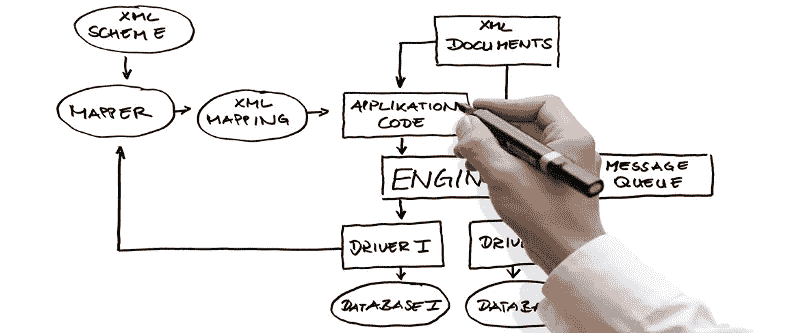

# Swift 5.1 将依赖注入提升到了一个新的高度

> 原文：<https://betterprogramming.pub/taking-swift-dependency-injection-to-the-next-level-b71114c6a9c6>

## 如何使用 Swift 5.1 属性包装器将依赖注入代码减少一半？

Swift 5.1 为该语言带来了许多新功能，其中一些有望彻底改变我们编写和构建 Swift 代码的方式。

本文将讨论 Swift 属性包装器，并演示一种可以用来显著简化代码的方法。

*更新:以下文章已更新，以反映 Swift 5.2 中的变化。*

## 一些背景

现代软件开发是管理复杂性的一种练习，我们尝试的方法之一是通过架构。反过来，架构实际上只是一个术语，用来描述我们如何将复杂的软件分解成容易理解的层和组件。



因此，我们遵循规则，将我们的软件分解成简化的组件，这些组件易于编写，只做一件事(SRP)，并且易于测试。

然而，一旦我们有了一堆组件，我们就必须将所有的组件重新连接起来，形成一个工作应用程序。数字。

以正确的方式将事物连接在一起，我们就有了一个由一组松散耦合的组件组成的整洁的结构。

如果做错了，我们最终会陷入一个紧密耦合的泥沼，其中太多的部分拥有太多关于它们的子组件是如何构造的以及它们如何在内部操作的信息。

这使得组件共享变得几乎不可能，并且使得从一个组件层交换到另一个组件层变得同样困难。

所以我们有一个第二十二条军规。我们用来简化代码的工具和技术最终会让我们的生活变得更加复杂。

幸运的是，我们可以使用另一种技术来管理这种额外的复杂性，这种技术被称为 [*依赖注入*](https://en.wikipedia.org/wiki/Dependency_injection) ，它基于一种被称为 [*控制反转*](https://en.wikipedia.org/wiki/Inversion_of_control) 的原理。


## 依赖注入

对依赖注入的完整和彻底的解释超出了本文的范围，所以让我们假设依赖注入让一个给定的组件请求系统连接到它完成工作所需的所有部分。

那些*依赖关系*被返回给完全形成并准备使用的组件。

例如，ViewController 可能需要一个视图模型。该视图模型可能需要一个 API 组件来获取一些数据，这又需要访问我们的身份验证系统和我们当前的会话管理器。ViewModel 还需要一个数据转换服务，它有自己的依赖项。

ViewController 不关心所有这些，也不应该关心。它只是想与完成工作所需的组件进行对话。

为了演示所涉及的技术，本文将使用一个轻量级但功能强大的 Swift 依赖注入系统，名为 [Resolver](https://github.com/hmlongco/Resolver) 。如果你用不同的，不要担心。可以使用任何 DI 框架。

如果你想了解更多，在 Resolver GitHub 知识库上有一个[关于依赖注入的简明介绍](https://github.com/hmlongco/Resolver/blob/master/Documentation/Introduction.md)指南，以及很多关于 Resolver 本身的文档。

## 一个简单的例子

使用依赖注入的一个非常基本的视图模型可能如下所示:

```
class XYZViewModel { private var fetcher: XYZFetching
    private var service: XYZService init(fetcher: XYZFetching, service: XYZService) {
        self.fetcher = fetcher
        self.service = service
    } func load() -> Image {
        let data = fetcher.getData(token)
        return service.decompress(data)
   }}
```

列出了我们的视图模型需要的组件，以及一个初始化函数，其作用基本上是将传递给模型的任何组件分配给模型的实例变量。

这就是所谓的*构造函数注入*，使用它可以确保我们不能实例化一个给定的组件而不给它所需要的一切。

现在我们有了视图模型，但是视图控制器是如何得到它的呢？

Resolver 可以在几种模式下工作来自动解决这个问题，但这里显示的最简单的方法是使用一种称为服务定位器的模式…它基本上是一些知道如何定位所请求的服务的代码。

```
class XYZViewController: UIViewController { private let viewModel: XYZViewModel = Resolver.resolve() override func viewDidLoad() {
       ...
    }}
```

因此视图控制器要求解析器“解析”依赖关系。解析器使用提供的类型信息来查找工厂，该工厂用于创建所请求类型的对象的实例。

注意，我们的视图模型需要一个获取器和一个提供给它的服务，但是视图控制器完全忽略了这一事实，让 DI 系统处理所有这些混乱的小细节。

还有一些其他的好处。例如，我们可以运行一个“模拟”方案，在这个方案中，我们的数据层被替换为来自应用程序中嵌入的 JSON 文件的模拟数据。这在开发、调试和测试时非常方便。

依赖系统可以完全在幕后轻松地处理这类事情，我们所有的视图控制器都知道它仍然得到了它需要的视图模型。[解析器文档显示了一个](https://github.com/hmlongco/Resolver/blob/master/Documentation/Names.md)的例子。

最后，注意在依赖注入行话中，我们的依赖通常被称为*服务*。

## 登记

为了让一个典型的依赖注入系统工作，我们的服务必须*注册*。这意味着我们需要提供一个与系统可能需要创建的每个类型相关联的工厂方法。

在一些系统中，依赖关系是命名的，而在另一些系统中，依赖关系类型是必须指定的。然而，解析器通常可以推断出所需的类型信息。

因此，Resolver 中的典型注册块可能如下所示。

```
func setupMyRegistrations {
    register { XYZViewModel(fetcher: resolve(), service: resolve()) }
    register { XYZFetcher(session: resolve()) as XYZFetching }
    register { XYZService() }
    register { XYZSessionManager()
}
```

注意，第一个*寄存器*函数注册了我们的 *XYZViewModel* ，并提供了一个工厂函数来创建一个新的实例。注册的类型由工厂的返回类型自动推断。

*XYZViewModel 的*初始化函数所需的每个参数也通过再次推断类型签名并依次解析它们来解析。

第二个函数注册了*XYZFetcher*协议，这是通过构建一个具有自己的依赖关系的 *XYZFetcher* 的实例来实现的。

这个过程递归地重复，直到所有部分都有了初始化它们自己和做它们需要做的事情所需的所有部分。

## 问题是

然而，大多数现实生活中的程序都很复杂，因此我们的初始化函数可能会开始失控。

```
class MyViewModel {var userStateMachine: UserStateMachine
    var keyValueStore: KeyValueStore
    var bundle: BundleProviding
    var touchIdService: TouchIDManaging
    var status: SystemStatusProviding init(userStateMachine: UserStateMachine,
         bundle: BundleProviding,
         touchID: TouchIDManaging,
         status: SystemStatusProviding,
         keyValueStore: KeyValueStore) { self.userStateMachine = userStateMachine
        self.bundle = bundle
        self.touchIdService = touchID
        self.status = status
        self.keyValueStore = keyValueStore
    }...}
```

初始化函数中有相当多的代码。这是必要的，但所有这一切都是样板。怎么摆脱？

## Swift 5.1 和属性包装器

幸运的是，Swift 5.1 为我们提供了一个名为 property wrappers 的新工具，(正式名称为*“property delegates”)，*作为[提案 SE-0258](https://github.com/apple/swift-evolution/blob/master/proposals/0258-property-wrappers.md) 的一部分在 Swift 论坛上发布，并被添加到 Swift 5.1 和 Xcode 11 中。

这个新特性使属性值能够自动包装在自定义的 get/set 实现中，因此得名。

请注意，您可以在属性值上使用定制的 getters 和 setters 来做这些事情，但是缺点是必须在每个属性上编写几乎相同的代码。(更多样板。)如果每个属性都需要某种内部支持变量，情况会变得更糟。(更多样板文件。)

## @Injected 属性包装

因此，在 get/set 对中自动包装属性听起来并不令人兴奋，但是属性包装器将对我们的 Swift 代码产生重大影响。

为了进行演示，我将创建一个名为@Injected 的属性包装器，并将其添加到我们的代码库中。(实现将在下一节介绍。)

现在，让我们回到“失控”的例子，看看我们全新的属性包装器给我们带来了什么。

```
class MyViewModel { @Injected var userStateMachine: UserStateMachine
    @Injected var keyValueStore: KeyValueStore
    @Injected var bundle: BundleProviding
    @Injected var touchIdService: TouchIDManaging
    @Injected var status: SystemStatusProviding ...}
```

仅此而已。只需将一个属性标记为@Injected，每个属性都会根据需要自动解析(注入)。

初始化函数中的所有样板代码都不见了！

此外，从@Injected 注释中可以非常清楚地看出依赖注入系统提供了哪些服务。

这种特殊类型的注释模式在其他语言中也有使用，特别是在 Android 上用 Kotlin 编程和使用 [Dagger 2 依赖注入](https://medium.com/@yostane/dependency-injection-with-dagger-2-inject-and-provides-ce21f7449ec5)框架时。

## 履行

我们的属性包装器实现很简单。我们用服务类型定义了一个通用结构，并将其标记为@propertyWrapper。

```
@propertyWrapper
struct Injected<Service> { private var service: Service!
    public var container: Resolver?
    public var name: String? public init() {} public init(name: String? = nil, container: Resolver? = nil) {
        self.name = name
        self.container = container
    } public var wrappedValue: Service {
        mutating get {
            if self.service == nil {
                self.service = container?.resolve(Service.self, name: name) ?? Resolver.resolve(Service.self, name: name)
            }
            return service
        }
        mutating set { service = newValue  }
    } public var projectedValue: Injected<Service> {
        get { return self }
        mutating set { self = newValue }
    }
}
```

所有属性包装器必须实现一个名为 *wrappedValue* 的变量。

当从变量请求值或将值赋给变量时，WrappedValue 提供属性包装使用的 getter 和 setter 实现。

在这种情况下，当我们的服务被请求时，我们的值“getter”将检查这是否是它第一次被调用。如果是这样，当访问时，包装器代码要求解析器基于泛型类型解析所需服务的实例，将结果存储到私有变量中以备后用，并返回服务。

我们还提供了一个 setter，用于我们可能需要手动分配服务的时候。这在一些情况下会派上用场，尤其是在进行单元测试的时候。

该实现还公开了一些额外的参数，如名称和容器，稍后会详细介绍。

*更新:上述实现从 Xcode Beta 6 更新，支持 Beta 5 中对 propertyWrapper 语法的 wrappedValue 和 projectedValue* *更改。*

*更新:通过添加公共初始化器，上述实现也被更改为支持 Xcode 11 和 Resolver 的发布版本。*

## 更多示例

我们最初的视图控制器代码现在是…

```
class XYZViewController: UIViewController {
    @Injected private var viewModel: XYZViewModel
    override func viewDidLoad() {
       ...
    }
}
```

我们的视图模型精简到最基本的东西…

```
class XYZViewModel {
    @Injected private var fetcher: XYZFetching
    @Injected private var service: XYZService
    func load() -> Image {
        let data = fetcher.getData(token)
        return service.decompress(data)
   }
}
```

甚至我们的注册代码也被简化了，因为构造函数的参数被左放右放…

```
func setupMyRegistrations {
    register { XYZViewModel() }
    register { XYZFetcher() as XYZFetching }
    register { XYZService() }
    register { XYZSessionManager()
}
```

## 回复和即时注射

上面显示的最初为本文编写的注入代码执行了*惰性注入*。换句话说，直到包装器的值被第一次访问，服务才被解析。

这适用于许多情况，但在非可变结构(例如 SwiftUI)中使用注入时会失败。

在 Resolver 中，基本注入属性包装器的当前实现如下…

```
[@propertyWrapper](http://twitter.com/propertyWrapper)
public struct Injected<Service> { private var service: Service public init() {
        self.service = Resolver.resolve(Service.self)
    } public init(name: String? = nil, container: Resolver? = nil) {
        self.service = container?.resolve(Service.self, name: name) ?? Resolver.resolve(Service.self, name: name)
    } public var wrappedValue: Service {
        get { return service }
        mutating set { service = newValue }
    } public var projectedValue: Injected<Service> {
        get { return self }
        mutating set { self = newValue }
    }}
```

对所需服务的即时解析确保了我们的对象拥有它所需要的一切，并准备好进行初始化。

默认为立即注入也支持解析[依赖图](https://github.com/hmlongco/Resolver/blob/master/Documentation/Scopes.md#graph)。(图形和范围是高级主题，超出了本文的范围。如果你真的感兴趣，请点击链接。)

## 命名服务类型

解析器支持命名类型，这使得程序能够区分相同类型的服务或协议。

这也让我们展示了属性包装器的一个有趣的属性[抱歉]，所以让我们来检查一下。

一个常见的用例可能是一个视图控制器，它需要两种不同的视图模型中的一种，这种选择取决于它是否被传递了数据，因此应该在“添加”或“编辑”模式下操作。

注册可能如下所示，两个模型都符合 XYZViewModel 协议或基类。

```
func setupMyRegistrations {
    register(name: "add") { NewXYZViewModel() as XYZViewModel }
    register(name: "edit") { EditXYZViewModel() as XYZViewModel }
}
```

然后在视图控制器中…

```
class XYZViewController: UIViewController { @Injected private var viewModel: XYZViewModel var myData: MyData? override func viewDidLoad() {
        $viewModel.name = myData == nil ? "add" : "edit"
        viewModel.configure(myData)
        ...
    }
}
```

注意在 *viewDidLoad* 中引用的 *$viewModel.name* 。

在大多数情况下，我们希望 Swift 假设包装的价值是资产的实际价值。然而，在属性包装器前面加上美元符号可以让我们引用属性包装器*本身*，这样就可以访问任何可能在它上面公开的公共变量或函数。

在这种情况下，我们设置了 *name* 参数，当我们第一次尝试使用我们的视图模型时，以及当解析器解析我们的依赖关系时，该参数将被传递给解析器。

请注意，当使用$前缀访问属性时，propertyWrapper 实现中的 *projectedValue* 为我们提供了所使用(预计)的值。

长话短说，在属性包装器上使用$前缀让我们可以操纵和/或引用包装器本身。在 SwiftUI 中你会看到很多这样的东西。

*更新:上面的代码将在最新版本的 Resolver 中使用新的@LazyInjected 属性包装器工作。如前所述，使用 Resolver 版本的@Injected 将立即解决依赖性。*

```
@LazyInjected private var viewModel: XYZViewModel
```

## 为什么注射？

我向一些人展示了这段代码，他们总是问:为什么使用术语 *Injected？*

我的意思是，既然代码使用了 Resolver，为什么不把它标记为@Resolve 呢？

理性很简单。我现在用 Resolver，主要是因为我写的。但是我可能希望在另一个应用程序中共享或使用我的一些模型或服务代码，而那个应用程序可能使用不同的系统来管理依赖注入。比如说，Swinject 故事板。

然后，Injected 变成了一个更中性的术语，我所需要做的就是提供一个新版本的@Injected 属性包装器，它使用 Swinject 作为后端。一旦完成，我就准备好了。

## 其他使用案例

我们将会看到属性包装器在 Swift 中的很多应用。

我们提到了依赖注入，SwiftUI 广泛使用包装器(@State、@Binding 等。)，但是看到 Cocoa 和 UIKit 中的标准类提供了一些额外的包装器，我不会感到惊讶。

想到了关于用户默认值和钥匙串访问的常见包装器。想象一下用…包装任何财产

```
@Keychain(key: "username") var username: String?
```

并且自动将您的数据存储到钥匙串中以及从钥匙串中获取数据！

## 过度的使用

然而，像任何酷的新锤子一样，我们冒着过度使用它的风险，因为每个问题看起来都像钉子。

在某一点上，一切都需要一个协议，记得吗？然后我们开始理解协议最适合用在哪里(比如在数据层代码中),于是我们放弃了。单个实现类上的太多协议只会使我们的代码变得混乱，实际上增加了协议和实现之间的耦合，使我们的代码更加僵化，难以更改。

在此之前，C++添加了自定义操作符，突然我们试图弄清楚 user1 + user2 的结果可能是什么？

我认为使用属性包装器的关键问题是问自己:我会在我所有的代码库中广泛使用包装器吗？如果是这样，那么属性包装器可能是一个很好的选择。

或者你至少可以考虑最小化它的足迹。如果你要制作一个如上所示的@Keychain 包装器，你可以在 KeychainManager 类的同一个文件中把它实现为 fileprivate，这样就避免了在你的代码中到处散布它的诱惑。

毕竟，现在使用它就像…

```
@Injected var keychain: KeychainManager
```

我们*不想要的是达到这样一种状态，即每个模型看起来都像是…*

```
class MyModel {
    @Injected private var fetcher: XYZFetching
    @Injected private var service: XYZService
    @Error private var error: String
    @Constrain private var myInt: Int
    @Status private var x = 0
    @Status private var y = 0
  }
```

然后让下一个查看代码的开发人员忙不迭地弄清楚每个包装器都做了什么。

## 完成块

属性包装器只是 Swift 5.1 和 Xcode 11 中引入的众多功能之一，这些功能有望彻底改变我们编写 iOS 应用程序的方式。

SwiftUI 和 Combine 受到了媒体的广泛关注，但是我认为属性包装器将会极大地减少我们在日常编程中编写的样板代码的数量，特别是在[我们可以使用 SwiftUI 和 Combine](https://medium.com/better-programming/swiftui-and-the-uistackview-problem-34381ffaa71f) 实际启动*之前。*

与 SwiftUI 和 Combine 不同，属性包装器可以在早期版本的 iOS 上使用！不仅仅是 iOS 13。

像往常一样，在下面的评论区留下任何问题，如果你喜欢这个作品并想看到更多类似的东西，请给我一两个掌声。

感谢阅读。

# 工厂

请注意，截至 2022 年 6 月，我推荐使用 Factory，这是我新的编译时安全依赖注入系统，也是 Resolver 的替代品。

你可以在 Medium 上阅读[Factory:Swift Dependency Injection](https://medium.com/better-programming/factory-swift-dependency-injection-14da9b2b5d09)，该项目可在 GitHub [这里](https://github.com/hmlongco/Factory)。

不要担心，您在这里读到的所有内容在使用 Factory 时都是一样的。

*本文是* [*雨燕依赖注入系列*](https://medium.com/p/365ce5038ef7/edit) *的一部分。*