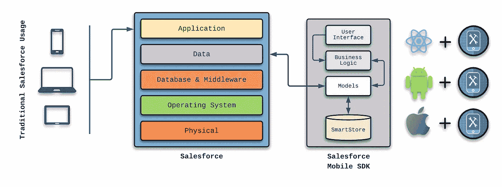
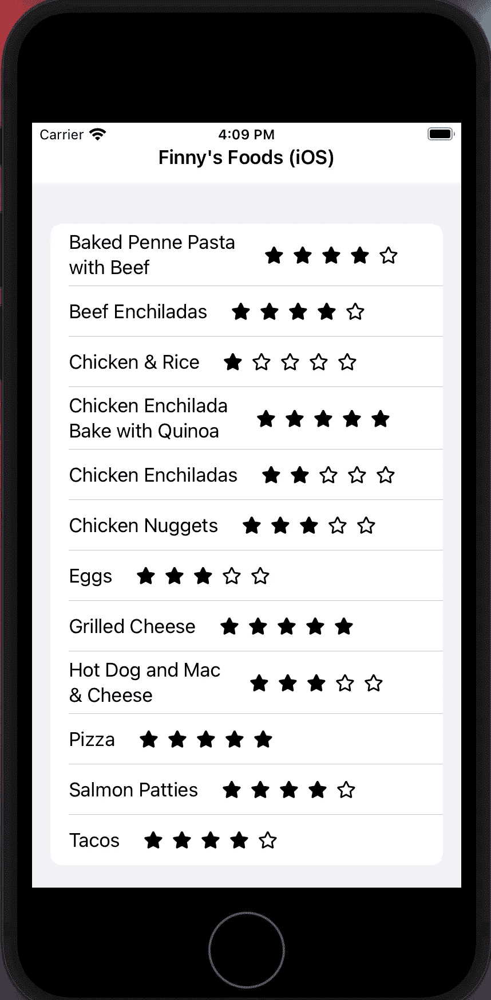

# 使用 Salesforce Mobile SDK 使您的应用程序离线

> 原文：<https://betterprogramming.pub/taking-your-app-offline-with-the-salesforce-mobile-sdk-3300719d0301>

## 请继续阅读，寻找一种简单的方法来切断你的应用程序


去年，我和妻子第一次体验了建造一个全新的家。这个过程既有趣又令人兴奋，但我们也经历了新住宅小区经常出现的意想不到的互联网服务中断。

虽然这些中断影响了我家人的流媒体服务能力，如亚马逊 Prime、Hulu 和网飞，但我继续从事我目前的项目，因为我设计它在隔离(或离线)状态下工作。当我一年中在内华达州和佛罗里达州工作时，这在航空旅行中总是很有帮助。

这让我想知道为什么更多的移动应用程序没有被设计成在互联网服务中断时继续工作。

在这篇文章中，我将展示让您的移动应用程序在离线模式下可用是多么简单。由于我最近花了一些时间在 [Salesforce Mobile SDK](https://developer.salesforce.com/docs/atlas.en-us.mobile_sdk.meta/mobile_sdk/intro.htm) 上，我想继续探索移动应用选项。

# 使用 Salesforce Mobile SDK 脱机工作

在我们开始编写代码之前，让我们简单了解一下离线功能如何与 Salesforce Mobile SDK 一起工作。



传统 Salesforce 用法

插图的左侧显示了 Salesforce 应用程序的传统使用方式。右侧提供了 Salesforce Mobile SDK 的高级概述。

运行在 Android 或 iOS 设备上的原生应用可以用 Android Studio、Xcode 或 React Native 编写。这些应用程序包括用户界面、某种级别的业务逻辑以及代表最终存在于 Salesforce 中的元素的模型对象。

Salesforce Mobile SDK 包括 SmartStore 方面，当移动应用程序无法访问 Salesforce 服务时，该方面使数据可用。模型层可以很容易地设计为在需要(或首选)离线模式时利用 SmartStore，并且当在线状态可用时，它还使 smart store 准备好与 Salesforce 同步所有更改。

如果您想了解更多关于该设计的信息，请查看“[使用智能商店安全存储离线数据](https://developer.salesforce.com/docs/atlas.en-us.noversion.mobile_sdk.meta/mobile_sdk/offline_intro.htm)

# 给芬尼食品增加离线功能

今年早些时候，我开发了 Salesforce Mobile SDK，并创建了一个名为 Finny's Foods 的虚拟应用程序。我用 Android、iOS 和 React Native 三次创建了这个应用程序。我想我会从使用 iOS/Xcode (Swift)版本的 Salesforce Mobile SDK 的[出版物](https://dzone.com/articles/exploring-the-salesforce-mobile-sdk-using-xcode)开始，然后在它的基础上提供离线功能。

下面列出了原始文章的 GitLab 存储库:

[https://gitlab.com/johnjvester/finnys-foods-ios](https://gitlab.com/johnjvester/finnys-foods-ios)

第一步是在 SmartStore 功能使用的`userstore.json`文件中建立`Meal__c`对象。

接下来，更新`usersyncs.json`文件，使当前的用餐列表离线可用:

您可以在“[用配置文件](https://developer.salesforce.com/docs/atlas.en-us.noversion.mobile_sdk.meta/mobile_sdk/offline_config_files.htm)注册 Soups”中了解所有关于 SmartStore 同步配置的信息

准备好 SmartStore 配置后，我重构了`MealsListModel.swift`类，如下所示:

我更新了`fetchMeals()`功能，以便在默认情况下与 SmartStore 交互，在需要时调用 Salesforce，但如果设备处于离线模式，则允许使用应用程序中存储的数据。

信不信由你，这就是所需要的。

# 芬尼食品的线下行动

从 Xcode 和一个 iPhone 8 模拟器启动 Finny's Foods 后，我们看到下面的屏幕显示，就像在原始出版物中一样。



现在，如果我断开设备与互联网的连接并重新加载应用程序，Xcode 中会出现以下日志:

```
2022-03-14 16:14:15.544412-0400 FinnysFoodsIOS[88679:6546397] [MobileSync] CLASS: SFSyncDownTask runSync failed:{ ... } cause:Server call for sync down failed errorError Domain=NSURLErrorDomain Code=-1009 "The Internet connection appears to be offline."
```

但是，应用程序仍然从 SmartStore 加载并提供数据。事实上，如果不查看 Xcode 中的日志，我根本不知道我正在处理数据的本地版本。

对于允许添加或更新数据的离线应用程序，SmartStore 能够使用同步管理器合并离线和在线数据。更多信息请参见[同步数据](https://developer.salesforce.com/docs/atlas.en-us.mobile_sdk.meta/mobile_sdk/entity_framework_native_requests.htm)文档。

# 结论

虽然互联网连接不断改善，但不能 100%保证连接可靠。具有前瞻性的功能开发人员应该考虑采取适当的措施，让他们的应用程序在互联网连接不可用时继续工作。问问自己:我的应用程序在断开连接的状态下工作时如何才能更好？

自 2021 年以来，我一直试图按照以下使命宣言生活，我觉得这可以适用于任何 IT 专业人士:

> *“将您的时间集中在提供扩展您知识产权价值的特性/功能上。将框架、产品和服务用于其他一切。”
> — J. Vester*

在本文中，我提供了一个使用 Salesforce Mobile SDK 实现离线功能的简单示例。Salesforce engineering 在模型层设计了集成点，这是确定是否可以检索实时数据或是否应该返回 SmartStore 数据的最佳位置。

显然，Salesforce 坚持我的个人使命，提供了一个易于使用的设计，没有大量的样板代码。

如果您对本文的源代码感兴趣，可以在 GitLab 上找到它:

[https://gitlab.com/johnjvester/finnys-foods-ios](https://gitlab.com/johnjvester/finnys-foods-ios)

祝你今天过得愉快！