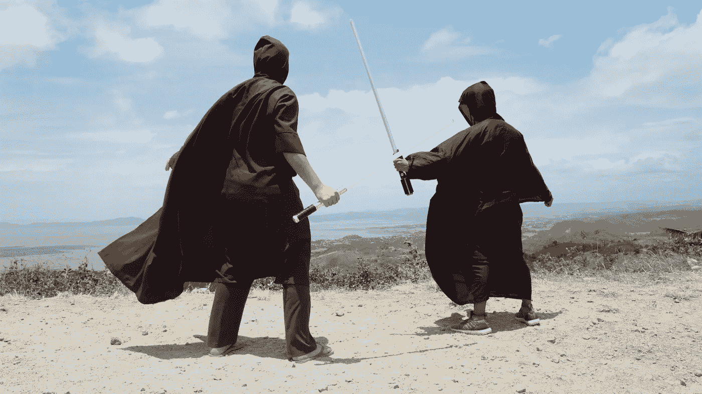

# 采访枪战的故事

> 原文：<https://betterprogramming.pub/tale-of-the-interview-gunfight-a22610d51f85>

## 对面试官和被面试者都是一个警示。

优雅的武器，更优雅的决斗由[克里斯·德利马](https://unsplash.com/es/@saberingpinoy?utm_source=unsplash&utm_medium=referral&utm_content=creditCopyText)在 [Unsplash](https://unsplash.com/s/photos/duel?utm_source=unsplash&utm_medium=referral&utm_content=creditCopyText)

*一天傍晚，一个身影走过一个不知名的门口。在里面，像你在每个城市都能找到的小酒吧。黑暗而沉闷，但人影熟悉地移动着。常客。那个失业的工程师。酒保知道这个表情。失业造成的损失。*

老样子吗？

工程师点点头。

又在找工作？

工程师接过他们的饮料，几乎不需要提示。是啊。我今天经历了最糟糕的面试。完全无能。我不知道他们怎么还在做生意。

首先，他们让我做一个编码测试。25 年的行业经验，但显然我可能不会写代码！随便啦。正常的 leetcode 狗屎。获取一些数据，然后篡改一下。使用了一个堆，得出了一个最优的 log-n 解。酒保带着专业的假装理解点点头。

然后就是一些制度设计。常见的白板图表。但是他们想要一个购物清单应用程序？工程师摇摇头，想起了他们的饮料，一口气喝了三分之一。我的意思是，我设计了一个很好的可扩展解决方案。它可以应付几百万的顾客，没问题。然后面试官问我面包和枣？我不喜欢约会。谁吃枣？！？

但后来变得更糟了！更多的行为废话。“说一个你牛逼的时候？”*讥讽地*。所以我做了！你还记得去年那个 LSI 控股项目吗？酒保没有。六个月来拯救那场垃圾大火。见鬼，一半的代码都是我自己写的。让他们赚了几百万。"告诉我你和同事发生冲突的一次经历？"太有创意了！那杯饮料现在几乎喝光了。

他们拒绝了。dunderhead 的经理说我“不适合这里的文化”。工程师吐出最后几个字，喝完了饮料。“技术上没有达到预期水平”？！？我做高级工程师十年了！我睡觉时也能做这项工作。

酒保同情地点点头，当他们终于开口说话时，又拿出一杯酒。粗糙。有这样的面试过程，在那里工作会是什么样的？听起来你真的躲过了一劫。

大约在同一时间，几英里外的另一家阴暗沉闷的酒吧迎来了一位不同的顾客。工程经理。他们愁眉苦脸地走向熟悉的酒吧，另一个酒保给了他们一杯冷饮和一个温暖的微笑。

糟糕的一天？

*经理急切地接过饮料。*

不确定我们会不会雇人。今天是最差的候选人。

哦？*在经理说话的时候，酒保抓起一个基本干净的杯子继续擦。老习惯了。当你听得太专注时，人们会紧张。*

是啊。丰富的经验，但也有很多危险信号。

甚至是基本的东西。就像他们的编码挑战没有任何测试一样。代码看起来很好，但实际上并不工作！只是愚蠢的错误。也许这些东西会在实际工作中被发现，但是这是草率的，只会让测试的缺乏更加明显。如果没有高年级学生的吝啬，让新毕业生写出好的试卷已经够难的了。酒保点点头。有道理。即使在酒吧，他们也必须树立一个好榜样。

然后设计回合就是一场灾难！我们做库存跟踪，比如你的啤酒和汉堡之类的。当事情即将变糟或耗尽时，该应用程序会提醒你。这似乎是他们产品的一次精心策划的推销。不管怎样，我们让候选人做一个简单的版本，看看他们如何处理问题。很明显，这个人通过过度设计来解决问题！那个人因为这个令人悲伤的笑话而发出了令人悲伤的笑声。两个独立的数据库、队列和无处不在的事件，它仍然不能处理截止日期……面试官试图帮助他们，但他们对它不熟悉，求职者没有得到提示。

当他们伸手去拿饮料时，经理看起来很失望。我也许可以处理这些事情，但我们接着问到了领导力。他们如何影响一个大型组织。随着调酒师点头，玻璃杯悄悄地从“基本干净”的那一堆移到“完成”的那一堆。我问了几个问题，答案都是关于技术的。“我重写了 CI 管道！”以及“我设计了这个价值数百万美元的建筑”。我们需要人们来塑造我们的文化和发展公司，而不是一些英雄程序员。他们唯一没有谈论技术的一次是他们让一个团队加班三个月来完成他们制定的最后期限！好像这是一件值得骄傲的事情…

这引起了酒保的窃笑，他终于开口说话了。呵，是啊。烧船的那种让船员保持动力。听起来你真的躲过了一劫。