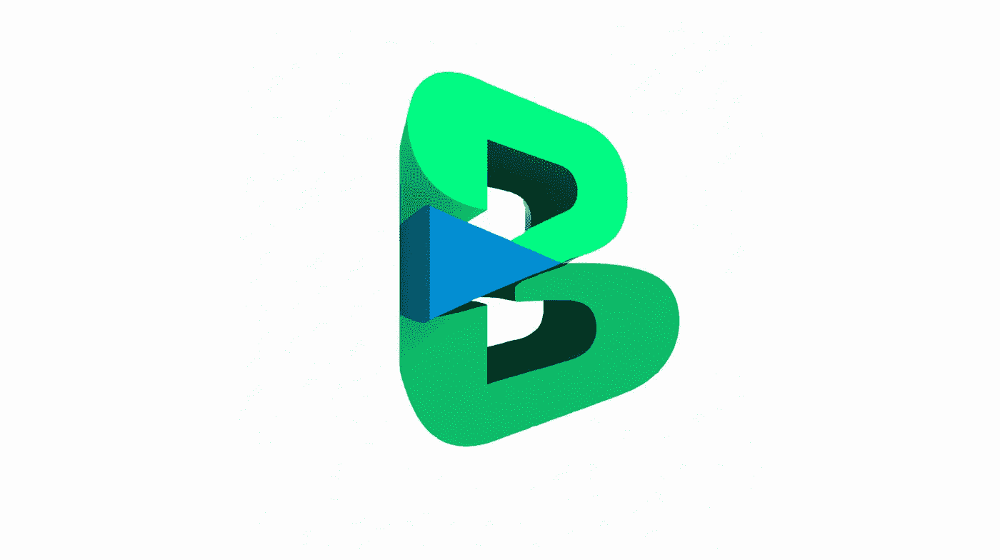

# 来自我们最新创作者的 15 个编码项目和 4 条建议

> 原文：<https://betterprogramming.pub/tauri-gpt-3-and-ios-16-a1781fdf4b71>

## 咖啡字节第 44 期

各位，周五快乐，

欢迎来到第 44 版的咖啡字节，更好的编程时事通讯。

我们希望你度过了愉快的一周。本周，我们在时事通讯中尝试了一个不同的主题，所以我将向您介绍一些新的更好的编程贡献者。他们有有趣的故事和想法让你在这个周末破解。

所以，事不宜迟，这里是过去两周我们最喜欢的 19 个故事。

# 项目

## [Adiós 电子。铁锈动力的替代品已经到来](/adiós-electron-a-rust-powered-alternative-has-arrived-and-its-lovely-bd26262dcf1a)

托里是今年的热门话题。 [Ed Rutherford](https://medium.com/u/218ea75e62c8?source=post_page-----a1781fdf4b71--------------------------------) 接受挑战，学习 Rust 并使用蓬勃发展的框架构建桌面仪表盘应用程序。结果相当不错。最终双星的大小只是许多电子构建应用的一小部分。Tauri 是构建桌面应用的下一个大事件吗？让我们知道你的想法！

## [使用 Python 构建基于人工智能的 Discord 富呈现客户端](https://medium.com/better-programming/last-seen-an-ai-based-discord-rich-presence-client-ad57d6f6ba3c)

想用 Discord 的状态功能炫耀自己的最新活动吗？Arhan Jain 已经建立了一个*Last seed*项目，在 feed 中显示你最新的 Google 相册。最重要的是，他通过利用微软 Azure 的认知服务，使用人工智能为每张照片生成标题。

## [通过微调 GPT-3](/how-to-finetune-gpt-3-finetuning-our-virtual-mental-health-assistant-641c1f3b1ef3) 创建一个虚拟精神健康聊天机器人

作为创新的程序员， [Amogh Agastya](https://medium.com/u/ab1c1e634ac1?source=post_page-----a1781fdf4b71--------------------------------) 使用 Python 构建了一个对话式人工智能聊天机器人，帮助用户感觉被倾听。有时候，我们只是需要一个耐心的耳朵来感觉更好，不是吗？

## [如何在 React 中将 Div 变成可访问按钮](/how-to-turn-a-div-into-an-accessible-button-in-react-fbf236283d6d)

Rebecca 分解了非语义按钮产生的问题，并展示了她的解决方案，在这个分步指南中，她在 React 中制作了一个实用且可访问的按钮。

## [单元测试与操作系统的交互](/unit-testing-interactions-with-the-operating-system-in-go-7704ad50197a)

[Leonardo Rodrigues Martins](https://medium.com/u/c4c65438054b?source=post_page-----a1781fdf4b71--------------------------------) 的指南探索了使用 mocks 和 stubs 测试特性的 Go 实现。你会发现他的创作方式既新颖又有趣。

## [使用 GPT-3 解析 PDF 发票文档](/parsing-pdf-invoice-document-with-gpt-3-and-workato-d2835cbafd94)

没有使用现成的解决方案， [Ferry Djaja](https://medium.com/u/457cf6b08ecd?source=post_page-----a1781fdf4b71--------------------------------) 采用了 OpenAI GPT-3 API 从 PDF 文档中提取特定信息。他使用 JavaScript 简化了将 PDF 二进制文件转换成字符串的过程……并将工作连接到自动化工具。

## [**在你的 Jetpack Compose 应用中滚动 Google Books**](/turn-the-page-overview-of-android-paging3-library-integration-with-jetpack-compose-3a7881ed75b4)

[Daniel Dimovski](https://medium.com/u/6cb47be620f1?source=post_page-----a1781fdf4b71--------------------------------) 带领我们通过一个使用 Android Paging3 库的实际实现。他展示了分页在幕后是如何工作的，以及为特定用户体验覆盖默认配置的方法。观看这一幕后揭示是一个你想上的旅程。

## [**将智能合约部署到多边形和以太坊区块链**](/deploying-smart-contracts-to-the-polygon-and-ethereum-blockchain-using-hardhat-and-ethers-js-2c31aa41aed0)

使用 Hardhat 和 ethers.js， [Emmanuel Ayodele Bello](https://medium.com/u/9d4368e976ea?source=post_page-----a1781fdf4b71--------------------------------) 创建了一个完整的编写、测试和部署合同的指南。区块链法则第一条:你必须签订合同。

## [**显示来自 Objective-C 代码库的 SwiftUI 视图**](/updating-swiftui-views-from-objective-c-mvvm-9c4f38d6d9c8)

SwiftUI 和 UIKit 之间的通信是一项相当常见的任务。但是，您有没有想过如何从 Objective-C 代码库显示 SwiftUI 视图？不要担心，麦克斯·卡利克展示了一项让 SwiftUI 视图在 Objective-C 代码库中工作的技术。如果您已经将 Xcode 更新到了版本 14，当您在项目中得到一个关于改变 actor-isolated 属性的错误时，您可能会觉得必须进行疯狂的堆栈溢出搜索。但是不用担心。麦克斯本周的第二篇文章展示了如何解决这个问题！

## [**在 iOS 应用中构建 PDF 生成器**](/swift-generating-pdfs-dynamically-using-pdfkit-12c37168e106)

回忆过去美好的日子？Marc Daou 提供了一种使用`PDFKit`和故事板动态生成 pdf 的方法。他构建了一个应用程序，从各自的 API 生成鸡尾酒 PDF 餐厅菜单。这可能是将我们的媒体故事转换成 pdf 的实际解决方案吗？也许吧！敬请关注，了解……

## [**锁定 SwiftUI 中的屏幕小部件**](/lock-screen-widgets-in-swiftui-1585aaa93ed4)

有什么比使用这个快速完成任务的小工具应用程序更好的方式来开始开发 iOS 16 呢？谢谢，[纳特科·比斯坎](https://medium.com/u/b90aff6ac4e4?source=post_page-----a1781fdf4b71--------------------------------)！

## [**在 SwiftUI 中复制动态岛动画**](/dynamic-island-animation-5869fbce41e6)

[艾图](https://medium.com/u/dac28fb3667b?source=post_page-----a1781fdf4b71--------------------------------)在[发布](https://developer.apple.com/documentation/activitykit/displaying-live-data-with-live-activities)动态岛屿 API 的前几天，为了好玩，制作了这个很酷的应用内演示。有了这个 [LiveActivity](/create-live-activities-with-activitykit-on-ios-16-beta-4766a347035b) 实现已经可用(再次感谢， [Batikan Sosun](https://batikansosun.medium.com/?source=user_profile-------------------------------------) **)** ，我迫不及待地想看看应用程序如何将这两个 API 用于有意义和有趣的用例。

## [**使用**](/the-appintents-framework-a-new-way-to-hook-up-apps-functionality-to-the-system-96279feb4cce) `[**AppIntents**](/the-appintents-framework-a-new-way-to-hook-up-apps-functionality-to-the-system-96279feb4cce)` [**框架**](/the-appintents-framework-a-new-way-to-hook-up-apps-functionality-to-the-system-96279feb4cce) 构建一个费用跟踪器 iOS 应用

iOS 16 刚从实验室出来，每个人都可以使用。现在是时候扩展你的应用程序的自定义功能，以支持系统级服务，如 Siri、快捷方式等。sadk oban 的 17 分钟有用讲解器(包括代码)是掌握新框架诀窍的最佳地方。

## [测试你的 React 原生模块是否与 Android 和 iOS 集成](/how-to-test-if-your-react-native-module-integrates-with-android-and-ios-aa18f43f296a)

跨平台的集成测试对于确保原生 SDK 和框架(如苹果的 StoreKit 和谷歌的 Play-Billing 库)被成功调用至关重要。Natalia Malesa ，在她的第一篇关于 Medium 的文章中，展示了如何使用 Cavy 框架来构建和运行集成测试。

## [我们如何将一个 API 从 MySQL 迁移到 AWS OpenSearch，从而将响应时间提高 1000 倍](/migrating-an-api-from-mysql-to-aws-opensearch-for-1000x-speed-e46139dff652)

“在我们的一个传统 API 生产繁忙的一天，我们开始收到响应时间缓慢的警报。API 使用`~70 seconds`以名义流量响应客户端！这是寻求优化的巨大动力。”作者[安基特·乔瓦尔](https://medium.com/u/846d0d6221b0?source=post_page-----a1781fdf4b71--------------------------------)。就这样，伟大的转变开始了。

# 建议和意见

## [**GitHub 副驾驶其实挺好的吗？**](/is-github-copilot-actually-kind-of-good-6b327cbdb59d)

在测试出 AI 工具后， [Sarah Cross](https://medium.com/u/4cda0b4f7850?source=post_page-----a1781fdf4b71--------------------------------) 认为 Copilot 不错，但并不伟大！她发现调试 Copilot 产生的问题比自己写代码要花更多的时间。所以，我们总结道，DIY 致胜！

## [停止招聘软件工程师。考虑产品工程师而不是](/stop-hiring-software-engineers-8545520437ac)

[Carlo Bertuccini](https://medium.com/u/93bc8a5052dc?source=post_page-----a1781fdf4b71--------------------------------) 强调一种思维模式,“你总是关注你的产品和你的客户，而不是技术和范围。但是我们真的应该停止雇佣软件工程师吗？卡洛斯指出，这要视情况而定— *每件事都必须联系具体情况。*

## [软件组件的名字应该古怪而神秘](/software-component-names-should-be-whimsical-and-cryptic-ca260b013de0)

Aaron Zinger 认为服务、回购和库的描述性名称是个坏主意。*描述性名称不创造透明性；他们创造了透明的假象。*描述性的还是异想天开的？你支持哪一个？

## [**强制函数为巨大的拉动请求**](/forcing-functions-for-great-pull-requests-d7b11989f43b)

Sid Shankar 强调了尽管资源丰富，开发团队中好的拉取请求却很少。他提供想法、观察和指导来自然地写出好的 PRs。

暂时就这样了。

直到你下次喝咖啡，

Anupam 和更好的编程团队

