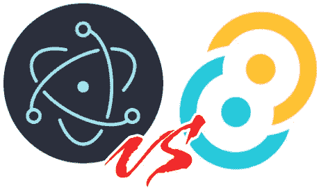
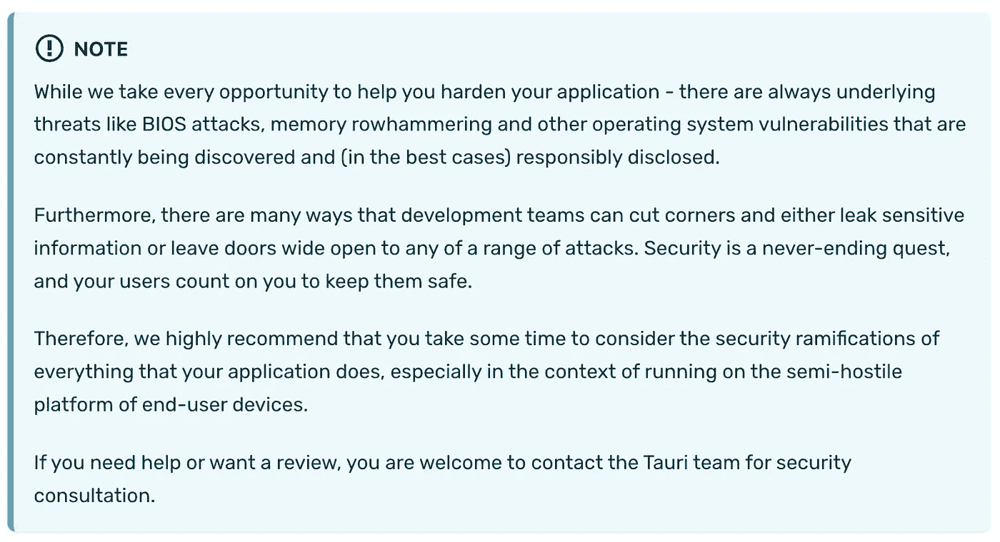
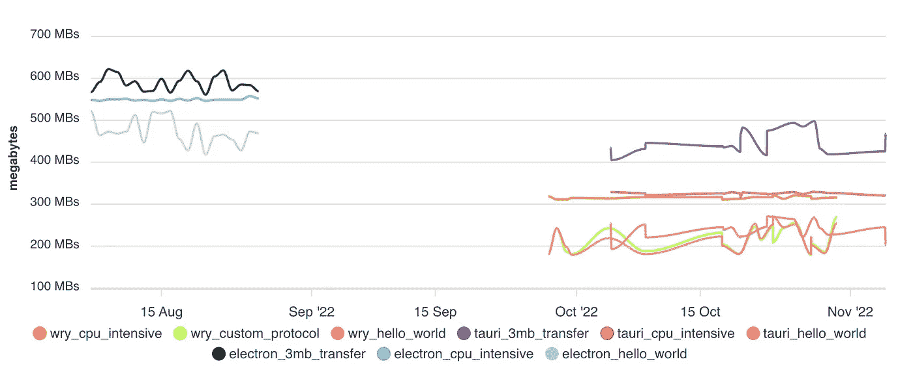
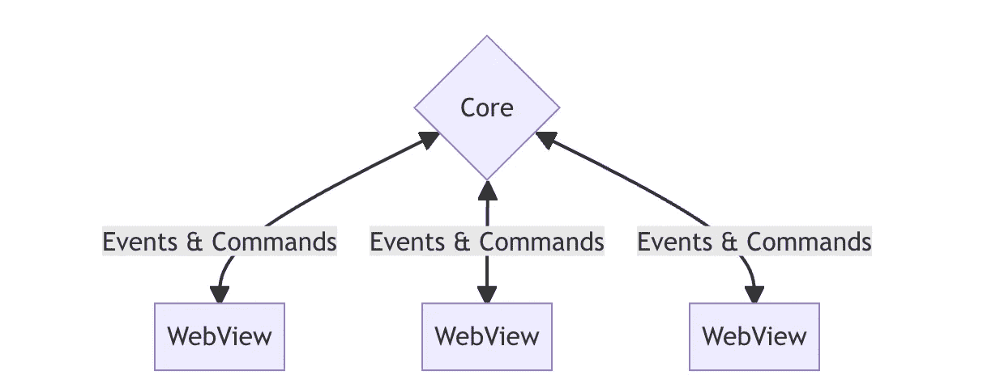
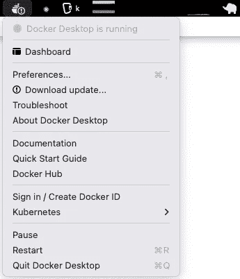
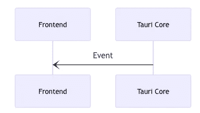
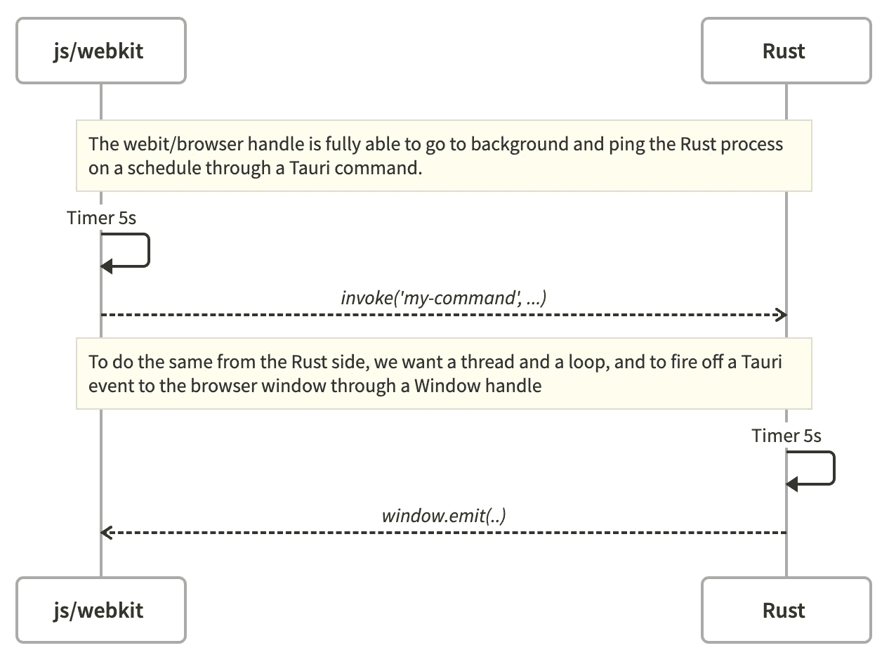

# Tauri 与电子托盘应用

> 原文：<https://betterprogramming.pub/tauri-vs-electron-for-tray-apps-ed15974f35ce>

## 使用 Tauri、Rust 和 JavaScript 构建一个桌面托盘初学者应用程序



作者图片

[Tauri](https://tauri.app/) 大体类似于电子。原理是一样的:通过使用 JavaScript 完成大部分应用程序/ UI 工作来快速构建应用程序。

然而，Tauri 在实现上采取了完全不同的方法，因此，在几乎所有可能的标准上都取得了更好的结果。

# 尺寸比较

我们已经知道，基于电子的应用程序有两个主要问题:

*   捆绑包大小(下载大小)
*   RAM 的使用和随时间的增长

有了电子版，你开始时只有 85MB 的包大小，几乎没有任何功能，大多数应用程序可以轻松下载到 150MB。

在内存使用方面，一个电子应用程序一开始几乎什么都不用，就占用了你 500MB 的内存。这也是我不使用任何电子 app(所谓的“原生 app”)用于 Slack 等各种流行的 Web apps 的原因。我只是使用 Chrome，希望它能以更好的方式优化选项卡间的 RAM 使用。

对 Tauri 来说:8MB 的包大小支持大量的功能，峰值内存使用量为 150-200 MB，这主要是因为浏览器就是浏览器。浏览器往往会耗尽内存(它使用每个操作系统的原生 Web 视图)。

就特性而言，好吧，Electron 花了几年才达到的(我在这里是作为一个电子开发者说的)——你现在可以在 Tauri 中获得它，它的第一个稳定版本。从高质量的捆绑器和开发工具，到内置的更新程序，到托盘图标支持，等等。

# 设计和架构比较

你从 Tauri apps 得到的另一个好处直接来自它的工程思维，我猜 Rust 帮助推动了这一点。

## 作为一等公民的安全



[来源](https://tauri.app/v1/references/architecture/security/)

作为一等公民的安全感。没有多少应用平台(实际上:据我所知没有)一开始就详细描述它们内置的安全特性，以及高级特性的[实现供您使用，重点是 JS 端、IPC 等。这是 Rust 作为一种语言所提供的安全性和稳定性的补充。更令人印象深刻的是](https://tauri.app/v1/references/architecture/security/)[包含了威胁建模](https://tauri.app/v1/references/security/)以及如何进行防御性操作背后的思想:安全源于设计。

## 作为一等公民的表现



[来源](https://tauri.app/v1/references/benchmarks/)

作为一等公民的基准。同样，没有多少平台以这个主题开始，提供高度详细、[自动化和透明的基准测试](https://tauri.app/v1/references/benchmarks/)。当这发生在一个库、工具或平台中时，你知道性能是一个主线 KPI。当您构建应用程序时，您希望确保您所使用的平台保持出色的性能，以便您基于该平台构建的应用程序保持出色。如果平台有性能问题，这自然意味着你的应用有性能问题，而且——作为开发者，你可能没有办法解决它。

## 完全的后端和前端分离



[来源](https://tauri.app/v1/references/architecture/process-model/)

虽然与 electronic 相比，这最初可能被认为是一个缺点，但后端流程构建在 Rust 中，前端构建在 JavaScript 中，这一事实实际上非常有益:

*   它迫使我们真正思考鼓励安全和稳定的 IPC
*   就 Rust 而言，它提供了您在后端过程中所需要的一切:性能、安全性、稳定性，以及当您需要与底层系统紧密操作时的系统方法。使用基于 Node.js 的后端流程无法做到这一点(在这种情况下，您必须使用原生 API)

Tauri 是如何用 Rust 宏和开发者经验抽象 IPC 的，即使你不懂 Rust，你也不会有问题。

# 保持简单的理由

构建电子应用程序绝不简单。和许多 JavaScript 应用一样，这实际上是选择悖论的顶峰，但在这里——甚至更是如此。虽然您在电子应用的前端有标准的 JavaScript 疲劳，但在后端“主”进程中也有同样的问题:您必须选择您的 JavaScript 工具、库和原则，但仅限于一个纯 Node.js 进程(因此有些库无法工作，有些库只能*工作)。*

使用 Tauri，后端是用 Rust 编写的，Rust 生态系统很简单，通常有一个很好的库来做一件事。所以你避开了选择的悖论，有了更多的时间去构建。

对于前端部分，你会得到和电子应用程序一样的体验。你需要选择你的捆绑器、应用框架、样式框架、状态管理框架、linter 等等——不管你用 JavaScript 还是 TypeScript。

从这个意义上说，在 Tauri 上构建更简单。

# 如何用 Tauri 搭建托盘 App？



作者图片

在这个练习中，我们来看看“托盘应用程序”是什么意思。突然，它实际上是许多事情。这是一个:

*   桌面应用程序
*   操作系统部件或附件
*   一个长期的后台进程
*   开窗练习(例如，在正确的位置弹出)

因此，对于一个新的应用平台来说，这可能是一个很难的练习，这是理解 Tauri 如何处理它的完美方式。我们已经知道许多托盘应用程序是在今天的电子版中实现的，那么 Tauri 进展如何呢？

# 示例案例:Docker 桌面应用程序

我们来分解一下 Docker 桌面 app。我们将尝试在 Tauri 重建它的大部分部件，看看什么有效。

Docker 桌面要求或规范遵循以下原则:

*   带有更新图标的托盘(当 Docker 加载时)
*   更新托盘中的动态菜单项，例如在打开托盘菜单时显示状态“Docker 正在运行”和当前登录的用户名
*   打开的桌面窗口(仪表板)，具有特定的行为:
*   当显示窗口时(托盘→打开仪表板)，窗口应该弹出到您当前的工作区和监视器
*   当点击窗口，或者要做别的事情时，窗口应该隐藏起来
*   这是一个品味问题，我们可以让窗口停留，用户应该通过点击关闭来显式隐藏它(事实上，关闭应该退出，但我们正在防止这一点，而是隐藏)
*   应用程序不应该出现在你的任务栏/跳板上。它应该只存在于您的托盘中。
*   这是一个偏好的味道，我们可以切换到开/关。
*   有特定的大小，不能调整大小
*   可以四处移动，有一个窗口外壳(这可以被删除，但让我们有外壳)

在基础设施和机制方面，我们需要:

*   JavaScript 应用程序和 Rust main 进程之间的某种状态轮询。我们可以去:
*   JavaScript 轮询信任 setInterval 并调用 Tauri 命令，或者
*   Rust 端通过在主窗口上执行`emit`来推送周期性事件，以便 JavaScript 端监听
*   无论哪种方式，我们双方都有一个持续的沟通渠道，这很好。
*   我们正在把一个桌面应用变成一个长期运行的强大的过程。
*   我们还需要从 JavaScript 到 Rust 的特别调用代码，Tauri 的`command`抽象神奇地解决了这个问题
*   最后，我们需要一个成熟的桌面应用框架和基础设施。在这里，我们将使用 React、Chakra-UI、React Router 和 Zustand 或 Redux 来实现状态，特别是状态持久性(例如在存储用户设置时)。

您可以在这里尝试已完成的初学者项目:

[https://github.com/jondot/tauri-tray-app](https://github.com/jondot/tauri-tray-app)

# Tauri 拥有唯一稳定的系统托盘实现

这可能令人惊讶，但与 Go 或 Node.js 相比，Rust 没有很好的系统托盘库，而 Tauri 实际上是目前最好的实现。我们所拥有的如下:

*   [https://github.com/Ciantic/trayicon-rs](https://github.com/Ciantic/trayicon-rs)—仅在 windows 上运行，设计用于与`winit`一起工作
*   [https://github.com/qdot/systray-rs](https://github.com/qdot/systray-rs)——不再维护了，作者指出这不是一件容易的事情
*   Tauri 制作了[https://github.com/tauri-apps/tao](https://github.com/tauri-apps/tao)，它实现了系统托盘功能，实际上是[https://crates.io/crates/winit](https://crates.io/crates/winit)的一个分支

# 演示应用程序:概述



[来源](https://tauri.app/v1/references/architecture/inter-process-communication/)

设置并携带入门应用程序(您将需要`pnpm`并且您可能希望[运行入门指南](https://tauri.app/v1/guides/getting-started/prerequisites)以获得基本的先决条件)

```
$ git clone https://github.com/jondot/tauri-tray-app
$ cd tauri-tray-app
$ pnpm install
$ cargo tauri dev
```

# 前端

每个 Tauri 应用程序都分为前端和主进程(Tauri 核心)。在 starter 项目中，前端有以下主要组件:

*   [建筑用 Vite](https://vitejs.dev/)
*   作为 UI 框架做出反应
*   [Chakra UI](https://chakra-ui.com/) 作为组件框架并用于造型
*   [React Router](https://github.com/remix-run/react-router) 作为通用路由框架，用于应用程序加载和卸载“屏幕”时
*   [Redux Toolkit](https://redux-toolkit.js.org/) 或 [Zustand](https://github.com/pmndrs/zustand) 用于状态管理和数据持久化(两者都是有线的，选择您喜欢的)

# 主流程

这里是我们的愿望列表中的一些机制，我们希望在 Rust 和 Tauri 的 API 中实现的核心/主要流程部分中实现。

*   避免从窗口关闭，因为它是一个托盘应用程序
*   从任务栏隐藏
*   确保窗口出现在用户面前
*   状态—为了熟悉起见，我们可以使用这两者中的任何一个(我们将在 JavaScript 端使用状态)
*   JavaScript 端(照常管理状态)。
*   rust side—[Tauri 中的状态管理器](https://docs.rs/tauri/1.1.1/tauri/trait.Manager.html#method.state)可以用于通用的状态存储。
*   后台进程运行和触发
*   JavaScript 方面——我们将回答这个问题——天真的 setInterval 循环会永远存在并 ping Rust core 吗？(是)
*   此外，启动这样一个永久循环的最佳方式是什么？
*   从 JavaScript 端控制原生特性，比如设置原生菜单项

# 从 JavaScript 动态设置菜单项

这很容易做到，以下是它的配方:

创建一个项目并给它一个唯一的 ID:

```
.add_item(CustomMenuItem::new("dynamic-item".to_string(), "Change me"))
```

构建一个命令，并在函数签名中请求应用程序句柄:

```
#[tauri::command]
fn set_menu_item(app_handle: tauri::AppHandle, title: &str) {
    let item_handle = app_handle.tray_handle().get_item("dynamic-item");
    item_handle.set_title(title).unwrap();
}
```

使用下面这段代码注册它:

```
.invoke_handler(tauri::generate_handler![greet, set_menu_item])
```

并使用 invoke 从 JS 端调用它:

```
const setMenuItem = () => {
  invoke('set_menu_item', { title: `count is ${count}` })
}
//...
<button onClick={setMenuItem}>Set menu item</button>
```

# 长期运行的流程

我们有两种方法可以做到这一点，在下面的序列图中，两种方法都被绘制出来:



作者图片

## JavaScript 端的长期运行流程

我们想运行一个普通的 JavaScript `setInterval`，并希望它保持活力，能够通过 IPC(一个 Tauri `command`)驱动 Rust 进程。

简而言之，它有效:

```
// Note: setInterval is firing off a promise and does not wait for it to resolve.
// depending on what you want to get done, it may be smarter to use a different
// scheduling technique for an async call that may take longer than the interval
// from time to time.
useEffect(() => {
  const interval = setInterval(() => {
    invoke('interval_action', { msg: `count is ${count}` }).then((s: any) => {
      setMsg(s)
    })
  }, 5000)
  return () => clearInterval(interval)
}, [count])
```

但是，要小心一些陷阱:

*   当 JavaScript 部分感觉到在后台时，注意计时器变慢[https://stack overflow . com/questions/23506103/setinterval-slows-with-tab-window-inactive](https://stackoverflow.com/questions/23506103/setinterval-slows-down-with-tab-window-inactive)
*   像往常一样，区间中的异步内容可能会漂移。因为如果异步操作由于某种原因被延迟，我们真的没有办法保持时间间隔

## 生锈一侧的长时间运行流程

我们可以在 Rust 端有一个长时间运行的进程，启动一个线程，让它在迭代之间有一个短暂的睡眠，做一个永远的循环。

这里有几个问题:

*   如何以及何时开始？
*   什么是并发模型？既然一个 Rust 线程想要通过 IPC ping JavaScript 端，那么这里一定有什么原因

为了开始这样一个过程，我们可以有一个`command`,并在 JavaScript 端准备好的时候调用它。这里没有对错，是你需要什么的问题。

```
#[tauri::command]
fn init_process(window: tauri::Window) {
    std::thread::spawn(move || loop {
        window
            .emit(
                "beep",
                format!("beep: {}", chrono::Local::now().to_rfc3339()),
            )
            .unwrap();
        thread::sleep(Duration::seconds(5).to_std().unwrap())
    });
}
```

或者，在 Tauri 设置阶段开始一个永久循环，我们仍然可以访问应用程序。对于发出事件，我们必须通过`Window`来完成，因为`App`不是线程安全的。

```
.setup(|app| {
        let window = app.get_window("main").unwrap();
    std::thread::spawn(move || loop {
        window
            .emit(
                "beep",
                format!("beep: {}", chrono::Local::now().to_rfc3339()),
            )
            .unwrap();
        println!("beep");
        thread::sleep(Duration::seconds(5).to_std().unwrap())
    });
    Ok(())
})
```

# 运行异步命令

让我们尝试启动一个网络请求，由 Rust 端执行。这里，我们使用 request，它使用 async，而`tokio`作为运行时。

我们知道这需要在我们生产的任何可执行文件中有一个初始化的`tokio`运行时。我们将会发现，Tauri 使用了`tokio`，所以一切都是开箱即用的。就像平常一样让函数异步，但是记住:你必须返回一个可序列化的错误。

为了有趣起见，我们还返回了一个`Vec`(可序列化的)或`Content`(可序列化的)。

```
#[tauri::command]
async fn api_request(msg: &str) -> Result<Vec<Content>, String> {
    let res = reqwest::get("https://example.com")
        .await
        .map_err(|e| e.to_string())?;
    let out = res.text().await.map_err(|e| e.to_string())?;
    Ok(vec![Content { body: out }])
}
```

完成之后，我们将高兴地在 JS 端接收到作为 JavaScript 数据对象的序列化内容。

# 航行

当在具有长时间运行间隔的窗口之外导航时，它被卸载并清除。React 路由器开箱即用。

*   记住:我们并不是真的在一个网站中导航。因此，使用像 React 路由器这样的路由器成为一种特殊的需求。不使用路由器，你可以使用某种标签控件，包含你需要的应用程序的所有屏幕。

总而言之，对于长时间运行的，processes 最好把它们放在 react-router 根中，对于改变的 UI 部分，把它们放在根中的一个`<Outlet/>`中。

# 防止模糊时退出和隐藏

Rust 和 Tauri 的 API 中模式匹配的混合简直太棒了:

```
.on_window_event(|event| match event.event() {
            tauri::WindowEvent::CloseRequested { api, .. } => {
                // don't kill the app when the user clicks close. this is important
                event.window().hide().unwrap();
                api.prevent_close();
            }
            tauri::WindowEvent::Focused(false) => {
                // hide the window automaticall when the user
                // clicks out. this is for a matter of taste.
                event.window().hide().unwrap();
            }
            _ => {}
        })
```

# 更新本地菜单

总的来说，你对事物固有的一面有很高的控制力。您可以对现有菜单做任何您想做的事情。然而，添加或删除项目变得复杂，因为无法访问菜单的当前“状态”。

要添加项目，您需要重新构建包含新项目的完整菜单，并通过本机 API 重新设置它:

```
// there's no way to grab the current menu, and add to it, creating
// an evergrowing menu. so, we rebuild the initial menu and add an item.
// this means we'll only add one item, but to add an arbitrary number,
// make this command accept an array of items.
// also, you probably would want to inject the new items in a specific place,
// so you'd have to split the initial menu to [start] [your content] [end],
// where 'end' contains things like "show" and "quit".
#[tauri::command]
fn add_menu_item(app_handle: tauri::AppHandle, id: &str, title: &str) {
    let mut menu = build_menu();
    let item = CustomMenuItem::new(id.to_string(), title);
    menu = menu.add_item(item);
    app_handle.tray_handle().set_menu(menu).unwrap();
}
```

# 结论

Tauri 还有很多东西。我们刚刚触及了几个案例，Tauri 1.1 处理得非常好——平台是成熟的；比电子在进化过程中的相似阶段更成熟。

虽然我还没有把它推送到苹果官方商店，但你现在可以用 Tauri 构建完全捆绑和随时发布的应用程序，并以你喜欢的方式发布它们。

要构建你的下一个托盘应用，你绝对可以从[https://github.com/jondot/tauri-tray-app](https://github.com/jondot/tauri-tray-app)开始。如果你发现你可以改进它，请随时提交拉动请求！