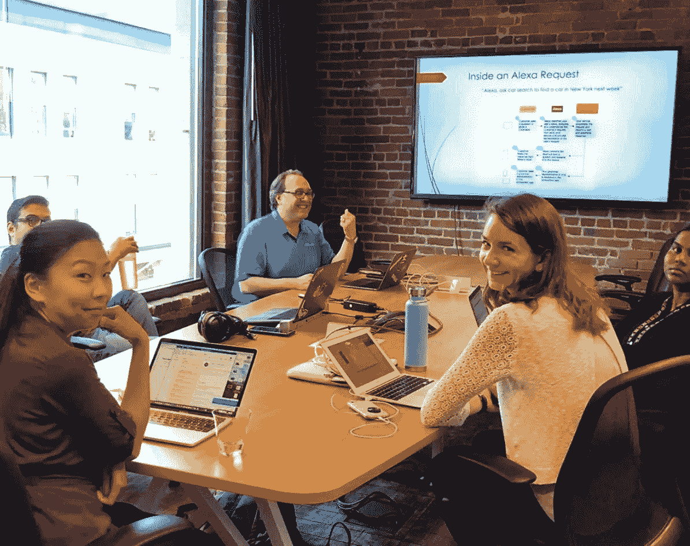

# 教你所知道的，以便学得更好

> 原文：<https://betterprogramming.pub/teach-what-you-know-to-learn-it-better-9b6c8765964d>

## 我通过领导 Alexa 开发研讨会学到了什么

Alexa 开发 101，图片由 Mindspand 提供

在过去的几年里，我一直在建立 Alexa 技能，亚马逊 Alexa 商店中有十几个已发布的技能。

我是一个终身学习者，三年前第一次接触 Alexa。这是学习新编程语言和使用新兴技术的好方法。这种对学习的热爱让我一直参与到新的声音特征和模式的出现中。几个月前，我决定通过举办一个面对面的课程来分享这种激情。我与西雅图当地的一家公司 [Mindspand](http://www.mindspand.com/) 合作，列出并推广它。

举办研讨会可能会令人生畏。有大量免费的专业文章、教程和视频。为什么要有人付钱亲自向我学习？

我不断提醒自己的是，我想做一些不同的事情来分享我的知识。人们有许多不同的学习方法。我通过自我探索和小型面对面会议的结合来学习。这让我可以和亲身经历过的人一起动手尝试。我想把这种元素带进我的工作室——我觉得我可以用自己真实的风格教学。

上这门课很有趣。该班级有一个小组设置，以给予人们一对一的关注。松散的展示风格让我可以把它变成一个互动的环境。我用一系列的练习把人们从一个“你好，世界！”申请一个完整的租车搜索技能。在这个过程中，我展示了一些我处理过的细微差别，并分享了我使用过的工具，比如[行话、](https://www.jargon.com/)来简化内容管理。

让我感到惊讶的一件事是，在会议期间，人们互相帮助的程度有多高。观众的技能水平各不相同。我为初学者量身定制了课程，但也包括一些练习来挑战更有经验的开发人员。小的，让我们专注于学习的环境有助于实现协作学习。

总是在学习

无论你的激情是什么，教别人不仅能让你感到满足，也能让你自己学到更多。我有几个关于功能或细微差别的问题，我早就解决了。但是当从一个新的角度被问及时，它迫使我去调查并解释为什么事情会是现在这个样子。至少在一个案例中，我发现了一个新的解决方案。

看到学生提出的问题，帮助我为下一组完善课程。上个月，我为华盛顿大学的一个商业黑客马拉松修改了这个研讨会。即使是教学，也是一个持续的学习过程。

那么你的激情是什么？是什么阻止了你与他人分享呢？这是一种有益的方式，教别人你喜欢的东西，同时给你更深的洞察力和理解。