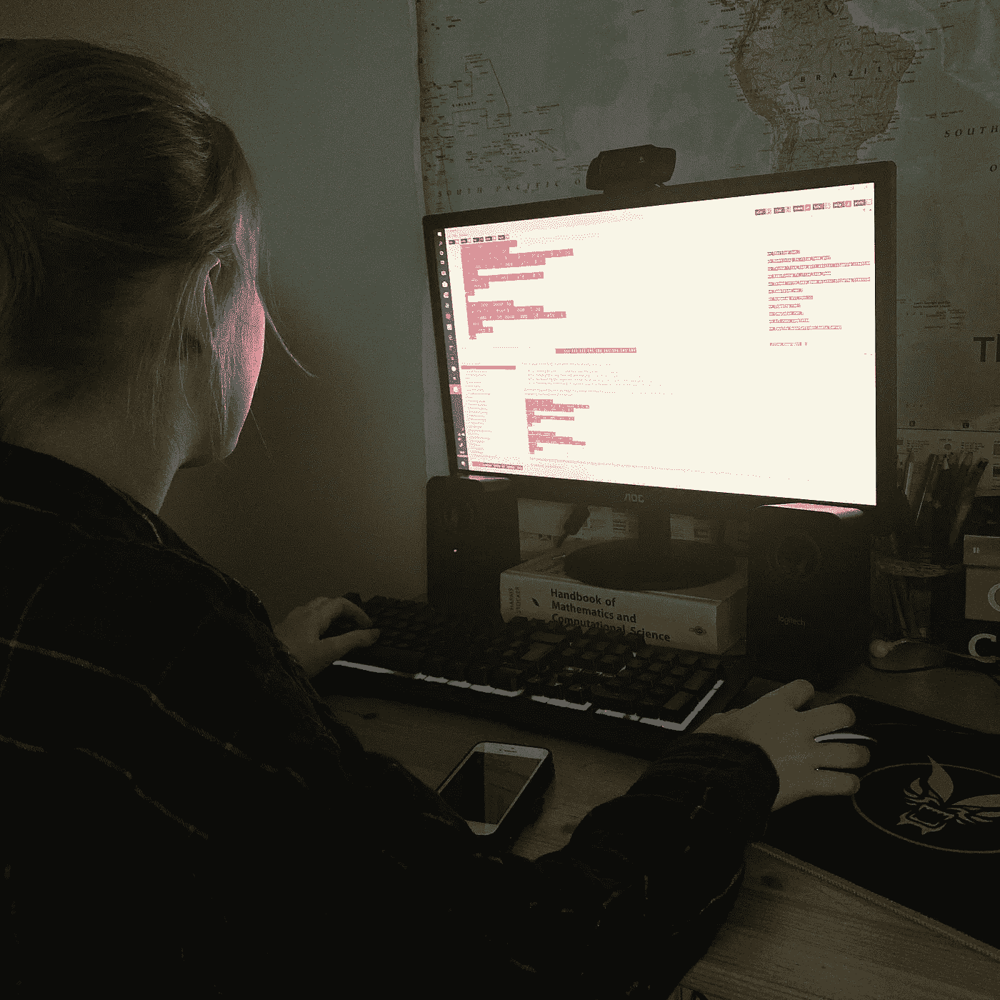
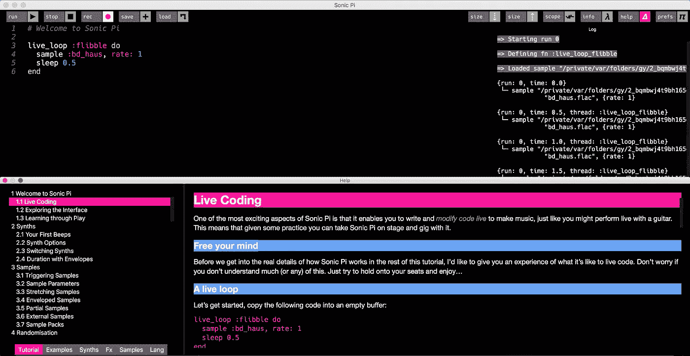

# 教你的孩子用音乐编码

> 原文：<https://betterprogramming.pub/teach-your-kids-to-code-with-music-198b9d81aede>

## 我如何在一周内教会我的孩子编程


马塞拉·拉斯科斯基在 [Unsplash](https://unsplash.com?utm_source=medium&utm_medium=referral) 上的照片。

暑假即将来临，一些家庭可能仍然处于完全封闭状态。还有什么更好的时间来教你的孩子…编码呢？

在这篇文章中，我将描述我如何教我的孩子用 [Sonic Pi](https://sonic-pi.net) 编程，这是一种现场音乐编码语言。最后，我会谈谈在这个过程中，它如何让我成为一名更好的程序员。

# 什么是声波圆周率？

Sonic Pi 是一种音乐专用的语言和编码环境，具有干净的界面和简单易学的语法。它是与 Raspberry Pi 基金会合作开发的，因此预装了 Raspbian 操作系统。

Sonic Pi 可以用于任何风格的音乐，但它特别适合基于电子节拍的风格。例如，蠢朋克做的那种事情:

音速小子里的“空气动力学”版本。

在上面的视频中，你会注意到程序员在录制过程中实时修改代码。这被称为[现场编码](https://liveprogramming.github.io/liveblog/2013/01/a-history-of-live-programming/)，Sonic Pi 明确鼓励这种做法。

能够做出改变并立即获得关于这些改变的反馈，为实验和学习创造了极好的环境。

# 适合什么年龄段？



我女儿在学习用音速圆周率编程。

我有两个双胞胎女儿(11 岁)和一个儿子(12 岁)。我发现音速小子正适合他们。他们已经有了一些视觉语言的经验，比如学校里的 [Scratch](https://scratch.mit.edu) ，我想说 Sonic Pi 只是比那稍微高了一点。

我们留出一周的时间来学习音速小子，每天下午花大约 90 分钟学习语言和环境。他们很快就学会了基础知识，到了周末，他们能够发挥创造力，真正开始探索。

我想说主要的挑战不是声波 Pi 环境本身，而是实际应用这些知识来创作音乐上有趣的作品。当然，这需要对音乐的理解——而不仅仅是编程技巧！

作为她的最后一个项目，我的一个女儿制作了这个版本的星球大战“黑暗面”主题。另一个是巴赫著名的《g 大调小步舞曲》的翻版。

# 如何开始

Sonic Pi 非常容易安装和设置。最好的选择之一是买一个[树莓 Pi 入门套件](https://thepihut.com/collections/raspberry-pi-kits-and-bundles/products/raspberry-pi-starter-kit)。如果您将它插入您的电视，并连接键盘和鼠标，您就拥有了一个现成的音乐制作和编码工作站！

Sonic Pi 也有 macOS 和 Windows 的安装程序，可以从[的网站](https://sonic-pi.net)上下载。在 macOS 上，下载只是一个带有可执行文件的 ZIP 文件，这意味着您可以在几秒钟内启动并运行。

## 学习路径



音速 Pi 环境。

网上有很多非常好的 Sonic Pi [教程](https://projects.raspberrypi.org/en/projects/getting-started-with-sonic-pi)，但是内置在 Sonic Pi 环境中的那些太好了，所以我们决定解决它们。从上面的截图可以看出，教程带用户从播放简单的哔哔声到触发循环和序列以及应用效果。

教程中充满了可运行的代码，所以很多时候，学习过程是由复制-粘贴-修改-重复循环组成的，这是非常有益的。

要开始，我建议下载软件，并通过[内置教程](https://sonic-pi.net/tutorial)！

# 关于编程，它教了什么？

Sonic Pi 部分是用 Ruby[编写的，大部分基于 Ruby](https://www.ruby-lang.org/en/)。如果您主要是在 C 风格的语言中长大的，那么语法可能最初看起来有点陌生。但不要因此而分心！Sonic Pi 包含了任何语言的所有结构:变量、代码块、循环、条件等等。

循环是 Sonic Pi 的核心。例如，以下代码将以 C4 的音高播放四次哔哔声，在每次迭代之间休眠半秒钟:

```
use_synth :beep
4.times do
  play :C
  sleep 0.5
end
```

如果你的目标是以有趣和吸引人的方式教你的孩子编程概念，我认为 Sonic Pi 是一个很棒的工具。

最后，如果您对它是否可以用于探索高级编程主题有任何疑问，请查看 [Mynah Marie 在 Sonic Pi 中实现的冒泡排序算法](https://www.earthtoabigail.com/blog/audio-representation-bubble-sort-with-ruby-sonicpi)！

# 最后的想法

我发现 Sonic Pi 是一个引人入胜的、高度完善的环境，可以在其中试验编程和音乐。任何 10 岁以上的人都可以很快从中获得有益的结果。

在通过 Sonic Pi 教程支持我的孩子的过程中，我也发现自己在学习如何成为一名程序员。我并不真正熟悉 Ruby 的方法和语法，使用 Sonic Pi——即使是短暂的——让我对这个世界有了一些有用的了解。

如果你正在寻找一些有教育意义的东西，让你的孩子在整个夏天都有事可做，我强烈推荐它！