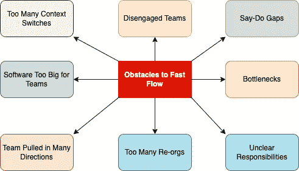

# 团队拓扑——思考团队的新方式

> 原文：<https://betterprogramming.pub/team-topologies-a-new-way-of-thinking-about-teams-8f4853038509>

## 围绕四种基本类型组织团队:流程一致的、授权的、复杂的子系统和平台

我[范·班杜拉](https://unsplash.com/@unstable_affliction)在 [Unsplash](https://unsplash.com/?utm_source=medium&utm_medium=referral) 上的照片

# 序

我最近在公司中与跨组织团队打交道的经历，他们的好处、挑战和缺点，驱使我深入研究团队拓扑结构及其表现形式，如[康威定律](https://en.wikipedia.org/wiki/Conway%27s_law)所述:

> “设计系统的组织被限制生产这些组织的通信结构的复制品的设计。”

几乎立刻，我就找到了这本由 Matthew Skelton 和 Manuel Pais 所著的好书。

在本文中，我想总结本书中的一些关键概念，并提炼出一些实用的建议，帮助我们更好地构建软件开发团队。

# 团队如何交付软件

随着系统复杂性的增加，它给构建和发展这些系统的组织带来了更多的负担。主要挑战之一是建立能够持续有效地交付价值的团队。考虑到康威定律，组织必须建立和维护具有清晰边界和松散耦合的有凝聚力的团队结构(被称为[反向康威策略](https://www.thoughtworks.com/radar/techniques/inverse-conway-maneuver))。

[团队拓扑](https://www.amazon.com/Team-Topologies-Organizing-Business-Technology/dp/B07VWYNGCQ)这本书确定了四种团队模式，描述了它们的结果、形式和它们解决的问题，因此它们可以作为我们的实用指南，无论我们是在组建新团队还是帮助现有团队在响应价值交付方面变得更有效。

我们将在这篇文章的后面修改这些模式。

# 通信结构

构建和运行复杂的软件系统总是一项团队活动，需要跨不同平台的具有不同技能的人的共同努力。此外，现代组织正在采用 DevOps 实践来快速交付和操作软件系统，同时适应业务需求或法规约束。

但是尽管有这些需求，他们中的许多人仍然对他们的团队有一个单一的、静态的视图，我们通常称之为“组织结构图”这些图表通常描述了组织实体、它们之间的关系以及它们的沟通渠道，通常是以一种非常层次化的方式。

事实上，我们并不把我们的交流局限于那些关注 org 的人。图表的交流线。我们会联系那些我们赖以完成工作的人。我们建立关系和信任，以分散的方式完成工作，从而缩短交付周期。

> “团队不是一群一起工作的人。团队是一群相互信任的人。”
> —西蒙·西内克

这就是为什么实际的沟通流程看起来与组织结构图大相径庭。

如果是这样的话，组织中的团队结构应该促进这种交流，并使之成为他们 DNA 的一部分。实现这一目标的第一步是意识到“说”和“做”的差距，并尽可能缩小这一差距。

如果我们想拥有独立的、自组织的、能够有效协作的团队，我们需要确保我们的组织文化、核心价值观、沟通流程、反馈循环和奖励机制**与**的意图保持同步。

# 逆康威手法

2015 年，Thoughtworks 的技术总监詹姆斯·刘易斯和其他人提出了应用“逆康威策略”(或反向康威策略)的想法:

> “组织应该专注于组织团队结构，以匹配他们希望系统展示的架构，而不是期望团队遵循强制的架构设计。”

这里的关键要点是，认为软件架构是一个独立的概念，可以孤立地设计，然后由任何团队实现，这是根本错误的。

我们可以在几乎所有类型的架构中注意到预期架构和团队结构之间的差距，甚至在非常现代的架构中，例如微服务。

# 团队认知负荷

类似于个人认知负荷(吸收和处理信息的极限)，团队认知负荷可以被视为其团队成员认知能力的总和
。

如果你希望你的团队取得高质量的成果，而不是让他们承担过多的任务和责任，那么认知负荷应该被考虑在内。

丹尼尔·平克的内在[动机](https://www.tutor2u.net/business/reference/motivation-pink-three-elements-of-intrinsic-motivation) : **自主**(被许多要求和混乱的优先次序轰炸的团队所破坏)**掌握**(通过处理太多的事情，我们最终妥协于平庸的结果)**目的**(不明确的方向和责任)这三个要素很好地阐述了这一点。

在决定团队规模、分配职责以及与其他团队建立联系时，有必要考虑团队认知负荷。

来自《团队拓扑:组织业务和技术团队实现快速流动》一书

# 组织设计需要技术专长

假设康威定律是真实的，我们可以得出结论，决定工程团队的形状和位置的人不可避免地会影响软件系统架构。

由此得出的推论是，组织和软件设计需要由同一批知情的人来承担。

一类这样的人可能是软件架构师。

Allan Kelly 对软件架构师角色的观点强调了这一点:

> “我比以往任何时候都更相信，自称是建筑师的人需要技术和社交技能，他们需要理解他人并在社会框架内工作。他们还需要比纯技术更广泛的职权范围——他们需要在组织结构和人事问题上有发言权，也就是说，他们还需要成为一名经理。”

本质上，这意味着我们需要让技术人员参与组织设计决策，因为他们了解关键的软件设计概念，这些概念可以进一步应用到团队的设计中。

# 沟通呢？

所有的沟通和协作都是好的吗？

当你设计一个系统时，你仔细地计划谁与谁“交谈”以及如何交谈。这同样适用于团队之间的沟通。因此，同样重要的是定义“团队界面”并围绕它们设定期望。

我们很多人都认为沟通越多越好，但事实并非总是如此。您应该在您期望拥有它的地方拥有它，否则，它可能意味着团队交流以弥补缺少的接口或定义良好的过程。

在谈论沟通时，另一个要考虑的有趣概念是“[波斯特定律](https://en.wikipedia.org/wiki/Robustness_principle)”也称为“健壮性原则”

你可以在这里阅读一篇由[迈克尔·费瑟斯](https://medium.com/u/b665266f0a0c?source=post_page-----8f4853038509--------------------------------) [撰写的关于这个定律的普遍性的非常有趣的文章。](https://michaelfeathers.silvrback.com/the-universality-of-postel-s-law)

# "团队 API "

团队 API 是定义良好的团队交互，是产生一个沟通良好的团队的连贯网络所必需的。

团队 API 可以包括:

*   团队产生的代码
*   代码版本控制策略
*   证明文件
*   首选工作方式
*   沟通渠道
*   路线图和优先事项
*   与团队互动时可能相关的任何其他信息

# 团队拓扑

《团队拓扑》[一书](https://www.amazon.com/Team-Topologies-Organizing-Business-Technology/dp/B07VWYNGCQ/ref=sr_1_1?keywords=Team+Topologies%3A+Organizing+Business+and+Technology+Teams+for+Fast+Flow&qid=1645359609&sr=8-1)提出了四种基本的团队类型:

1.  流对齐的
2.  平台
3.  使能够
4.  复杂子系统

我们将仔细看看它们中的每一个。

# 流程一致的团队

一个"**流**"是完成领域或组织能力的连续工作。这样的流程需要明确的焦点和责任，以便它与正在构建的单一愿景保持一致。

理想情况下，这样的团队能够尽可能快速有效地构建和交付客户或用户价值。

与流程一致的团队是基本的组织团队，而另一种团队类型的目的是减少与流程一致的团队的认知负荷，并支持他们的流程以获得最大的绩效。

由于与流程一致的团队通常负责端到端的产品或服务交付，他们自然更接近最终客户，并主动拥有软件操作方面，例如监控、问题调查和修复，或者任何其他应该进入工作流程的工作。

为了保持独立性并交付端到端的软件，与流程一致的团队应该整合一组功能，包括:

*   产品管理
*   系统设计和架构
*   软件开发
*   DevOps
*   测试和自动化
*   用户体验(用户界面/UX)

## 预期行为

那么，我们如何知道一个有效的流程一致的团队是什么样的呢？
[【团队拓扑】](https://www.amazon.com/Team-Topologies-Organizing-Business-Technology-ebook/dp/B09JWT9S4D/ref=tmm_kin_swatch_0?_encoding=UTF8&qid=1645359609&sr=8-1)作者提出了以下特征:

*   与流程一致的团队旨在产生稳定的功能交付流程。
*   一个与流程一致的团队可以根据来自最新变更的反馈，快速地修正过程。
*   一个与流程一致的团队使用一种实验性的方法来开发产品，期望不断地学习和适应。
*   与流程一致的团队很少(理想情况下是零)将工作移交给其他团队。
*   一个与流程一致的团队必须有时间和空间来解决“技术债务”,以确保代码的变更仍然是健壮的和可维护的。
*   顺流团队的成员觉得他们已经实现或正在实现“自主、掌握和目标”——丹尼尔·平克的[动机](https://en.wikipedia.org/wiki/Drive:_The_Surprising_Truth_About_What_Motivates_Us)的三个关键要素。

# 扶持团队

由于流对齐的团队采用端到端的所有权来交付工作软件，他们没有足够的能力通过学习和实践新的工具和技能来提高他们的能力。

这就是授权团队发挥作用的地方。

授权团队由技术专家和特定技术或产品领域的专家组成。这样的团队已经分配了能力来研究新技术，尝试新工具，并围绕相关的应用程序堆栈对相关的实践、框架和任何替代方案提出建议。

这允许与流程一致的团队获得和发展能力，而不必为了投入精力到这些活动中而停止流程。

## 预期行为

正如我们在上面看到的，赋能团队的任务是帮助流程一致的团队获得缺失的能力，通常是围绕特定的技术或产品管理领域。

*   一个有能力的团队主动寻求理解与流程一致的团队的需求。
*   类似于架构或创新团队，一个支持团队在他们的专业领域中保持最新的方法、工具和实践，远早于流程一致的团队的实际需求。
*   授权团队不仅促进授权团队内部的学习，还促进跨流程团队的学习，充当促进组织内部适当知识共享的管理者。

# 复杂子系统团队

一个复杂子系统团队负责构建和维护系统的一部分，这部分系统严重依赖于专业知识，以至于大多数团队成员必须是该知识领域的专家，以便理解和修改子系统。

这个团队的目标是减少在包含或使用复杂子系统的系统上工作的流对齐团队的认知负荷。团队通过特定的能力和专业知识来处理子系统的复杂性，这些能力和专业知识通常很难找到或发展。

复杂子系统的示例可能包括面部识别算法、机器学习方法、实时设备驱动程序、数字信号处理或任何其他基于专业知识的功能，这些功能很难直接嵌入到流对齐团队中。

## 预期行为

*   复杂子系统团队注意子系统开发的当前阶段，并采取相应的行动，同时与流程一致的团队合作，以确保成功的子系统集成。
*   对于一个复杂的子系统团队，子系统的交付速度和质量应该很高，以证明分离的合理性。
*   复杂子系统团队正确地优先化和交付即将到来的工作，尊重使用复杂子系统的流程对齐团队的需求。

# 平台团队

平台团队的目的是使流程一致的团队能够自主地交付工作。虽然与流程一致的团队拥有在生产中构建、运行和修复其应用程序的全部所有权，但平台团队提供内部服务来减少与流程一致的团队开发这些底层服务所需的工作量。
“**平台**的定义与 Evan Bottcher 对数字平台的定义一致:

> “数字平台是自助式 API、工具、服务、知识和支持的基础，它们被安排为引人注目的内部产品。自主交付团队可以利用该平台以更快的速度交付产品功能，减少协调。”

Prezi 的平台工程师 Peter Neumark 强调了平台团队和他们支持的流一致团队之间目标一致的必要性:*“平台团队的价值可以通过他们为产品团队提供的服务的价值来衡量。*

## 预期行为

*   平台团队利用与流程一致的团队的强大协作来了解他们的需求。
*   一个平台团队依赖于快速原型技术，并让流程一致的团队成员参与进来，以便快速反馈什么可行，什么不可行。
*   平台团队非常关注其服务的可用性和可靠性，并定期评估服务是否仍然符合目的和可用。

一个好的平台应该为开发团队提供标准、模板、API 和经过充分验证的最佳实践，以便快速有效地交付他们的软件。

# 摘要

许多组织的最大挑战之一是建立能够持续软件交付的团队。往往源于责任和边界不清。

为了避免这个问题，[Team topology "](https://www.amazon.com/Team-Topologies-Organizing-Business-Technology-ebook/dp/B09JWT9S4D/ref=tmm_kin_swatch_0?_encoding=UTF8&qid=1645359609&sr=8-1)建议围绕四种基本类型来组织团队:流对齐、使能、复杂子系统和平台。这可能有助于创建团队及其互动，促进个人和组织层面的流动。

这只是这本伟大的[书](https://www.amazon.com/Team-Topologies-Organizing-Business-Technology-ebook/dp/B09JWT9S4D/ref=tmm_kin_swatch_0?_encoding=UTF8&qid=1645359609&sr=8-1)所提供内容的一小部分摘录，在我看来，这本书节奏紧凑、有趣，并且提供了关于组织动力学和软件开发的真正深刻的见解。