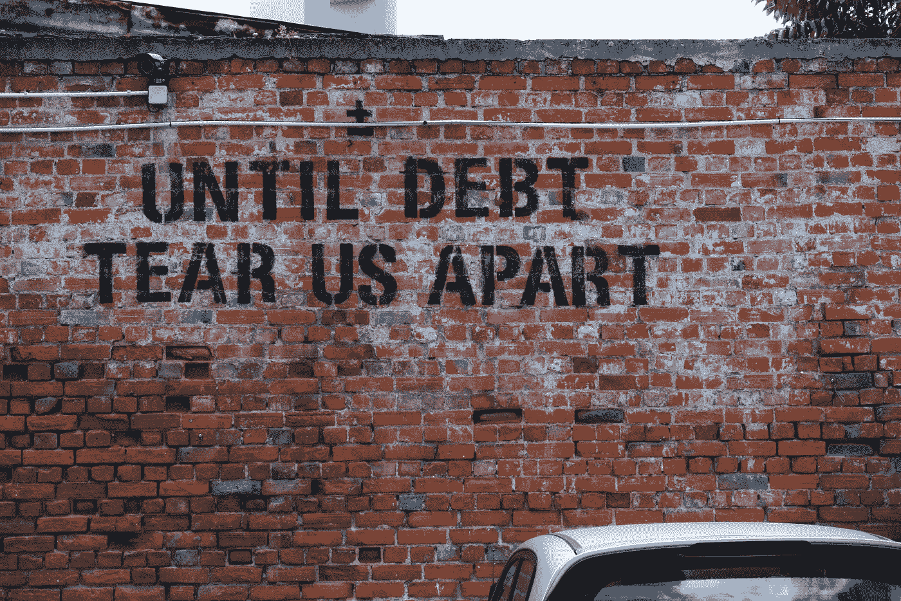
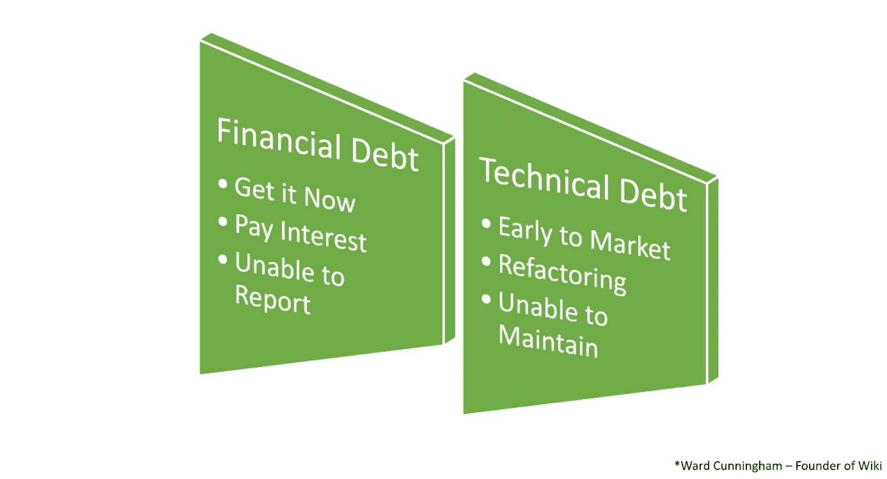
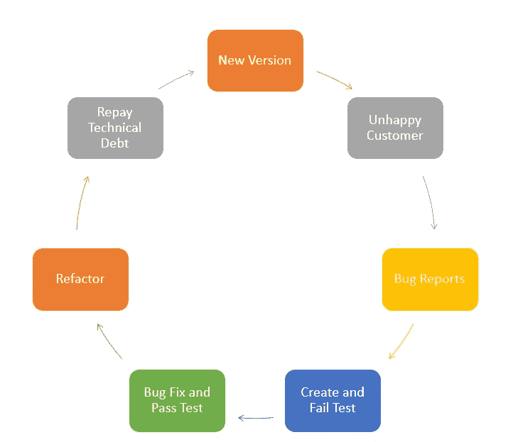
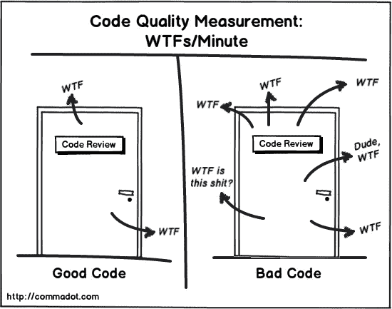

# 工程中的技术债务和权衡

> 原文：<https://betterprogramming.pub/technical-debt-and-tradeoffs-in-engineering-4a8696d8a95e>

## 因为不幸的是，我们现在不能免费拥有一切

由[埃胡德·纽豪斯](https://unsplash.com/@paramir?utm_source=unsplash&utm_medium=referral&utm_content=creditCopyText)在 [Unsplash](https://unsplash.com/s/photos/technic-debt?utm_source=unsplash&utm_medium=referral&utm_content=creditCopyText)

什么是技术债？这可能是你工作做得不好的标志吗？这可能与你赊欠新笔记本电脑多少钱有关吗？或者是您每月必须花费在云成本上的金额？

# 我们每天都要做出妥协

技术债务是一个隐喻——让我们暂时坚持最可能更熟悉的金融模型，它可能有助于我们理解它是怎么回事。

下图比较了你欠债的不同原因(技术原因和财务原因):

金融债务与技术债务的比较

我们每天不得不面对的妥协和相关选择导致了技术债务。问问你自己:“现在做还是马上做？”

你很可能会同意你不能同时拥有两者。当然，根据你当前的项目和项目的范围，“正确”可能会有所不同，但是一般的意思是一样的。

您项目的当前需求将总是决定您必须选择的折衷方案。你可以把它们归纳为三个主要部分:

*   质量
*   费用
*   时间

简单地说，你不会得到一个快速的低成本高质量的解决方案。你必须从这三点中选择两个——做得又快又便宜但质量差，或者在短时间内质量高但花费大。

# 技术债务的类型

下面的列表可能不完整，但它应该包括我们日常业务中的主要技术债务类型:

*   代码债务

过于复杂的代码会减慢你的开发速度，你不知道发生了什么。

*   建筑**债务**

任何不再满足项目需求或需要额外工作的架构只会降低您的速度。

*   知识债务

由于以前的项目成员或其他原因，不知道如何支持或使用代码将会减慢您的速度。

*   测试债务

无法测试和验证您的代码会减慢您的速度，因为您不知道您的项目是否还在工作。

*   技术债务

如果你需要实现一个你目前的技术无法实现的特性，你会因为某种原因而放慢速度。

# 你闻到了吗？

以上债务全部臭…

> *“气味是代码中的某些结构，它表明对基本设计原则的违反，并对设计质量产生负面影响。”—* [*威廉&玛丽计算机科学*](http://www.cs.wm.edu/~denys/pubs/ICSE'15-BadSmells-CRC.pdf)

如果你保持一个健康的发展周期，你会发现自己经常关注你的气味和技术债务，就像下面显示的那样。

开发周期示例

开发软件是一个永无止境的过程，就像偿还技术债务一样。我的一位前高级经理喜欢说:“如果你停止一个项目的工作，要么是因为你退休了，要么是你的软件不再被使用了。”

# 那么，我如何嗅到技术债务？

古老但仍广为人知的方法

当然，WTFs/分钟可能是一个选项，但玩笑归玩笑，有一些方法可以让你识别每一种债务类型，也有一些建议来防止和减少它们。

# 代码债务

这是你可能得到的重要债务之一，你花很多时间阅读代码。在完美的世界中阅读代码很容易，但在现实世界中却很难。

## **闻码债**

*   “什么……这是谁写的？”
*   “那部分肯定是个笑话，加油！”
*   一种不适合您的显示器并迫使您滚动的方法。
*   难以发音的变量名或到处都是“temp”，“I，a，s”变量，这些变量不能解释它们的作用。
*   处理一半应用程序业务代码的庞大函数。

## **预防和减少**

*   为您的代码标准实现一个编码指南。
*   看看罗伯特·c·马丁的 [*干净代码:敏捷软件工艺手册*](https://www.amazon.com/Clean-Code-Handbook-Software-Craftsmanship-ebook/dp/B001GSTOAM) 来看看一些例子。
*   简单地写你的代码，你不必成为新的莎士比亚，尽量让你的代码易读。

# 建筑债务

这种债务有时会出现在客户的请求或反馈中。可能是客户正在以一种你从未想过的方式使用一个特性。为此，我想引用史蒂夫·乔布斯的话:

> “通过焦点小组设计产品真的很难。很多时候，人们不知道他们想要什么，直到你给他们看。”—史蒂夫·乔布斯，1998 年

## **可能的气味**

*   开发人员可能会告诉你:“这比它应该的要难很多，”或者“为什么我们去年没有这样做？”
*   您的团队完成任务的估计时间远远落后于实际所需时间，尤其是对于“简单”的任务。
*   开发人员倾向于建议“从头开始”，不重用现有的代码部分。

## **预防和减少**

*   尽量让灵活性成为你的项目的一个高优先级特性。
*   试着深入了解你所在行业的日常任务。
*   始终保持并传达项目的长期愿景。
*   讨论计划的和已经完成的变更，定期召开会议，在开发人员之间分享新特性和代码部分。

# 测试债务

如果您不能够可靠而快速地进行测试，它将会减慢您开发过程中的一切。

## **闻闻这笔债务**

*   "改变这部分太冒险了，谁知道会有什么副作用。"
*   "我们在几个更新之前没有解决这个问题吗？"
*   如果您对 *done* 的定义不包含测试和测试用例的创建/更新，请查看下面的文章。

 [## 完成的定义？

### 我想每个在团队工作的人都会偶然发现上面的标题和相关的话题至少一次…

medium.com](https://medium.com/@c.muehle18/definition-of-done-cfe6eb0401b8) 

## **预防和减少**

*   包括测试到您的日常开发周期中，测试必须是开发团队的高优先级任务。
*   投资测试基础设施，它将每天为您节省成本/时间。
*   构建自动化测试用例。
*   使用集成测试。

# 知识债务

知识债务并不直接意味着你错过了学习一些东西或者你很愚蠢，它更多的是关于你的代码和客户需求是什么和如何的。

您需要了解代码中发生了什么，对于客户的工作流来说也是如此，您需要了解某个功能是如何使用的，您可能会计划对其进行调整。

> “任何傻瓜都能知道。重点是要理解。”― **阿尔伯特·爱因斯坦**

## **气味会是**

*   “我不知道我们有这个项目/代码/功能。”
*   “看着这部分，我不知道它应该做什么。”
*   所有作者都离开了公司，没有人知道代码了。
*   我最喜欢的一个——为实用方法或其他更常见的任务重新发明轮子。

## **预防和减少**

*   请删除死代码—您应该有一个版本控制系统，以便您可以随时恢复和检查。
*   记录你的改变——如果你犯了什么事，请提供适当的描述。如果你需要打破一种模式，解释一下，这样人们以后就会明白你为什么这么做。
*   说起来容易，做起来有时很难——减少员工流动。

# 技术债务

技术在变化，而且变化很快。你获得了全新的语言、技术、工具或实践。

当然，你不可能什么都知道，但你需要让自己保持消息灵通。再次，想想你的客户可能想要得到什么。

> 每个商人的金科玉律是这样的:“设身处地为顾客着想”。”——奥里森·斯韦特·马登

## **有哪些气味**

*   “如果我们可以使用(新技术)，这将是小菜一碟。”
*   您不能更新开发机器的操作系统/工具集。
*   如果运行您的解决方案所需的硬件过时且昂贵/难以获得。
*   您的支持团队通知客户不要更新他们的系统，以防止破坏功能。

## **减少和预防**

*   保持你的工具更新，订阅时事通讯，GitHub，或者任何适合你核心技术的东西。
*   确保您的业务逻辑层是可移植的，尝试优先考虑这一点。
*   看看你是否能参加开发者大会/峰会，看看其他人如何应对他们的挑战。
*   确保解决所有其他形式的技术债务。

# 摘要

没有技术债务你永远无法工作，只要你意识到它存在于你的产品中，并且你计划解决这个问题并与所有相关人员沟通，那就没问题。

您的路线图应该保留一些百分比来解决这个问题，这样它们就永远不会堆积成一个大问题。

感谢您的阅读，如果我漏了一个类型或者您有任何额外的建议，请随时留下您的评论。

# **资源**

*   气味:【http://www.cs.wm.edu/~denys/pubs/ICSE'15-BadSmells-CRC.pdf 