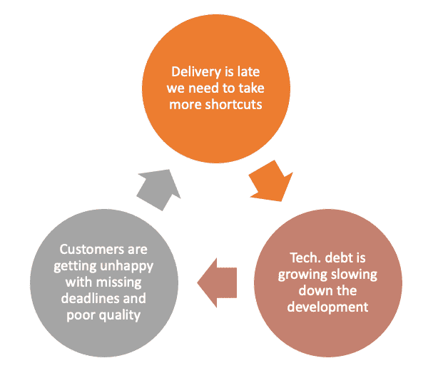
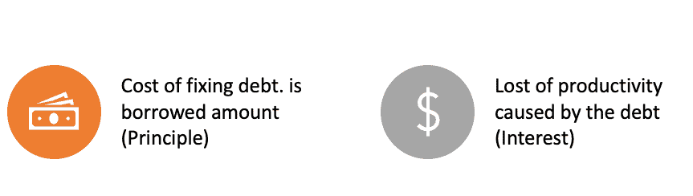
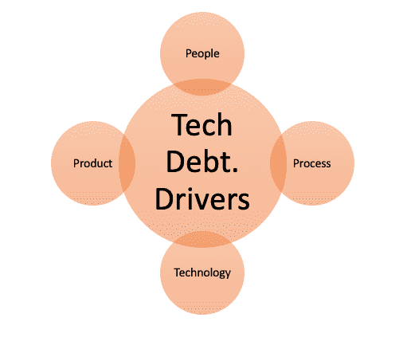

# 技术债务去神秘化

> 原文：<https://betterprogramming.pub/technical-debt-demystified-316899d1a2b9>

## 概述什么是技术债务，如何识别它，以及如何以负责任的方式偿还它

爱丽丝·帕斯夸尔在 [Unsplash](https://unsplash.com/s/photos/debt?utm_source=unsplash&utm_medium=referral&utm_content=creditCopyText) 上的照片

我们生活和工作在快节奏的工作环境中。频繁的业务和组织变化、激烈的竞争，以及创造产品和服务来满足客户需求和增加收入的压力。

这些条件产生了现代软件开发和交付实践，其中术语“敏捷”和“持续”是我们日常工作的各个方面的基础。

不可避免的是，这种更有生产力和更敏捷的需求是如此重要和耗时，以至于我们几乎没有时间以可持续的方式适当地计划和实践软件工程最佳实践。

像 MVP(最小可行产品)和 MVA(最小可行架构)这样的概念变得无处不在，并开始证明做最少的努力是正确的，以使软件或服务“出厂”

我在许多小公司和大企业工作过，我记得在每一家公司，我都参与或领导过重大的重构工作、完整的系统重写或“打破垄断”的努力。在某种程度上，这感觉就像是一种时尚或神奇的技能，被添加到我的简历中，并获得有吸引力的工作机会。

# 为什么会这样？

在大多数情况下，场景几乎是相同的:

开发从“薄弱”的基础开始，继续以圆角和被忽略的非功能性需求开始，无论什么原因在当时看起来都是合理的，随着系统随着时间的推移而增长，它很快从一个看似成功的项目变成了一个没有人想要“接触”或维护的遗留怪物。

目睹如此多的公司，突然意识到开发健壮的、高质量的系统是困难的，这是令人着迷的。

在某种程度上，这使这些公司陷入了一个众所周知的恶性循环:开发速度放缓，错过了最后期限，客户感到不安，工程团队承受了更大的压力，这使得降低效率或从传统架构迁移到现代架构变得更加困难。

在这种情况下，技术债务会迅速积累，导致工程生产率下降，并给组织带来巨大的成本。

# 定义的技术债务

我们先从症状说起:

*   你觉得你的开发团队的生产力没有处于最佳状态吗？
*   在你决定对你的代码库进行修改之前，你会三思吗？
*   你的团队是否感到沮丧，不断救火？

如果你对所有这些问题的回答都是肯定的，那么你可能正遭受着严重的技术债务。

技术债务一词是沃德·坎宁安在 1992 年创造的一个隐喻。

坎宁安说:

> "当有意识或无意识地做出错误或次优的技术决策时，技术债务就产生了."

通过这个术语，Cunningham 希望找到一种方法来沟通交付速度和持续改进正在开发的软件的架构和质量属性所需的努力之间的平衡。

这个类比来自金融债务，你有本金和利息。

就像在金融中一样，你希望减少原则，这反过来会随着时间的推移使持续的利息支付减少。

就像在金融领域一样，利息是每次你需要在相关领域进行变革时，因为债务而花费的额外努力。

令人惊讶的是，这种类比很快成为一个自我实现的预言:如今许多公司意识到技术债务已经开始以真正的财务影响来体现自己。他们努力做到以下几点:

*   留住现有客户
*   获得新业务
*   提供有竞争力的解决方案

最终，它会对公司的经营业绩产生负面影响。

另一方面，技术债务的概念发展到了这样一个地步，开发人员明白他们需要一个定义明确的方法来识别其来源和管理它的策略，平衡短期目标和创建长期可行的可持续产品的需要。

DevOps 实践中的静态代码分析工具使得在潜在的质量和安全问题变成债务之前发现它们并实现持续的债务削减过程变得更加容易。

# 技术债务的类型

我认为技术债务与糟糕的系统设计和缺乏对软件开发生命周期中要做的架构工作的持续投资有着密切的关系。

这一假设的推论是，即使在没有明确的代码质量问题的系统中，技术债务也可能存在。这意味着，从理论上讲，你可以拥有一个运行良好的系统，但仍有需要你关注的债务积累。

为什么？因为我们都经历过。智者说，变化是唯一不变的。

即使在某个时候，您已经划清了界限，并决定将您的遗留系统置于维护模式，并从头开始创建一个更好的版本，您仍然需要修改该遗留系统来满足现有客户的需求。

现在，你将面对一个怪物，每次你碰到它，它都会“咬”你一口。

让我们回到我之前提到的系统设计和架构问题。

在他著名的文章中，“谁需要建筑师？”Martin Fowler 声称，架构师最重要的任务之一是通过寻找消除软件设计中不可逆性的方法来消除架构。

没有理论上的理由说明软件中的任何事情都是不可逆的，这就是技术债务的全部。

这是在对我们具有进化能力具有战略重要性的地方缺乏投资。

让一些东西容易改变会让整个系统变得复杂一点，让所有东西都容易改变会让整个系统变得非常复杂。

这就是为什么我们需要建筑师。

我们需要他们成为软件开发过程中不可或缺的一部分，以不断地评估和询问类似这样的问题:

*我们应该注意哪些技术债？*

*我们期望改变软件的哪个方面？*

*我们应该改进什么，以便更容易整合和管理变革？*

# 技术债务的来源

在本节中，我们将回顾技术债务的主要来源:

# 人

毫不奇怪，人的因素是技术债务积累的最主要因素之一。

在技术方面，人们要么倾向于过度设计解决方案，专注于想象的用例并试图优化，同时依赖错误的假设，要么缺乏足够的经验来意识到他们在开发期间所做决策的缺陷和影响。

偶然复杂性是众所周知的可能由上述原因引起的现象之一。

意外复杂性的另一个相对较新的原因是所谓的“[简历驱动的开发](https://martinjeeblog.com/2015/03/11/cv-driven-development-cdd/)”，其中技术和开发领导基于“时尚”或“酷”技术做出决策，以获得由于稀缺而具有高需求的技能。

在业务方面，人们并不总是意识到一些早期的设计决策对软件项目的影响，以及他们将来可能产生的成本。

# 过程

从过程的角度来看，让我们从应该有一个过程的断言开始。

减少技术债务首先需要(I)确定具体的 it 项目，(ii)评估它们对可预见的软件发展的影响，(iii)理解债务成本，以及(iv)最后引入向相关的技术和商业利益相关者(例如开发领导和产品经理/所有者)传达其影响的机制，以便他们计划减少债务。

# 技术

有时，尽管我们尽了最大努力，但我们很快就会采用过时或有限的技术，无法应对规模、性能、维护或任何其他内部和外部的需求和力量。

当发现和替换较晚时，它会导致变通方法和补丁、快速和不可靠的解决方案(以“创造性”为卖点)，并最终导致产品复杂性的增加。

# 产品

产品经理不可避免地会遇到的一个主要矛盾是特性开发与在设计、最佳实践实现和技术债务减少上投资开发时间之间的矛盾。开发人员希望提高他们开发的系统的质量、性能和稳定性，包括更多面向客户的特性和改进。

当我们处理“范围蔓延”时，情况会更糟[蜂巢产品副总裁梅根·格里森](https://www.linkedin.com/in/megangleason/)在她的[帖子](https://thenewstack.io/adding-too-many-features-will-break-your-product-users-and-team/)中简洁地说:

*“除了少数例外，我们为产品增加的每一平方英寸的表面积都增加了它的复杂性，降低了我们快速移动的能力。”*

她的主张的基本前提是，交付新功能需要考虑成本。反过来，这意味着产品经理不仅应该关心“是什么”，还应该关心“如何”，因为这可能有助于推动关于平衡短期结果和长期软件可持续性的更好决策。

# 偿还技术债务

解决技术债务不是一件小事。

正如我们之前看到的，它始于对信息技术的认识，了解信息技术的类型，跟踪、量化信息技术，并与相关的利益相关者沟通，然后制定行动计划来实施信息技术的减少。

根据我的经验，最具挑战性的部分是说服所有相关的决策者，这是必须要做的。

这是必须的，因为只有在经济上可行的情况下，软件开发才能作为一个行业持续下去。

# 结论

市场和客户不断要求新的应用程序和系统，他们现在就想要。

这些应用程序中的一些将是短暂的，但是一些，通常是成功的应用程序，必须长期维护和扩展。

技术债务是创建可持续软件的最大障碍，管理技术债务应该解决这样一个问题，即我们如何应对快速扩展的软件基础，同时保持它的可伸缩性、高性能、安全性，运行在最新技术之上，并以经济可行的方式满足其业务和用户目标。

我们看到，它始于这样一种认识，即由于缺乏专业知识、冲突的优先级、缺失的过程以及许多其他原因，演进的软件将积累技术债务。

管理技术债务需要技术和业务双方的关注和纪律，但如果我们都理解不管理它最终会导致我们自己的沮丧和糟糕的业务结果，我们可以共同努力以负责任的方式计划和处理它。