# 构建和发布我的前 3 个网页游戏后的技术见解

> 原文：<https://betterprogramming.pub/technical-insights-from-my-first-3-published-web-games-36299a7f94df>

## 设计游戏的建议

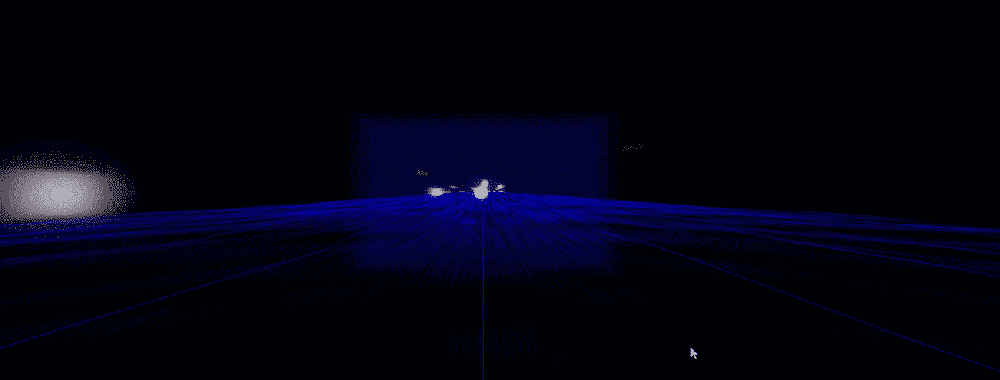

随着我作为一名游戏开发者在过去一年的成长，我已经发布了三款游戏，你现在就可以在你的浏览器上玩:

*   11 月 21 日: [vast](https://joejs.itch.io/vast) ，一款混合了编码和 2D 平台游戏玩法的益智平台编程游戏。
*   5 月 22 日:[下载速度](https://joejs.itch.io/download-speed)，一个赛车流氓建兴，你玩一个正在下载的文件。
*   醒醒吧，菲利克斯！，一个反向的子弹地狱(想想*吸血鬼幸存者*)，由时钟上的猫费利克斯主演。

所有这些游戏都有以下优先事项:学习和实践游戏开发，增强我的投资组合，享受乐趣/沐浴在创造力中，以及(可能)赢得一些钱。

我写这篇文章的目的是集思广益，分享每个游戏的技术细节(例如，我使用了什么工具和方法)，以及对我如何以及为什么用 JavaScript 和 web 构建游戏的见解。

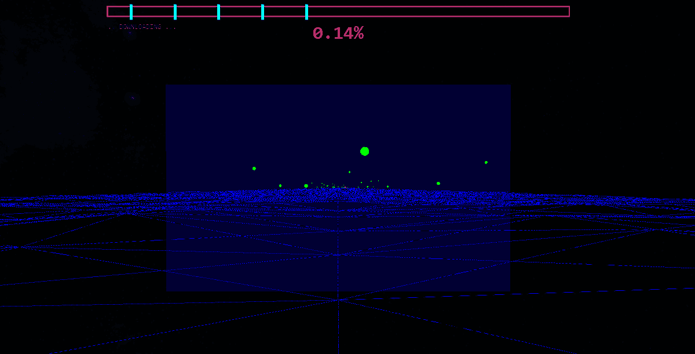

从网上下载的真实的第一人称数据片段。

# 为什么要为网络/浏览器开发游戏？

我经常收到这个问题，我认为这是一个好问题。如果有很多游戏创作平台，比如 Unity，Unreal Engine，Godot 等等。为什么我要在一个健壮的引擎之外用 JavaScript 构建游戏？

首先，我相信网络游戏的潜力和优势。比如，我参与的很多 jams 制作的游戏都需要用户下载一个`.exe or .app`文件才能运行。这个可执行文件通常没有代码签名(也就是说，你必须说“是的，Windows/Mac/Linux，我可以运行这个完全未知和不可信的二进制文件！”).对于一个非商业游戏产品来说，这是可以理解的。

对我来说，我的观众已经在使用我的游戏将要运行的平台/进程:浏览器！我所有的游戏都被部署到游戏市场[https://itch.io/](https://itch.io/)和[https://gamejolt.com/](https://gamejolt.com/)上，无需安装或下载步骤即可玩。这也可以通过 Unity 的 WebGL 构建输出等方法实现——但这些方法放弃了本地控制，而是首先使用 JavaScript 为浏览器编写代码，比如方便可靠地访问 Web APIs。

> 玩家参与游戏的低门槛将永远是浏览器游戏的最大特点。

第二，*我喜欢使用 JavaScript* 。这是我十几年来练习、构建和教授给别人的专业语言。*我为什么不试着用它做游戏呢？*

随着时间的推移，浏览器改进了它们的特性集和功能(例如 WebGL 2.0、gamepad 支持和[其他 API](https://developer.mozilla.org/en-US/docs/Web/API))，关于“典型网页游戏”的概念受到了挑战，我觉得这很令人兴奋。

第三，*为网络开发游戏扩展了我典型的赚钱技能，*你知道…网络开发！如果你是一名网络开发人员，想知道是否可以用 JavaScript 制作游戏，我为你写了这篇文章！

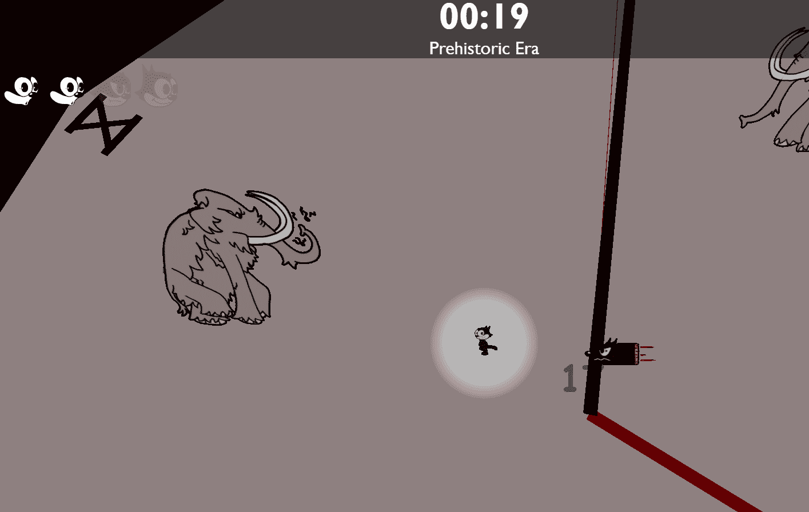

生活在石器时代的猫菲利克斯。

在上面的 Felix the Cat `.gif`中，计时器、生命值和伤害值实际上是游戏`<canvas>`顶层的 React 组件。我在前端框架或 DOM API 中采用了这种策略来混合传统的 web 元素，这些元素看起来像是我游戏的一部分，但实际上却存在于游戏之外(或在游戏之上)。

游戏开发本质上是 UI 开发，我已经将我学到的许多东西带到了我传统的面向业务的工作中。

网络上的 3D 视觉也正在成为品牌、营销和许多其他产品和体验的热门商品。在我的游戏中工作教会了我一些东西，帮助我建立人们会为之付费的体验！

我的第一个网页游戏:

# 广阔的

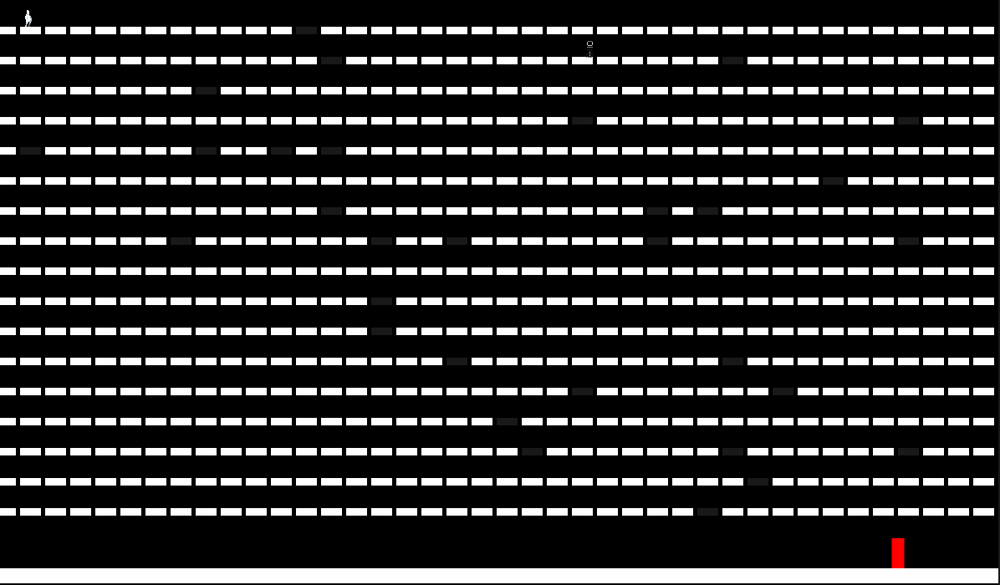

不知疲倦的大量计算。

在 [vast](https://joejs.itch.io/vast) 之前，我已经制作了一些玩具游戏，但是我决定参加 [Kajam 2021](https://kajam.replit.com/) game jam，以便制作并发布我的第一个完全可玩的游戏……然而事实证明。我只有一周的时间来做这件事！

jam 由 replit 运行，他创建了 JavaScript 游戏编程库并鼓励参与者使用它来构建他们的游戏，所以我这么做了！

## 选择构建网页游戏的工具

我对这个游戏的选择很简单(因为它是*为我*选择的)，我喜欢和 Kaboom 一起工作。但是有很多选项我可以选择(例如 [Phaser](https://phaser.io/) 、 [Babylon](https://www.babylonjs.com/) 、 [PlayCanvas](https://playcanvas.com/) 、 [PixiJS](https://pixijs.com/) 等等)。工具选择瘫痪对于多产和有创造力的程序员来说是一个真正的生产力杀手。我同情被困在这里的人；这有点像陷阱。以下是我对这些东西的思考、分类和策略:

1.  请理解，您选择的工具最终会将视觉效果呈现给 HTML 中的`<canvas>`元素。我强烈建议学习一下 [canvas 元素](https://developer.mozilla.org/en-US/docs/Web/API/Canvas_API)本身，并用它来构建一些简单、可控的可视化。当你在制作游戏时，你实际上是在接收玩家的输入，并将其与视觉内容混合在一起。`<canvas>`元素将始终支持该内容的可视化，除非您仅使用 DOM 元素构建游戏。了解它的功能！
2.  注意像 Phaser，Kaboom，Babylon 这样的游戏“库”的区别；像 PlayCanvas 这样的游戏“引擎”；和一个像 Three.js 这样的“渲染库”，有了*“游戏库”*，你的开发将是非可视化/以代码为中心的，但你将配备许多实用程序和组织工具，这些工具有利于大多数游戏，如精灵动画和输入模块。有了一个*“引擎”*，你就有了一个图形用户界面，在这里你可以直观地变换游戏中的物体，就像你在使用 Photoshop 一样。您将编写代码来附加到对象，有时附加到其他上下文。这是构建游戏的一种流行方式，Unity 和 Unreal Engine 等工具就是证明，部分原因是当你有一个拥有不同技能的大型团队时，它们的可伸缩性和可访问性。有了像 Three.js 这样的“渲染库”,你就可以抽象出你画布上的内容，除此之外就没什么了，而且很少是专门面向构建游戏的。奇怪的是，我制作的大多数游戏都没有游戏库或引擎，只有这个“渲染库”。我后来深究原因。
3.  了解你的工具的视觉能力/偏见。虽然它们都将渲染到`<canvas>`，但大多数库都是以 2D 图形(例如 Phaser，Kaboom)或 3D 图形(例如 Babylon，PlayCanvas)为基础构建的。挑一个符合你眼光的吧！
4.  认识到您的秤的需求。很明显，这篇文章中的许多建议和观点来自于制作小游戏的个人开发者，而不是创造大规模体验的大团队。想想合作者将如何与你一起开发你的产品，尤其是艺术家和其他编码人员。最好是根据规模和生产率来定制您的技术选择。

> 到目前为止，你可以在我提到的任何工具中制作出一个伟大的游戏。所以，随便挑一个做点什么吧！学习一个将延续到另一个，你可以在未来尝试。

Kaboom 使用起来很好，而且不觉得功能臃肿，我认为这是 Phaser 难以使用的原因。下面是来自 *vast* 的一些示例代码，它一次显示了许多不同的内容:

[以上代码在全游戏代码库中。](https://github.com/00-joe-js/vast/blob/main/code/levels/winLevel.js#L56)

也就是说，我不得不在缺乏对某些机制的控制的情况下工作，比如控制*重力*和*平台*如何工作。在这个视频博客中，我谈了很多我的挑战和过程。在继续之前，我还想强调一点: *vast* 的游戏内编程接口。

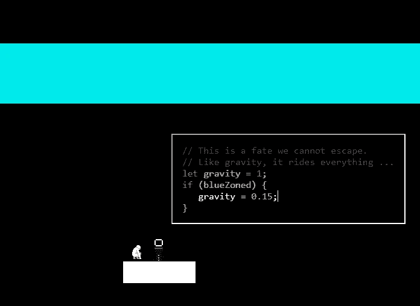

如果你愿意，你可以在你的游戏中加入谦逊耗子乐团的内容。

玩 *vast* 的主要方式是编写影响你的环境的代码。玩家编写的任意代码的执行是通过`[eval](https://developer.mozilla.org/en-US/docs/Web/JavaScript/Reference/Global_Objects/eval)` 实现的，我认为这是一个极其罕见的用例。更重要的是，这段代码的可视化和编辑不是来自于`<canvas>`上的 Kaboom，而是来自于`<canvas>`之上的一个 DOM 元素。这也适用于开始出现在第 7 级的对话框:

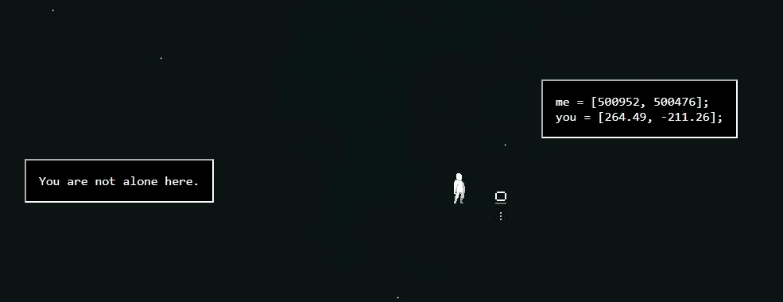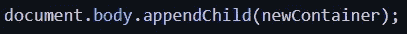

我强调 DOM 元素的使用(以及任何前端框架，如 React、Vue、Angular 等。)在我的游戏中，因为它们在你的游戏 ui 中暗示了强大的控制和视觉自由，以及像(例如网络摄像头流)这样有趣元素的使用。*而且你可能已经知道这个东西了！如果你是一名网络开发人员，正在阅读这篇文章，我希望你能认识到这一点，并且充满了可能性！*

我在《广袤的 T2》上的工作给我带来了信心，让我相信我可以用我已经非常熟悉的工具和平台制作一款令我自豪的游戏。我认为*浩瀚的*是我迄今为止最个人化的游戏——它的想法来自我的日常编程和成人教育学，恐怖主题来自我自己的噩梦。它的玩家基础有限(需要编程知识才能玩)，但我从玩过的人那里得到了很好的反馈。如果你是其中之一，谢谢你！

如果您需要完成 *vast* 的提示，请随时联系我！直到你打败了最后一个 boss，游戏才算结束。

我很兴奋能做另一个游戏插件，并最终建立一些别的东西。半年后，我找到时间，制作了我的下一个游戏:

# **下载速度**

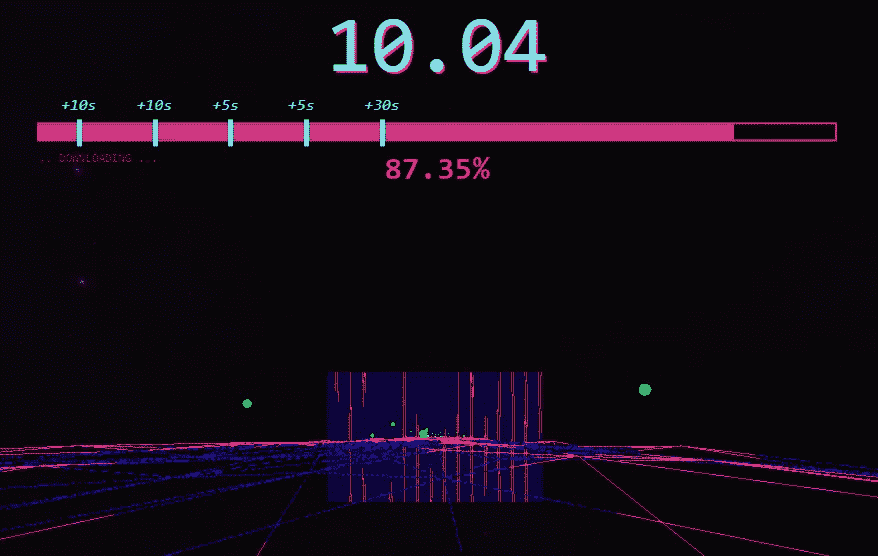

**快！用户在等待！**

[下载速度](https://joejs.itch.io/download-speed)(我猜)是一个赛车游戏，风格化的想法是你是一个文件，从原始服务器到用户计算机——只需两分钟！它通过 [Three.js](https://threejs.org/) 渲染，整个 UI 和 HUD 都是用 DOM 元素搭建的，包括我们的朋友 Blippy！：

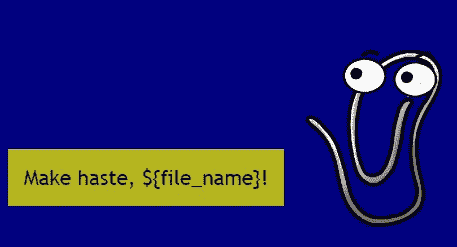

它是为一款[休闲游戏 jam](https://itch.io/jam/jame-gam-18) 制作的，主题为“**时间就是金钱**”，要求特殊对象“**剪辑**”。我最喜欢的一件事就是在主题的约束下工作。在*下载速度*的情况下，“时间就是金钱”在游戏的升级系统/经济中盛行，你必须花剩余的时间来获得更快的速度。“剪辑”希望是显而易见的，包括一个像 Blippy 这样的字符真的推动了文件下载知识摆在首位！

我说过，我用 Three.js 做的游戏，根本不是“游戏库”，更多的是“渲染库”。让我们探索一下:

## **Three.js 基础知识简介**

Three.js 是一个抽象内置浏览器 WebGL 方法的库，允许您方便地将 3D 场景渲染到`<canvas>`。3D 场景由世界空间和其中的物体(包括形状、模型、灯光等)组成。)，以及至少一个观察空间/场景的摄像机。您可以使用一种机制来渲染该空间的图像(通常称为“帧”)，该空间中的对象或相机的变换将反映在后续的图像中。Three.js 库还附带了一些实用程序来计算世界空间中的东西，比如线性代数函数和构造，**但是在“游戏制作”实用程序领域中并不多见**。

**Three.js 不是专门制作游戏的库**。很多人在寻找基本的游戏功能时很早就遇到了这个事实，比如监听用户输入、检测碰撞或以典型的方式控制相机。我构建了一个第一人称角色模块在 Three.js 中使用，因为它没有:

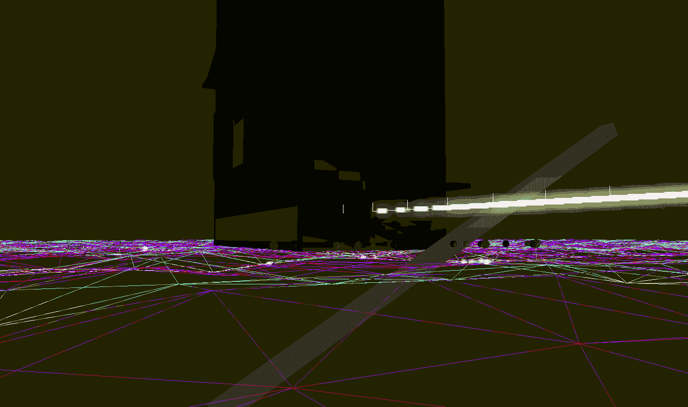

**在沙盒周围移动 FPS 角色相机。**

*下载速度*从未有过这种移动的自由，但确实是从我在 Three.js 中实现第一人称视角角色控制器的工作发展而来的——见上图。这个角色可以移动，环顾四周，跳跃和跌倒，走上斜坡和滑下陡坡，并与可配置距离的对象进行交互(像开枪一样)。

我用研究了一年左右的数学概念，从零开始实现了这个控制器。我用它的一个内部版本来提高下载速度，并且正在用它来驱动一个更大的、正在开发的游戏。

> 虽然这比使用游戏库或引擎中的内置控制器需要更多的努力，但在底层使用 **Three.js 让我能够控制和灵活地创建我可以在基础层面适应的系统**，从而带来更独特的游戏体验。

## **“那么，我做游戏一定要做数学吗？”**

你不需要，而且你完全可以不用学习大量的数学就能做出很棒的游戏。然而，如果您在线性代数方面建立了坚实的基础，您确实可以获得一定程度的表达自由和更容易的调试。以下是经常对我有用的内容，如果你对游戏开发很认真，我建议你最终也要学习:

*   理解向量以及如何操作它们。这包括矢量加法、减法、标量乘法和点积。矢量思维有助于在 2D 和 3D 空间中让你的物体相互作用，并按照你想要的方式移动。向量是你在世界空间中描述位置和方向的方式，就像计算你的玩家和敌人之间的方向和距离，或者他们是否在看着对方。好好学习它们，从多个来源！
*   正弦和余弦函数的性质。我不得不喊出[这篇文章](https://allenchou.net/2019/08/trigonometry-basics-sine-cosine/)来帮助我理解如何使用这些函数来生成一个循环值，从那以后我在工作中使用了很多。简单地将一个时间戳(例如从`Date.now`开始)和一个`Math.sin/cos`结合起来就足以做一些非常棒的事情。
*   嵌套世界空间和应用矩阵。不要担心所有矩阵运算的细节，相反*和*致力于概念化坐标空间如何存在于一个层次结构中，以及矩阵如何被用来应用从一个坐标空间到其父空间的变换，反之亦然。这与在 Three.js 中使用`[Group](https://threejs.org/docs/#api/en/objects/Group)`有很大关系，可以省去很多调试时的麻烦。

[《图形与游戏开发 3D 数学入门》这一章](https://gamemath.com/book/multiplespaces.html#why)真的帮了我这个概念；总的来说，这本书是一个坚实但具有挑战性的研究。我在学习其他东西的时候学到了我需要的数学知识，但是我估计到目前为止我已经专注于它六个月了。

## **关于学习数学**

我理解学习数学的犹豫；老实说，我讨厌学校里的数学。你会很高兴听到**数学感觉适用于虚拟空间**，比如制作 3D 场景，立即回答经典问题“我会用它做什么？”。我学习我需要知道的东西的过程是遇到问题，或者渴望一个特定的效果，然后学习数学来解决那个问题或者达到那个效果。

我想重申对**从多种来源学习数学的建议**。数学可能真的感觉像外星魔法，直到正确的人第五次给你解释，可能是以你大脑认为最好的方式。

我认为通过*数学*和*编码*我发现的最有力的线索是它们的构造的“概念化-应用”本质。`Math.cos`类似于使用`for loop`，在这种方式下，你需要首先强烈地概念化他们独立做的事情，发现他们的实际用法，然后在解决不同问题的同时练习他们。

学习这种类型的东西可以从不同的角度进行优化，因为我们每个人都有不同的想法，并且以非常微妙的方式交流想法。以下是一些对我帮助很大的资源，供你选择:

*   https://gamemath.com/
*   [https://www . gabrielgambetta . com/computer-graphics-from-scratch/00-introduction . html](https://www.gabrielgambetta.com/computer-graphics-from-scratch/00-introduction.html)
*   [https://www.youtube.com/c/ProfessorDaveExplains](https://www.youtube.com/c/ProfessorDaveExplains)
*   【https://www.udemy.com/course/games_mathematics/】

## **代码+gif 供你细读**

以下是游戏中的代码截图:

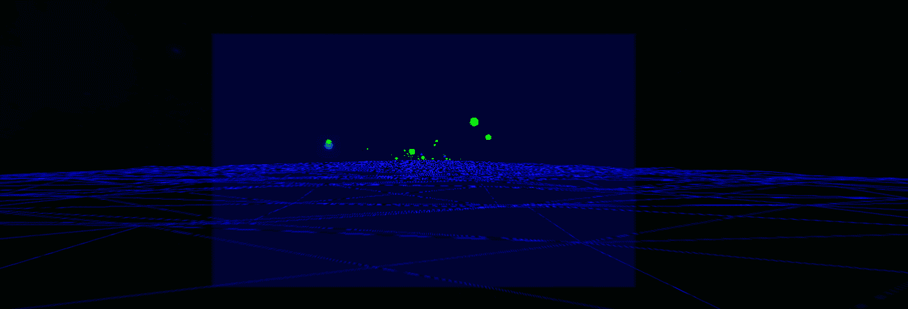

Blippy 说，“拿起速度水果变得更快！”

给定材质颜色和半径(大小)，速度果实是圆形网格。它将被添加到一个组中，该组将被附加到场景的其他位置。[源代码。](https://github.com/00-joe-js/hold-future/blob/main/src/items/speedFruit.ts#L51)

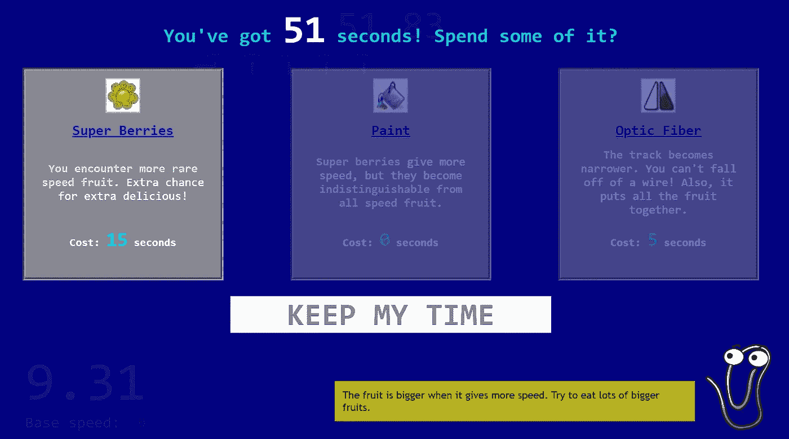

[Blippy 的所有名言。](https://github.com/00-joe-js/hold-future/blob/main/src/upgrades/gui.ts#L34)

布利皮说，“是的！快点！！!"

使用后处理着色器通过 Three.js 渲染器来增强游戏的感觉。[来源](https://github.com/00-joe-js/hold-future/blob/main/src/renderer/index.ts#L46)。

## **给你的游戏“果汁”**

如果两个游戏玩起来完全一样(想想外面有多少 2D 平台玩家)，但一个感觉有趣，另一个感觉无聊，这可能与“**榨汁**”有很大关系。游戏开发者使用这个术语来描述声音、视觉、振动和其他东西的使用，以增强游戏的“冲击力”——玩家需要并期望从令人满意的游戏中得到的往往未被认可但潜意识中感到的润色。

如果你在玩一个动作类的第一人称射击游戏，比如《毁灭战士》或者《使命召唤》，你被一个敌人(或者他们的武器)击中了……你认为会发生什么？我鼓励你花一点时间，想象你正在玩这个游戏，或者在建造它，想想因为你的角色被击中的这一瞬间可能发生的所有事情。

我想到的一些事情:一闪而过的红色屏幕，一声撞击声(也许是一声响亮的“啊！”)、模糊的屏幕(尤其是如果被爆炸物击中)、健康计的变亮/变暗以描述失去的健康、相机的咔嗒声或控制器的振动。*你还见过什么？*

现在想象玩一个这样的游戏，被敌人的子弹或火球击中，而…这些都没有发生。那个游戏不仅感觉没那么好玩，玩起来也更让人迷惑和沮丧。

> 我是不是被撞了？凭什么？！

下载速度对我来说真的很重要，玩起来感觉很有趣，这是一个短暂而紧张的体验。我想让玩家感受到慢和快的区别。我希望玩家获得速度果实不仅仅是为了变得更快，还因为得到它们让**感到满足。我想要一种从头到尾都在强化的体验。**

下面是我尝试过的几种“果汁”*下载速度的方法，*附带一些实现细节:

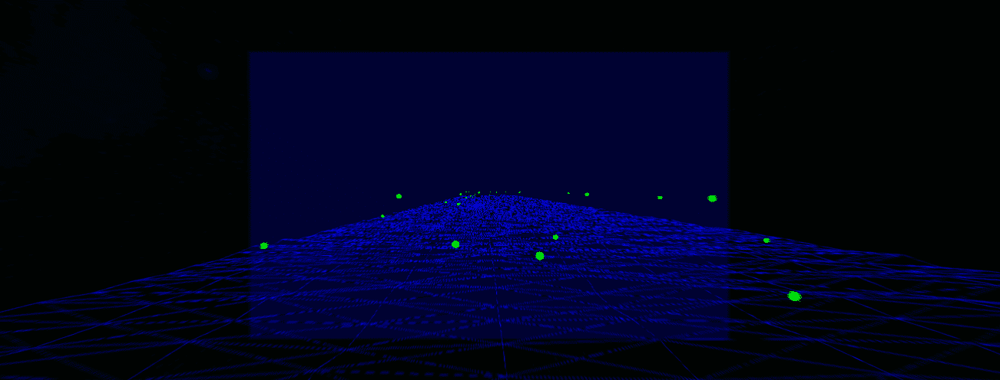

**当玩家抓到一个速度果实时**

*   *屏幕根据水果的颜色闪烁绿色或粉色*。这是通过具有颜色统一的后处理渲染器着色器程序来完成的。
*   *一股强劲的加速推动他们向前滑行*。这是一个降级标量，应用于用户的基本速度矢量。这也仅仅是游戏的一个基本机制(Blippy 称之为“助推”)，以鼓励玩家将水果采摘链在一起。
*   *拾取声音播放*，对于普通水果，音调较低且较安静，对于超级浆果(粉红色球体)，音调较高且较大声。
*   *基于用户当前速度的模糊等级。这种效果在高速下更加明显，并且在渲染器上用 GLSL 后处理着色器实现。*

## **GLSL 着色器**

大多数渲染器中都有着色器程序(例如 Unity 和 Blender 使用的程序)，它们是通知 GPU 材质或图像应该如何渲染的一种方式。

到目前为止，我发现学习这些着色器如何工作对于在我的游戏中产生有趣的视觉效果是不可或缺的，并且解决了一些非常困难的问题(例如*醒醒吧，菲利克斯！*，本文稍后)。

这是一个非常复杂的概念，这篇文章很长，所以我将简单地演示和分享一些东西，然后继续:

*   [“从零开始学习 GLSL 着色器”](https://www.udemy.com/course/learn-glsl-shaders-from-scratch/)Udemy 上的 Nicholas Lever。这门课信息量非常大，但是很难。如果你喜欢尝试，喜欢在学习中接受挑战，我强烈推荐它。
*   [着色器之书](https://thebookofshaders.com/)是一本未完成的经典，也是我偶尔会参考的东西。
*   我的着色器代码打开了，它包括来自我重新创建或派生的上述资源的演示，以及我自己的实验。我经常回到这些来实现我游戏中的视觉效果。

下面是我如何在*下载速度*中使用着色器来增强视觉效果:

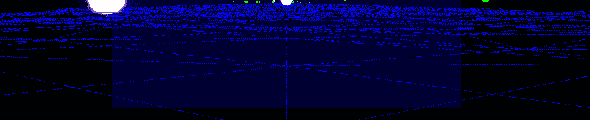

[地板](https://github.com/00-joe-js/hold-future/blob/main/src/level/groundPath/groundShaders.ts)

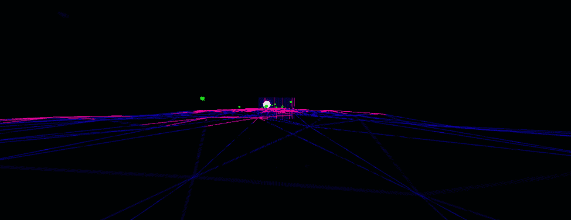

[模糊](https://github.com/00-joe-js/hold-future/blob/d3317096affcb22e577f70ac80e7c360d7fc9560/src/renderer/blur-shader.ts)和[闪光](https://github.com/00-joe-js/hold-future/blob/83c7759c545e200a0fac94afabccb804c344deea/src/renderer/index.ts#L46)，以及[最终目标](https://github.com/00-joe-js/hold-future/blob/5f6ac46b29171c187523c2bea677d670160f0213/src/level/groundPath/goalShaders.ts)。

有时果酱有巨额现金奖励(25000 美元！)，所以在我完成*下载速度*之后，我就开始了:

# 醒醒，菲利克斯！

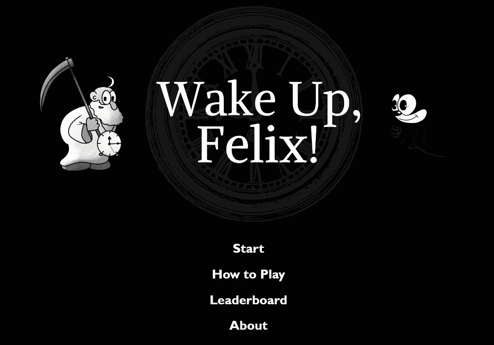

醒醒，菲利克斯！是为 NBC 环球赞助的 [Together Jam 2022](https://gamejolt.com/c/togetherjam) 制作的。我被允许使用菲利克斯猫，主题是“数量的力量”。我为我如何匹配这个游戏的主题感到自豪:你每分钟都会得到一件新武器，与时钟上的数字相匹配。

**武器 5、6、7 和 8**

这款游戏和*下载速度*一样，都是用 Three.js 制作的，这看起来很奇怪，因为这款游戏给人的感觉主要是 2D。2D 精灵实际上是渲染到`Plane`几何体*、*的纹理材质，并在 3D 场景中四处移动。你可以感觉到相机旋转以展示这种 3D 和 2D 的混合，时钟和武器上的照明也有所使用，以强调混合的视角。

这是在游戏的本地副本上被大量夸大的镜头旋转，以展示这种视觉效果的极端版本:

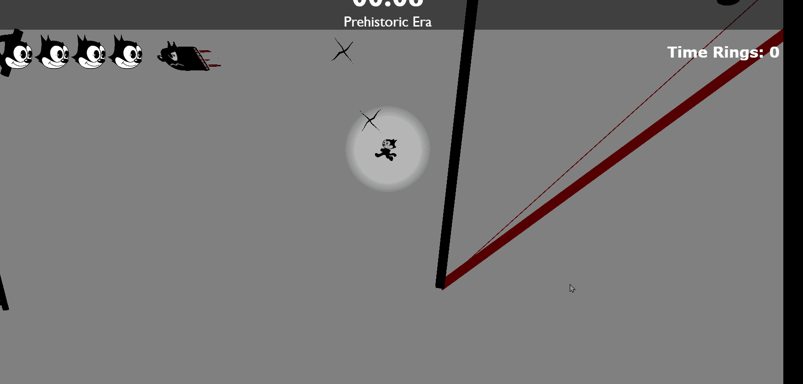

如果比赛像这样，你会晕船的！

我的灵感来自于制作一个像 [*吸血鬼幸存者*](https://store.steampowered.com/app/1794680/Vampire_Survivors/) 这样的游戏，因为我认为有分数和排行榜会是一个合适的体验，这是 jam 的另一个要求。排行榜还包括你选择了哪些武器！

2 是一种相当受欢迎的武器。#TeamHammer

对我来说，这个游戏最重要的事情之一就是我可以在时钟上放置大量的敌人，尤其是在一次跑步的末尾。当我试图一次产生 10-15 个敌人时，我在早期遇到了性能问题，使游戏变慢。

## **Three.js 的纹理首次渲染**

如前所述，这个游戏中的 2D 精灵实际上是 3D 网格，具有平面几何图形和一面渲染的材质。起初，这个材质是一个带有纹理贴图的`MeshBasicMaterial`。

当纹理首次用于材质时，Three.js 会执行“首次渲染”步骤来计算和缓存有关如何渲染纹理的信息。这适用于场景中的每一个纹理，即使它是你已经使用过的同一种纹理(例如猛犸精灵)。对我来说，这意味着每个敌人都会在《重生》中结巴，而且玩得很糟糕。

我解决这个问题的第一个尝试是为所有敌人共享相同的纹理。这解决了性能问题，但不起作用，因为如果我翻转纹理(使敌人转向)，或改变其偏移(使精灵动画)，它会将该变换应用于屏幕上该类型的每个敌人。相当尴尬。

我终于解决了这个问题…用一个着色器！

这个着色器为同一个敌人接收相同的加载纹理，但是允许**在单个网格**上独立控制。这个着色器播放动画，在需要时翻转纹理，甚至在敌人被击中时处理“击中闪光”。

我为这段代码感到自豪，因为我觉得我编写这段代码的能力是我几个月来不断学习和实践的结晶。而且，它解决了我游戏中的一个主要问题！

现在我可以有很多敌人了，明白吗？：

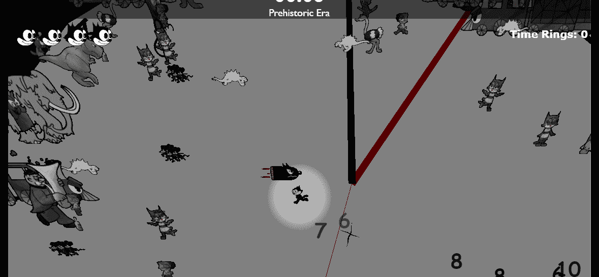

## **游戏艺术**

游戏中所有的 2D 艺术都是由我的好朋友亨特绘制的，所有的音乐/声音都是由我的搭档艾丽莎绘制的！

**猛犸之敌。**

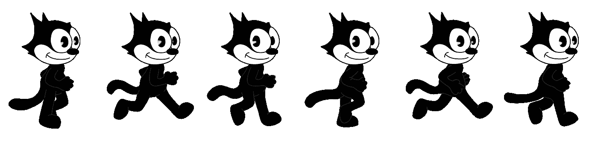

**菲利克斯散步。**

**我最喜欢的敌人，大号佬！**

我还用这个果酱在 Blender 中制作了所有的 3D 模型，从而拓展了我自己的艺术技巧！

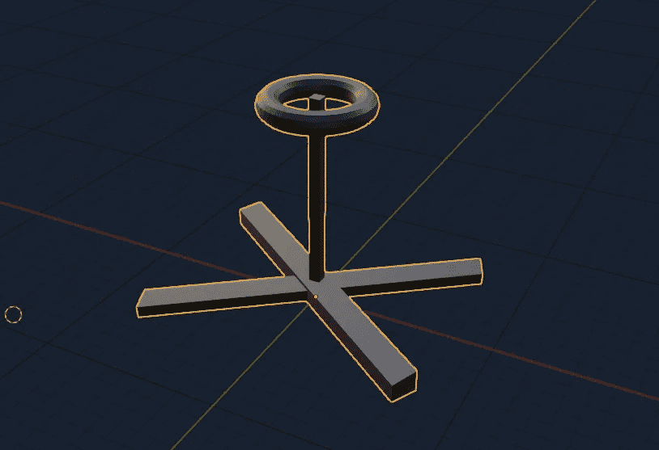

**武器九(9)。**

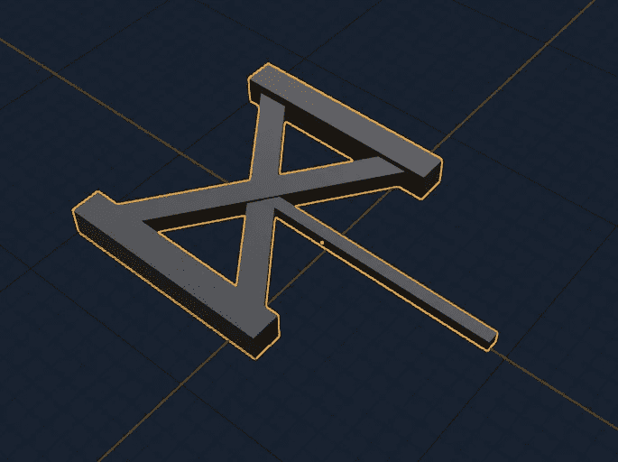

**兵器 XI (11)。**

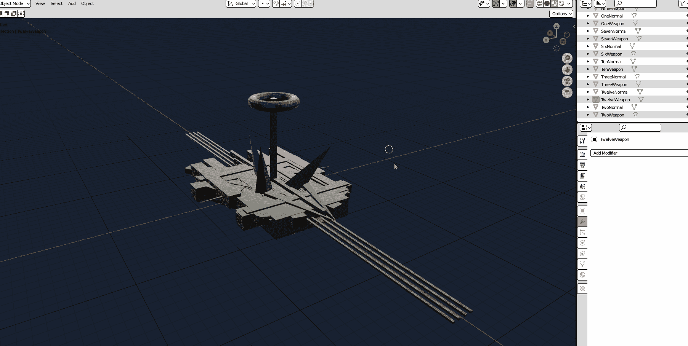

**所有武器和时钟号都在同一个文件里。看到它像这样粘在一起一定是某种恐惧症！**

# **包装**

我很感谢你阅读这篇文章，玩我的游戏。制作这些产品需要大量的努力，以便学习新的技能，以有效的方式构建，并实现创造性的愿景。我的任何一场比赛的每一次发挥都是值得珍惜的。❤

我希望这篇文章向您介绍了有趣的概念、工具和思想。

## 给有抱负的网页游戏开发者的一些临别建议

*   **先从 3D 基础开始。使用像 [Blender](https://www.blender.org/) 这样的程序是一个很好的开始。建立自己对 3D 世界空间、几何图形(顶点/边/面)、位置、比例、旋转、材质等的理解..你可能在 Unity、Unreal Engine、Three.js 或另一个 3D 平台上遇到的每个概念都可能在 Blender 中找到，你可以在那里摆弄它，并按下“撤销”按钮。**
*   **参与一场游戏堵塞。**游戏堵塞对我来说极具激励性，也是向他人学习的好方法。在小范围内工作也是有用的，特别是如果你想练习构建和实际完成项目。如果你将来想和我合作一首歌，请联系我！我愿意和别人一起工作，即使你经验有限。
*   **走出选刀麻痹，只做。对于任何做任何东西的程序员来说，这都是一个重要的建议，但是工具通常没有你的共同努力重要。寻找的最好的东西是文档、社区和可用的例子。**
*   驾驭网络！我还有其他长期的游戏正在开发中，它们将 Chrome 扩展作为游戏玩法的一部分，还有 WebRTC 视频流！正如我在文章前面提到的，我认为浏览器独特游戏体验的潜力还没有被充分发掘。其他人可能会说服你，一个网页开发者，你必须转换你的平台来制作一个引人注目的游戏。**你不要**！

感谢阅读！