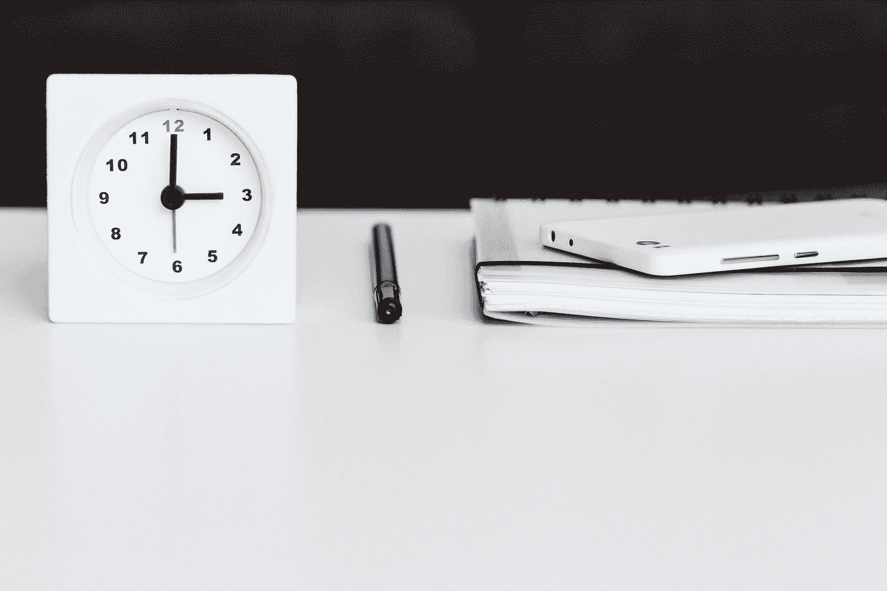
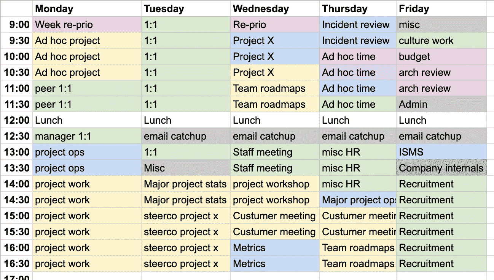
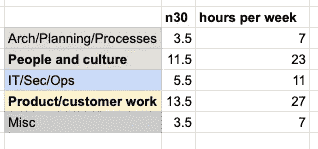

# 作为高级领导者管理时间和认知负荷的技巧

> 原文：<https://betterprogramming.pub/techniques-for-managing-your-time-and-cognitive-load-as-a-senior-leader-2b9eadb0daa4>

## 3.否定

[自由股票](https://unsplash.com/@freestocks?utm_source=medium&utm_medium=referral)在 [Unsplash](https://unsplash.com?utm_source=medium&utm_medium=referral) 上的照片

任何一家大型公司的大部分高层领导都会在好的一天里参加 30 分钟到几个小时的会议。这可能包括与客户会面、团队评审、重复性战术会议、一对一或技术架构。以我的经验来看，你管理的组织越大，或者你所在的组织越大，这种情况就会越来越多。

有些人能够做非常不同的设置，最著名的是来自 Shopify 的鸢·吕特克，他做了关于取消“ [Shopify 循环会议](https://www.theobservereffect.org/tobi.html)”的实验，这是一个有趣的实验，也是一篇非常好的文章。

下面是一些对我有用的例子，它们可能对你也有用:

# 1.把它捆起来

持续的环境转换是大多数领导者工作的一部分。如果你能在更长的时间内保持类似的活动类型，它对你的认知负荷和能量水平的影响会更小。这就是为什么集中编码或更长的白板会议不累。这是我用来移动我的会议的模板。这并不总是可能的，因为例如客户会议需要时间灵活性，随机火灾也是如此。我可能需要提前去学校接孩子，或者依赖公司里不适合我的同事。也就是说，很多会议可以变成这样。

捆绑的会议模板

我得到模板的方法是:

1.  看看最近几周的日历数据
2.  考虑每月/每两周/每周的
3.  为更大的项目工作重新安排或设置时间段
4.  根据对您的情况有意义的一些标准对插槽进行颜色编码
5.  一个接一个地捆绑相似类型的任务。
6.  使用模板作为基线来调整事情。

将相似类型的任务一个接一个地捆绑在一起有助于减少上下文切换，从而减轻总体认知负荷。1:1 放在同一天，使会议的精神负荷减少。虽然一对一是针对不同的员工，但活动类型是相似的。召开一次客户会议，然后是架构，然后是项目工作。

对我来说，会议最终主要集中在人员和客户/项目工作上

30 分钟数的分割

你可以用对你有意义的方式进行分组

进行捆绑时的一个重要方面是考虑消耗能量的活动。如果时间报告是一种痛苦，那就在一天结束的时候离开，或者做一些你知道会让你兴奋的活动。

# 2.使用块和焦点时间

这个想法很简单，实际上这里有 30 分钟的时间，没有足够的时间专注于工作，所以相反，你试图为特定的工作留出一些时间。这将把你的一天分成几块，比如“外部会议”、“电子邮件”、“面试”和“项目工作”。

这有助于在火中航行时，在大多数周内获得集中注意力的时间。

# 3.否定

你可以说不。这听起来可能有争议，但无情的优先排序是事情的完成方式。默认的答案是肯定的，这不是一个长期战略。是的，模式会扼杀你的生产力，这很容易做到，尤其是在大型组织中。

在说“不”之前，如果你的职位允许的话，一个更简单的步骤是要求对方提供议程或一份适当的预读文档。

通常会议以重定向结束。当要求另一方写一份预读材料时，可以使思路清晰，并使决策过程加快两倍。

# 4.不要只是立即回应

嗯，我自己也有点内疚，但是在会议和日常工作中，人们很容易淹没在细小的信息中，注意力不集中。在面对面的会议中，我尽量带一个纸质笔记本，用传统的方式开会和做笔记。这阻止了可能通过笔记本电脑、电话、空闲时间等发生的分心。

如今，远程工作方式越来越难，但我确实尝试在一天中划分时间，把“非生产性时间”用于休息和收发电子邮件。

上下文切换对精力和跟上不同主题的速度有很高的要求。当同时处理不同的事情时，认知功能会降低。

如果你想阅读更多关于如何获得更大关注的例子，我推荐一本名为“[腾出时间](https://maketime.blog/)的好书，还有其他例子对我不起作用，但对你有用。