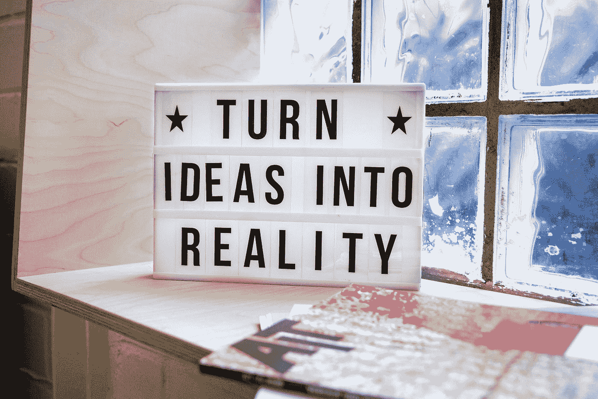

# 技术在不断发展。你也在进化吗？

> 原文：<https://betterprogramming.pub/technology-keeps-on-evolving-are-you-evolving-too-b3135dd0dc57>

## 跟上时代—技术不会等待你

Avel Chuklanov 在 [Unsplash](https://unsplash.com?utm_source=medium&utm_medium=referral) 上拍摄的照片

你上一次:

*   参加了一个会议？
*   参加了一个课程？
*   通读文档以了解最新的新特性？
*   做了自己的项目？
*   解了一个积分公式？

是时候自我反省了！作为开发人员，我们总是需要保持敏锐和及时更新。你永远不知道你的技术什么时候会突然过时。

技术跟不上我们，我们要跟上。醒醒吧，现在就开始你的学习之路。作为开发人员或架构师，我们应该始终朝着我们的一个目标努力。

# 我该怎么办？

以专注的方式度过你的时间。获取知识，而不是信息。知识更专注。把你的时间花在学习你想在日常生活中使用的东西上。你的知识会帮助你成为你想成为的人。

不要无脑的看编程文章。相反，搜索一个你想更多了解的特定主题，集中注意力，发展自己。阅读这个特定主题的文章，或者更好的是，做一些实际的增长或架构工作。

# 创建增长计划

由[拍摄的照片](https://unsplash.com/@airfocus?utm_source=medium&utm_medium=referral)在[的 Unsplash](https://unsplash.com?utm_source=medium&utm_medium=referral)

为了衡量你多年来的进步和目标，制定一个成长计划是至关重要的。时光飞逝，不知不觉中，你会发现今年你没有机会温习那项特殊技能。

为你想关注的项目制定一个清晰的、可衡量的计划。尽你所能每天花些时间朝着你想成为的方向成长。思考“谁是我的榜样”也是一个很好的练习。我怎样才能变得更像他们？”一边写成长计划。

# 回顾你的成长计划

除非不时回顾，否则成长计划是没有用的。提醒你自己你的目标，并确保你确实在以期望的速度朝着期望的方向成长。

# 不要变得舒适的工作

照片由 [Jukan Tateisi](https://unsplash.com/@tateisimikito?utm_source=medium&utm_medium=referral) 在 [Unsplash](https://unsplash.com?utm_source=medium&utm_medium=referral) 上拍摄

工作时感觉舒服吗？这不应该发生。你应该总是以这样或那样的方式挑战自己。然而，就技能和自我成长而言，这并不总是与技术项目有关。

你可以挑战自己多说多做，或者挑战自己更多地参与方法论。有无限可能。

只要确保在一天结束的时候，你不断地鞭策自己，不断地学习。当然，不接受任何挑战是舒服的，但长期来看，这对你的职业生涯和自我成长非常不利。

# 充满激情

米卡·鲍梅斯特在 [Unsplash](https://unsplash.com?utm_source=medium&utm_medium=referral) 上的照片

充满激情有助于你自动跟上时代。通过充满激情，你会有内在的动力去阅读最新的新闻，尝试一些技术的新特性。内在动力是来自自身的提高技能的动力，没有来自外部环境的要求、压力或动力。这是一种发自内心的积极主动的动力。

内在动机是推动你改进人们甚至没有想过要改进的项目。它促使你去学习人们不愿花时间去学习的东西。这是最好的动力，因为它是自我驱动的。它真正来自于自己，只有你自己才会知道你想做什么，你想成为什么样的人。

例如，假设你获得了一个新的职位或头衔。你可能想参加一些在线课程或阅读一些文章来温习你在新角色中的技能。这是内在动机:没有人要求或激励你为这个角色而学习；但是，你主动这么做了。积极主动是一项非常重要的技能，不仅对你的自我发展如此，对你的职业生涯也是如此。

# 准备学习资源

[绿色变色龙](https://unsplash.com/@craftedbygc?utm_source=medium&utm_medium=referral)在 [Unsplash](https://unsplash.com?utm_source=medium&utm_medium=referral) 上拍照

好的学习需要好的学习资源。不一定总是很贵。免费资源有时会比付费资源更好。

如果你要做长期投资，比如说一个为期三个月的认证课程，确保在选择课程之前进行研究。对于你的特定目标，可能已经有一个非常著名的课程了。

无论如何，不要在学习方面吝啬金钱。考虑到你准备使用特定资源学习的时间，你花在学习资源上的钱是值得的。

# 如何保持最新状态

有多种方法可以保持最新状态。首先，你需要心中有一个明确的目标。试着在前进的道路上衡量你的进步，以保持你的动力。

以下是一些可以跟上时代的例子:

*   针对特定认证的学习
*   对于你不太了解的项目，跟随在线教程/课程
*   好奇。听说过你最喜欢的框架或技术的新版本吗？反应 18？谷歌一下，花点时间搞清楚它到底是怎么回事，拿去试驾一下。
*   把你自己放出去。你的经验越多，你就会越好。

最重要的是，继续建设！你建得越多，你就会越好。这是我能给的最好的建议。不停地建造，建造，再建造。你会发现你对以前的实现不再满意，想要重写。这是进步的一大标志，因为你能认识到自己的错误。您可能会在下一次迭代或项目中记住这些错误。你做得越多，所有这些就越会成为你的第二天性。

开发不是一门精确的科学，任何能按预期实现目标的应用程序都是好的。然而，当写自学的小项目时，不要害怕对自己的创作持批评态度。你做得越多，你重写的就越多，你就会变得越好。

# 已经是最新的？

你已经掌握了你最喜欢的技术了吗？那也行！接下来是时候拓宽你的技能范围或者更详细的介绍了。你学得越多，你就越会发现你还有无限的知识要学。

请认识到，不可能什么都学会。明智地选择你想拓展或关注的领域。虽然保持成长和跟上时代很重要，但保持良好的工作生活平衡和远离潜在的倦怠也同样重要。花一些“自己的时间”来放松和放松是完全可以的！

# 聚焦和阻塞时间

在 [Unsplash](https://unsplash.com?utm_source=medium&utm_medium=referral) 上 [NeONBRAND](https://unsplash.com/@neonbrand?utm_source=medium&utm_medium=referral) 拍摄的照片

这是我们忙碌生活中最难的一步。为你的自我成长和学习留出时间。养成在特定时间框架内学习的习惯，并把这段时间安排在你的日程中。始终如一，切实地为自我成长留出时间，是你走向成功的第一步。

# 立即采取措施

我希望你在读完这篇文章后，立即采取下一步行动。

*   想想你更想了解什么。
*   想想你想成为谁，谁是你的榜样。
*   思考实现这一目标的步骤。
*   把这个写下来，每一两个月回顾一次。
*   思考内在动机:你内在的动机是什么？
*   立即开始朝着你的成长计划努力吧！
*   制定一个你会 1000%投入的学习计划。没有借口。
*   别忘了留点时间放松一下。对你的自我成长规划要现实，不要过度规划。长期的一致性比短时间的学习更重要。

# 摘要

太多了！让我们总结一下最重要的几点:

*   不要让自己停滞不前或安逸，因为从长远来看，这可能会导致灾难性的后果。
*   使用自我成长计划进行规划，并积极参与其中。
*   激情和内在动力是自我成长的巨大燃料。
*   不断学习新的东西。

现在，走出去，规划你的自我成长，学习令人敬畏的东西！

# 参考

你就是你所关注的:一篇由 [Darius Foroux](https://medium.com/u/54163a1723f6?source=post_page-----b3135dd0dc57--------------------------------) 撰写的优秀文章。

 [## 你会成为你所关注的人

### 你所关注的会影响你的思想，影响你的行动，决定你的结果…

dariusforoux.medium.com](https://dariusforoux.medium.com/you-become-what-you-focus-on-d8e531cf53eb) 

[订阅我的媒介](https://kevinvr.medium.com/membership)到**解锁** **所有** **文章**。通过使用我的链接订阅，你是支持我的工作，没有额外的费用。你会得到我永远的感激。