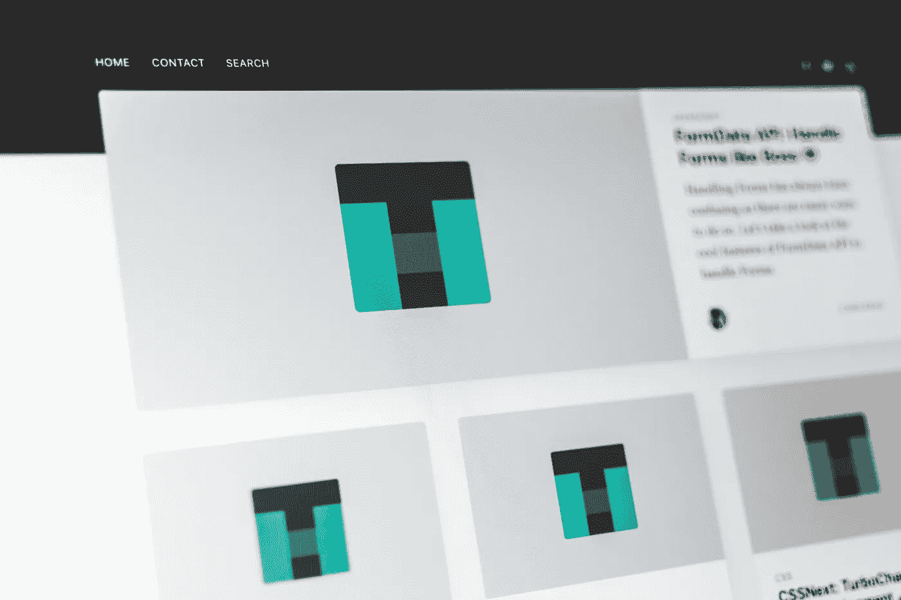

# 5 种替代 HTML 的模板语言

> 原文：<https://betterprogramming.pub/templating-languages-to-use-instead-of-html-eb3682443958>

## *不要重复自己。使用模板代替*

[潘卡杰·帕特尔](https://unsplash.com/@pankajpatel?utm_source=unsplash&utm_medium=referral&utm_content=creditCopyText)在 [Unsplash](/s/photos/template?utm_source=unsplash&utm_medium=referral&utm_content=creditCopyText) 上拍照。

纯 HTML 文件慢慢变得有点过时，并不是创建全新网站的最佳选择。如果你使用的是 Express.js 这样的框架，你可以选择使用模板语言。这种模板语言确保您可以将代码分割成可重用的组件，以获得更好的开发体验。

有相当多的模板语言。有些与 HTML 非常相似，有些则完全是独一无二的。

使用模板语言是将服务器端连接到站点前端的一个很好的方式。某些框架使得使用和处理所有解析变得非常容易。

这里有一些你可以使用的模板语言，用一些小代码片段向你展示它们是如何工作的，以及它们的独特之处。

# EJS

嵌入式 JavaScript，或称 [EJS](https://ejs.co/) ，是一种模板语言，可以让你用普通的 JavaScript 生成 HTML。这是一种非常简单的语言，如果学生需要选择一种模板语言，这是一个很好的选择。

它使用`<% %>`和 JavaScript 创建动态网站和网页。对于复杂的应用程序来说，这不是最好的选择，但是对于大多数项目来说是可行的。

# 把手

手柄是另一种非常简单的模板语言，没有很多独特的特性。然而，这是创建小项目的一个很好的方法，实际上我曾经在一个项目中使用过这个方法。

语法易于阅读和使用。这种语言的特点是他们称之为*助手*，这些功能可以和带有标签的语法一起使用。这些可以是一个循环，条件，或者你可以自己创建的东西。所以如果你需要的话，这种语言确实提供了定制。

# 哈巴狗

Pug 是一种受 HAML 启发的模板语言。像 Python 一样，它使用空白来表示嵌套。它的特性包括，条件，以及使用 *Mixins* 创建可重用的组件。Pug 模板是在`.pug`文件中创建的，应该使用框架或编程方式进行解析。

ID 和类名是用简写的，这种简写经常在 jQuery 中使用。这使得它易于阅读，易于编辑，并且是一种很好的模板语言。它甚至还有[反应积分](https://github.com/pugjs/babel-plugin-transform-react-pug)！

我以前写过几篇关于 Pug 的文章，如果你想了解更多关于这种语言的知识，可以去看看。你也可以阅读官方文档或者用 Express.js 自己尝试一下。

# 髭

[Mustache](https://mustache.github.io/mustache.5.html) 是一种最小模板语言。它自称为一种无逻辑的模板语言，事实也的确如此。它是一种模板语言，具有相当少的功能集，但它仍然拥有创建优秀网站和 web 应用程序所需的一切。

来自官方文件

该语法易于阅读、学习和编译。对于每个学习使用模板语言的人或者简单的网站来说，这个小语言是一个很好的选择。

# 反应(JSX)

[React](https://reactjs.org/) 与其说是一种模板语言，不如说是一种创建可重用组件的方式。但是它使用了一个值得注意的例子:JSX。这种模板语言与其他模板语言非常相似，非常容易学习。

它现在被广泛使用，当与 React 结合使用时，它提供了许多其他模板语言所没有的功能。

它使用定制的类似 HTML 的标签作为您可以创建的组件。您可以使用属性，并在需要的地方插入 JavaScript。

# 结论

在创建网站或 web 应用程序时，您可能应该使用模板语言。而这份名单只是冰山一角。你可以做大量的选择，每种语言都与其他语言略有不同。一个解决另一个的问题，等等。

感谢您的阅读，祝您度过美好的一天。