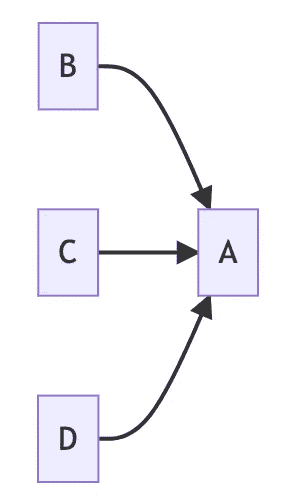
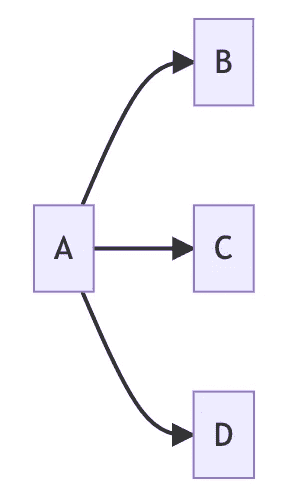
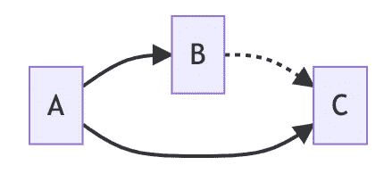
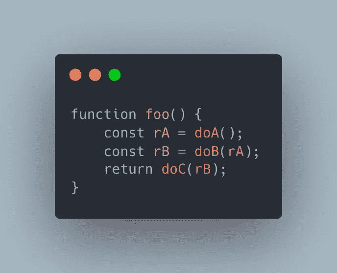
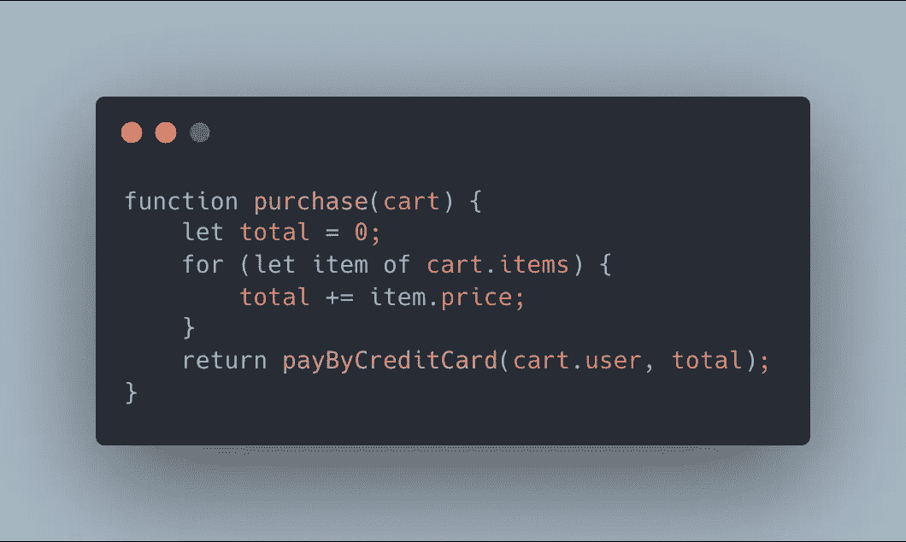
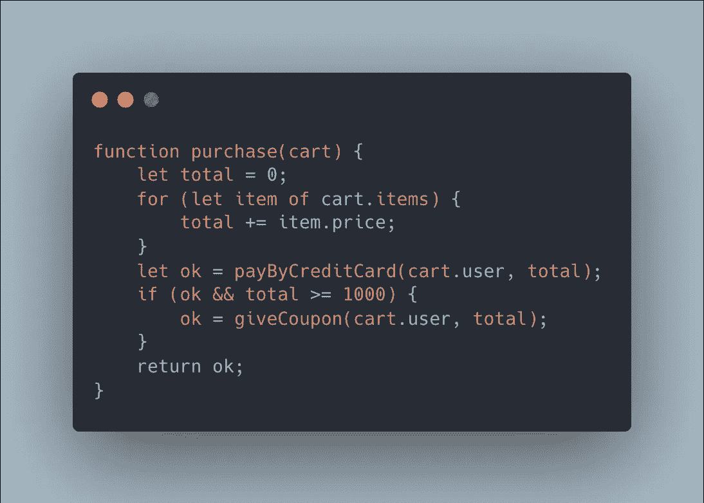
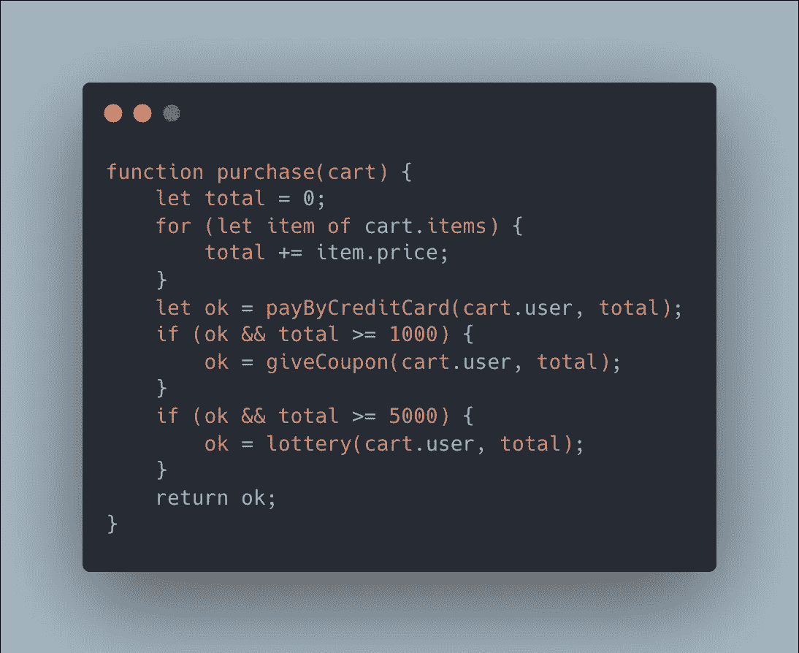
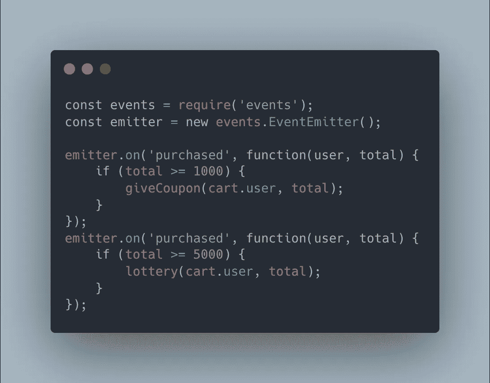
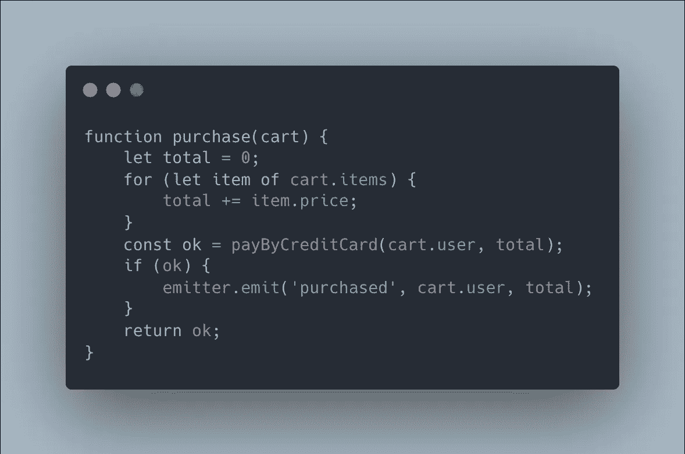

# 理解代码中的时间耦合

> 原文：<https://betterprogramming.pub/temporal-coupling-in-code-e74899f7a48f>

## *我们经常谈论耦合，耦合到底是什么？*

照片由 [Florian Olivo](https://unsplash.com/@florianolv?utm_source=medium&utm_medium=referral) 在 [Unsplash](https://unsplash.com?utm_source=medium&utm_medium=referral) 上拍摄

一般来说，有三种类型的组件耦合。

1.  传入耦合:A 组件的任务必须依赖于 B、C 和 d 的实现。

2.传出耦合:A 组件的任务完成后，必须执行 B、C、D。

3.时间耦合:A 组件的任务完成后，必须执行 B 和 C。另外，B 比 c 早。

这里提到的组件根据粒度可以是源代码级、模块级甚至服务级。

在本文中，我们将特别深入探讨时间耦合，因为这是最常见也是最容易被忽略的陷阱。首先我们在 Node.js 中描述如下:

在这一点上，我们发现这是非常普遍的。几乎我们所有的代码都是这样的。在一个方法中按顺序做三件事是很正常的，不是吗？

让我们举一个更具体的例子。假设我们有一个电商，有一个功能，`purchase`。因此，我们开始用简单的方式编码。

首先汇总购物车中所有商品的价格。然后调用支付服务来处理信用卡。简单吧？

好的，营销团队想让消费超过 1000 美元的人获得折扣券，所以我们继续修改我们的`purchase`。

这个功能也是相当普遍的，然后销售团队发现优惠券是一个很好的推广方式，于是提出达到 5000 美金的人可以获得一次抽奖机会。这个`purchase`一直在成长。

这是一种时间耦合。无论是`giveCoupon`还是`lottery`，其实都是依赖于`purchase`的，必须在`purchase`的生命周期内完成。一旦功能需求越来越大，整个`purchase`的性能就会被不断拖累。尤其是`lottery`通常需要巨大的计算量，`purchase`被迫等待`lottery`成功才算成功。

# 通过域事件解耦计时

从上一节中，我们了解到`purchase`应该只需要处理付款，其余的行为是附加的，不应该与`purchase`处于同一个生命周期。换句话说，即使`giveCoupon`失败了，也不应该影响到`purchase`或者`lottery`。

领域驱动开发中有一种方法叫领域事件。当一个任务完成后，它会发出一个事件，关心该事件的处理程序在收到该事件后可以采取相应的动作。顺便说一下，这种方法在设计模式中也被称为*观察者模式*。在领域驱动的开发中，“通知”包含了领域中无处不在的语言，因此通知被命名为域事件。

因此，让我们以节点的方式稍微修改一下`purchase`。

通过事件，我们可以将`giveCoupon`和`lottery`与`purchase`完全解耦。即使任何一个处理程序失败，也不会影响原始的支付流程。

而`purchase`只需要专注于支付过程。当支付成功时，发出事件，让其他函数接管。

如果以后有更多的需求，不需要改变原来的`purchase`，只需要增加一个新的 handler 即可。这就是脱钩的概念。这里我们去掉了代码级耦合和时序级耦合。

# 如何处理事件损失

在我之前的文章中，我们提到无论何时失败都可能发生，我们必须预料到它们并优雅地处理它们。这被称为[弹性工程](https://www.bmc.com/blogs/resilience-engineering/)。

当我们通过域事件将优惠券和彩票解耦时，我们将立即面临一个问题。活动输了怎么办？付款完成了，但是优惠券还没发，这对客户来说肯定是个大问题。

换句话说，我们如何确保发出的事件将被执行。这正是消息队列被引入系统的原因。

我们之前讨论过[消息队列](https://selectfrom.dev/message-queue-in-redis-9efe0de2c39c)，在消息传递中有三种不同级别的保证，它们是:

*   最多一次
*   至少一次
*   正好一次

大多数消息队列有至少一次的保证。也就是说，通过消息队列，我们可以确保所有事件至少可以执行一次。这也确保了消息不会丢失。

因此，为了避免事件丢失，我们将使用 RabbitMQ 或 Kafka 将`emitter.emit`更改为队列提交。在这个阶段，我们已经在系统级引入了解耦，即让事件生产者和消费者属于不同的执行单元。

# 如何处理排放损失

故事还没有结束。我们已经可以确保发出的事件得到执行。如果事件根本没有发送呢？继续以`purchase`为例，当`payByCreditCard`已经成功，但是由于意外原因导致系统崩溃而没有发送事件。然后，即使有消息队列，我们仍然得到不正确的结果。

为了避免这个问题，我们可以利用事件源。在[分布式事务](https://medium.com/interviewnoodle/distributed-transaction-introduction-1cd105c830a2)和 [CQRS](https://medium.com/interviewnoodle/shift-from-monolith-to-cqrs-a34bab75617e) 中，我已经描述了事件源的核心概念。

在发出事件之前，首先将事件存储到存储中。在处理程序处理完事件后，在存储器中将事件标记为“已处理”。

有一点应该注意，事件的编写和支付必须在同一个事务下进行。这样，只要支付成功，事件也就写成功了。最后，我们可以定期监控过期事件，以了解哪里出错了。

# 结论

这一次我们仍然在经历系统的一步一步的进化，就像我们在[从整体到 CQRS](https://medium.com/interviewnoodle/shift-from-monolith-to-cqrs-a34bab75617e) 的转变中所做的那样，让你知道当系统变得庞大和复杂时如何解耦。一开始，我们首先通过域事件将源代码和执行时序解耦；然后我们引入了消息队列和消息生产者和消费者来实现系统级的解耦。

就像我之前说的，一个系统进化是为了解决一个问题，但是它也会产生新的问题。只能选择最能接受的方案，在复杂度、性能、生产力等因素上寻求妥协。

将一个完整的动作分割成不同的执行单元必然会遇到不一致的情况。在解决不一致时，有许多考虑因素，例如:

*   不管事件是否会丢失，就用最简单的架构，`EventEmitter`。这种做法最简单，可能 80%的情况下都没有问题，但是如果有问题怎么办？
*   试图尽可能可靠，所以引入消息队列，它应该 99%确定不会有问题。但还是有 1%，这样的风险可承受吗？
*   实现事件源是以增加复杂性为代价的，性能可能会受到影响。这可以接受吗？

就像我常说的，系统设计没有完美的解决方案。每个组织都有不同的风险承受能力。在各种指标中，寻找自己最能接受的解决方案，思考自己随时面临的风险和失败。因此，每个人都应该能够建立一个有弹性的系统。