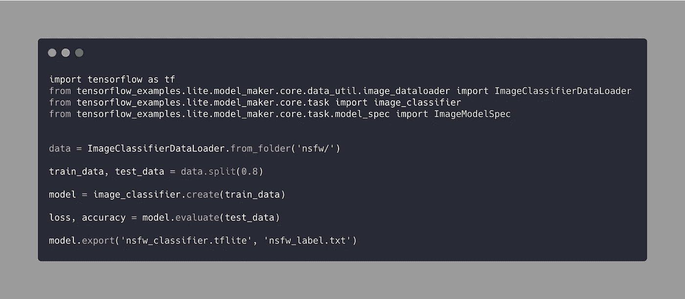
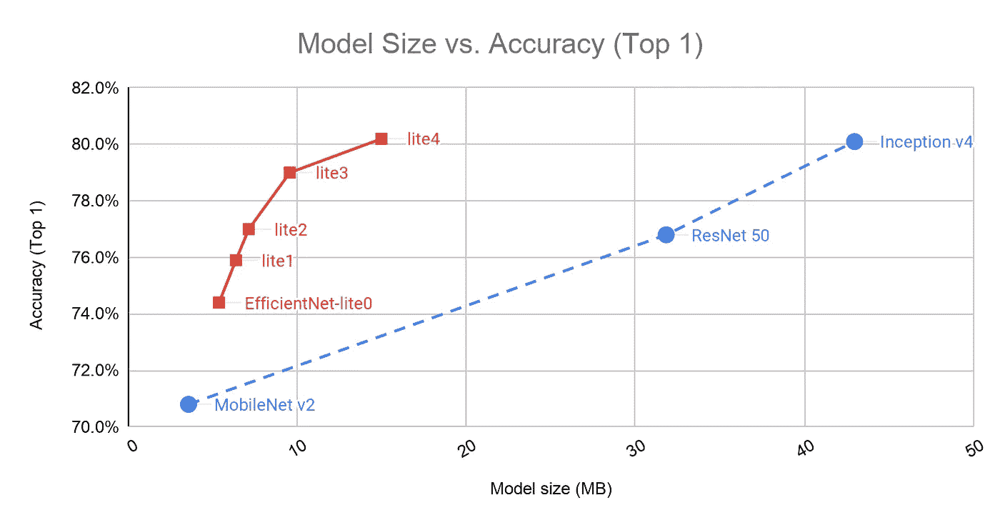
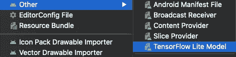
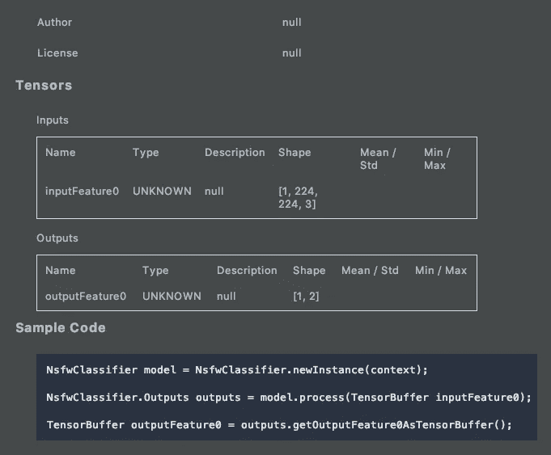
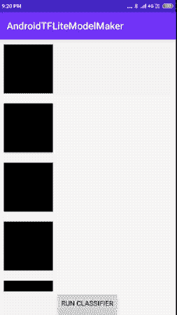

# TensorFlow Lite 模型生成器:为 Android 构建图像分类器

> 原文：<https://betterprogramming.pub/tensorflow-lite-model-maker-build-an-image-classifier-for-android-cf5893f713a8>

## 为边缘设备构建机器学习模型变得简单多了


照片由[埃弗顿维拉](https://unsplash.com/@evertonvila?utm_source=medium&utm_medium=referral)在 [Unsplash](https://unsplash.com?utm_source=medium&utm_medium=referral) 拍摄

TensorFlow 最近刚刚通过 livestream 结束了一年一度的[开发峰会(由于新冠肺炎全球疫情),发布了许多令人兴奋的公告，大多数都专注于将机器学习推向更高的高度。从核心 TensorFlow 平台(TF2.2)的强大新版本到新的](https://heartbeat.comet.ml/tensorflow-dev-summit-2020-livestream-highlights-8b99f7006743) [Google Cloud AI 平台管道](https://cloud.google.com/ai-platform/pipelines/docs?hl=nb)，使 TensorFlow 在生产中的使用更加简单，甚至更好。

但这不是这篇文章的重点。相反，我们将深入探讨今年的突破性公告之一，那就是:TensorFlow Lite 模型制造商。

使用内置于 TF Lite 支持库中的 TF Lite Model Maker，为移动和边缘设备构建模型非常容易。此外，Android Studio 4.1(当前版本，金丝雀版本)具有针对 TF Lite 模型的新代码生成功能，可自动为 TF Lite 模型生成包装器 Java 类，从而简化移动机器学习开发人员的模型开发和部署流程。

TensorFlow Lite 是一个轻量级的跨平台解决方案，用于在移动和嵌入式设备上部署 ML 模型。如果您想了解今年 TF Dev 峰会上关于 TensorFlow Lite 的所有新闻和公告，我强烈建议您查看[该资源](https://heartbeat.comet.ml/tensorflow-dev-summit-2020-tensorflow-lite-19dde3153335)。

# TensorFlow Lite 模型生成器

TF Lite Model Maker 是一个 Python API，使从头构建机器学习模型变得轻而易举。它只需要五行代码(不包括导入)，如下所示:



是的，我们将使用 NSFW 数据集。

在上图中，我们正在加载一个数据集，并将其分成训练集和测试集。随后，我们训练、评估并导出 TF Lite 模型以及标签(从子文件夹中检索)。

在幕后，Model Maker API 使用迁移学习来用不同的数据集和类别重新训练模型。默认情况下，模型生成器 API 使用 EfficientNet-Lite0 作为基本模型。

[EfficientNet-Lite](https://github.com/tensorflow/tpu/tree/master/models/official/efficientnet/lite) 最近才发布，属于能够在边缘设备上实现最先进精度的图像分类模型家族。下图显示了 EfficientNet-Lite 型号的精度与尺寸对比，并将其与 MobileNet 和 ResNet 进行了对比。



来自[文档](https://blog.tensorflow.org/2020/03/higher-accuracy-on-vision-models-with-efficientnet-lite.html)。EfficientNet-Lite 针对移动推理进行了优化

模型生成器 API 还允许我们切换底层模型。例如:

```
model = image_classifier.create(train_data, **model_spec=mobilenet_v2_spec**, validation_data=validation_data)
```

或者，我们也可以从 TensorFlow Hub 传递托管模型，以及自定义的输入形状，如下所示:

```
inception_v3_spec = ImageModelSpec(uri='tfhub_url_goes_here')inception_v3_spec.input_image_shape = [299, 299]//pass this spec into model_spec
```

我们还可以在 ModelMaker API 的`create`函数中微调训练超参数，如`epochs`、`dropout_rate`和`batch_size`。

```
model = image_classifier.create(train_data, epochs=10)
```

现在我们已经很好地了解了 Model Maker API 的核心功能，让我们来加强运行上述 Python 脚本所需的依赖关系。

## 升级 TensorFlow

确保您运行的是 Python3.6 或更高版本，并在 macOS 上安装了最新的 pip 版本。TensorFlow 2 包需要一个`**pip**`版本> 19.0。随后，pip 安装以下程序来更新 TensorFlow:

```
pip install --user --upgrade tensorflow
```

> 注意:建议在虚拟环境中安装 Python 包。使用虚拟环境，您可以测试不同版本的库。为了了解这个过程，你可以查看一下这个教程。

从我们的终端，让我们使用以下命令快速测试我们是否安装了最新的 TensorFlow 版本:

```
python3 -c 'import tensorflow as tf; print(tf.__version__)'
```

## 安装模型生成器库

在您的终端上运行以下命令来安装 Model Maker 库:

```
pip3 install git+https://github.com/tensorflow/examples.git#egg=tensorflow-examples[model_maker]
```

现在一切都准备好了，这意味着是时候训练我们的模型了。只需从 macOS 终端运行 Python 脚本。对于这个演示，我们使用了来自 Kaggle 的合适的 [NSFW 数据集。一旦我们的模型准备好了，就该导入到我们新的 Android Studio 项目中了。](https://www.kaggle.com/drakedtrex/my-nsfw-dataset)

# 为 TensorFlow Lite 模型设置梯度依赖关系

Android Studio 4.1 几乎没有针对 TensorFlow Lite 模型的新增强功能:

*   首先，它让我们直接从 import 菜单导入一个`tflite`模型，并将它放在一个`ml`文件夹中。只需进入**文件>新建>其他> TensorFlow Lite 模型**。



> **注意**:在一个场景中，你不像上面那样导入模型，而是直接把它放在`assets`文件夹中，模型绑定将被禁用，Android Studio 的自动代码生成不会为分类器创建 Java 包装类——直到你把它移到`ml`文件夹中。

*   其次，Android Studio 现在有一个模型查看器，可以显示元数据摘要——输入和输出张量、对它们的描述以及示例代码，如下所示:



默认情况下，模型生成器 API 只生成最少的元数据，由输入和输出形状组成。为了扩展和添加更多的上下文，如作者、版本、许可证以及输入和输出描述，我们可以利用[新的扩展元数据](https://www.tensorflow.org/lite/convert/metadata)特性(目前处于试验阶段)。

## 启用 ML 模型绑定

尽管将`tflite`模型放在了`ml`目录中，但是模型绑定并没有自动启用。您需要在应用程序的`build.gradle`脚本中添加`buildFeatures`和`aaptOptions`元素来启用它:

```
android{ buildFeatures **{
        mlModelBinding true**
    **}** aaptOptions **{** noCompress "tflite"
    **}
}** 
```

我们的模型的分类器现在可供我们运行推理。是时候在`build.gradle`文件中添加`tensorflow-lite`依赖项了:

```
dependencies **{** 
  implementation 'org.tensorflow:tensorflow-lite:0.0.0-nightly'
  implementation 'org.tensorflow:tensorflow-lite-gpu:0.0.0-nightly'
  implementation 'org.tensorflow:tensorflow-lite-support:0.0.0-nightly'
  implementation 'org.apache.commons:commons-compress:1.19'
**}**
```

# 设置我们的活动布局

现在是时候在我们的活动中放置 UI 元素了。为了简单起见，我们的`activity_main.xml`文件由一个 RecyclerView 和一个按钮组成:

为了填充 RecyclerView 的适配器，我们需要一个模型。下面的 Kotlin 数据类包含一个图像、预测文本和一个布尔标志，用于指示我们的输入图像是否是 NSFW。

```
data class DataModel(var drawableID: Int, var isNSFW: Boolean, var prediction: String)
```

以下 XML 代码表示 RecyclerView 的每一行的布局:

```
<?xml version="1.0" encoding="utf-8"?>
<LinearLayout xmlns:android="http://schemas.android.com/apk/res/android"
    android:layout_width="match_parent"
    android:layout_height="wrap_content"
    android:orientation="horizontal"
    android:padding="10dp">

    <ImageView
        android:id="@+id/imageView"
        android:layout_width="100dp"
        android:layout_height="100dp"
        android:scaleType="centerCrop" />

    <TextView
        android:id="@+id/tvPrediction"
        android:layout_width="match_parent"
        android:layout_height="wrap_content"
        android:layout_gravity="center"
        android:gravity="end|center_vertical"
        android:textSize="20sp" />

</LinearLayout>
```

现在我们已经创建了数据模型和视图，是时候将它们提供给 RecyclerView 的适配器了。

# 设置我们的 RecyclerView 适配器

以下代码创建了 RecyclerView 的`Adapter`类:

我们基于 NSFW 输出在`ImageView`上设置了一个颜色过滤器(NSFW 图像由于明显的原因被隐藏在黑色中)。

最后，是时候深入我们的`MainActivity.kt`了，在这里我们初始化上面的适配器，更重要的是，对一系列图像进行推理。

# 运行 TF Lite 图像分类器

为了运行模型，我们需要预处理输入以满足模型的约束。TensorFlow Lite 内置了一堆图像预处理方法。要使用它们，我们首先需要初始化一个`ImageProcessor`，然后添加所需的操作符:

## 预处理输入图像

在下面的代码中，我们将输入图像的大小调整为 224 乘 224，这是模型输入形状的尺寸:

```
val imageProcessor = ImageProcessor.Builder()
    .add(ResizeOp(224, 224, ResizeOp.ResizeMethod.BILINEAR))
    .build()

var tImage = TensorImage(DataType.FLOAT32)

tImage.load(bitmap)
tImage = imageProcessor.process(tImage)
```

`TensorImage`是提供给 TensorFlow Lite 模型的输入。但是在我们运行推理之前，让我们创建一个后处理器来归一化输出概率。

## 设置我们的后处理器

后处理器基本上是一个将我们的结果去量化的容器:

```
val probabilityProcessor =
    TensorProcessor.Builder().add(NormalizeOp(0f, 255f)).build()
```

## 运行推理

以下几行代码实例化了从模型自动生成的分类器，传递输入张量图像，并在`outputBuffer`中获得结果:

```
val model = NsfwClassifier.newInstance(this@MainActivity)
val outputs =
    model.process(probabilityProcessor.process(tImage.*tensorBuffer*))
val outputBuffer = outputs.*outputFeature0AsTensorBuffer* val tensorLabel = TensorLabel(labelsList, outputBuffer)
```

`TensorLabel`用于将关联概率与其标签进行映射。在我们的模型中，只有几个标签:“NSFW”和“SFW”。我们已经在`labelsList`数组列表中设置了它们。在不同的场景中，您可以解析`labels.txt`文件以获得所有类别，就像这里的[所做的](https://github.com/anupamchugh/AndroidTfLiteCameraX/blob/master/app/src/main/java/com/anupam/androidcameraxtflite/TFLiteClassifier.kt)。

最后，使用`mapWithFloatValue`函数，我们可以检索 NSFW 和 SFW 类别的概率。

`MainActivity.kt`的完整代码如下。它对每个图像运行上述图像分类器，并相应地用数据更改更新 RecyclerView 适配器:

下面是上述应用程序的实际输出:



仅显示 SFW 图像。

# 结束语

可以说，Model Maker Python 库已经存在，并将被希望在设备上快速部署 ML 模型的移动开发人员广泛使用。

对于那些了解苹果机器学习技术的人来说，TF Lite 模型生成器类似于 Create ML，至少理论上是这样的。目前，Model Maker API 仅支持图像和文本分类用例，预计对象检测和 QR 读取器将很快推出。

Android Studio 对 ML 模型绑定和自动代码生成的支持消除了我们在之前的 [TensorFlow Lite Android 教程](/image-classification-on-android-with-tensorflow-lite-and-camerax-4f72e8fdca79)中与`ByteBuffer`交互的需要。

扩展元数据(在撰写本文时处于实验阶段)还允许我们[生成定制的、特定于平台的包装代码](https://www.tensorflow.org/lite/guide/codegen)，从而进一步减少我们需要编写的样板代码的数量。我们将在以后的教程中研究定制代码生成以及更多内容。

上述教程的完整源代码可以在这个 [GitHub 资源库](https://github.com/anupamchugh/AndroidTFLiteModelMaker)中找到。

这一个到此为止。感谢阅读。