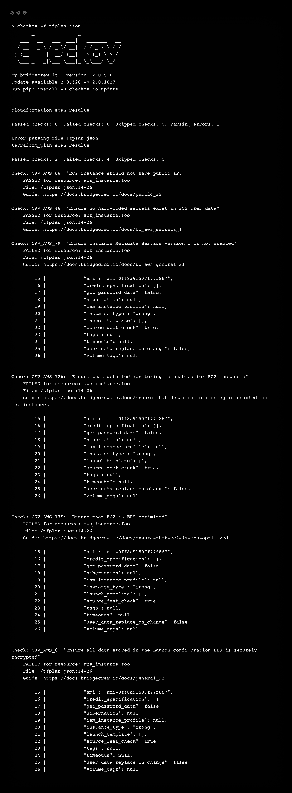

# 如何保持你的 Terraform 代码干净——可持续的方式

> 原文：<https://betterprogramming.pub/terraform-clean-code-b4f78a0e2>

## 我从哪里开始创建长期良好的 Terraform 代码？发现最佳实践和工具，让您有一个正确的开始


照片由[没有修改](https://unsplash.com/@norevisions?utm_source=unsplash&utm_medium=referral&utm_content=creditCopyText)[上的](https://unsplash.com/s/photos/cleaning?utm_source=unsplash&utm_medium=referral&utm_content=creditCopyText)Unsplash

在 DevOps 团队中工作意味着为许多 Terraform 存储库做贡献。有时我们没有完全相同的方式来编写 Terraform 代码。代码审查也变得很耗时，维护代码也很困难。

随着你的发展，你将拥有越来越多的 Terraform 代码，一天将永远是 24 小时。如何以最小的努力保持良好的质量水平？时间是宝贵的，你不能浪费它。

在这里，自动化是保持 Terraform 代码整洁的救星。您将能够用更少的努力处理更多的代码。然后，把腾出的时间投入到更有影响力的任务上。

本文向您展示了开始这种持续改进的第一步。这涉及到最佳实践和工具。Terraform 有内置的工具，其他的可以添加到你的配置中。

# 处处保持相同的格式

## 地形 fmt

当你阅读非标准代码时，你的眼睛必须一直适应。这需要更多的专注来跟上。您必须标准化代码格式，以确保良好的可读性。

Terraform 提供了一个名为`fmt`的内置子命令。它重写你的代码，以遵循 [Terraform 语言风格约定](https://www.terraform.io/language/syntax/style)的子集。

```
$ terraform fmt
```

> 💡不同 Terraform 版本之间的格式规则可能会有所不同。版本升级后不要忘记运行`terraform fmt`命令。

## 命名约定

计算机科学的主要困难之一是给事物起好名字。这同样适用于变量、输出、资源和数据源的 Terraform。这就是好的命名约定发挥作用的地方。

这将使你有一个明确的代码。它会把自己读成英语。

在本文中，我不会深入讨论整个命名约定。但是，我邀请您参考这个链接，它提供了一个鼓舞人心的链接:

[](https://www.terraform-best-practices.com/naming) [## 命名规格

### 请注意，实际的云资源通常在允许的名称上有限制。例如，有些资源不能包含…

www.terraform-best-practices.com](https://www.terraform-best-practices.com/naming) 

# 跟踪打字错误和语法错误

## Terraform 验证

之前，你已经看到了 Terraform 的`fmt`命令。Terraform validate 是另一个内置的子命令。它将允许您检查和跟踪语法错误和打字错误。

让我们举下面的例子:

该代码片段在资源名称处包含一个错误。对它运行 validate 子命令会突出显示它:

```
$ terraform validate
╷
│ Error: Invalid resource type
│
│   on main.tf line 5, in resource "aws_instanc" "foo":
│    5: resource "aws_instanc" "foo" {
│
│ The provider hashicorp/aws does not support resource type  
| "aws_instanc". Did you mean "aws_instance"?
╵
```

从 Terraform 的角度来看，Terraform 代码可能看起来有效，但实际上可能不起作用。在此示例中，代码声明了一个不存在的 AWS 提供程序区域和一个错误的实例类型:

运行`validate`时，Terraform 指示一切正常:

```
$ terraform validate
Success! The configuration is valid.
```

这是因为 Terraform 只验证代码语法和结构。它不检查 AWS 提供程序和资源中使用的值。这超出了 Terraform 的范围，与提供者有关。

> 💡考虑将 Terraform validate 作为快速验证的第一步。它不会检测到`terraform apply`之前的所有错误。

## TFLint

TFLint 是一个 linter，它检查潜在的平台错误并执行最佳实践。您可以添加与主要云提供商(AWS、Azure、GCP)兼容的插件，以实现高级错误检测。最佳实践可通过规则系统进行配置。

[](https://github.com/terraform-linters/tflint) [## GitHub-terra form-linters/TF lint:一个可插拔的 Terraform Linter

### 一个可插入的 Terraform Linter TFLint 是一个框架，每个特性都由插件提供，主要特性如下…

github.com](https://github.com/terraform-linters/tflint) 

TFLint 总是在它运行的当前目录中寻找额外的`.tflint.hcl`文件。在这个配置文件中，您可以添加特定的规则和插件。

以下是 TFLint 配置的示例:

1.  添加插件 AWS 是为了检测特定的错误。
2.  实施检测无效 AWS 实例类型的规则。

现在，让我们看看之前的 Terraform AWS 代码片段:

您必须在 terraform 目录中初始化 TFLint:

```
$ tflint --init
```

接下来，使用目录位置运行 TFLint:

```
$ tflint .
1 issue(s) found:

Error: "wrong" is an invalid value as instance_type (aws_instance_invalid_type)

  on main.tf line 7:
   7:   instance_type = "wrong"
```

# 安全性和合规性

Terraform 不过是一个将基础设施作为代码来管理的工具。确保良好的安全设计取决于您。这对于检查可能导致漏洞的错误配置非常重要。

## 什么是 Checkov？

Checkov 是一个静态代码分析工具，用于将基础设施作为代码文件进行扫描。它支持 Terraform，包括 750 多种预定义的策略。您还可以贡献和创建您的自定义策略。

## 安装 Checkov

```
$ brew install checkov
```

## 评估地形图

根据 Terraform 平面图创建 JSON 文件:

```
$ terraform init
$ terraform plan --out tfplan.binary
$ terraform show -json tfplan.binary | jq '.' > tfplan.json
```

Checkov 读取该文件并返回带有建议的输出:



地形图的 Checkov 输出

# 预提交:掌握所有这些的一个工具

## 什么是预提交？

预提交是一个管理 git 钩子脚本的框架。它们对于在提交给代码评审之前识别简单的问题很有用。甚至在您键入提交消息之前，预提交钩子就已经运行了。

[](https://pre-commit.com/) [## 预提交

### 编辑描述

pre-commit.com](https://pre-commit.com/) 

预提交取代了您为检查代码而键入的许多命令。

## 安装预提交

```
$ brew install pre-commit
```

也可以用 pip 安装它:

```
$ pip install pre-commit
```

## 如何使用预提交？

Terraform 代码需要在一个初始化的 git 存储库中。预提交需要一个名为`.pre-commit-config.yaml`的配置。在这个文件中，您为 Terraform 定义了预提交挂钩。

初始化 git 存储库:

```
$ git init
```

以下是提交前配置:

预提交配置使用来自两个不同存储库的钩子。第一个是 Terraform 特有的，第二个更通用。它运行的`terraform fmt`、`terraform validate`、`tflint`你以前见过。钩子定义的顺序就是执行顺序。

配置就绪后，您需要在 git 中添加 Terraform 文件:

```
$ git add main.tf
```

您可以使用以下命令手动运行预提交:

```
$ pre-commit run -a
```

预提交已经执行了所有的钩子脚本并更新了 Terraform 文件。它需要在 git 中重新添加文件以考虑更新。提交代码时会自动运行预提交。

# 结论

通过本指南，您已经看到了入门和保持 Terraform 代码整洁的主要内容。这依赖于良好实践的实施和诸如棉绒和扫描仪等工具的使用。

使用预提交，您可以在单个命令中自动检查本地潜在的错误。在将代码提交到远程 git 存储库之前，检查是自动完成的。这将使你的代码审查更有效率。

预提交将使您能够简化 CI/CD 渠道。它有许多钩子脚本来驱动许多 Terraform linters 和扫描器。

感谢阅读🙏希望这篇文章对你的 Terraform 有所帮助！想了解更多关于 DevOps 的知识？它在⬇️下面

[](https://getbetterdevops.io/) [## Getbetterdevops

### Getbetterdevops 是一个 devops 博客，帮助学习现代基础设施和云技术，如 Kubernetes…

getbetterdevops.io](https://getbetterdevops.io/)