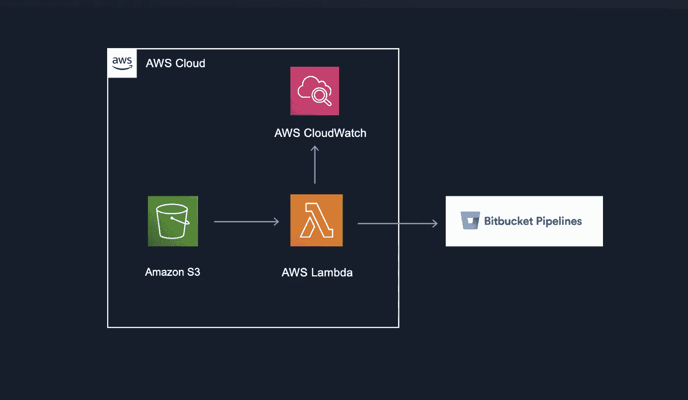

# 使用 AWS 触发位桶管道的地形设置

> 原文：<https://betterprogramming.pub/terraform-setup-for-triggering-bitbucket-pipelines-using-aws-44eda5d13348>

## 更轻松地创建管道！

使用 AWS 触发位桶管道

在我之前的故事中，我解释了如何使用 AWS 设置来触发 Bitbucket 管道。现在，让我们看看如何使用 Terraform 实现同样的结果。总而言之，每当我们的 S3 存储桶发生任何变化时，我们将研究如何使用 AWS Lambda 运行位存储桶管道。

# 组件

首先，您应该向模块定义传递一些基本参数。它可能看起来像这样:

# 希腊字母的第 11 个

现在，让我们继续讨论λ函数。首先，您需要创建一个向 Bitbucket API 发送 POST 请求的 Python 脚本。这个 POST 请求将触发所需的管道。Lambda 函数可能是这样的:

注意，我使用了`get_secret()`函数从 AWS Secrets Manager 获取某些凭证。您也可以对凭证进行硬编码，或者将它们作为环境变量传递，但是当然，不建议这样做。

转到 Terraform 结构，确保给你的 Lambda 所有必要的权限。例如，您应该添加 CloudWatch 策略，以便在需要时能够使用日志进行调试。然后，如果您将凭证存储在 secrets manager 中，您也需要让您的 Lambda 访问它。您可以使用类似这样的内容:

# S3 事件通知

假设您已经有了一个 S3 存储桶，您可以像这样使用它:

根据您希望触发器如何运行，您可以替换过滤器前缀和后缀。例如，如果您只想在对 zip 文件进行更改时触发 Lambda 函数，那么您可以使用`.zip`作为后缀。

同样，如果您只想在特定文件夹中发生更改时触发它，可以使用文件夹/对象的名称作为前缀。

# 秘密

不建议您在 Terraform 设置中添加凭据。你可以做的是使用 Terraform 创建一个秘密持有者，然后使用控制台手动输入你的凭证。秘密可以这样创造:

然后，您还可以修改您的环境变量来传递秘密的名称，这样您就不必在 Lambda 函数中手动键入它们。

`secret_name = aws_secretsmanager_secret.pipeline_password.name`

差不多就是这样了！

希望这有所帮助！