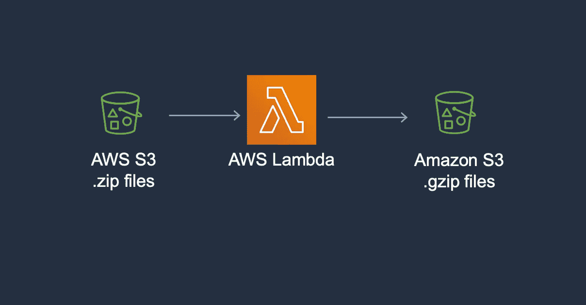

# 通过 S3 使用 AWS Lambda 的地形设置

> 原文：<https://betterprogramming.pub/terraform-setup-for-using-aws-lambda-with-s3-2b8ba286b6d7>

## 构建您的铲斗



我最近遇到一个场景，我想对一堆传入的 S3 文件进行修改。最好的方法是使用事件触发器，每次有新文件上传到 S3 时，它都会运行一个 AWS Lambda 函数。尽管在使用控制台时创建 S3 桶、事件通知和 Lambda 函数的过程非常简单，但在使用 Terraform 时会变得有点棘手。

假设您已经有了一个基本的 Terraform 设置，让我们看看如何首先构建您的铲斗。

# S3 水桶:

对于像 bucket name 这样的变量，您可以将值作为局部变量存储在单独的文件中，也可以在这里简单地引用它们。您是否需要服务器端加密是可选的，通常取决于您的用例。

# 希腊字母的第 11 个

首先，您需要创建一个`src`目录，其中包含 Lambda 函数的 Python 代码。

```
terraform
│   buckets.tf
│   lambda.tf 
│   notifications.tf
│   permissions.tf
│   ...
└───src
│   │   conversion_lambda_python_file.py
│   │   
│   │
```

您在这里为 Python 文件指定的文件名稍后将用作 Lambda 的 Terraform 设置的处理程序值。你的 Lambda 函数应该有一个名为`lambda_handler`的函数。它可能看起来像这样:。

在这里阅读关于这个 Lambda 做什么[的细节。](/unzip-and-gzip-incoming-s3-files-with-aws-lambda-f7bccf0099c9)

注意我们是如何在`lambda_handler`函数中读取事件键的。现在，我们的 Lambda 地形设置看起来有点像这样:

archive_file 模块生成 Python 文件的存档，然后可以在我们的 Lambda 函数中使用它。还可以将环境变量传递给 Lambda 函数。

需要注意的一点是，默认情况下，Lambda 的超时时间为三秒，内存仅为 128 MBs。根据您想要处理的 S3 文件的数量，您可能想要将这些参数更改为它们的最大值:

内存大小= 10240

超时= 900

# S3 事件通知

现在，我们需要创建一个事件通知，每当一个新文件上传到 S3 时，它将触发一个 Lambda 函数。例如，如果您还想在删除或恢复文件时运行 Lambda 函数，您可以修改 events 参数。

如果您只想考虑 S3 存储桶中的特定文件夹，可以添加文件夹名称作为过滤器前缀。同样，如果您只想考虑可能导致触发的特定文件类型，您可以添加文件扩展名作为过滤器后缀参数。

不要忘记，我们还需要给我们的 S3 桶必要的权限，以便它能够调用一个 Lambda 函数。

# 权限策略

无论您在 Terraform 设置中使用什么角色，都需要其他权限策略，如访问 S3 或调试用的 Cloudwatch 日志。

如果您希望将特定操作的权限仅授予您的角色，而不是全部权限，您还可以在 Resource 选项下指定相关资源。

差不多就是这些了！

在另一篇文章中，我描述了如何使用 AWS 控制台做同样的事情。你可以在这里了解更多信息:

[](/unzip-and-gzip-incoming-s3-files-with-aws-lambda-f7bccf0099c9) [## 用 AWS Lambda 解压和 Gzip 输入的 S3 文件

### 更容易、更快、更好

better 编程. pub](/unzip-and-gzip-incoming-s3-files-with-aws-lambda-f7bccf0099c9)