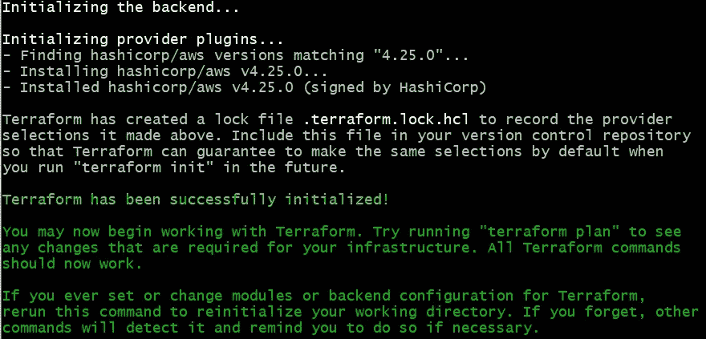
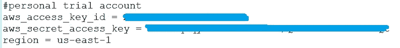
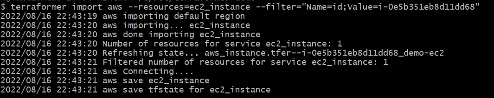
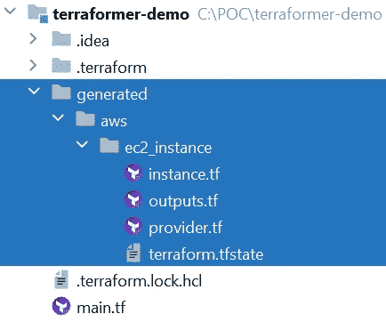
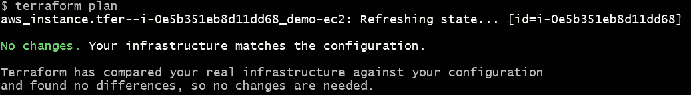
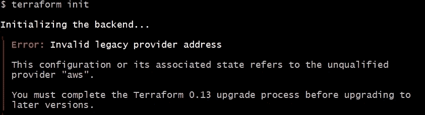
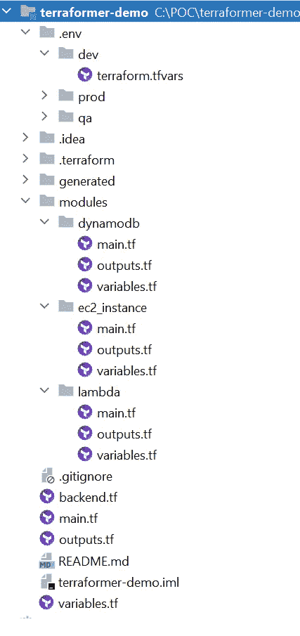

# Terraformer:将基础设施转换成可重用的 Terraform 代码

> 原文：<https://betterprogramming.pub/terraformer-converting-infrastructure-into-reusable-terraform-code-afe543ad0b15>

## 关于如何使用 Terraformer 从现有基础设施构建可重用 Terraform 代码的分步指南


作者照片

```
Table of Contents· [What is Terraformer?](#00bb)
· [Why Terraformer?](#5116)
· [How to Use Terraformer?](#5c31)
  ∘ [Step 1: Installation](#1323)
  ∘ [Step 2: Terraformer import](#1916)
  ∘ [Step 3: Templatize the Generated Code for Reusability](#7c58)
  ∘ [Step 4: Standardize Terraform Modular Structure](#da83)
  ∘ [Step 5: Add a GitHub Actions Workflow](#58b8)
· [Summary](#aee9)
```

“全栈”的新概念不再只是 UI 加后端。云原生应用程序开发需要将基础架构即代码(IaC)添加到您的“完整堆栈”列表中。Terraformer 可以极大地帮助您扩展整个堆栈，以包括 IaC。

# 什么是 Terraformer？

我们中的许多人已经知道 Terraform，它是主流的基础设施代码(IaC)语言。Terraformer 就像是 Terraform 不太为人所知的孪生兄弟。它与 Terraform 完全相反——将基础设施逆向工程为代码。简单来说，Terraformer 是一个 CLI 工具，它基于您现有的基础设施生成`tf` / `json`和`tfstate`文件。

Terraformer 在其 [GitHub repo](https://github.com/GoogleCloudPlatform/terraformer) 中拥有超过 9k 颗星星，150 多名贡献者，自 2019 年 5 月首次公开发布以来，已经赢得了巨大的人气，引领了将现有基础设施转换为 Terraform 代码的努力。

# 为什么是 Terraformer？

让我们面对现实吧，我们中的许多人都没有奢侈的机会在一流的 IaC 公司找到工作。我们发现自己经常在继承的 IaC 混乱中挣扎，有一些合适的 Terraform 代码(如果你幸运的话)。但通常，许多开发人员带着多年来手工构建的基础架构来来去去。要将您现有的基础设施转换成 Terraform 代码，并开始向最先进的 IaC 目标前进，您需要使用 Terraformer。

此外，如果您想为您的生产资源开发一个 Terraform 模板，以便您可以轻松地将其复制到多个地区并用于灾难恢复，Terraformer 是您的合适工具。

Terraformer 可以提供重要帮助的另一个原因是，当您的架构师或技术负责人在您的云提供商中完成 POC 并手动构建一系列服务时。更好的是，当你最终让它们无缝地一起工作时，你就有了这个杰作。

此时，您的工作开始了，您如何将所有出色的工作复制到另一个环境/客户中？好吧，和地球人交朋友！您可以用几个命令将所有堆栈转换成漂亮的 Terraform 代码！通过一些调整，您可以将生成的代码模板化，并在不同的环境/帐户中重复使用。

让我们深入了解一下这是如何实现的。

# 如何使用 Terraformer？

# **第一步:安装**

[Terraformer 的 GitHub 页面](https://github.com/GoogleCloudPlatform/terraformer#installation)有安装 Terraformer 的详细说明。我们将遵循版本中的安装说明。

**对于 Windows:**

*   假设你已经安装了 terra form:[https://www.terraform.io/downloads](https://www.terraform.io/downloads)
*   导航到 Terraformer 发布页面，[https://github.com/GoogleCloudPlatform/terraformer/releases](https://github.com/GoogleCloudPlatform/terraformer/releases)，找到您想要的云提供商和操作系统的 exe 文件，例如，`[terraformer-aws-windows-amd64.exe](https://github.com/GoogleCloudPlatform/terraformer/releases/download/0.8.21/terraformer-aws-windows-amd64.exe)`是针对 AWS 作为提供商，针对 Windows 平台。
*   将 exe 文件路径添加到 path 变量中，并将 exe 文件重命名为`terraformer.exe`。
*   运行`terraformer version`来检查你是否正确安装了它。在撰写本文时，最新的发布版本是`v0.8.21`。

**对于 Mac:**

## **步骤 2:导入 Terraformer】**

让我们从名为`terraformer-demo`的目录下的一个简单的`main.tf`文件开始。对于这个演示项目，我们将使用 AWS 作为我们的提供商。`main.tf`只有以下简单的提供者配置:

这是我们开始使用 Terraformer 所需的唯一文件。

Terraformer 使用 [terraform providers](https://www.terraform.io/docs/providers/index.html) ，其中已经包含了与云提供商的 API 协同工作的所有资源和逻辑。一个工具通过 RPC 调用与这些提供者一起工作，因此它允许他们使用新版本的提供者而无需修改代码。

现在让我们运行`terraform init`来安装我们的 AWS 提供者所需的插件。如果一切顺利，您应该会在控制台上看到这样的输出，这表明 Terraform 已经成功初始化。



出于演示目的，我正在使用我的 AWS 个人试用帐户，我已经在我的`.aws\config`文件中配置了访问密钥和秘密密钥，见下面的截图，密钥在这里被屏蔽，用您自己的密钥替换它们。



到目前为止，所有的准备工作已经完成。现在让我们进入有趣的部分，通过尝试`terraformer import`来做一些 Terraform 的逆向工程！

## **进口一种资源**

让我们从简单的开始。在 AWS 控制台中手动创建一个 EC2 实例，一旦完成，记下它的实例 id，在我的演示中，实例 id 是`i-0e5b351eb8d11dd68`，现在让我们执行这个命令:

```
terraformer import aws --resources=ec2_instance --filter=”Name=id;Value=i-0e5b351eb8d11dd68"
```

在上面的命令中，`aws`是提供者。`--resources`传入我们要从中生成 Terraform 代码的资源类型。`--filter`用于根据特定的标准过滤资源，在我们的例子中，我们通过 id `i-0e5b351eb8d11dd68`过滤 EC2 实例。

运行该命令后，我们看到控制台输出如下:



现在让我们检查一下项目结构中发生了什么。注意一个名为`generated`的新文件夹被创建了，请看下面截图中突出显示的部分。在`generated`下，有我们提供者的`aws`文件夹，下面是`ec2_instance`文件夹，包含所有生成的 terraform 代码。



打开`instance.tf`，我们看看 Terraformer 刚刚表演了什么魔术！

我们如何知道这个生成的代码确实是正确的呢？好吧，让我们来看看。让我们导航到目录`ec2_instance`，然后运行`terraform init`来初始化这个目录中的 Terraform。然后运行`terraform plan`，看看发生了什么？



没有变化！它显示了 Terraformer 生成的代码与基础设施的实际状态相匹配。干得好 Terraformer！

默认情况下，Terraformer 生成的代码适用于 Terraform 0.12。当我们在生成的`ec2_instance`文件夹中运行`terraform init`时，会遇到以下错误:



请确保运行此命令来更新状态文件中的提供程序。一旦完成，再次运行`terraform init`，然后运行`terraform plan`。

```
terraform state replace-provider -auto-approve "registry.terraform.io/-/aws" "hashicorp/aws"
```

## **导入一种资源**

如果我们想要导入一种特定类型的资源，比如我们所有的 Lambda 函数，我们可以运行下面的命令:

```
terraformer import aws --resources=lambda
```

这个命令将为我们配置的特定帐户和地区的所有 Lambda 函数生成 Terraform 代码。

## **进口多种资源**

如果我们想要导入多种类型的资源，只需用逗号分隔资源，例如下面的命令，它为我们所有的 Lambda 函数以及 DynamoDB 表导入:

```
terraformer import aws --resources=lambda,dynamodb
```

## **在同一资源类型内导入多个资源**

如果我们需要导入多个资源，我们也可以使用`terraformer import`来完成。例如，如果我们需要导入两个 Lambda 函数，`lambda-test1`和`lambda-test2`，让我们试试这个命令:

```
terraformer import aws --resources=lambda --filter="Name=function_name;Value=lambda-test1:lambda-test2"
```

注意过滤器`Name`是`function_name`，`Value`有两个函数名，用冒号分隔，`:`。确保在这里使用正确的语法。一旦导入，`generated/aws/lambda`下的`lambda_function.tf`看起来如下:

## **通过标签使用过滤器导入资源**

我们在上面的“导入一个资源”一节中简要地提到了过滤器。让我们在这里更深入地探讨如何最好地使用过滤器来为我们想要的资源导入代码。我们可以通过标签来过滤资源，例如，下面的命令通过标签`name`和值`test-table`来过滤 DynamoDB 资源。

请注意过滤器名称`tags.name`，这是区分大小写的，如果您输入大写字母`tags.Name`，如果您没有另一个定义了标签`Name`的 DynamoDB 表，则过滤的服务数量可能为 0。

```
terraformer import aws --resources=dynamodb --filter="Name=tags.name;Value=test-table"
```

## **导入带有特定标记关键字的资源**

要使用特定的标签键过滤资源，假设我们想要使用定义了标签键`name`的标签过滤 DynamoDB，我们可以像这样运行命令，注意我们不需要指定`Value`:

```
terraformer import aws --resources=dynamodb --filter="Name=tags.name"
```

## **导入所有资源**

如果您想为整个基础架构堆栈生成 Terraform 代码，该怎么办？这个命令实际上非常简单:

```
terraformer import aws --resources=*
```

是的，使用通配符传入资源就可以了。然而，根据您的基础设施规模，这可能需要一些时间，并且在`generated\aws`下创建的目录数量可能会令人震惊。

## **用 excludes 关键字**导入资源

如果需要排除某个资源的导入，可以使用`--excludes`关键字，示例命令:

```
terraformer import aws --resources=* --excludes="dynamodb" 
```

# **第三步:将生成的代码模板化，以实现可重用性**

Terraformer 从您现有的基础设施中生成的原始 Terraform 代码看起来很棒，但它的可重用性不是很好，因为它为您导入到代码中的特定资源提供了硬编码值。为了使代码可重用，我们需要稍微调整一下。例如，在上面为 Lambda 函数生成的代码中，它具有硬编码的 Lambda 函数名称、角色、处理程序等。

如果我们想要重用这段代码，我们需要参数化这些变量来模板化这个特定的资源。这是 Lambda 函数 Terraform 代码模板化后的样子。注意这些参数以`var`开始，引用它们的变量。对于这个例子，我们只选择了几个参数来具体化，也欢迎您参数化可选字段，以便在配置 Lambda 函数时实现最大的灵活性。

对应的`variables.tf`应该是这样的:

将生成的代码模板化后，一个自然的问题出现了:如何最好地组织我们生成的 Terraform 代码？让我们进入下一步。

# 步骤 4:标准化 Terraform 模块化结构

一个 Terraform 模块只是一个定义了多个相关资源的`.tf`配置文件的集合，以一种代码可以被重用的方式进行编码。使用模块的好处是，当在多个项目中做同样的事情时，编码工作会大大减少。

## 地形模块化结构的最佳实践

*   `main.tf`、`variables.tf`、`outputs.tf`。这些是最小模块的推荐文件名，即使它们是空的。`main.tf`应该是主入口点。
*   项目的根目录可以称为“根模块”。嵌套模块，又名“子模块”，应该存在于`modules/`子目录下。根模块中的代码通常根据需要调用子模块。
*   这些模块可以嵌套，尽管建议深度不要超过 3/4 层，并尽可能避免这种情况，以降低复杂性。
*   根模块和任何嵌套模块应该有`README`文件。

模块化 Terraform 项目结构示例如下所示:



注意`modules`目录下的多个模块。推荐的方法是将这个`modules`目录移动到一个共享的存储库中，这样组织中的所有项目都可以从它们各自的项目中调用那些集中的模板化的可重用模块。

还要注意位于环境相关目录下的`.tfvars`文件，如`.env`下的`dev`和`prod`。这些文件包含变量的环境特定值。

为了继续我们上面关于模板化 Lambda 模块的讨论，我们现在可以让根`main.tf`调用 Lambda 可重用模块来创建两个新的 Lambda 函数`lambda_demo1`和`lambda_demo2`，参见下面来自我们根`main.tf`的片段:

注意，我们在这里用根级别的`variables.tf`文件中定义的变量参数化了`role`。我们也可以参数化其他变量，但出于演示的目的，我们现在只展示一个。`lambda_iam_role_arn`的实际值在`.env/dev`文件夹下的`terraform.tfvars`文件中定义。

```
lambda_iam_role_arn = "arn:aws:iam::##########:role/service-role/lambda-test-role-#####"
```

更好的方法是使用 Terraformer 为 IAM 角色导入代码，并模块化那个`iam`模块，然后在 root `main.tf`中创建一个新的 Lambda IAM 角色，然后使用 Lambda 块`role = module.iam.iam_role_arn`中调用`iam`模块的输出，而不是使用来自`terraform.tfvars`的硬编码变量。好吧，欢迎读者使用这个场景作为练习。

# 步骤 5:添加 GitHub 操作工作流

现在有了 Terraform 项目结构，让我们探索如何使用 GitHub Actions 工作流将我们的 Terraform 代码部署到 AWS。参见下面运行一系列 Terraform 命令的示例工作流:`terraform init`、`terraform plan`、`terraform apply`，最后，如果需要，我们可以切换到名为`destroy`的分支，运行`terraform destroy`来删除我们刚刚在 AWS 中创建的资源。

请注意，我们将`terraform.tfvars`和`-var-file`传递给 Terraform 命令。根据从`workflow_dispatch`手动触发器传入的环境，Terraform 工作流在`.env`下的环境文件夹中进行检查，并使用传入的相应`.tfvars`文件为所选环境运行。

# 摘要

我们探讨了什么是 Terraformer，为什么我们需要它，以及如何使用它将现有的基础设施导入 Terraform 代码。然后，我们进一步研究了如何将生成的 Terraform 代码模板化，并使其可重用。我们还研究了 Terraform 模块化结构的一些最佳实践。最后但同样重要的是，我们探索了使用 GitHub Actions 工作流来自动化 Terraform 代码部署。

编码快乐！

# **参考文献**

[](https://github.com/GoogleCloudPlatform/terraformer) [## GitHub-GoogleCloudPlatform/terra former:CLI 工具，用于从现有的…

### 基于现有基础设施生成 tf/ json 和 tfstate 文件的 CLI 工具(反向地形)。免责声明…

github.com](https://github.com/GoogleCloudPlatform/terraformer) 

[标准模块结构|哈希公司的 terra form](https://www.terraform.io/language/modules/develop/structure)