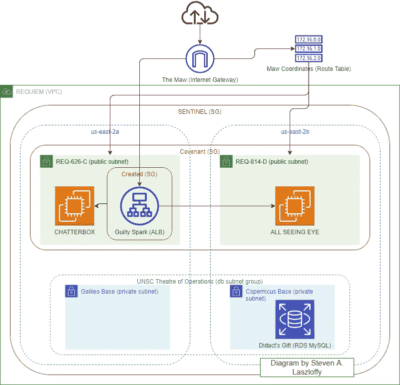
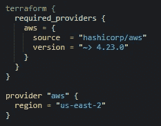
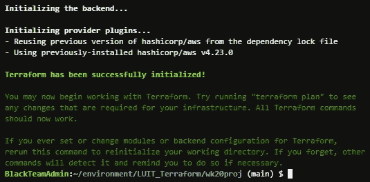
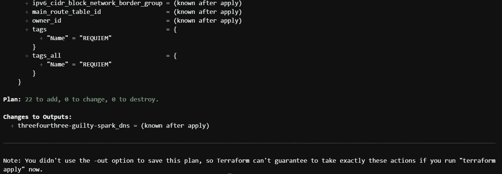
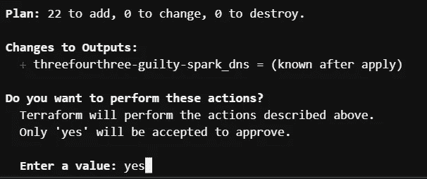
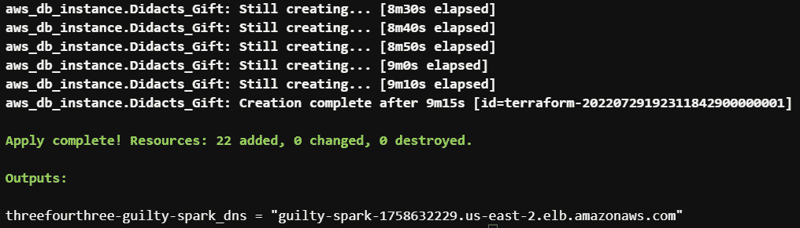
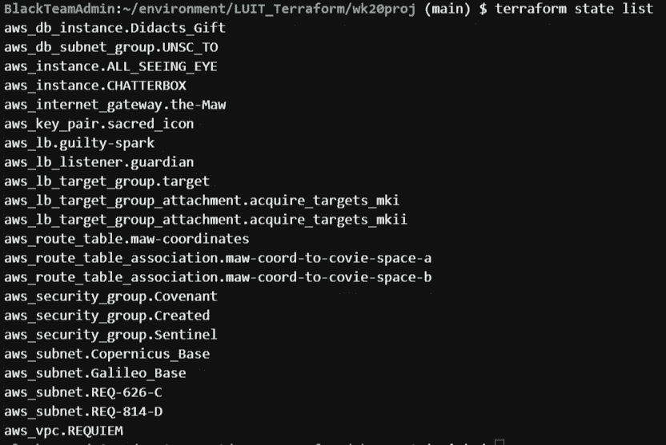
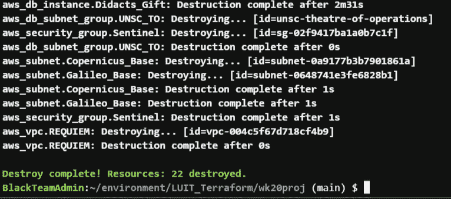

# 一场了不起的双重胜利

> 原文：<https://betterprogramming.pub/terraforming-a-terrific-two-tier-triumph-4e7297e6a1e1>

## 或者如何在 Terraform 中建造一个简单的建筑

如果你一直关注我的旅程，这个项目可能看起来有点熟悉。我之前完成了一个项目，使用 AWS 的 CloudFormation 和 YAML 创建了一个 3 层的示例架构。这一次，我们将它削减到两层，并且将在 Terraform 中完成。

# 什么是 Terraform？

简而言之，Terraform 是一个基础设施即代码(IaC)工具，允许人们创建完整的架构，而不管你使用的是哪个提供商(AWS、GCP、Azure 等)。与 CloudFormation 类似，在 cloud formation 中，您创建一个“模板”来启动，Terraform 利用一个中心文档来列出要创建的数据点和资源。

# 我们在建造什么？

我们的任务是构建一个具有以下规格的双层架构:

*   VPC 和 CIDR 16 年 10 月 0 日
*   CIDRs 为 10.0.1.0/24 和 10.0.2.0/24 的 2 个公共子网。每个都在不同的 AZ 中，以实现高可用性。
*   CIDRs 为 10.0.3.0/24 和 10.0.4.0/24 的两个私有子网。每个都在不同的 AZ 中，以实现高可用性。
*   一个专用子网中的 RDS MySQL 实例。
*   将流量导向公共子网的负载平衡器。
*   每个公共子网中的 EC2 t2.micro 实例。

# 我需要什么？

*   具有管理员权限的 AWS 帐户
*   访问 [Terraform 文档](https://registry.terraform.io/)
*   您选择的 IDE/终端。(我使用 Visual Code Studio 和 Cloud9 的组合)
*   安装在 IDE 或本地工作站上的 Terraform。

# 我们走吧！！

对于这个项目，我们将有点混乱，并创建一个“单片”地形(tf)文件。这仅仅意味着我们所有的资源、数据点等将在一个文件中。Tf 允许工程师将元素分解成不同的文档，从而允许更多的模块化设计，但我们只是要为这个项目创建一个野兽。

我建议为您的 Terraform 项目创建一个新目录，因为当我们运行它时会创建一些文件/文件夹。但是现在，一个简单的 1，2，3 就能让我们到达我们需要的地方:

*   `mkdir <projectname>`
*   `cd <projectname>`
*   `touch main.tf`

我们将要编辑的是`main.tf`文件。

## 供应商

这是我们告诉 tf 我们将使用什么服务的地方。注意，你可以有多个提供者(事实上，这是 tf 的优点之一)，但是现在我们只使用 AWS。

我们也将在这里指定我们的区域。

## VPC

接下来，我们将创建我们的 VPC。这将是我们的环境，包含我们所有的组件。接下来，我们将继续创建我们的子网:

通过`map_public_ip_on_launch`元素，子网可以很容易地从公有切换到私有。元素确保子网在我们创建的 VPC 内。上面的代码还显示了我们如何手动将每个子网分配到不同的可用性区域以获得可靠性。

至此，我们基本上已经有了这个小项目的“骨架”，所以现在让我们添加一些器官吧！

## 实例

该项目模拟了一个 2 层体系结构，需要一个 RDS MySQL 实例在私有子网中作为我们的“数据库层”,两个 EC2 实例在公共子网中作为我们的“web 层”。下面的代码还展示了一些需要创建的额外内容，比如 EC2 实例的密钥对、它们的安全组以及 RDS 实例的子网组。

我们将在下一节中讨论安全组，所以现在，让我们回顾一下 RDS。就像这个项目的 99%一样，我们可以从 Terraform 注册表中找到所有这些元素的文档。有示例代码，以及所有组件(必需或可选)的列表，以及可以在输出中引用的内部属性等。插入我们的价值观，我们就出发了！我将注意到 RDS 可能需要相当长的时间来创建/销毁，所以我将我的大小更改为比他们提供的示例小得多，并且关闭了 multi-az，因为我在这个项目中不需要它。

许多元素都是不言自明的，因此创建资源(例如修改模板)变得相当快速和容易。

EC2 实例就像在控制台或 AWS CLI 中创建它们一样，或者几乎是任何其他实例化 EC2 实例的方式。我们只是要确保`subnet_id`和`vpc_security_group_ids`设置正确，否则要进行大量的故障排除。我将我的引导程序内联(虽然对于更大的引导程序脚本，它可以作为文件或数据源传入)，这样我们就有了实例！

# 界面

如果实例是我们的器官，那么网络接口就像嘴巴或眼睛……进入我们环境的门户。

## 网关

用户或客户实际与之交互的第一部分是互联网网关。这是什么让交通进入我们的 VPC。我们还将在这里设置路由表:

您可能会注意到，我只将公共子网添加到路由表中。这是因为，由于这更多的是在 Terraform 中的练习，而不是在完整的架构中，所以没有理由将我的私有子网连接到我的公共子网。因为我的 web 层只不过是一个简单的 html 页面，所以它不需要与 RDS 实例/私有子网/“数据库层”对话。但是，如果是这样的话，我们还需要几个元素:

*   私有子网的另一个路由表
*   公共路由表中的另一个条目
*   NAT 网关
*   EIP
*   可能有一两个我现在忘记了:)

## 负载平衡器

然后，我们进入一个设备，将流量分配给我们的 web 层。这实际上提供了我们用来访问 web 服务器的 DNS，所以看起来这是第一部分，但是由于 DNS 只是我们 VPC 内部的一个地址，它必须首先通过 IG。

非常简单，我们构建我们的 ALB 来指向我们的公共子网，确保它有正确的安全组，将`internal`设置为`false`,这样它就是一个“面向互联网”的负载平衡器，我们就完成了！哦，等等，不完全是……这让我花了点时间才弄明白，但是有一个倾听者(尤其是`target_group_arn`)是让这个工作成功的绝对关键。

简单回顾一下:

*   创建需要监听器的 ALB
*   创建一个需要目标组的监听器
*   创建需要目标的目标组
*   将目标附加到组

还和我在一起吗？很好！

我要说的是，所有这些部分的文档都很好地解释了每个部分*是什么，但通常不会帮助您了解*哪些部分可以一起使用，或者您*需要*哪些部分才能工作。这些项目无疑教会了我这一部分。

# 安全组

在我们尝试运行之前，这最后一部分将介绍我们需要的三个安全组，以便让正确的流量流向它需要去的地方。

VPC、ALB 和 EC2。

老实说，这是我在整个项目中最大的挣扎。最终，我忘记了我的 VPC 安全组上的`cidr_blocks`，然后需要为 EC2 实例和负载平衡器创建安全组。允许从 ALB 到 web 层的流量是通过引用 ALB 安全组实现的。

有了这个拼图的最后一块，我们现在准备通过 Terraform 命令来创建这个作品！

# 土地改造

## 1.地形初始化

`terraform init`是我们将在终端上运行的第一个命令。正如您可能猜到的，这将初始化我们的项目将使用的所有文件和依赖项。

screencap 来自命令的重新运行，因此是“重用”和“先前安装”的行

## 2.terraform fmt/terraform 验证

这两个不同的命令是可选的，但可以派上用场。`fmt`仅仅格式化你的。tf 文件，所以他们有干净的空间等等。浏览你的文件并检查语法。它不能检测所有的问题，但是通过发现那些烦人的小错误，它肯定能为你节省一些时间！这两个函数都将返回他们已经修改过的文件。(可以使用`-diff`和`fmt`来显示所做的更改)

## 3.地形图

下一个命令将检查您的代码，并提供一个输出，显示 Terraform 在“应用”时将执行的操作。

太多无法截图，但底部的提要有助于注意

## 4.地形应用

好了，伙计们，这是红色大按钮！这个命令告诉 Terraform“Go”，在第二次“yes”确认之后，tf 将开始创建所有的资源。

同时，喝杯咖啡，或者吃点零食。对于此项目，即使 RDS 很小，也可能需要 5-6 分钟。

构建完成后，我们应该会看到以下屏幕:

我们可以运行的一个很酷的命令是`terraform state list`,它将向我们展示所有创建的不同元素:

我们可以通过检查 AWS 控制台中的不同点来手动确认所有内容都已创建，但我们的最终检查是看我们是否可以访问我们的 web 服务器。

## 5.地形破坏

史诗般的成功！现在让我们打扫一下。这一条命令将关闭一切，并删除我们创建的所有资产/资源。

我们已经看到了如何在 Terraform 中创建一个简单的 2 层 AWS 架构。感谢你在这段旅程中与我同行，如果你想看最终的`main.tf`文件，请务必查看我的 GitHub:

 [## GitHub - vypr907/LUIT_Terraform:我探索 Terraform 的所有技术升级的地方

### 我在 Tech-GitHub-vypr 907/LUIT _ terra form 的所有探索之家

github.com](https://github.com/vypr907/LUIT_Terraform)