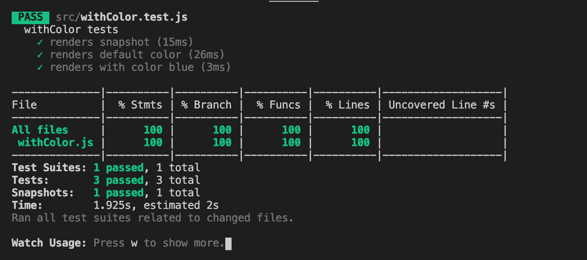
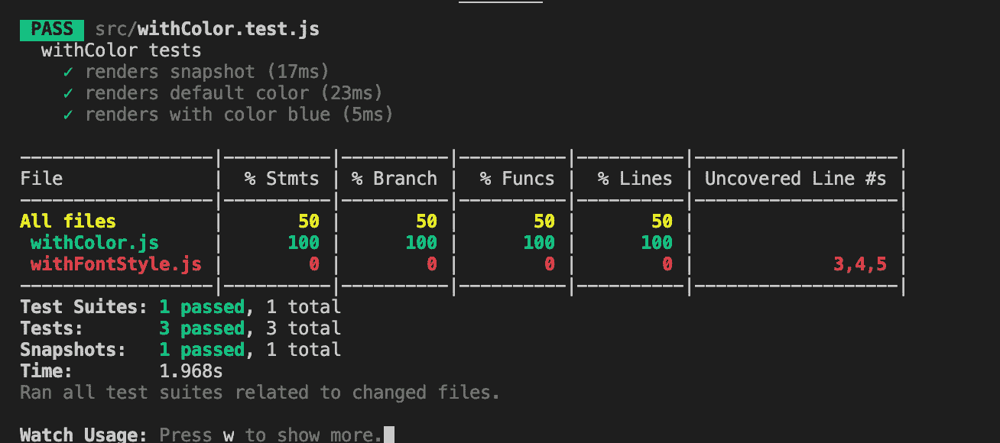
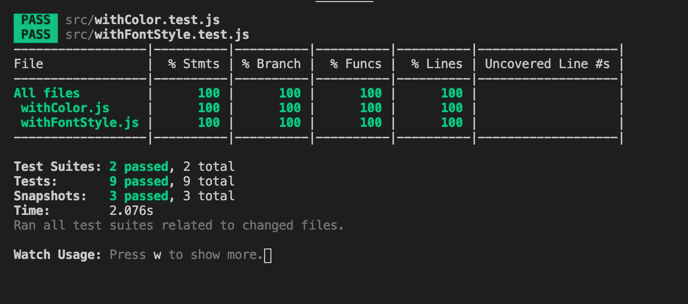
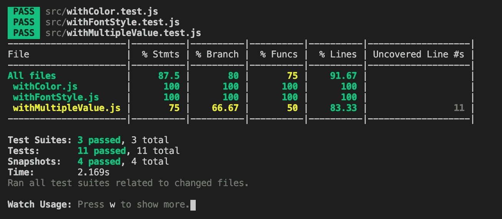
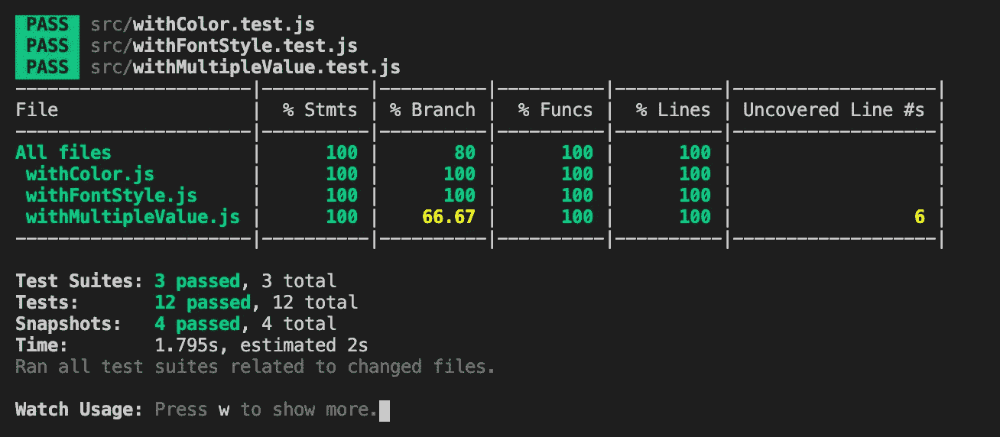
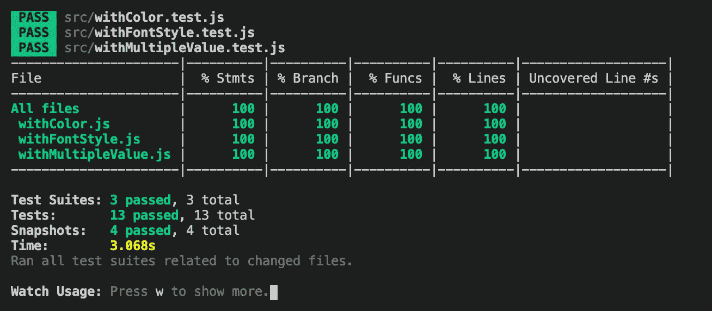

# 高阶组件的测试用例及测试覆盖

> 原文：<https://betterprogramming.pub/test-cases-and-test-coverage-for-high-order-components-2fb6fbddc33c>

## 关于如何为高阶组件编写测试用例以及如何测量测试覆盖率的例子


照片由 [timJ](https://unsplash.com/@the_roaming_platypus?utm_source=unsplash&utm_medium=referral&utm_content=creditCopyText) 在 [Unsplash](https://unsplash.com/s/photos/spectacular?utm_source=unsplash&utm_medium=referral&utm_content=creditCopyText) 上拍摄

我们最近写了一篇关于[无头 UI 组件](https://medium.com/better-programming/headless-ui-components-a-journey-with-high-order-components-render-props-and-custom-hooks-811c9677b4cf)的文章，探讨了高阶组件(hoc)和定制钩子。下一个问题是如何编写[测试用例](https://medium.com/better-programming/testing-your-components-in-react-967abda02396)和测量测试覆盖率。虽然在另一篇文章的[中介绍了测试定制钩子，但是在这里，我们将通过例子介绍如何使用 Jest 和 React 测试库来测试 hoc。](https://medium.com/better-programming/test-custom-hooks-using-react-hooks-testing-library-a3a37031a9be)

# 术语

**单元测试用例**:开发人员编写并运行的自动化测试用例。他们隔离程序的每个部分，并验证各个部分是正确的。

**集成测试用例**:将单个部分组合起来并作为一个组进行测试的自动化测试用例。

**测试覆盖率**:一个度量由一组测试用例执行的测试量的指标。收集关于语句、分支等的执行百分比的信息。也有迹象表明哪些线路尚待测试。

[**Jest**](https://github.com/facebook/jest) :保证任何 JavaScript 代码库正确性的 JavaScript 测试框架。它是最受欢迎的测试程序之一，也是 React 项目的默认选择。

[**React 测试库**](https://github.com/testing-library/react-testing-library) :测试 React 组件的轻量级解决方案。它在 react-dom 和 react-dom/test-utils 的基础上提供了实用函数，通过 react 组件的使用方式来测试它们。React 测试库以及 Jest 运行单元测试案例和集成测试案例。

[**高阶分量**](https://reactjs.org/docs/higher-order-components.html) :取一个分量，返回一个新分量的函数。这是一种复用组件逻辑的组合方法。

[**创建 React App**](https://medium.com/better-programming/10-fun-facts-about-create-react-app-eb7124aa3785) :搭建 React 项目的快速方法。这样，我们专注于代码，而不是构建工具。它有内置的 Jest 和 React 测试库，是`package.json`中`[dependencies](https://medium.com/better-programming/package-jsons-dependencies-in-depth-a1f0637a3129)`的一部分:

```
"dependencies": {
  "@testing-library/jest-dom": "^4.2.4",
  "@testing-library/react": "^9.5.0",
  "@testing-library/user-event": "^7.2.1"
}
```

# 带颜色的测试和覆盖范围

在无头 UI 组件的文章中，我们编写了`withColor`组件。这是一个为底层组件设置颜色的包装器:

在一个简化和隔离的环境中，编写测试用例类似于编写实际的代码。对于一个特设，我们需要创建一个可以显示颜色的要包装的组件:`<div>Test Color</div>`。该组件用于在以下测试代码的第 6 行生成`withColor` HOC:

第 7-10 行呈现了一个快照测试用例，它拍摄了一个快照，并将其存储在`__snapshots__`目录下作为引用(选项`—- updateSnapshot, or -u`)。第 9 行将新快照与引用进行比较，并验证 UI 没有意外更改。

这是生成的参考快照，它类似于浏览器中的表示:

该快照为接下来的两个测试用例提供了清晰的画面:

*   当没有指定颜色时，验证父节点是否具有默认颜色`red`(第 12-15 行)。
*   当颜色被指定为`blue`时，验证父节点具有颜色`blue`(第 17-20 行)。

然后我们可以运行测试:`npm test`。

它将在 Create React App 中运行`App.test.js`和`withColor.test.js`。我们怎么能只运行我们的特设测试用例呢？

`npm`有一个`—-`选项，它将`--`之后的所有参数直接传递给脚本。

以下是一些帮助消息:

```
$ npm test -- --helpUsage: test.js [--config=<pathToConfigFile>] [TestPathPattern]Options:
  --help, -h                    Show help                          
  --version, -v                 Print the version and exit             
  --collectCoverage             Alias for --coverage.                  
  --collectCoverageFrom         A glob pattern relative to <rootDir> matching the files that coverage info needs to be collected from.
  --coverage                    Indicates that test coverage information should be collected and reported in the output.                                                                                    
  --testMatch                   The glob patterns Jest uses to detect test files.  
  --updateSnapshot, -u          Use this flag to re-record snapshots.
```

然后，下面的命令将使用`with*.test.js`的命名约定运行所有特设测试:

```
npm test -- --testMatch="<rootDir>/src/with*.test.js" --collectCoverage --collectCoverageFrom="src/with*.js"
```

运行该命令会产生以下输出。我们很高兴地看到`withColor.js`已经通过了语句、分支、函数和行的 100%覆盖率测试。



# withFontStyle 的测试和覆盖率

让我们继续另一个特设，`withFontStyle`。这是一个为底层组件设置字体样式的包装器:

运行测试命令，我们发现`withFontStyle.js`已经覆盖了`0%`。它清楚地列举了上面的代码需要在第三行、第四行和第五行进行测试。



我们创建一个可以显示字体样式的组件:`<div>Test Font Style</div>`。该组件用于在下面的测试代码中的第六行生成`withFontStyle` HOC。

第 33 行创建了另一个组件。该组件由`withColor`和`withFontStyle`两者包裹:

下面是生成的快照，一个用于`withFontStyle`测试，另一个用于测试`withColor`和`withFontStyle`的组合:

现在我们对`withFontStyle.js`也有了 100%的覆盖率:



# withMultipleValue 的测试和覆盖率

`withMultipleValue`写的有点不一样。它没有添加`div`包装器，而是修改了底层组件的属性:

以下是测试案例:

这是生成的快照:

我们运行测试命令，得到以下结果:



上面写着声明覆盖范围是`75%`。`withMultipleValue.js` 的第 11 行尚未测试。

因此，我们在第 27-40 行添加测试用例来调用`onClick`回调:

我们再次运行测试——这是覆盖率报告:



报表覆盖率 100%，但分支机构没有完全覆盖。

`withMultipleValue.js`中的第六行是条件(三元)运算符`Number(props.value) ? props.value * factor : factor`。我们已经测试了`truthy`条件，但没有测试`falsy`条件。那么解决方案是在下面的第 20-25 行添加测试用例，没有初始值。

现在，我们实现了所有项目的 100%覆盖率:



# 结论

我们已经使用了特别的例子来说明如何为 HOC 编写测试用例。同时，我们还展示了如何提高测试覆盖率。

在现实世界中，事情通常更复杂。有异步代码、不确定的执行序列、第三方库等等。可能无法达到 100%的覆盖率，70% — 80%的覆盖率是一个合理的目标，尽管值得努力追求高目标。通常，它在最后 10%-20%的覆盖范围内更有效。

感谢阅读。我希望这有所帮助。你可以在这里看到我的其他媒体出版物。