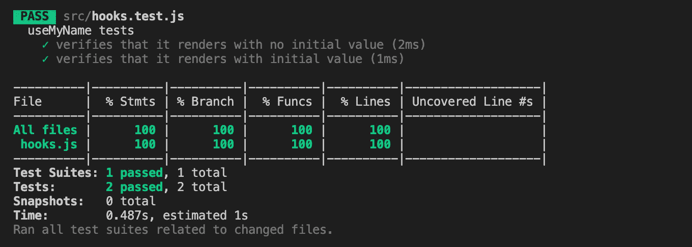
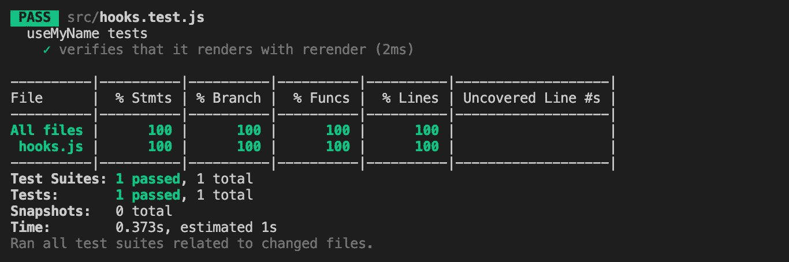
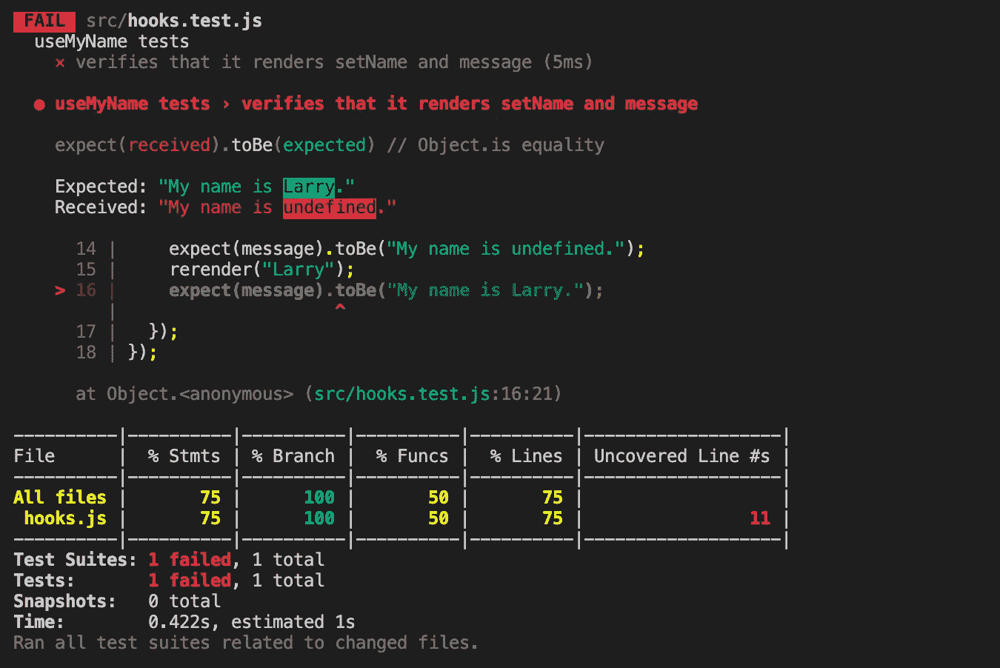
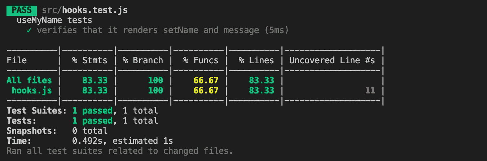
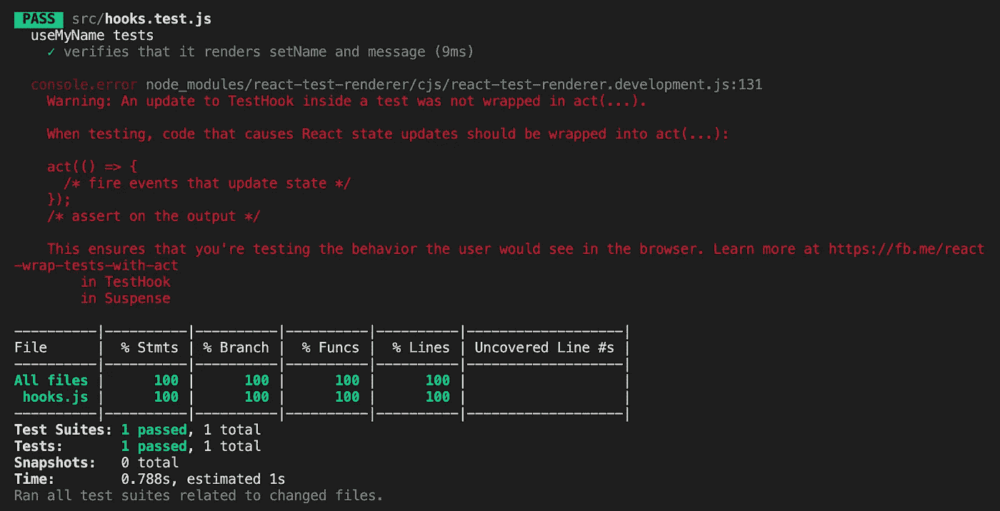
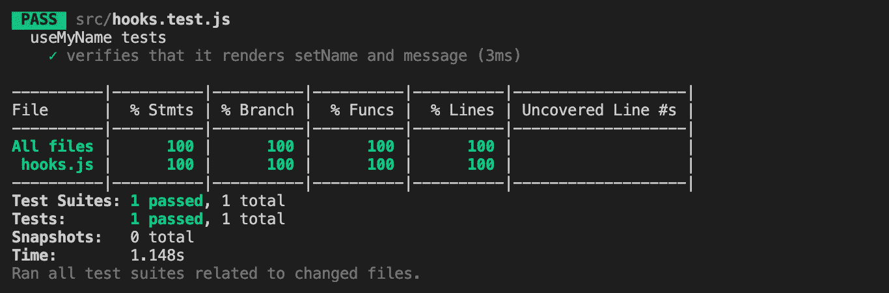
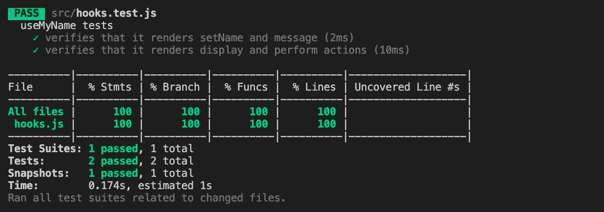
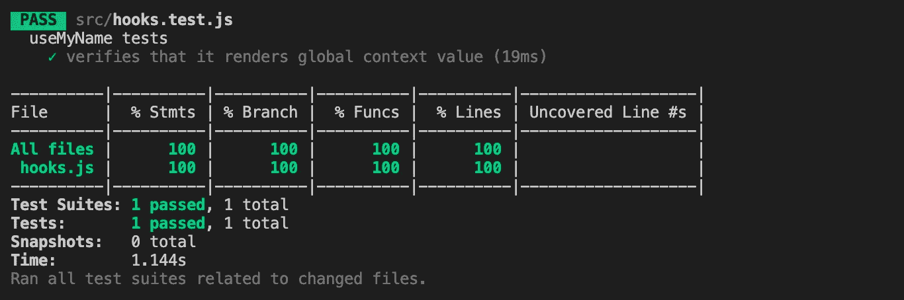
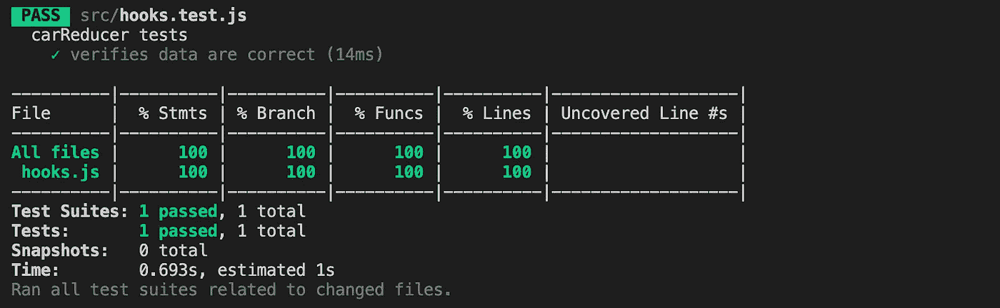

# 使用 React 钩子测试库测试定制钩子

> 原文：<https://betterprogramming.pub/test-custom-hooks-using-react-hooks-testing-library-a3a37031a9be>

## 为你的钩子建立一个基本的测试基础设施


安娜·洪科在 [Unsplash](https://unsplash.com/s/photos/library?utm_source=unsplash&utm_medium=referral&utm_content=creditCopyText) 上拍摄的照片

钩子很受欢迎，因为它们带来了可读性和可维护性。定制钩子成为可组合性和可重用性的推动者。在[无头 UI 组件](https://medium.com/better-programming/headless-ui-components-a-journey-with-high-order-components-render-props-and-custom-hooks-811c9677b4cf)中，我们探索了定制钩子，以及高阶组件(hoc)。

我们如何测试它们？在[高阶组件的测试用例与测试覆盖](https://medium.com/better-programming/test-cases-and-test-coverage-for-high-order-components-2fb6fbddc33c)中，我们使用 [Jest](https://github.com/facebook/jest) 和 [React 测试库](https://github.com/testing-library/react-testing-library)举例说明了如何编写高阶组件的测试用例以及如何测量测试覆盖。在本文中，我们将演示如何使用 [React 钩子测试库](https://github.com/testing-library/react-hooks-testing-library)来测试定制钩子。

# 安装 React 钩子测试库

测试定制钩子需要两个包:

```
npm install --save-dev @testing-library/react-hooks
npm install --save-dev react-test-renderer
```

安装完成后，这些包就变成了`package.json`中的`[devDependencies](https://medium.com/better-programming/package-jsons-dependencies-in-depth-a1f0637a3129)`。

[测试渲染器](https://medium.com/better-programming/testing-your-components-in-react-967abda02396) ( `react-test-renderer`)用于将 React 组件渲染为纯 JavaScript 对象，不依赖于 DOM 或原生移动环境。安装的版本应该与 React 版本相匹配。

`@testing-library/react-hooks`构建于测试渲染器之上。

你可能还需要其他的`@testing-library`包。如果您使用[创建 React App](https://medium.com/better-programming/10-fun-facts-about-create-react-app-eb7124aa3785) ，它们是`package.json`中`dependencies`的一部分:

```
"dependencies": {
  "@testing-library/jest-dom": "^4.2.4",
  "@testing-library/react": "^9.5.0",
  "@testing-library/user-event": "^7.2.1"
}
```

# renderHook API

`renderHook` API 是`@testing-library/react-hooks`的核心。每次渲染时，它都会渲染一个调用所提供的`callback`的测试组件，包括它调用的任何钩子。

```
function renderHook(
  callback: function(props?: any): any,
  options?: RenderHookOptions
): RenderHookResult
```

`options`的类型为`RenderHookOptions`，它是一个对象，可以选择包括:

*   `initialProps`:是`renderHook`的`callback`功能的初始值。
*   `wrapper`:它是一个 React 组件，在使用全局上下文的同时包装测试组件。

`RenderHookResult`是定义如下的数据结构:

```
{
  current: any,
  error: Error
}
```

我们用例子来说明`renderHook`在各种情况下是如何使用的。使用 Create React App 作为工作环境。所有定制钩子都托管在`src/hooks`中，所有钩子测试都托管在`src/hooks.test.js`中。

在[中每个人都可以构建一个定制的钩子](https://medium.com/better-programming/everyone-can-build-a-custom-hook-e0f1c6802ffe)，我们构建了一系列钩子。我们将使用它们来构建测试用例。

这是最简单的挂钩:

以下是测试案例:

在第 6 行，`renderHook`用于呈现自定义钩子，`useMyName`。

在第 7 行，`result.current`是`useMyName`的返回值。

与第 5 - 8 行的情况相比，第 10-13 行显示了初始值设置为`“Larry”`的不同情况。

正如我们在[另一篇文章](https://medium.com/better-programming/test-cases-and-test-coverage-for-high-order-components-2fb6fbddc33c)中所解释的，下面的命令用于执行测试用例:

```
npm test -- --testMatch="<rootDir>/src/hooks.test.js" --collectCoverage --collectCoverageFrom="src/hooks.js"
```

以下是测试结果和测试覆盖范围:



# `rerender`原料药

在之前的测试中，我们用不同的初始值重复了两个测试。这可以通过将初始值传递给`renderHook`的`callback`来组合:

```
renderHook((initialName) => useMyName(initialName)
```

当初始值改变时，我们调用`rerender`来触发钩子重新计算。

```
function rerender(newProps?: any): void
```

以下是备选测试套件:

这会产生相同的结果:



现在，让我们来看一个更复杂的定制钩子，它返回一个方法和一个值。

以下是测试案例:

在第 6 行，`renderHook`用于呈现自定义钩子，`useMyName`。这一次，`current`被析构为一个方法和一个值(第 12 行)。在第 13 行测试该方法，在第 14 行和第 16 行测试该消息。

运行测试套件:



发生了什么事？测试在第 16 行失败。

`message`的值在第 12 行被析构。`message`变得停滞不前，不再获取新值`“Larry”`。

这是需要记住的事情。尽管析构`result.current`的值使代码变得干净，但是任何后续的更新只能在直接使用`result.current`时使用，除非它们被再次析构。

我们在下面的测试代码中修复了这个问题(第 16 行):

但是我们仍然得到失败的测试结果。还有什么不对？

在`useMyName`中，`initialName`被传递到`useState`作为初始状态。由于`useState`的性质，rerender 不会更新初始状态。为了让状态拾取道具变化，我们需要调用`useEffect` hook(第 6 - 8 行)。

现在测试用例通过了:



但是，我们发现功能覆盖率是`66.67%`。测试用例没有覆盖第 11 行的函数`setName`。

我们在第 16 行添加了函数的测试用例:

再次运行测试:



测试用例通过，语句覆盖率为 100%。分支、函数和线条。

但是那个红色警告是什么？这意味着我们需要`act` API。

# act API

测试时，导致 React 状态更新的代码应该被包装到`act(…)`中。

`act`由`react-test-renderer`导出。因此，它可以通过第 2 行的语句导入。

为了使用方便，`act`被`@testing-library/react-hooks`重新导出。它通常与`renderHook`一起导入，类似于第 1 行的语句。

在第 18 行，调用`setName`被包装在`act`中。

运行这个命令，我们通过了所有的测试，并且没有任何警告。



还有一个`act`，从`@testing-library/react`或者`react-dom/test-utils`出口。它的功能类似，但它是不同的`act`。如果你用错了，会有警告提醒你:

```
Warning: It looks like you're using the wrong act() around your test interactions.
    Be sure to use the matching version of act() corresponding to your renderer:

    // for react-dom:
    import {act} from 'react-dom/test-utils';
    // ...
    act(() => ...);

    // for react-test-renderer:
    import TestRenderer from 'react-test-renderer';
    const {act} = TestRenderer;
    // ...
    act(() => ...);
        in TestHook
        in Suspense
```

在下面的测试用例中，我们添加了第二个测试套件(第 23 - 56 行)，它构建了一个采取行动的用户界面:

两个点击动作(第 45 行和第 52 行)由`act` API 包装。

和往常一样，我们想做一个快照测试(第 47 行),看看它是如何呈现的:

运行测试用例，我们很高兴看到一切看起来都很好。



# useContext 的包装

我们如何测试调用全局上下文的定制钩子？

在上面的代码中，`NameContext`(第 3 行)是一个全局上下文，由第 12 行使用。

`NameContext`要求提供者使用全局上下文包装组件。这个提供者在第 5 行被定义为`NameContextProvider`。

我们可以通过调用`renderHook(() => useMyName())`来测试`useMyName`。但是，这仅验证第 3 行的`CreateContext`的初始值，在本例中为`undefined`。

`wrapper`是 renderHook 的选项之一。这有助于我们解决问题。在第 8-11 行，它创建了一个由`NameContextProvider`包装的 React 组件。该组件可自由设置任何`initialName`(第 9 行)。

第 14 行的测试能够读取全局上下文值并通过这个测试套件:



# waitForNextUpdate API

React Hooks 测试库中有一些异步实用程序。`waitForNextUpdate`返回一个`Promise`,在钩子下一次渲染时解析，通常是在异步更新导致状态更新时。

```
function waitForNextUpdate(options?: {
  timeout?: number
}): Promise<void>
```

以下代码来自 [Lodash:创建 React App 的内置库，用于去抖和用钩子节流](https://medium.com/better-programming/lodash-create-react-apps-built-in-library-for-debounce-and-throttle-with-hooks-3418087f44d8)。在`wait`时间之前，它会去抖一个值。

以下是测试案例:

在第 11 行和第 15 行，`waitForNextUpdate`可以方便地快进到下一个状态更新。

# 测试减速器

减速器是一个具有`(state, action) => newState`类型的功能。它有两个参数——当前状态和用户执行的操作。然后，它根据所调度的动作有条件地返回一个新状态。

以下代码来自[如何将 JavaScript 类转换为 React 的 useReducer 钩子](https://medium.com/better-programming/how-to-convert-javascript-classes-to-reacts-usereducer-hook-575769b0c7e9)。它是一个更新猫的状态对象的 reducer。

`useReducer`是一个内置的钩子，适用于管理包含多个子值的状态对象。我们通过用`useReducer`钩子包裹一个减速器来生成一个钩子。从技术上讲，`useReducer`钩子不是自定义钩子，但也可以通过 renderHook 测试，类似于其他内置钩子。

以下是`catReducer`的测试用例:

运行 tests 命令，我们得到了 reducer 代码的`100%`覆盖率:



# 结论

由于自定义钩子在 React 中流行，我们需要一种方便的方法来测试它们。React Hooks 测试库提供了完成它的基础设施。

感谢阅读。我希望这有所帮助。你可以在这里看到我的其他媒体出版物。