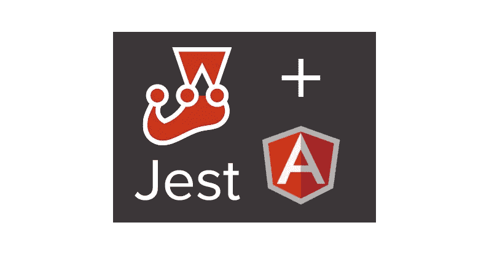
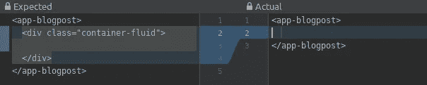
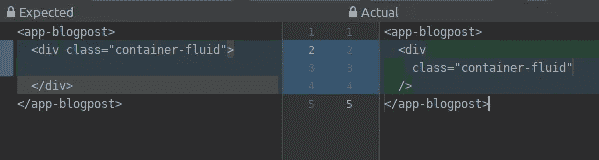

# Jest 和 Angular 的测试驱动开发尝试

> 原文：<https://betterprogramming.pub/test-driven-development-attempt-with-jest-and-angular-7e064b76ca2d>

## Jest 中的测试驱动开发可能吗？Jest 比 Karma 更好还是更快？什么是开玩笑的快照测试？让我们找出答案。



用 Jest 作为测试框架编写角度代码

几个月前，我和一个同事一起工作。我们正在使用 Karma 和 Jasmine 进行有角度的前端概念验证，一切都很顺利。我的同事告诉我, [Jest](https://jestjs.io/) 要好得多。我很惊讶，但由于没有人知道所有的事情，对你的工作方式持批评态度总是好的，我愿意相信他。这让我很好奇。有没有更好的办法？

当时，我还在开发一个大型前端应用程序，进行了 1000 多次角度测试。运行所有这些测试非常慢。这让我想到，Jest 能解决这个问题吗？Jest 也允许我以测试驱动的方式工作吗？你猜怎么着，现在几个月过去了，我一直在我的网站上玩 Jest。我发现了一些有趣的见解，我在这里与你分享这些。

这篇文章的结构如下:

*   测试驱动开发简介
*   Jest:历史和优点
*   快照测试:UI 测试和属性匹配器
*   Jest 和 Karma 的速度比较
*   结论

# 前端代码中的 TDD 今年是哪一年？

我不是想让你相信编写测试很重要。我已经过了那个阶段了。我相信以一种非常结构化的方式来解决问题会带来最好的结果。让我告诉你如何做到这一点。

我将通过应用被称为测试驱动开发(TDD)的软件开发过程向您展示我是如何做到这一点的。让我们从定义开始，之后，我将展示如何用 Angular 编写这样的代码，使用 Jest 作为我们的测试框架。

> “测试驱动开发(TDD)是一种软件开发过程，它依赖于一个非常短的开发周期的重复:需求被转化为非常具体的测试用例，然后代码被改进以便通过测试。”
> 
> — [维基百科](https://en.wikipedia.org/wiki/Test-driven_development)

基本上，当我们以这种方式编写代码时，一切都归结为:我们编写了一个测试，它失败了，因为它还没有实现。然后我们编写足够的代码来通过这个测试。当测试通过时，我们检查这是否是可满足的代码。如果不是，我们使用重构步骤清理它。

在第一次迭代之后，我们 100%确定我们得到了我们想要的。更重要的是，当我们继续这样做的时候，情况依然如此。我们过去写的每一个测试都是我们 100%确定的。

想看看我们过去写的东西还能用吗？只要做测试，他们就会支持你。

作为个人，你可能会想，“我知道我写的是什么，我确信它是有用的。”然而，当你在一个更大的组织中工作时，当它不工作时，你假设它工作的机会增加了。测试给了你和你的团队一些东西，在某些事情确实出错的情况下——例如，在外部包升级或者大的重构期间(或者它甚至可能是一个缺失的特性)。

这些测试记录了系统的整个工作过程。从长远来看，这是应该走的路。

# 遇见笑话

## 测试框架的起源


[瑞秋](https://unsplash.com/@noguidebook?utm_source=medium&utm_medium=referral)在 [Unsplash](https://unsplash.com?utm_source=medium&utm_medium=referral) 上的一张小丑照片

Jest 是一个由脸书维护的 JavaScript 测试框架。笑话的重点在于它的简单。它可以与 Babel、TypeScript、React、Node、Angular、Vue 等技术协同工作。

## 笑话的优点

Jest 旨在强化以下几点:

*   **配置** : Jest 旨在打破常规。这并不是 100%正确的，因为你仍然需要到处配置一些东西。然而，Medium 上已经有大量的[文章](https://medium.com/angular-in-depth/integrate-jest-into-an-angular-application-and-library-163b01d977ce)介绍了如何使用 Jest 创建和设置 Angular 应用程序。所以我不打算在这里谈这个。
*   快照:这是一个非常有用的工具，可以确保你的用户界面没有意外的改变。当我给你一个例子的时候，它会变得更清楚。我已经给了你一个我喜欢它们的原因:你可以很快看到(例如，在一个拉请求中)你的模板发生了什么变化。
*   **隔离**:每个测试都在它们的进程中运行，这意味着它们可以被并行化。这大大提高了它们的速度。他们也不需要像 Karma test runner 这样的浏览器。当您必须运行 1000 多个测试时，这无疑是一个很大的改进。
*   API:他们有很好的文档。然而。我注意到我不必一直检查文档。这意味着它非常直观，这是我所欣赏的。

最重要的是，它开箱即用，具有覆盖范围、简单模仿、观察插件和异常上下文。

# 快照测试

好吧，先说我在《因果报应》里没见过的。这是对我来说最突出的事情。为什么要使用快照？

> "当你想确保你的用户界面不会发生意外变化时，快照测试是一个非常有用的工具."——[玩笑](https://jestjs.io/docs/en/snapshot-testing)

这有点难以理解。先说我的一个例子。我们将从一个基本测试开始，然后继续。

```
***it***("should render", () => {
  fixture.detectChanges();
  ***expect***(fixture).toMatchSnapshot();
});
```

好的，你可以这么做。它告诉我们组件应该呈现。快照放在一个文件夹中，您可以在那里看到它。让我向您展示这样一个快照文件的内容。

```
// Jest Snapshot v1, [https://goo.gl/fbAQLP](https://goo.gl/fbAQLP)exports[`BlogpostComponent should render 1`] = `
<app-blogpost>

</app-blogpost>
`;
```

很好，这很容易开始。我们的测试为我们生成了快照。我们从绿色测试开始——这是一个好的开始。但是让我们重构一下，因为测试描述非常糟糕。

Jest 还支持内嵌快照。让我们使用它们，因为我喜欢在测试本身中包含所有信息。我给你看！

```
***it***("renders my empty blogpost component", () => {
  fixture.detectChanges();
  ***expect***(fixture).toMatchInlineSnapshot();
});
```

让我们现在运行这个。

```
***it***("renders my empty blogpost component", () => {
  fixture.detectChanges();
  ***expect***(fixture).toMatchInlineSnapshot(`
    <app-blogpost>

    </app-blogpost>
  `);
});
```

那好多了。我们的测试描述完全符合预期。但是现在说不通。如果我们只有一个空组件，实际的好处是不清楚的。让我们进入下一个测试驱动的步骤。

我们将测试改为一个空的 div，上面有一些 bootstrap 样式。这是我们想要实施的下一步。

```
***it***("renders a blogpost with a full width container", () => {
  fixture.detectChanges();
  ***expect***(fixture).toMatchInlineSnapshot(`
    <app-blogpost>
      <div class="container-fluid"> </div>
    </app-blogpost>
  `);
});
```

让我们现在运行测试，看看它做什么。我们看到它失败了，这是合乎逻辑的，因为我们还没有实现它。它还允许我们查看预期快照和实际快照之间的差异。

我也会给你看:



预期与实际

让我们继续讨论实现。

我在组件 HTML 文件中放入了以下代码:

```
<div class="container-fluid"></div>
```

第一次运行测试时，我几乎 100%确定它会成功。然而，它没有！

幸运的是，Jest 至少让我看到了不同之处。让我们调查一下。



预期与实际

我的反应？那不是我所期望的。但它是有效的 HTML，是一回事。这使得完全测试驱动有点困难，因为我必须习惯用格式化程序的方式编写代码。

在最初的失望之后，我接受了当前的快照，我的测试现在成功了。我觉得没什么可学的了，所以我将组件开发的其余部分作为练习。

如果你愿意，进入第三步，给测试添加越来越多的细节(比如自己实现一篇博客文章或任何其他组件)。

```
***it***("renders a blogpost with a full width container", () => {
  fixture.detectChanges();
  ***expect***(fixture).toMatchInlineSnapshot(`
    <app-blogpost>
      <div
        class="container-fluid"
      />
    </app-blogpost>
  `);
});
```

快照测试是识别应用程序中意外接口变化的理想方法。根据 Jest，您应该了解一些[最佳实践](https://jestjs.io/docs/en/snapshot-testing#best-practices)，以便有效地使用它:

*   **将快照视为代码**:提交快照，并将其作为常规代码评审过程的一部分进行评审。
*   **测试应该是确定性的**:对一个没有改变的组件多次运行相同的测试，每次都会产生相同的结果。否则，您的模板将在不同的运行中发生变化，从而导致意外的失败。例如，通过使用固定的日期来尽可能避免这种情况。
*   **使用描述性的快照名称**:避免类似`should render`的东西。描述你期望从你的测试中得到什么，就像你应该为你所写的每一个测试所做的那样。确保你的意图是明确的。

## 具有内联快照的属性匹配器

我将给出一个例子来展示快照测试的威力，这是我非常喜欢的一个例子。在下面的例子中，我检查了一个包含我所期望的所有内容的对象。这太棒了。

这种快照很容易适应预期的变化(例如，当我们添加一个新的字段或者当我们改变数组的顺序时)。这使得再次以测试驱动的方式工作成为可能。这很好。

不再有构建复杂组件的麻烦，只需以易读的格式提供您需要的所有信息。

```
***expect***(dataEmitted).toMatchInlineSnapshot(`
  Array [
    Object {
      "category": "frontend",
      "publicationDate": 2020-03-21T00:00:00.000Z,
      "title": "my frontend blogpost.fr",
      "url": "www.medium.com/life-is-fun",
    },
    Object {
      "category": "backend",
      "publicationDate": 2020-02-15T00:00:00.000Z,
      "title": "my backend blogpost.fr",
    },
  ]
`);
```

# 速度:因果报应与笑话

首先，我必须写一些测试来试验它们。写完这些测试之后，我想知道加速的幅度会有多大。让我们比较一下我对因果报应和笑话的结果。

使用 Karma 浏览器测试了运行大约 2000 个测试所花费的总时间(在我的机器上几乎是 80 秒)。如果你想一想，这并不慢。运行 20 个 Jest 测试大约需要 4 秒钟。使用简单的数学，认为运行 1000 个测试在玩笑中比在 Karma 中更快是愚蠢的。

如果你认为这是从一个测试框架转移到另一个框架的原因，请三思。如果我是诚实的，我喜欢笑话，我没有理由不使用它。我认为*这个*的特殊原因根本不是搬家的好理由。

如果你用的是老版本的 Angular，我建议你升级到最新版本。这将比转换测试框架更有意义。

```
> jest...Test Suites: 8 passed, 8 total
Tests:       20 passed, 20 total
Snapshots:   12 passed, 12 total
Time:        4.0s
Ran all test suites.
```

# 结论

在使用 Jest 几个月之后，我觉得关于这个框架我还有很多需要发现的地方。然而，在使用这个框架之前，我也获得了一些问题的答案。我想我可以用一句话来概括我的答案:

另一边的草并不总是更绿。

这对我来说有两个主要原因:

*   我期望 Jest 比使用 Karma 快得多。但说实话，事实并非如此。例如，与从角度 7 移动到角度 9 相比，结果相当令人失望。
*   快照测试不是圣杯。你还需要其他的测试。然而，它们被证明是相当有用的，而且肯定增加了一些东西。我仍在探索如何充分利用它们。这当然是对其他测试的一个很好的补充，而不是替代。

## 我还会继续用 Jest 吗？

我肯定会的。我确实喜欢很多《孽债》里没有的东西。我发现 Jest 的模拟功能非常具有可读性。此外，快照测试为语言增加了一些东西。总的来说，我发现 Jest 非常容易使用，这也是有人能给我的最好的理由，让我选择 Jest 而不是 Karma。