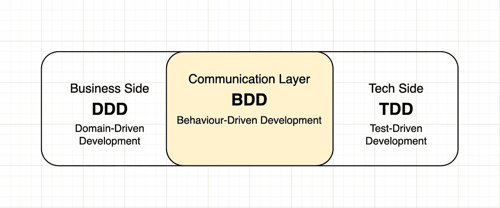
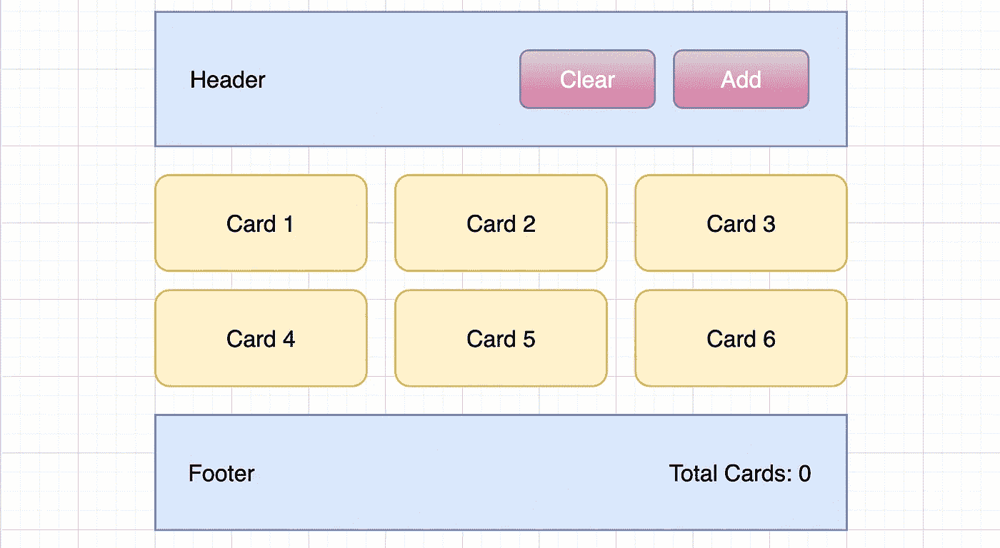
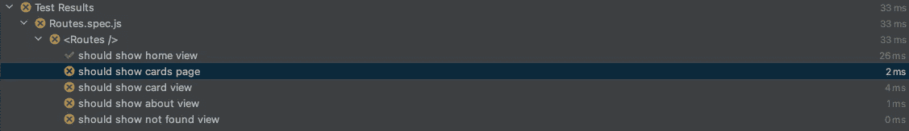

# React 应用程序中的测试驱动开发

> 原文：<https://betterprogramming.pub/test-driven-development-in-react-application-f697f66467e5>

## 如何应用 TDD 方法的详细指南


感谢来自 unsplash.com[的](https://unsplash.com/)[基亚布拉](https://unsplash.com/@chiabra)的图片

测试是我们生活中非常重要的一部分。测试给你对事物的信心。现在你在厨房里做沙拉调料。你把所有的配料混合在一起，你或多或少知道它们的味道。你的过程的结果将是一个腌制的沙拉。在把酱放入沙拉之前，你可能想检查一下——它够咸、够甜或够辣吗？最后，你用调料给沙拉调味。

在完成过程的结尾之前试图理解它是怎样的就是测试。我们在上菜前测试食物，在建桥前测试组件的强度。我们在将药物送往药店之前会对其进行测试。美国宇航局在发射火箭前做了许多测试。这里可以给出十几个例子，但是测试的思想无处不在。有了编码，也是一样。

在我们的项目中编写代码就像一个滚雪球一样越滚越大——出错和最终失败的几率非常高。此外，其他开发人员也参与到项目中，如果没有测试，破坏某些东西的几率会更高。当服务中出现问题时，企业会花费时间和金钱来修复它。所以，最好通过测试来预测潜在的错误。

在阅读 Robert C. Martin 的《干净的代码》时，我认为首先考虑测试，然后创建一个组件是非常困难的。但是经过一些训练和下面描述的技术，我对 TDD 比以前更有信心了。

在这里，您将学习如何对 React 应用程序使用测试，以及一般的测试行为。你会看到不同类型的测试之间的区别，在哪里使用它们，什么时候使用。做好大量编码的准备。

在开始编写测试之前，我想强调三个重要的概念:

*   DDD —领域驱动的开发
*   行为驱动的开发
*   测试驱动开发

# DD 是什么？

DD 的意思是驱动发展。这意味着发展是基于某种行为的。请看下图:



驱动发展

## DDD

这是在代码中对商业思想的正确解释。就像写企业代码的技巧；产生的代码是基于商业理念的。它包括诸如通用语言这样的重要方面，通用语言是业务和开发方之间的一种独特的交流语言。另一方面，模型驱动设计基于一个模型和一些开发模式。

## BDD

这意味着改善开发团队和业务之间的沟通。这个概念是从 TDD 分出来的；这就像是它的变体或延伸。BDD 是对行为的描述，它对集成测试和 e2e 很有帮助。

## TimeDivisionDuplex 时分双工

这是基于测试的发展。TDD 认为你应该在写代码之前写测试，这样你就可以看到它是否会失败。只有在书面测试之后，您才开始为书面测试编写功能，并找出满足测试的组件。对于单元测试来说非常好。

# 试验

*   单元测试——这是一种测试类型，当你测试一个元素(或实体)时，没有任何与其他元素的绑定(连接)。
*   集成测试——这是关于 React 向 DOM 呈现某些内容时的呈现逻辑。它着眼于相关的函数，枚举，一些逻辑依赖函数，等等。
*   E2E 测试——当我们测试用户如何与界面交互时。它关注的是渲染结束时用户对界面的行为。有浏览器和创建的用户，他们通过一个界面。

## 应用

在模式上，您可以看到应用程序非常简单。最后，您可以找到到 [GitHub 资源库](https://github.com/antonkalik/tdd-react-example)的链接。但是现在，让我们专注于按照 TDD 方法构建应用程序。我们不会实现所有的组件。重要的是理解如何在 React 中使用 TDD。



应用程序模式

开始时，理解我们要构建什么并确定实现这个应用程序需要什么组件是非常重要的。在我的解释中，我们从简单的开始。

该应用程序的想法是呈现从一个假 API 请求的卡片网格。此外，我们必须能够通过点击`Add` 按钮来添加新卡，而`Clear`按钮必须从网格中移除所有的卡。最后，在`Footer`中，我们显示了牌的总数。每张卡我们必须能够打开或删除。我用的是`create-react-app`。

应用程序的包

安装包之后，让我们来构造我们的文件夹。每个组件和视图文件夹必须有`index.js`作为一个文件。

文件夹结构

应用程序中的路由必须具有以下路由:

```
/ -> Home Page
/cards -> Cards Grid Page
/card/:id -> Card View
/about -> About View
/* -> Not Found View
```

# 试验

当我们用技术语言描述应用程序时，我们已经调用了一些组件。每个组件都必须独立于测试。我们必须能够测试组件而不依赖于其他组件。我们将从视图开始编写组件。我们需要它们来呈现`App`本身并测试路由。

```
└── views
        ├── AboutView
        ├── CardView
        ├── CardsView
        └── HomeView
```

在文件夹`src/views/`里，我们把`index.js. <VIEW_NAME>.spec.js`放在每个文件里。比如`AboutView.spec.js`然后打开。

关于查看测试开始

是的，我们正在抛出`Error('Not implemented')`，你必须习惯它，因为最重要的部分是描述。我们必须描述我们将在每个`it`中测试什么，以及我们期望从那个组件的每个测试中得到什么。现在将以下内容添加到`index.js`:

对“关于视图”第一次测试的满意度

回到您的测试文件。我们将完全按照我们对这个组件的期望来编写测试。我们在期待什么？渲染后，我们将保存快照和`About View`标题。

测试关于视图

Jest 帮助我们将组件结构的快照保存到磁盘，并在随后的测试运行中，将新的快照与先前保存的快照进行比较。在这种情况下，快照只是数据结构的文本表示。第一次触发测试快照时，它会将组件的文本表示结果写入磁盘。测试将通过并被记录为快照。

下次操作组件时，测试将会失败，因为写入快照的数据会有差异。为什么它很重要？比较并防止组件中不需要的元素。检查快照中的差异非常重要。如果其中有未定义的值，默认情况下快照测试将被破坏。回到`index.js`，为测试调整我们的视图组件。

关于视图

对所有其他视图进行同样的操作。为你的组件、函数、工具、钩子等等写一个测试和实现。这是 TDD 的主要概念。

## 路线

如你所知，我们的应用程序中有`Routes`可以呈现我们的视图。在文件夹`src/Routes`中，创建`index.js`和`Routes.spec.js`，然后将其添加到文件中:

带组件路由器的 TDD

到了`it`，我们准确描述了我们对`Routes`的预期。让我们先加入我们的`HomeView`期望。了解我们对此组件的期望很重要。

路线测试

第一个测试告诉我们`HomeView`必须通过路线`/`。如您所见，我们模仿它只是为了避免视图组件的意外导入。我们通过测试实现进行隔离。让我们为这个测试调整一下我们的`Routes`。不多不少。

路线组件

运行您的测试。除了与`HomeView`相关的第一个测试之外，结果必须与失败的测试相关。



通过了路由组件的测试

`it`一个接一个地为其他视图添加测试。

路由测试的完整描述

并为每个描述的测试调整组件。

测试的路由组件更新

# 应用程序组件

是时候用主`App`组件绑定它了。进入`App`文件夹，创建文件:`index.js, App.spec.js`。记住`App`必须有`Routes`。我们来测试一下。

打开`App.spec.js`，像之前用`throw Error("Not implemented");`一样描述 app 测试。

模拟应用程序测试

当然，我们还没有任何`App`组件，但是我们已经知道在这个组件中，我们将会有`Routes`。让我们创建`App`组件。我用的是`styled-components`。

应用程序组件

现在，让我们为`App`运行我们的测试。您将看到快照将被创建，并且测试已通过。

## 页眉

是时候为我们的`MainLayout`准备一些组件了。`Header`有`title`和两个按钮`Add`和`Clear`。让我们从测试开始。老规矩，用`Test not implemented`。只有第一个测试将为我们的组件做好准备。

标题测试场景

然后让我们为笔试创建我们的`Header`。只满足测试；没别的了。

标题组件

然后进行测试。必须通过两个第一测试。好了，让我们将其他测试逐个添加到`Header`中，并针对每个测试组件进行改进。

标题测试控件

在向`Header`组件添加按钮之后——更新您的快照。

测试的标题自适应

如你所见，我们正在一步一步地进行。首先是测试，然后我们做实现来满足测试。让我们为`Header`添加两个额外的测试，如下所示:

标题测试

当然，还要为这些测试修改组件。我们必须确定我们的函数已经被调用。

测试标题的最终实现

## 页脚

这个组件要简单得多，但是我们要在其中渲染一些卡片。你可以看看上面是什么样子。首先，创建一个名为`Footer.spec.js`的测试。

页脚测试

并适应测试组件的每种情况。几乎与标题中的相同，但简单得多。

页脚组件

# 钩住

是的，我们必须用同样的方法测试钩子。让我们假设我们将有一些请求卡的问题。我们有一个请求的链接，数据的预期结果必须是一个带有`id`和`title`的数组。

对于 HTTP 请求，我们将使用`axios`。首先，我们要嘲笑这一切。让我们转到`src/hooks`并创建一个文件夹`useApi`。将会有`index.js`和`useApi.spec.js`，在开始时，让我们在那里添加这些模拟:

useApi 钩子测试模拟

好的，不。我们可以描述一下我们对钩子的期望。

使用 Api 测试

这一部分已经很熟悉了，我们必须为测试调整我们钩子。

为笔试使用 Api 挂钩改编

让我们在测试中描述对钩子行为的期望。在这种情况下，`mockImplementation`有助于独立返回每个测试中承诺的假数据。

挂钩使用测试

我们正在等待每一项测试中特定领域的变化。为什么我们会有它？因为钩子会用在有生命周期的组件中。

useApi 挂钩实现

# 还原剂

完全相同的方法可以用于上下文中的 reducer。让我们假设我们的应用程序有一个上下文，我们将在一个 reducer 的帮助下使用一些动作。记住我们使用`initState`在`useReducer`钩内的减速器:

```
export const *initialState* = { cards: [] };const [state, dispatch] = useReducer(reducer, *initialState*);
```

那么，让我们描述一下我们对那个减速器的期望。代码如下:

减速器测试

当然，还要一个接一个地调整我们减速器。

减速器功能

现在，更新测试以获得减速器行为的附加描述。

减速器测试更新

同样，为所有的书面测试修改 reducer。

减速器功能更新

# 其他组件

现在，尝试检查存储库中的其他组件，并编写自己的测试。有`Card`、`Cards`、`MainLayout`带`Header`、`Footer`。首先，创建测试，然后是组件实现。

# 结论

我只想向您展示如何在您的应用程序中使用 TDD。刚开始的时候，感觉很烦，但是最后你节省了很多时间。因此，您将收到经过全面测试的独立组件，如果其他开发人员需要在那里做一些更新，这将是清楚的。

总的来说，TDD 提供了稳定性、可靠性和成熟的解决方案，这些都是任何企业应用的基石**。**

# 资源

GitHub 库:[https://github.com/antonkalik/tdd-react-example](https://github.com/antonkalik/tdd-react-example)

```
**Want to Connect?**I'll be glad to keep in touch through [Twitter](https://twitter.com/idedycom).It's always a pleasure to receive any suggestions and comments related to the topic. Feel free to ask any questions.Thank you!
```