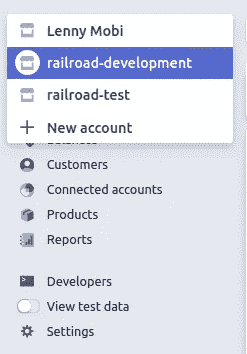

# 使用 Stripe 和 Ruby on Rails 进行测试驱动开发

> 原文：<https://betterprogramming.pub/test-driven-development-with-stripe-and-ruby-on-rails-cfc81e3e261>

## 测试您的支付集成的实用指南

图片由[乔希·阿佩尔](https://unsplash.com/@joshappel)提供。

# 在 Stripe Dashboard 中为自动测试设置一个单独的子帐户

对于我的项目，我通常会创建至少三个独立的 [Stripe](https://stripe.com/) 子账户:一个用于开发(手工测试)，一个用于测试(自动化测试)，一个用于生产。

一旦您创建了这些子帐户，将它们的 API 凭证保存到您的环境中(对于 Linux 为`.bashrc`，对于 Mac 为`.bash_profile`)。

我在 Rails 中设置了我的条带初始化器，如下所示(`config/initializers/stripe.rb`):

这样，我就能肯定不同的环境不会互相冲突。

# 定义测试的前后挂钩

在`spec/support/clear_stripe.rb`中定义的两种方法将在测试套件之间和之后运行，以确保每个测试运行都是独立的，并且在 Stripe 的末端是一个干净的石板。

它们将清除 Stripe 的客户、定价和产品数据，因此请确保它们不会在生产中被调用！

# 在有意义的地方模仿条纹

在测试套件中实时请求条带化可以增强您对应用程序的信心，但随着应用程序的增长，这可能会非常耗时。为了避免这种情况，我使用了一种叫做`stripe-ruby-mock`的[宝石](https://github.com/stripe-ruby-mock/stripe-ruby-mock):

通过在每次测试之前调用`StripeMock.start`，我们确保我们的测试套件不会对条带发出实时请求。我选择嘲讽 Stripe 的`Stripe::Customer.create`动作，因为它经常被调用，而我在寻找的响应不太可能在 Stripe 端改变。

# 集成测试示例

这个集成测试测试了我的应用程序的一部分，它允许用户从 [Twilio](https://www.twilio.com/) 提供电话号码。测试的目标是确保 Stripe 可以为用户设置订阅，并尝试在第一个订阅期向他们收费。

在这里，我们看到我们没有调用`stripe-ruby-mock`。相反，我们实时请求条带化。像往常一样，在测试套件开始之前，Stripe 的数据被清除，我们在系统上初始化一个用户，并在 Stripe 端初始化一个匹配的客户端记录。

在测试主体中，为客户添加了一个支付源(这个行为在一个单独的测试套件中进行测试),并发出 web 请求。此后应用程序行为被断言。

# 验证 Webhooks 来自条带服务

您的应用程序必须包含用于验证到达您的服务器的 web 请求确实来自 Stripe 的逻辑。否则，任何人都可以向您的服务发送虚假请求来绕过计费逻辑。

我编写了上面的模块来验证来自 Stripe 的请求，并将其插入到我的控制器中的一个`before_action`:

这个控制器的测试很简单。我们应该在测试中得到一个`unauthorized`响应，因为请求不是由 Stripe 签名的:

# 测试条纹网钩

为了使测试更容易，我在我的应用程序中创建了一个模块，并委派了由 Stripe 事件调用的业务逻辑。

该模块用于提取 Stripe 提供的有效负载，并根据事件类型有条件地运行业务逻辑。这样，我可以使用`stripe-ruby-mock`来生成模拟请求，将这些请求提供给模块，并观察它的行为。测试 webhooks 的测试套件如下所示:

在每个测试中，我们将请求配置参数传递给`stripe-ruby-mock`，并将 gem 发出的事件传递给`StripeHelper::IncomingWebhook`。然后，该模块挂钩到应用程序的模型中，并执行我们可以在之后观察到的某些操作。

暂时就这样吧！我希望这激发了您为应用程序的条带集成编写测试。

[沙希科](https://www.linkedin.com/in/shashike-jayatunge/)是一名来自多伦多的软件工程师，也是 [Restarone Inc](https://www.restarone.com) 的创始人。当他不开发软件时，他在 Medium 和 YouTube 上创作内容，帮助人们过渡到技术领域。