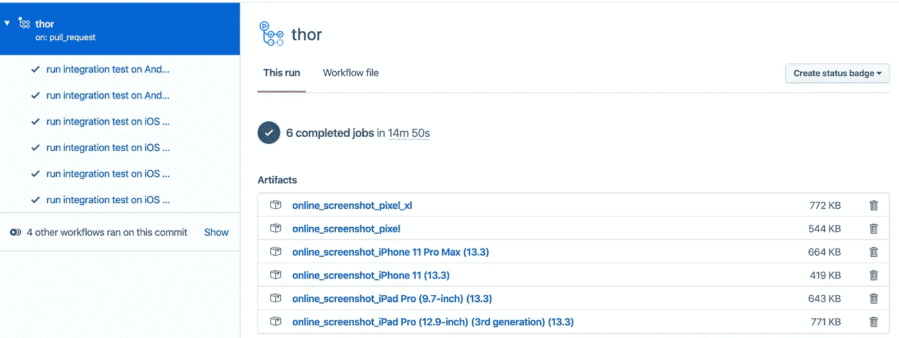

# 用 GitHub Actions 测试 Android 上的 Flutter 应用程序

> 原文：<https://betterprogramming.pub/test-flutter-apps-on-android-with-github-actions-abdba2137b4>

## 满怀信心地交付跨平台应用

乔纳森·肯珀在 Unsplash[拍摄的照片](https://unsplash.com/s/photos/android?utm_source=unsplash&utm_medium=referral&utm_content=creditCopyText)

在之前的一篇文章中，我讨论了如何使用 GitHub Action 在 iOS 设备上测试 Flutter 应用程序:

 [## 使用 GitHub 操作端到端监控您的 Flutter 应用程序的健康状况

### 详细的指南

medium.com](https://medium.com/better-programming/monitor-your-flutter-apps-health-end-to-end-with-github-actions-8a9fb1889c6a) 

然而，由于 Android 设备种类繁多(例如折叠屏和双屏)，测试 Android 设备也是有意义的。

*注:我借用了我的边项目* [*的代码，迷你驴*](https://medium.com/minidonkey101/hooray-mini-donkey-is-here-82161aa948c9) *，一个帮助做加密隐写以保护隐私的实用程序。了解如何将代码应用到实际项目中的更多细节。请查看* [*资源库*](https://github.com/tianhaoz95/photochat) *。*

# 1:构建环境

我们可以用 Java 8 搭建一个环境，用下面的 GitHub 动作配置在 macOS 上 Flutter:

有几个问题:

*   模拟器运行的平台必须是“MAC OS-latest”——其他类型的容器不支持 Android 模拟器所需的加速器虚拟化。
*   Java 版本必须是 8，因为 Java 9+和 Android SDK 管理器二进制文件有一个错误。

# 2:定义感兴趣的设备矩阵

定义好环境后，我们可以使用以下配置列出想要验证我们的 Flutter 代码的设备:

注意:随意添加更多设备，根据 [android emulator runner](https://github.com/marketplace/actions/android-emulator-runner) ，可以使用`avdmanager list`找到支持设备的完整列表。

# 33:启动模拟器并运行集成测试

为 Android Emulator Runner 动作提供一个 Flutter 集成测试脚本将加速我们的测试:

# 4:坐下来喝杯咖啡

万岁！下面快速浏览一下我们的设备测试矩阵:

信用:样品 CI/CD 结果来自[天昊 95/photochatapp](https://github.com/tianhaoz95/photochat)

## 感谢阅读！

特别感谢[杨](https://github.com/ychescale9)和[瑞奇](https://github.com/rngadam)打造[安卓模拟器 Runner Action](https://github.com/marketplace/actions/android-emulator-runner) 。