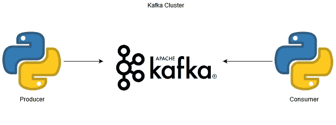

# 用 Python 测试您的 Kafka 集群

> 原文：<https://betterprogramming.pub/test-your-kafka-cluster-with-python-5acaff78f5b3>

## 构建您自己的生产者/消费者来确保您的集群是健康的


照片由[拉蒙·萨利内罗](https://unsplash.com/@donramxn?utm_source=medium&utm_medium=referral)在 [Unsplash](https://unsplash.com?utm_source=medium&utm_medium=referral) 上拍摄

如果像我一样，您是一名开发人员，您有时需要部署新的中间件版本(可能出于安全目的或者使用一些新功能，等等。).但是，如果这些新版本与您以前的配置不兼容，会发生什么情况呢？

基于这一观察，我们实现了一些自动化测试，每次构建新的中间件版本时都会运行这些测试。

这是我和阿帕奇·卡夫卡一起做的。卡夫卡有点敏感，不容易管理。一旦你有了一个稳定的产品版本，你会在升级之前三思而行。DevOps 思维方式的一大优点是它可以应用于如此多的用例:代码交付、基础设施交付、安全补丁、法规遵从性等等。

提醒一下，为了传播 Kafka 集群的目标，我们假设 Kafka 集群是一个实时的大量数据流。数据存储在我们称之为*的主题*中，并由*消费者*消费。



说明我们将在本文中构建什么

在您的构建过程之后，为了测试您的 Kafka 集群，构建您自己的生产者/消费者系统来验证您的集群是否工作是非常好的。

为了实现这一点，我们将使用 Python(像往常一样)，以及[Kafka-Python](https://pypi.org/project/kafka-python/)(pip-install)库。该脚本的一个先决条件是，您的 Kafka 集群必须允许您动态创建主题(即，在您的 Kafka `server.properties`中，设置`auto.create.topics.enable`必须设置为`true`，这是默认值)。)

我们将在这里创建:

*   将在主题中插入一个数字值(它可以是固定值或随机值；这取决于你。)
*   将尝试使用所有插入消息的使用者
*   一个报告生成器，它将把一个包含测试结果的文本文件上传到 S3(假设您的集群在 AWS 中)

注意:我的脚本通过 GitLab 管道启动，我使用`sys.exit`函数向我的操作系统返回一个退出代码。这允许我在我的管道中有一个成功或失败的作业。

首先，我们加载所有的依赖项:Kafka、`datetime`、 [Boto3](https://boto3.amazonaws.com/v1/documentation/api/latest/index.html) (AWS SDK)、OS 和 sys。

然后，我们声明一些将在整个程序中使用的基本设置:

*   `client` —您的 Kafka 集群端点的 URL(这里我有三个节点。)
*   `topic` —要创建的主题名称，您的测试数据将被注入和使用
*   `nbrrecords` —要注入多少条记录
*   `nbrrecordsinserted` —从 0 开始
*   `nbrrecordsretreived` —用 0 初始化
*   `now` —当前时间戳
*   `S3client` —将我们的结果上传到 S3 存储桶

这里第一个也是唯一的功能是生成我们的报告。它将在文件中打印出要插入、插入和消耗的记录数。简单，基本。

这里我们从制作人开始。您需要初始化一个 KafkaProducer 对象，将集群连接字符串作为参数。

然后，我们向我们的集群中插入一条消息“str(i) + Is my cluster working ”,用于每个插入的项目，其中 I 是一个从 1 开始的变量，表示要插入的记录数。

如果在此过程中出现问题，我们会捕捉异常，生成失败报告，并将其上传到 S3。

第一部分迅速而有效。现在，您应该已经在集群中插入了一些数据。现在该用 KafkaConsumer 对象来读取(消费)它们了。

第一部分和制作人很像。我们初始化一个消费者对象，并为它分配要解析的主题分区和 Kafka 集群连接字符串。

我们还要求消费者从头开始，我们收集存储在主题中的最新值。这将用于退出我们的消费者`for`循环。(如果你不这样做，你的消费者将会无休止地等待新消息的到来——这不是我们想要的)。

在整个读取过程中，我们递增变量以了解已经读取了多少条消息。这里的一个改进是实现一个 try/except 块来处理在`for`循环中的消息消耗失败。

有趣的是有时候你仅仅通过写一篇文章就能看到自己的错误(/facepalm)。

在 try/except 块之后，我们将最终结果上传到 S3。

```
if nbrrecordsinserted == nbrrecordsretreived:
  sys.exit(0)
else:
  sys.exit(1)
```

最后，为了正确地退出脚本，我们检查是否所有的消息都被我们的流程使用了。如果是，我们说剧本成功了，如果不是，我们认为是 KO。

如果你想使用代码，整个要点可以从获得。

请在下面的评论中提出任何建议；非常感谢。

我希望你们喜欢这个快速教程。下一篇文章再见。