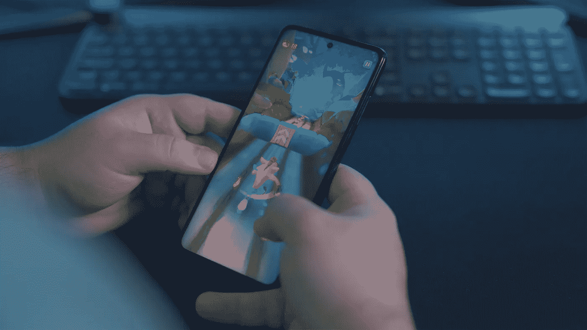
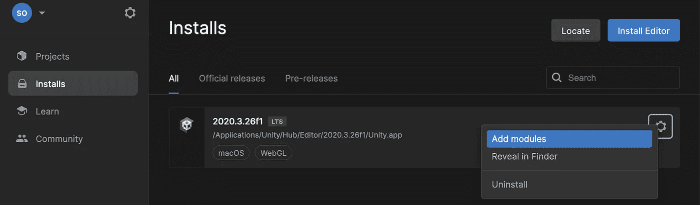
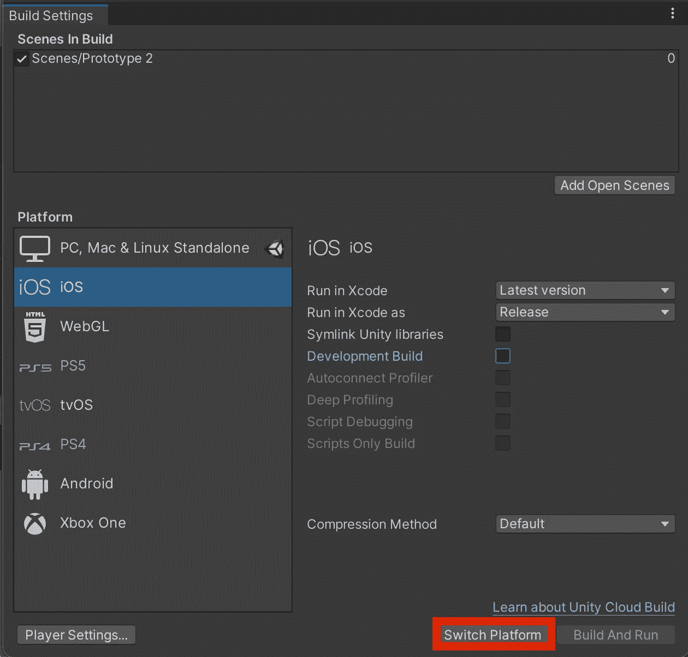
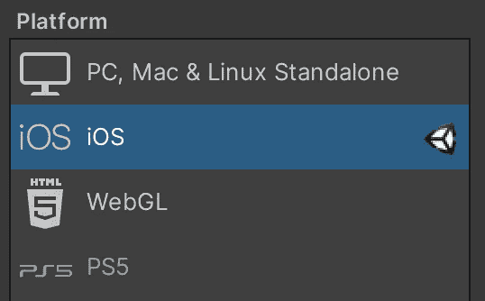
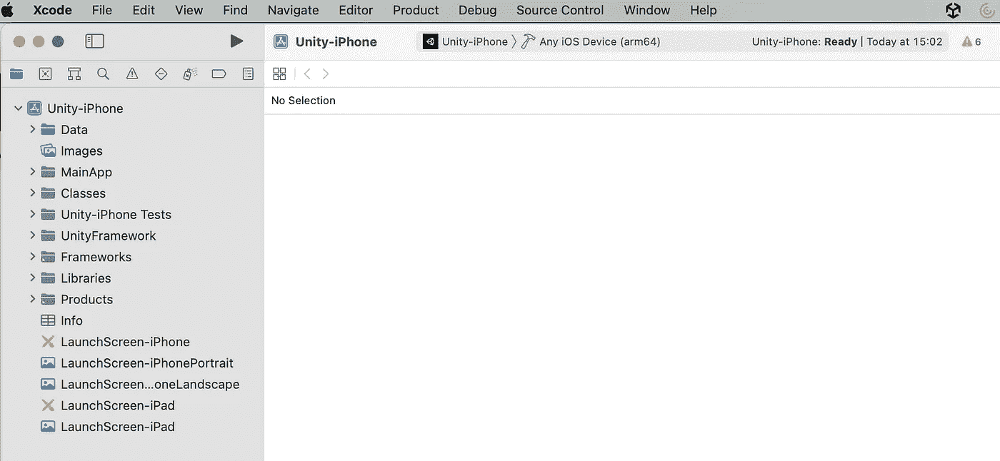
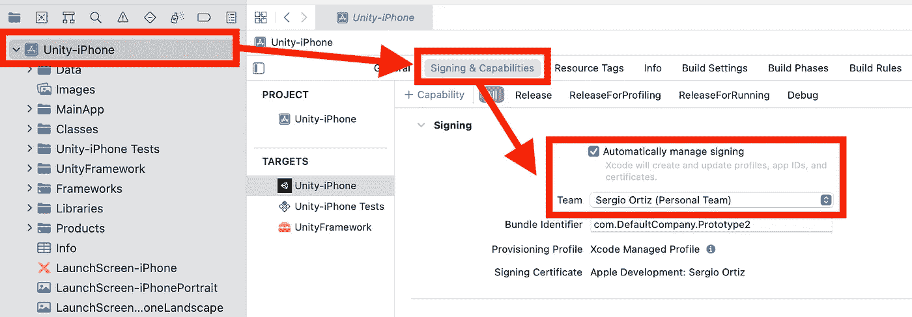
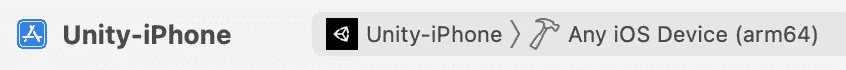
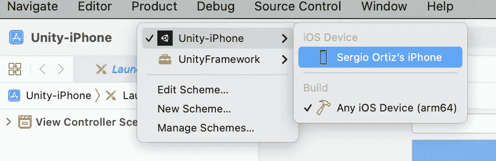
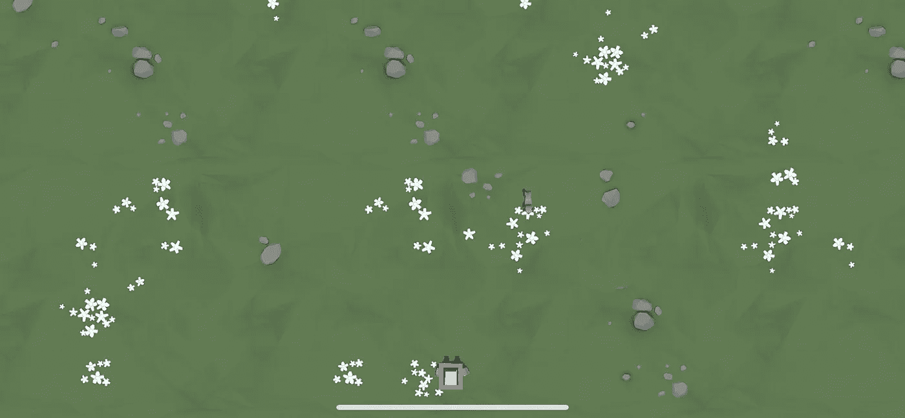

# 如何在没有开发者账号的 iOS 设备上测试 Unity 游戏

> 原文：<https://betterprogramming.pub/test-your-unity-game-on-an-ios-device-without-a-developer-account-ac256fb00a1>

## 在 iOS 上测试您的手机游戏，无需花费 99 美元

照片由 [Unsplash](https://unsplash.com/s/photos/mobile-game?utm_source=unsplash&utm_medium=referral&utm_content=creditCopyText) 上的 [Onur Binay](https://unsplash.com/@onurbinay?utm_source=unsplash&utm_medium=referral&utm_content=creditCopyText) 拍摄。

如果你开始在 Unity 上开发手机游戏，你首先想到的问题可能是如何在你的 iOS 设备上玩游戏。你在网上找到的大多数文献(包括 Unity 文档)都会要求你拥有一个 99 美元/年的苹果开发者账户，并为你的游戏生成证书。

幸运的是，有一种方法可以测试你的游戏，而不需要开发者帐号，你只需要一个苹果 ID。当然，你稍后将需要一个开发者帐户来在应用商店中发布你的游戏，但是我们需要开发游戏；-).

事不宜迟，让我们在 iOS 上测试一下我们的 Unity 游戏吧！

# 先决条件

我假设你对 Unity 和 Xcode 有基本的了解。对于本教程，我有以下内容:

*   马科斯·蒙特雷
*   团结 LTS 2020.3
*   Xcode 13
*   一台装有 iOS 15 的 iOS 设备

您还应该有一个想要导出的游戏。如果你没有，你可以从[这里](https://github.com/serchazo/UnityPrototype)下载一个(免责声明:这个游戏是按照[这个官方 Unity 教程](https://learn.unity.com/tutorial/week-2-basic-gameplay-may-24-28)的说明制作的，不准备在手机上玩，但是对于这个教程来说已经足够了)。

# 安装 iOS 构建器模块

首先，我们需要能够在 iOS 上构建我们的 Unity 游戏。打开 Unity Hub 并选择安装。选择您的 LTS 版本，单击版本名称右侧的齿轮图标，然后选择 Add Modules。

在添加模块窗口的平台下，激活 **iOS 构建支持**并选择**安装。**

模块将开始安装，这可能需要几分钟时间，具体取决于您的计算机。安装完成后，重启 Unity(无需重启 Hub)。

# 为 iOS 构建您的游戏

打开 Unity，进入文件>构建设置，选择窗口**底部的**切换平台**。**

Unity 将开始进行切换，一旦完成，Unity 图标将出现在 iOS 图标旁边，构建选项将被激活。

选择**构建**，系统会提示您保存文件的位置。注意:为导出选择一个空文件夹或创建一个新文件夹，此文件夹的所有内容将被覆盖。

# 在 Xcode 上进行必要的调整

Unity 完成构建后，转到之前选择或创建的文件夹，找到。 *xcodeproj* 文件，双击打开。Xcode 打开并索引文件可能需要几分钟时间。

神奇！你的游戏在 Xcode 上。但是我们还没有完成。

我们快到了！我们仍然需要修改 Xcode 上的应用程序的签名，以便我们可以在我们的设备上玩游戏。

选择项目名称，在我的例子中是`Unity-iPhone`，转到“签署&功能”。选择“自动管理签名”。选择此选项后，团队菜单将可用。选择与您的 Apple ID 帐户关联的团队。

# 连接您的 iOS 设备并测试您的游戏

该玩了！将您的 iOS 设备连接到 MacBook。

在 Xcode 窗口的顶部，您会看到您的应用程序和目标设备的名称，它会首先显示“任何 iOS 设备(arm64)”作为设备名称。

点击设备名称并选择您 iOS 设备。

按下`Command + R`来建立和运行你的游戏！你都准备好了！

我希望这有所帮助。这当然是最容易的部分，你仍然需要确保你的游戏*实际上*可以在 iOS 上运行，但至少现在你知道如何在实际设备上测试你的游戏。