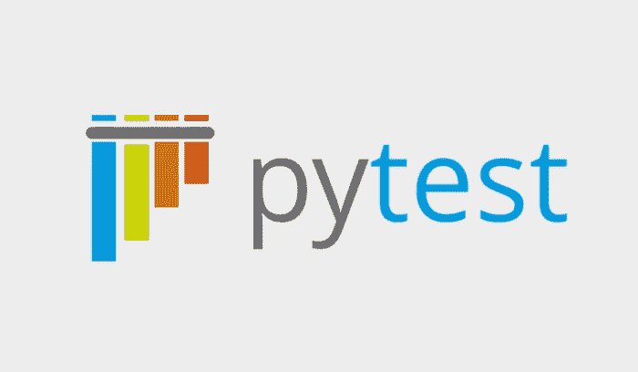

# 用 Pytest 测试 Django 应用程序

> 原文：<https://betterprogramming.pub/testing-a-django-application-with-pytest-3615df7e81f8>

## 使用 Pytest 向 Django polls 应用程序添加测试



# 议程

在这篇文章中，我们将学习如何在 Django 中使用`pytest`。

我们将为 Django polls 应用程序编写测试。

Polls 应用程序是 Django 的官方入门教程。因此，我们选择它而不是别的。

# 设置

我们用的是 Python 3.10 和 Django 4.0。

民意测验教程由六部分组成。我们将为每个部分添加测试。

下面介绍一下完成 [part 1](https://docs.djangoproject.com/en/4.0/intro/tutorial01/) 后的第一个测试。

我们已经建立了一个 Github 库来跟踪我们的代码。我们在[提交](https://github.com/akshar-raaj/polls/commit/58b135c814591bdb528618a23061628cab821499)中完成第 1 部分。

现在，您应该已经完成了本教程的第 1 部分，并且应该能够访问它了。

```
http://localhost:8000/polls/
```

我们需要安装`pytest`来运行测试。发出以下命令:

```
$ pip install pytest
```

注意`$`是命令提示符，实际命令是`pip install pytest`。

有了这个，你应该可以从终端发出`pytest`命令。

```
$ pytest
```

它应该给出类似于以下内容的输出:

```
=============================================================
test session starts =============================================================

platform darwin -- Python 3.10.4, pytest-7.1.2, pluggy-1.0.0

rootdir: /Users/akshar/Play/Python/Djangos/mysite

collected 0 items

=============================================================
no tests ran in 0.00s =============================================================
```

我们需要为 pytest 安装插件`pytest-django`，以便能够运行 Django 应用程序的测试。发出以下命令:

```
$ pip install pytest-django
```

在 pytest 可以从 Django 项目运行测试之前，它需要设置 Django 项目。因此它需要知道 django 设置模块的路径。

这可以通过添加环境变量`DJANGO_SETTINGS_MODULE`来设置。

```
$ export DJANGO_SETTINGS_MODULE=mysite.settings
```

让我们通过发出命令`pytest`来尝试运行测试。

```
$ pytest
```

它应该输出如下所示的内容:

```
=============================================================
test session starts =============================================================

platform darwin -- Python 3.10.4, pytest-7.1.2, pluggy-1.0.0

django: settings: mysite.settings (from env)

rootdir: /Users/akshar/Play/Python/Djangos/mysite

plugins: django-4.5.2

collected 0 items

===============================================================
warnings summary ===============================================================

../../../../.pyenv/versions/3.10.4/envs/pyenv3104/lib/python3.10/site-packages/django/conf/__init__.py:229

      /Users/akshar/.pyenv/versions/3.10.4/envs/pyenv3104/lib/python3.10/site-packages/django/conf/__init__.py:229: RemovedInDjango50Warning: The USE_L10N setting is deprecated. Starting with Django 5.0, localized formatting of data will always be enabled. For example Django will display numbers and dates using the format of the current locale.

warnings.warn(USE_L10N_DEPRECATED_MSG, RemovedInDjango50Warning)

-- Docs: https://docs.pytest.org/en/stable/how-to/capture-warnings.html

===============================================================
1 warning in 0.06s ===============================================================
```

您会注意到输出包含`django-4.5.2`。因此`pytest`意识到我们正在 Django 项目中运营。

您还会注意到输出有`django: settings: mysite.settings`(来自 env)。

因此`pytest`能够找到 Django 设置模块，并且应该能够设置 Django 项目。

但是，从输出中收集的 0 个项目来看，似乎没有运行任何测试。

让我们添加第一个测试。Django 会在添加应用程序投票时创建一个文件`polls/tests.py`。让我们把测试放在同一个文件中。

下面我们给`polls/tests.py`补充一下内容。

```
def test_one():

    assert 1 == 1
```

这里没什么有趣的，因为我们只是断言两个相等的值相等。目前的目标是确保`pytest`能够找到写在这个文件中的测试。一旦我们能够做到这一点，我们将增加更多有趣的测试。

通过发出命令`pytest`尝试再次执行测试。您仍会看到收集的 0 件物品。这是因为`pytest`测试发现期望测试文件名为`test_*.py`或`*_test.py`。它找不到`tests.py`。

参见`pytest`测试发现规则[此处](https://pytest-django.readthedocs.io/en/latest/faq.html#my-tests-are-not-being-found-why)。

因此，我们需要提示`pytest`也在 Django 测试文件中寻找测试。

在项目的根目录下添加一个文件`pytest.ini`，内容如下:

```
[pytest]

python_files = tests.py
```

再次发出`pytest`命令。

```
$ pytest
```

输出应该类似于:

```
=============================================================
test session starts =============================================================

platform darwin -- Python 3.10.4, pytest-7.1.2, pluggy-1.0.0

django: settings: mysite.settings (from env)

rootdir: /Users/akshar/Play/Python/Djangos/mysite, configfile: pytest.ini

plugins: django-4.5.2

collected 1 item

polls/tests.py .
```

从输出中可以明显看出，polls' `tests.py`由`pytest`读取，因此收集了 1 个测试。

可以在[提交](https://github.com/akshar-raaj/polls/commit/ddae02782c6a225013c9604429838a902b1e00c2)时检查运行所需的更改。

# 第 1 部分测试

本教程的第 1 部分介绍了 URL 和相应的视图。点击端点/轮询/返回状态代码为 200 的响应。

我们应该为这个视图添加一个测试，它应该断言调用这个 URL 确实会返回 200 状态代码。

修改 polls/tests.py 以删除之前的测试，即`test_one`。相反，添加另一个名为`test_polls`的测试函数，如下所示:

```
from django.test import Client

def test_polls():

    client = Client()

    response = client.get('/polls/')

    assert response.status_code == 200
```

让我们重新进行测试。

您应该看到测试通过，并有以下类型的输出:

```
=============================================================
test session starts
=============================================================

platform darwin -- Python 3.10.4, pytest-7.1.2, pluggy-1.0.0

django: settings: mysite.settings (from env)

rootdir: /Users/akshar/Play/Python/Djangos/mysite, configfile: pytest.ini

plugins: django-4.5.2

collected 1 item

polls/tests.py .
===========================================================
1 passed, 1 warning in 0.03s
===========================================================
```

让我们假设某个其他开发人员修改了相应的视图，即`polls/views.py`中的索引，并将响应的状态代码设为 201。让我们模仿这种变化:

```
def index(request):

    return HttpResponse("Hello, world. You're at the polls index.", status_code=201)
```

再次执行测试会导致测试失败。因此，测试是为了防止我们意外的变化。

让我们恢复索引视图中引入的更改，以确保测试再次通过。

相关提交在这里是。

# 第 2 部分测试

您应该已经完成了教程的第 2 部分[才能从这里继续。](https://docs.djangoproject.com/en/4.0/intro/tutorial02/)

本教程的第 2 部分介绍了:

*   模型
*   管理

我们想要添加一个测试来确保模型`Question`上的方法`was_published_recently`的行为符合预期。

让我们在`polls/tests.py`中添加以下测试。

```
import pytest

import datetime

from django.utils import timezone

@pytest.mark.django_db

def test_model_question():

    pub_date = timezone.now()

    question = Question.objects.create(question_text="How's the weather?",

                                       pub_date=pub_date)

    assert question.was_published_recently() is True
```

再次执行测试。

```
$ pytest
```

您会注意到输出提到现在收集了 2 个项目。这证明这个新添加的测试也已经被`pytest`选中。

我们可以在`test_model_question`中增加一个断言语句来检查`was_published_recently`是否为`False`。

在`test_model_question`中添加以下额外语句。

```
pub_date = timezone.now() - datetime.timedelta(days=2)

question = Question.objects.create(question_text="How's the weather?",

                                   pub_date=pub_date)

assert question.was_published_recently() is False
```

这个例子介绍了一个名为`mark`的 Pytest 特性。点击阅读更多相关信息[。](https://docs.pytest.org/en/stable/how-to/mark.html#mark)

相关的提交在这里是[T21。](https://github.com/akshar-raaj/polls/commit/6375b7be7cf4219fd3ade2133d0d232caf696c0a)

# 重构

目前，我们所有的测试都在同一个文件中。随着我们逐渐添加更多的测试，管理会变得更加困难。因此，将测试分成不同的模块是有意义的。

让我们将视图测试保存在文件`polls/test_views.py`中。和文件`polls/test_models.py`中的模型测试

让我们创建这两个文件。

```
$ touch polls/test_models.py

$ touch polls/test_views.py
```

让我们从`polls/tests.py to polls/test_views.py`复制视图测试。`polls/test_views.py`应该是这样的:

```
from django.test import Client

def test_polls():

    client = Client()

    response = client.get('/polls/')

    assert response.status_code == 200
```

类似地，将模型测试复制到`polls/test_models.py`。它看起来像这样:

```
import pytest

import datetime

from django.utils import timezone

from .models import Question

@pytest.mark.django_db

def test_model_question():

    pub_date = timezone.now()

    question = Question.objects.create(question_text="How's the weather?",

                                       pub_date=pub_date)

    assert question.was_published_recently() is True

    pub_date = timezone.now() - datetime.timedelta(days=2)

    question = Question.objects.create(question_text="How's the weather?",

                                       pub_date=pub_date)

    assert question.was_published_recently() is False
```

此外，我们需要修改 pytest.ini 以确保新的测试文件可以被`pytest`发现。

```
python_files = tests.py test_*.py
```

相关提交在这里是。

你会注意到我们在`test_model_question`中有两个断言语句。理想情况下，测试应该尽可能的小，并且应该只测试一件事情。因此，我们应该将这个测试分成两个独立的测试函数。

我们也可以使用基于类的方法，将两个测试分组在一个类中。

```
class TestModels():

    @pytest.mark.django_db

    def test_question_published_recently(self):

        pub_date = timezone.now()

        question = Question.objects.create(question_text="How's the weather?",

                                           pub_date=pub_date)

        assert question.was_published_recently() is True

    @pytest.mark.django_db

    def test_question_not_published_recently(self):

        pub_date = timezone.now() - datetime.timedelta(days=2)

        question = Question.objects.create(question_text="How's the weather?",

                                           pub_date=pub_date)

        assert question.was_published_recently() is False
```

这看起来比之前的方法干净多了。

再次执行测试:

```
$ pytest
```

您会注意到在输出中收集了 3 个项目。这里有两个测试来自`test_models.py`，而一个测试来自`test_views.py`。

Pytest 还提供了只运行单个模块测试的能力。让我们只运行模型测试，不要查看测试。

```
$ pytest polls/test_models.py
```

# 第 3 部分测试

您应该已经完成了教程的第 3 部分[才能从这里继续。](https://docs.djangoproject.com/en/4.0/intro/tutorial03/)

本教程的第 3 部分介绍了:

*   视图
*   姜戈奥姆
*   模板

让我们添加以下测试。

*   索引视图必须只返回最近的 5 个问题
*   详细视图为无效 id 返回 404 响应。
*   详细视图为有效 id 返回 200 响应。

因为我们想要对多个视图进行测试，所以将它们分组到一个类下是有意义的。

因此，让我们将之前的测试`test_polls`移到一个名为`TestViews`的类中。此外，我们应该将其重命名为`test_index`,因为视图的名称是一个索引。

```
import pytestfrom django.test import Client class TestViews():
 @pytest.mark.django_db def test_index(self): client = Client() response = client.get('/polls/') assert response.status_code == 200
```

让我们添加另一个测试，以确保索引视图只显示最新的 5 个问题。

```
@pytest.mark.django_dbdef test_index_num_questions(self): """ This test asserts that latest n questions are shown by the index view. :return: """ question_texts = [b'first', b'second', b'third', b'fourth', b'fifth', b'sixth'] for question_text in question_texts: pub_date = timezone.now() question = Question.objects.create(question_text=question_text, pub_date=pub_date) client = Client() response = client.get('/polls/') assert b'first' not in response.content for question_text in question_texts[1:]: assert question_text in response.content
```

我们创建了六个问题实例。`Question`“第一个”是最初创建的，因此不是最近 5 个问题的一部分。因此，它不应该是响应的一部分。

我们现在要为其他视图添加测试，即详细信息、结果和投票。在这一点上，我们有机会看到参数化测试的使用。

我们希望确保视图细节、结果和投票返回状态代码 200。使用当前的方法，我们将不得不再编写 3 个测试`test_detail`、`test_results`和`test_vote`。

它们都只是实例化一个`Client`，执行`client.get(url)`，并断言状态代码是 200。

这增加了重复代码。为了避免重复的代码，我们可以只添加一个测试并用`pytest.mark.parametrize`来修饰它。

让我们添加以下测试函数:

```
@pytest.mark.django_db@pytest.mark.parametrize('url_fragment', ['', 'results/', 'vote/'])def test_detail_views(self, url_fragment): pub_date = timezone.now() question = Question.objects.create(question_text='How you doin? <Joey style>', pub_date=pub_date) client = Client() response = client.get('/polls/{}/{}'.format(question.pk, url_fragment,)) assert response.status_code == 200
```

我们引入了一个新的 pytest 装饰器，名为 pytest . mark . parameterize。

*   `test_detail_views`将被调用三次。
*   在第一次调用中，`url_fragment`将作为空字符串传递。
*   在第二次调用中，`url_fragment`将作为`results/`传递。在这个测试调用中，`url /polls/<question_pk>/results/`将与`client.get`一起使用。
*   在第三次调用中，`url_fragment`将作为`vote/`传递。

因此，可以通过编写一个测试方法来测试所有的 3 个视图。

进行测试。

```
$ pytest
```

之前的测试计数是 4。您会注意到输出中的测试计数现在已经从 4 增加到 7。

因此，`test_detail_views`用不同的参数被调用了三次。每次调用都被视为一次单独的测试。

与这些更改相关的提交在这里是。

# 固定装置

到目前为止，我们还没有使用过夹具。

在多种情况下，某些东西是经常需要的。在我们的例子中，我们需要一个客户端来测试任何视图。

Pytest 有一个 fixture 机制，这样经常需要的东西可以被定义为 fixture，并且可以在任何函数中使用。

`test_index`可以修改成这样:

```
@pytest.mark.django_dbdef test_index(self, client): response = client.get('/polls/') assert response.status_code == 200
```

你会注意到我们如何从方法体中移除了`client = Client()`，并在方法签名中添加了一个名为 client 的参数。

`pytest-django`提供了一个名为 client 的 fixture。无论何时任何 fixture 作为一个参数被添加到测试方法签名中，`pytest`足够聪明地在测试方法调用期间传递那个 fixture。

事实上，我们可以从所有测试方法中移除客户端的实例化，而使用 fixture。

与这些更改一起提交的相关代码在这里是。

# 概述

*   我们熟悉以下内容:
*   Django 项目中的`pytest`入门
*   理解`pytest.ini`文件以配置 pytest
*   熟悉`pytest`标志
*   引入参数化测试
*   引入了`pytest`夹具