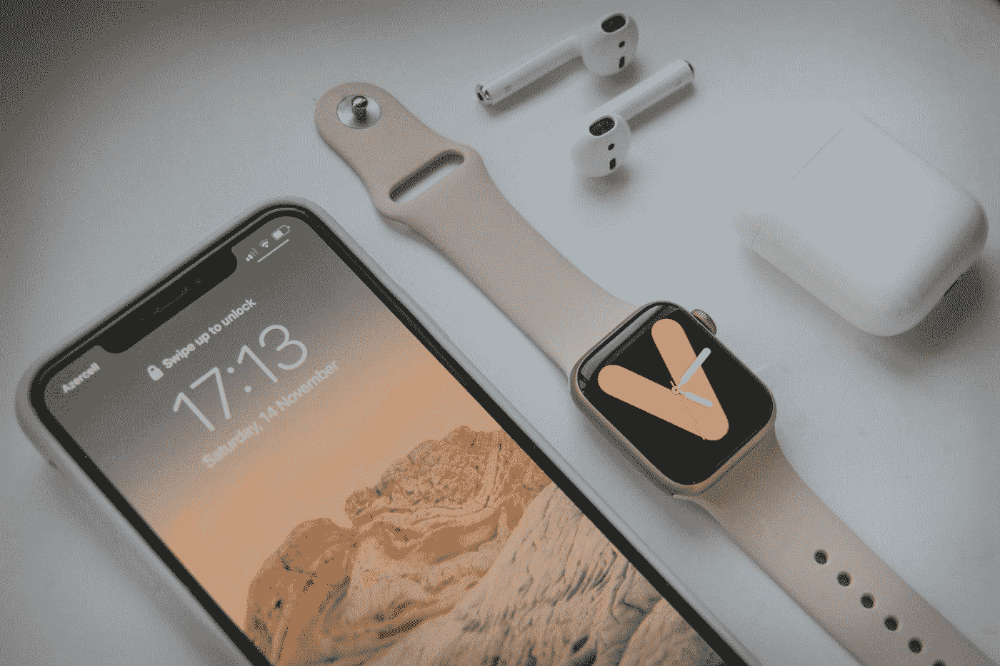

# 使用 Clean 架构测试 SwiftUI + Combine iOS 应用程序

> 原文：<https://betterprogramming.pub/testing-a-swiftui-combine-ios-app-using-clean-architecture-f7dee1ba5342>

## 清洁测试 iOS 应用程序

[拉拉·阿兹利](https://unsplash.com/es/@lazizli?utm_source=medium&utm_medium=referral)在 [Unsplash](https://unsplash.com?utm_source=medium&utm_medium=referral) 上拍照

这是正在进行的文章列表的第二部分。我强烈推荐在继续之前阅读《T21》的第一部分。

# 基本原则

使用 clean 架构测试用 SwiftUI 和 Combine 构建的 iOS 应用程序可以在几个步骤中完成。首先，您需要为您的应用程序创建测试用例。这可以通过使用 Xcode 附带的`XCTest`框架来完成。

一旦您创建了您的测试用例，您就可以使用`AnyPublisher`类型来测试您的应用程序的输出。`AnyPublisher`类型是一个可以产生任何类型输出的发布器，所以你可以用它来测试你的应用程序的`Publisher`的输出

要测试产生`String`值的`Publisher`，可以使用`XCTAssertEqual`方法将发布者的输出与预期输出进行比较。例如:

在上面的代码中，通过使用`sink`方法订阅来测试`publisher`。当发布者产生一个值时，调用`receiveValue`闭包，并使用`XCTAssertEqual`方法将输出与`expectedOutput`进行比较。如果输出与预期输出不匹配，测试将失败。

您可以使用这种方法来测试任何产生`String`值的`Publisher`，并使用`Error`类型发出完成或失败的信号。这是确保应用程序正常运行并产生预期输出的有效方法。

## 概述

这是我们在构建清洁建筑中的最后一个结果:

要测试这个应用程序，您可以使用以下方法:

1.  为领域层中的类编写单元测试，包括`MyViewModel`类。这些测试不应该依赖于表示层或数据访问层中的类，应该验证`MyViewModel`类的业务逻辑和数据操作是否正常工作。
2.  为表示层和领域层中的类编写集成测试。这些测试应该创建`MyView`和`MyViewModel`类的实例，并验证它们能够正确地协同工作，以显示从数据访问层获取的数据。
3.  为数据访问层中的类编写集成测试。这些测试应该创建`DataFetcher`协议实现的实例(比如`NetworkDataFetcher`和`DatabaseDataFetcher`，并验证它们可以正确地从网络或本地数据库获取数据。

# 测试

前面的每一个测试都应该单独运行和编写，以便它们可以独立于其他测试运行和验证。这将确保应用程序的不同层被单独和彻底地测试，并且任何改变或添加都不会破坏现有的测试。

## 视图模型

例如，`MyViewModel`类的单元测试可能如下所示:

在前面的代码示例中，创建了测试用例来测试`MyViewModel`类的功能。`MyViewModel`类负责从`DataFetcher`获取数据，并将其提供给视图。

`MyViewModelTests`类是`XCTestCase`的子类，包含一个名为`testFetchData`的测试方法。该方法用于测试`MyViewModel`类的`fetchData`方法。

`testFetchData`方法创建一个`MockDataFetcher`实例，并使用它来初始化一个`MyViewModel`实例。`MockDataFetcher`是一个模拟对象，在测试中用来代替真实的`DataFetcher`。`MockDataFetcher`有一个`fetchDataResult`属性，用于模拟`fetchData`方法的输出。

接下来，`testFetchData`方法将`MockDataFetcher`的`fetchDataResult`属性设置为一个特定值，并在`MyViewModel`实例上调用`fetchData`方法。这模拟了`DataFetcher`成功获取数据并将其返回给`MyViewModel`的场景。

在调用`fetchData`方法后，`testFetchData`方法使用`XCTAssertEqual`方法将`MyViewModel`的`data`属性与期望值进行比较。如果`data`属性与预期值不匹配，测试将失败。

`testFetchData`方法也使用一个`XCTestExpectation`来等待测试结束。这是必要的，因为`fetchData`方法是异步的，测试在完成输出检查之前必须等待。

通过这种方式，测试用例确保`MyViewModel`可以正确地从`DataFetcher`获取数据，并使其对视图可用。这有助于确保应用程序正常运行并产生预期的输出。

## 视图-视图模型

类似地，`MyView`和`MyViewModel`类的集成测试可能如下所示:

定义了一个`MockDataFetcher`类，这是一个`DataFetcher`类的模拟实现。这个模拟类有一个名为`fetchDataResult`的属性，用于模拟`fetchData()`操作的结果。

`MockDataFetcher`类的`fetchData()`方法被定义为返回一个`AnyPublisher<String, Error>`实例。这意味着调用者可以订阅发布者并异步处理`fetchData()`操作的结果。

在测试用例中，`fetchDataResult`被设置为一个字符串值，并且在一个`MyViewModel`实例上调用`fetchData()`方法。测试用例中没有直接处理产生的`AnyPublisher<String, Error>`实例，但是预计被测试的`MyView`实例将订阅发布者并处理`fetchData()`操作的结果。

然后，测试用例检查`MyView`实例中的标签是否具有预期的文本，这表明`fetchData()`操作成功，并且`MyView`实例能够正确处理操作的结果。

# 结论

这两篇文章的主要目的是分离层。

要使用 clean architecture 和 SwiftUI 分离各层并进行合并，请遵循以下步骤:

1.  确定应用程序中的不同层，例如表示层、域层和数据访问层。
2.  您可以对每个识别的层使用 SPM。例如，为表示层创建一个“表示”包，为域层创建一个“域”包，为数据访问层创建一个“数据访问”包。
3.  将必要的框架导入到每个包中，比如 SwiftUI 和 Combine 用于表示层，Core Data 或 Realm 用于数据访问层。
4.  遵循干净的架构原则，定义每个包的必要类型、协议和类。例如，在领域层定义视图模型、模型和用例，在表示层定义视图和视图控制器。
5.  通过将必要的包相互导入来设置包之间的依赖关系。例如，表示层可能依赖于领域层，而领域层可能依赖于数据访问层。
6.  测试应用程序以确保各层正确分离，并且正确设置了依赖关系。
7.  随着应用程序的增长和发展，不断重构和改进架构。

感谢阅读。