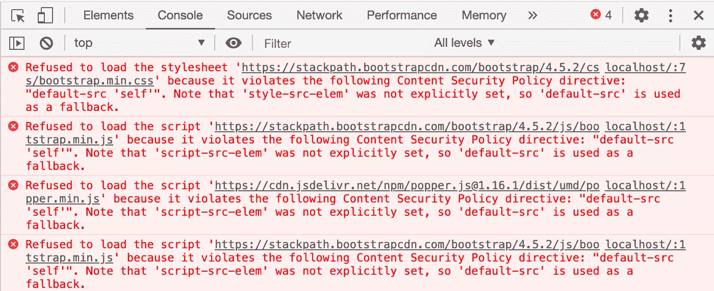

# 使用 Nightwatch 和 Express 测试内容安全策略头

> 原文：<https://betterprogramming.pub/testing-content-security-policy-headers-with-nightwatch-and-express-5a62c5329ba8>

## 立即提高您的 Express 应用程序的安全性

由[欧文·史密斯](https://unsplash.com/@mr_vero?utm_source=medium&utm_medium=referral)在 [Unsplash](https://unsplash.com?utm_source=medium&utm_medium=referral) 上拍摄

我的团队最近开始在我们的网站上实施 CSP。当我们开始构建配置时，我们意识到我们是在手动测试，我们的反馈循环没有我们希望的那么小。我们决定创建一些测试，这样我们就不必在更改内容后重新测试所有不同的页面。

这个故事讲述了我们如何使用一个示例应用程序测试 CSP 报头的一些关键部分，这个示例应用程序可以在[这里](https://github.com/HarryEMartland/testing-csp-example)找到。

# 内容安全策略标题

内容安全策略(CSP)头允许页面指定可以从何处加载外部资源。该报头的主要目标是减轻 XSS 攻击。标题由许多“指令”组成，这些指令使您可以对页面可能加载的各种类型的资源进行粒度控制，例如图像、CSS 和 javascript。Mozilla 在 header [这里](https://developer.mozilla.org/en-US/docs/Web/HTTP/CSP)有一些很棒的文档。

实际上有两个 CSP 报头，`Content-Security-Policy`和`Content-Security-Policy-Report-Only`。报告标头不会强制实施策略和阻止资源，而是允许您收集将被阻止的资源的信息。两个标题中的一个选项是提供报告 URL。当发生违规时(或者如果使用了报告头，就会发生违规)，一个 JSON 有效负载将被发送到报告 URL，其中包含有关被阻止内容的信息。对于本文的其余部分，使用哪个头并不重要，因为它的工作方式是一样的。

如果 CSP 报头配置不正确，可能会导致大量功能停止工作。CSP 能够阻止 JavaScript 和 CSS 等资源的加载。在 CSS 的情况下，这可能会使你的网站完全不可读，或者如果 JavaScript 被阻止，会使交互功能没有响应。

即使启用了仅报告，如果 CSP 配置错误，也可能导致大量流量被发送到报告端点。根据此端点的托管位置，如果无法处理负载和/或在报告数据存储方面花费大量资金，它可能会关闭您的网站。

# 守夜

[Nightwatch](https://nightwatchjs.org/) 是一个可以使用真实浏览器测试网站的测试框架。为了测试 CSP，我们可以看到浏览器如何处理我们的头。夜视可以在实时或预生产环境中使用。在我们的例子中，我们将在本地启动我们的应用程序。这允许我们在部署或事件提交到版本控制之前运行我们的测试。

关于夜巡的更多信息，请查看他们的[入门指南](https://nightwatchjs.org/gettingstarted)。

# 测试

下面的摘录显示了我们的 CSP 测试是如何设置的。该测试正在加速我们的整个应用程序，因此我们可以对其进行测试。在顶部，我们需要输入`http`，这样我们就可以启动一个服务器，然后我们需要输入我们的实际应用。Nightwatch 在其生命周期中为我们提供了一些方便的钩子。before 钩子在所有测试之前运行一次，这里我们为我们的应用程序启动一个服务器。接下来，我们注册一个 after 钩子，以便在所有测试完成后关闭服务器。

可以通过检查浏览器返回的日志来测试违规情况。在下面的例子中，我们打开应用程序的根页面，等待主体可见，然后检查是否有日志。我们过滤返回的日志，所以如果页面有其他日志，他们不会给我们假阴性。如果发现任何安全日志，就会抛出异常，导致测试失败。

只有 Chrome 支持从浏览器获取日志。Nightwatch 允许你配置可以使用不同浏览器的不同环境。在`package.json`文件中，我们通过设置参数`-e chrome`在运行这些测试时启用了 chrome 环境。

*完整的测试可以在* [*这里找到*](https://github.com/HarryEMartland/testing-csp-example/blob/master/test/nightwatch/app.nightwatch.js) *。*

到目前为止，我们已经测试了我们的应用程序仍然可以使用我们的新 CSP 头，但是我们还没有测试 CSP 是否真的阻塞了资源。因为我们不想在应用程序中引入仅仅用于测试的页面，所以我们创建了一个特定于测试的应用程序。这个应用程序需要重用相同的 CSP 配置，所以在示例项目中，我们将它提取到它自己的模块[中。然后，这个模块可以在测试应用程序中重用，如下所示。](https://github.com/HarryEMartland/testing-csp-example/blob/master/middleware/helmetConfiguration.js)

下面的文件是 Nightwatch 测试的一个片段，展示了我们如何为测试创建一个测试应用程序。该测试现在需要在`express`中进行，并创建一个新的 express 应用程序。然后我们注册一个提供静态内容的中间件，这样我们就可以提供测试 HTML 页面。这些页面可能包含我们想要检查是否被阻止的资源。该测试类似于上面的例子，但是不是在找到日志时抛出异常，而是在没有找到日志时抛出异常。

*满测可以在这里找到***。**

# *测试策略*

*我们将介绍几个场景，说明在实施 CSP 时您可能想要测试的内容。首先，我们将看看一个简单的自包含应用程序，然后我们将看看如何在使用微前端时进行测试，最后我们将看看如何测试 CSP 阻塞资源。*

*在一个简单的自包含应用程序中，您应该已经设置了一些浏览器测试。当运行这些测试时，可以添加一个如上的额外断言来检查是否有任何 CSP 违规。这使您确信应用程序在启用 CSP 的情况下仍能正常工作，并检查没有脚本在后台被阻止。*

*当使用微前端时，网关可能负责设置报头。在这种情况下，您不需要测试任何真实的页面，但是您仍然需要测试您的标题。在这种情况下，我们可以创建一些类似于上面违例测试的测试。我们可以创建基本的 HTML 文件，其中包含已知的资源加载示例，并通过 Nightwatch 测试运行它们。这给了我们信心，如果我们改变 CSP 头，我们不会倒退，新的规则正在应用。页面服务的所有者也应该像运行自包含应用程序一样运行浏览器测试，并检查是否违反了 CSP。然后他们可以反馈给网关团队来更改标题。或者，更好的是，网关可以让特定的页面覆盖 CSP。*

*启用 CSP 后，我们的网站仍能正常工作，这一点很重要。然而，如果 CSP 不起作用，就没有什么意义了。我们还应该创建一些包含违反 CSP 的资源的页面，确认如果有人设法注入恶意内容，就会被捕获。在示例项目和测试中，我们只是检查控制台中是否有日志输出，但这可以通过创建一个模拟报告 URL 并检查发送给它的数据来进一步实现。*

*CSP 头是一个复杂的野兽，有能力瘫痪一个网站。通过编写如本文所示的测试，您应该能够满怀信心地发布您的网站和 CSP 正在按要求工作。完整的例子请看这个项目。*