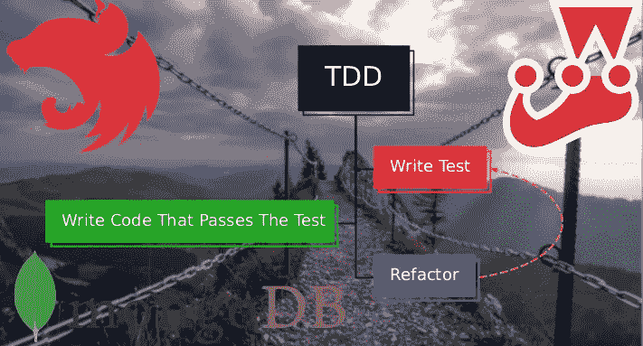
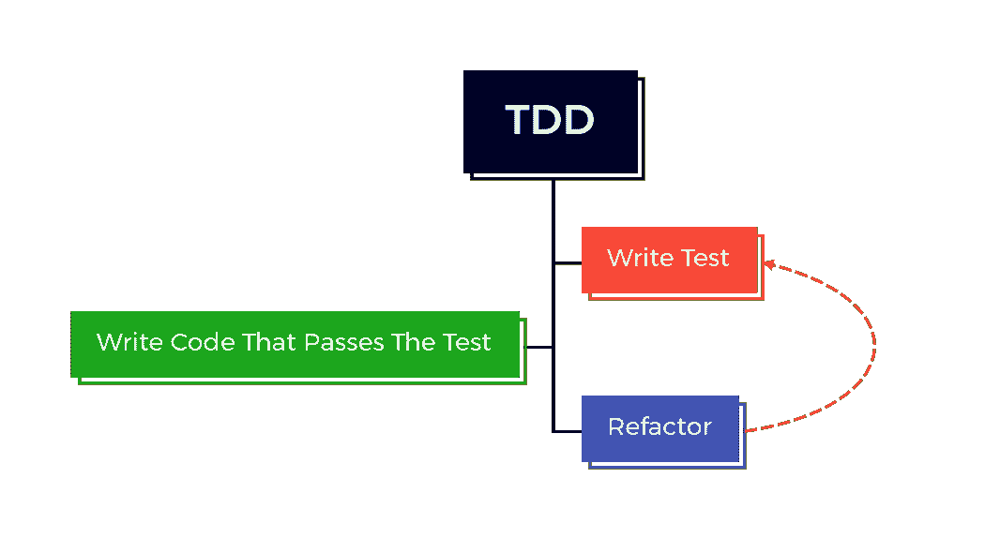
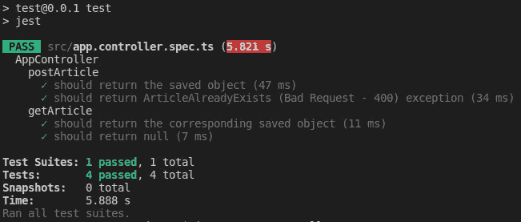
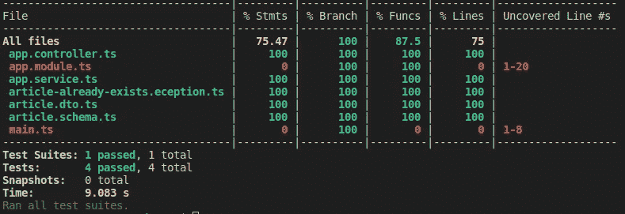

# 用 Jest 测试 NestJS + Mongo 中的控制器

> 原文：<https://betterprogramming.pub/testing-controllers-in-nestjs-and-mongo-with-jest-63e1b208503c>

## 在使用 MongoDB 和 Mongoose 时，如何使用 Jest 为您的 NestJS 控制器规划和编写可靠的单元测试

在本文中，通过示例，您将了解到在使用 MongoDB 和 Mongoose 时，如何使用 Jest 为您的 NestJS 控制器规划和编写可靠的单元测试。这里使用的大多数测试技术都可以在没有 NestJS 的情况下应用，使用其他 DBMS(数据库管理系统)甚至使用 Jest 以外的测试库！这里使用它们是因为它们的相关性以及它们简化了多少工作。

在开始编写代码之前，让我们先快速浏览一下所使用的主要库(用 NPM 安装它们)。

# NestJS

Node.js 框架，用于使用 JavaScript 或更好的 TypeScript 编写服务器端应用程序。 [NestJS](https://nestjs.com/) 通过提供自己的开箱即用的应用架构模式，简化了开发的架构部分，旨在提供可伸缩性、解耦性、易维护性，当然，还有可测试性。NPM 的 NestJS 核心每周下载量持续增长，上周下载量超过 130 万次。

# 蒙戈

我用“mongo”指代[MongoDB](https://www.mongodb.com/)+[mongose](https://mongoosejs.com/)+[MongoDB 内存服务器](https://github.com/nodkz/mongodb-memory-server)。MongoDB 是一个高性能的 NoSQL DBMS，它将数据存储为类似 JSON 格式的文档。Mongoose 是一个 JavaScript 对象建模库，它使得与 MongoDB 的交互更加容易和安全。MongoDB 内存服务器是一个库，它从 Node.js 中以编程方式启动一个真实的 MongoDB 服务器。

# 玩笑

Jest 是一个完整的 JavaScript 测试框架，由 Meta(以前的脸书)开发，关注简单性和性能(例如，测试并行运行)。NPM 的 Jest weekly 下载量持续增长，上周下载量超过 1730 万次。

# 实施目标

我们希望在本指南中实现和测试什么？我们将在 NestJS 控制器中实现并测试两个端点。一个 GET 端点映射到一个名为`*getArticle*`的方法，一个 POST 端点映射到一个名为`*postArticle*`的方法。

这里使用的代码和项目结构被简化，以集中于测试方面。如果您想在更完整的项目环境中看到更多的测试和代码，请参考下面的 GitHub 资源库:

 [## GitHub-vsdepontes/太空飞行-新闻-后端-节点:后端挑战 2021🏅-太空飞行新闻

### 这是由 Coodesh 后端服务为 Coodesh“后端挑战 2021”发起的挑战🏅——太空飞行新闻”。的…

github.com](https://github.com/vsdepontes/space-flight-news-backend-node) 

这是来自库德什的挑战。简单来说，目的是使一个 API 能够接口对航天新闻文章数据库的 CRUD(创建、读取、更新和删除)操作。

# 从哪里开始？

你将如何开始编写代码和测试？如果你已经完成了你的代码，很好！你可以写你的测试。但是我想快速地谈谈一个被称为测试驱动开发(TDD)的良好实践。

在 TDD 中，我们遵循以下三条规则:

1-在编写确保正确行为的单元测试之前，您不应该编写任何生产代码。

2-你不应该写太多的测试，以免失败。

3-你不应该写多于足够通过测试的产品代码。

这些规则引导我们进入以下工作流程:

TDD 工作流程

首先，我们编写测试来确保我们想要实现的算法的正确行为(“使用 *X* 输入，异常、错误或预期结果是 *Y* ”)。然后，我们编写足够通过测试的代码。最后，当我们改进代码时，我们回到第一步，一个循环就产生了。

直接回答题目中的问题，我们就从测试开始。

# 计划测试

这一部分的重要性怎么强调都不为过。如果我们错误地计划我们的测试，我们的代码也会出错，从而使我们浪费时间和精力。

测试应该反映您正在尝试实现的特性/功能的需求。另一个人必须能够知道你的代码接受什么作为输入，它给出什么作为输出，以及它何时以及如何失败。测试是对你的代码最好的文档。

我们的`*postArticle*` 方法必须接收一篇文章作为参数，并返回该文章的已保存版本或一个异常，以防已经保存了另一篇同名文章。`*getArticle*` 方法必须接收一个标题作为参数，并返回带有相应标题或`*null*`的文章。这些是我们将要测试的行为。

*注意:这里我们将使用文章的标题(字符串)作为标识符，但是更好的方法是使用自己的数据库 id(通常是正整数)。*

# 准备基础

## 控制器、模块和服务

要从头开始，您的控制器、模块和服务文件应该如下所示:

当您使用 Nest CLI 创建它们时，NestJS 可能已经在您的控制器和服务文件中放入了一些简单的方法，但是如果是这样的话，请删除它们和它们的依赖项。

## 这篇文章

我们希望将文章保存到数据库中，但是文章到底是什么？我们必须确定文章的结构。

因为我们还想在 MongoDB 数据库中持久化(保存)文章，所以我们必须创建相应的 MongoDB 模式。

## 存根

测试时，我们使用“存根”。这些是我们在测试时将要使用的对象的实例，具有预定义的值。在项目的根目录下创建一个名为“test”的文件夹，并在其中保存一个名为“stubs”的子文件夹，这是一个很好的做法。

因为我们需要一个文章的实例来测试我们的代码，所以让我们创建一个文章存根。

注意，我们正在导出一个名为`*ArticleSTOStub*`的`*ArticleDTO*` 的实例，它具有预定义的值。

## 例外

当有人试图保存一篇标题重复的文章时，我们想要返回一个异常，所以我们写这个异常。

我们将其命名为`*ArticleAlreadyExists*` *，*定义了一个自定义错误消息(“文章已经存在！”)并将 HTTP 响应代码设置为 400(错误请求)*。*

## 数据库连接

为了建立与数据库的连接，我们可以在控制器中做这样的事情:

基本上，我们用`*MongooseModule*`通过`*forFeature*` 方法传递我们的模式，用`*forRoot*` 方法传递 MongoDB 连接 URI。注意，这里我们通过一个环境变量来传递我们的连接 URI，以避免在我们的代码中将其作为字符串公开。

# 编写测试

## 测试文件的基础

首先，让我们创建测试文件。如果 NestJS 已经为您创建了一个，请删除它并跟随我们。在单元测试的情况下，在与要测试的代码相同的文件夹中创建测试文件，并通过附加*来命名它。spec* 带有要测试代码的文件名的后缀。Jest 在默认情况下也需要这些约定。所以，如果控制器被称为`*app.controller.ts*`，测试文件将被称为`*app.controller.spec.ts*`，并且应该在同一个文件夹中。

创建好文件后，让我们开始编写一些代码。

> *第 1 行:我们从* `@nestjs/testing` *中导入了一个名为* `Test` *的类和一个名为* `TestingModule` *的类型。*
> 
> 第 2 行:我们导入了想要测试的控制器。
> 
> *第 3 行:我们导入了控制器使用/依赖的服务。*
> 
> *第 6 行:Jest 中的* `describe` *创建了一个测试块，并让您传递一个字符串作为参数，以表明它们的一般用途。既然我们想测试我们的* `AppController` *，我们就写它吧。*
> 
> *第 7 行:很快，我们将实例化我们的控制器，以便访问它的方法(* `postArticle` *和* `getArticle` *)，但是让我们在这个块的全局作用域中声明它，以便我们可以在任何测试中引用我们的控制器(因为每个测试都是块中有自己作用域的函数)。*
> 
> *第 9 行:Jest 中的* `*beforeAll*` *创建了一个代码块，它将在任何测试之前运行。*
> 
> *第 10–15 行:我们编译我们的应用程序(* `app` *)，传递我们想要测试的控制器和它需要的提供者。*
> 
> *第 16 行:从我们编译的* `app` *中得到我们需要的控制器的实例(* `appController` *)。*

如果您在您的终端中编写`*jest*`并按回车键运行，您会看到一个错误，但是如果您仔细阅读(总是注意错误消息)，您会发现问题是什么:*您的测试套件必须包含至少一个测试。*

我们确实打下了一些基础，但是我们仍然没有编写任何测试。

## 数据库连接问题

我们不想在测试时搞乱我们的生产数据库。您可以考虑建立一个远程测试数据库，但是这也有几个问题，比如模式结构不匹配、无法离线测试以及在多人使用数据库时缺乏对数据库状态的控制。

最常用的方法是“模仿”与数据库的交互，也就是说，对检索或更改数据所涉及的方法设置预定义的响应，而不真正依赖任何类型的数据库实例。

然而，这种方法通常会很快变得令人困惑，并在测试中增加一层人为因素。更好的方法是在您的 RAM 中运行一个随需应变的专用数据库实例进行测试。这就是我们将要对`*MongoDBMemoryServer*`做的事情。

> *第 17 行:我们创建一个新的 MongoDB 服务器并获得守护进程(* `mongod` *)*
> 
> *第 18 行:我们获得了刚刚启动的 MongoDB 服务器的连接 URI*
> 
> *第 19 行:我们使用 URI 连接并获得到 MongoDB 服务器的连接*
> 
> *第 20 行:通过连接，得到我们想要操作的模式的模型(* `Article` *)*
> 
> *第 25 行:我们提供了我们的* `Article` *模式模型，类似于我们之前在* `*app.module.ts*` *中所做的。这里的区别只是这个模型来自我们的临时 RAM 数据库，而不是来自由* `*MONGODB_CONNECTION_URI*` *环境变量指定的真实数据库。*

现在，让我们从 Jest 添加两个更多的块，`*afterAll*`和`*afterEach*`。

> *第 31–35 行:在这里，我们说在我们所有的测试都运行之后，我们必须删除数据库，关闭连接并停止守护进程。*
> 
> *第 37–43 行:现在，我们说在每个单独的测试之后，我们将从我们的集合中删除所有条目(文档/数据)。在这种情况下，我们只有一个集合(用于文章)，但是将它变得更加通用是一个很好的实践。想法是总是从一个干净的数据库开始测试。*

## 测试文章后

现在，我们终于能够为`*postArticle*`方法编写一批测试了。记住，这个方法必须接收一篇文章作为参数，并返回文章的保存版本或一个异常，以防已经保存了另一篇同名的文章。

为了创建一批测试，我们使用 Jest 中的一个`describe`块和一个或多个`it`块。一个`it`块对应于一个特定的测试场景，并且应该在其末尾调用`expect`函数来检查验证测试的条件。

基于我们的需求，我们可以考虑两个简单的测试场景。

1-文章是有效的，应该没有任何问题地保存。

2 —文章标题重复，应抛出异常。

我们将用两个`it`块为`postArticle`方法编写一个`describe`块，每个测试一个。

> *第 49 行:我们将文章存根传递给* `postArticle` *方法，并获取返回的已创建文章。*
> 
> *第 50 行:我们使用* `expect` *函数来检查创建的文章的标题是否等于我们传递来保存的文章的标题。* `toBe` *方法指定了我们想要执行的逻辑比较。有很多不同的方法进行各种检查。如果该表达式返回除* `true` *之外的任何内容，则测试被视为失败。*
> 
> *第 53 行:这里，我们使用 mongoose 将文章存根保存在数据库中(注意，我们使用的是* `articleModel` *)。我们可以使用我们的* `postArticle` *方法来保存文章存根，但是该方法可能包含比简单保存更多的逻辑，因此当我们只是想在数据库中放些东西时，会引入更多的不确定性。*
> 
> *第 54–56 行:这里，我们使用* `postArticle` *方法，尝试保存数据库中已经存在的一篇文章，因为我们在上面的行中保存了它，并检查是否会抛出预期的异常。* `rejects` *方法用于处理被拒绝的承诺，而* `toThrow` *方法检查错误是否是* `ArticleAlreadyExists` *的实例。*

记住`*postArticle*` 仍然不存在，所以你的 IDE 可能会警告你，如果你试图运行测试文件，你也会得到相关的错误。然而，要意识到现在我们已经知道了方法必须如何运行，并且我们有一个简单的方法来检查它并展示给其他人。

## 测试物品

`*getArticle*`方法必须接收一个标题作为参数，并返回具有相应标题的文章或返回`*null*`。

基于我们的需求，我们可以考虑两个简单的测试场景。

1 —找到并返回具有相应标题的文章。

2 —没有相应标题的文章，应返回`*null*`。

让我们编写测试。

> *第 62 行:再次强调，这里不要使用* `postArticle` *方法来保存文章，这一点很重要。如果您在这里使用了它，并且在* `postArticle` *方法中发生了错误，测试将会说在测试* `getArticle` *时发生了错误，这使得事情更加混乱。总是试图隔离你正在测试的东西。*
> 
> *第 63 行:这里我们使用* `getArticle` *来搜索我们之前保存的文章的标题并存储返回。*
> 
> 第 64 行:现在，我们检查找到并返回的文章标题是否与我们保存的文章标题相同。
> 
> *第 67 行:在没有事先将任何内容保存到数据库的情况下(记住，* `afterEach` *方法会在每次测试后清空数据库)，我们尝试通过文章的标题来查找文章。*
> 
> *第 68 行:我们使用* `toBeNull` *检查对象文章是否如预期的那样是* `null` *。*

# 实现这些方法

既然测试已经完成，我们应该编写足够的代码来通过测试，因为通过测试意味着功能是完整和准确的。

本文的重点是测试，所以不会有太多关于方法本身实现的解释。

# 运行测试

现在，当您在终端中执行`*npm test*`时，所有的测试都应该运行并顺利通过。

要查看测试覆盖率，使用`*npm run test:cov*` *。测试覆盖结果显示了你的所有测试测试了多少代码，并且是代码质量的一个很好的度量。*

为了让您的测试在您修改代码时自动运行，请使用`*npm run test:watch*`。还有一些有用的 VS 代码扩展来帮助你跟踪你的测试执行，比如来自“Orta”的“Jest”扩展。

# 最终考虑

这绝不是对 Jest 或 TDD 的详尽回顾，但我真的希望您能在这里找到有用的东西。读完这篇文章后，我建议看一下 [Jest 文档](https://jestjs.io/docs/getting-started)以获取更多信息。

感谢阅读。