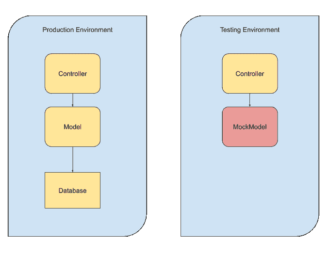

# 测试 Flutter 应用程序:建立对代码的信心，更快地迭代

> 原文：<https://betterprogramming.pub/testing-flutter-apps-build-confidence-in-your-code-and-iterate-faster-450ea52b2068>

## 测试从未如此简单


由 [SpaceX](https://unsplash.com/@spacex?utm_source=medium&utm_medium=referral) 在 [Unsplash](https://unsplash.com?utm_source=medium&utm_medium=referral) 上拍摄的照片。

Flutter 是一个跨平台的应用程序开发框架。但是没有一个全面的测试套件，任何应用程序都是不完整的。在这篇文章中，我将告诉你单元测试和小部件测试 Flutter 应用程序的基本原理，以及模仿依赖性。

# 为什么要测试？

开发任何严肃的软件项目时，测试都是至关重要的。有了一个好的测试套件，您可以对代码的任何部分进行修改，而不用担心这会破坏任何东西。如果系统运行正常，您可以随时运行测试，并在几分钟内获得答案。

作为一名开发人员，如果你不测试你的代码，你怎么能期望你的客户测试它呢？

# 单元测试

我们将从单元测试开始，因为它们是最简单的。值得注意的是，Flutter 清楚地将*单元*测试与*小部件*测试分开。在*窗口小部件*测试断言窗口小部件树并测试 UI 的地方，*单元*测试不应该呈现 UI 并纯粹测试业务逻辑。

要开始测试您的类，您需要将`test`依赖项添加到您的`pubspec.yaml`中:

```
dev_dependencies: 
  test: 
    1.14.4
```

现在让我们创建一个简单的模型类来进行测试:

这是一个简单的类，有两个属性和一个自定义的 getter。现在，在`test`文件夹中创建一个名为`PersonTest.dart`的文件:

这是有史以来最简单的测试示例。首先，在第 1-2 行，我们导入了将要测试的`test`模块和`Person`类。然后，在`main`方法中，我们使用`test`函数定义一个测试。它将接受测试的名称和一个执行测试本身的回调函数。在其中，我们创建了`person`模型和`person.name`将成为`'John Smith'`的`expect`。

`test`包公开了许多可以和`expect`一起使用的断言函数，比如:

```
expect(person, isA(Person)) 
expect(person, isA(String))
```

下面是来自`[matcher](https://pub.dev/documentation/matcher/latest/matcher/matcher-library.html)`模块(内置于`test`)的一些常见断言:

*   `isEmpty`
*   `isList`
*   `isFalse` / `isTrue`
*   `isNaN`
*   `isNull`
*   `throwsException`

现在，如果您尝试运行测试(您可以使用 Android Studio， *Run - > Run tests* )，您将会看到这个测试通过了。干得好！

# 小部件测试

单元测试非常简单:执行动作，断言结果。当 UI 发挥作用时，一切都变得复杂了。让我们再写一个最简单的例子:一个显示你的名字的小部件。我们将确保它正确渲染，并在屏幕上显示您的姓名。

首先，让我们创建小部件。将以下内容添加到您的`main.dart`文件中:

这里应该没有什么令人惊讶的——只是一个需要命名参数`name`的无状态小部件。完成后，在`test/main_test.dart`中添加测试代码:

您可以看到，我们没有导入`test`包，而是导入了`flutter_test`包。为了让它工作，确保你的`pubspec.yaml`中有这个:

```
dev_dependencies: 
  flutter_test: 
    sdk: flutter
```

现在，在第 5 行，注意我们如何使用`testWidgets`函数而不是`test`。它为您注入了包含一些渲染所需的 UI 设备的`WidgetTester`对象。它也是异步的，因此回调函数使用了`async`关键字。

在第 6 行，我们用`pumpWidget`函数呈现用户界面。它的行为完全符合您的预期。您只需向它传递一个小部件。之后，我们创建一个*查找器*，用于在 UI 树中查找小部件。我们希望找到具有指定名称的文本框。最后，在第 10 行，我们`expect`说`nameFinder`将`findsOneWidget`。对于其他情况，也可以用`findsNothing`、`findsWidgets`(一个或多个)、或者`findsNWidgets`(确切的说是`n`小部件)来断言。

# 什么是嘲讽？

在测试时，我们主要想检查我们编写的代码*是否有效。特别是对于单元测试来说，我们并不关心互联网是否工作或者数据库是否可用。我们想孤立地检查函数。*

但大多数情况下，不可能得到完全纯的、非依赖的函数。他们将导入其他模块和库，这在测试环境中可能是有问题的或者完全不可能调用的。为了解决这个问题，devs 想出了嘲讽的主意。

模仿是用模仿代替系统的一部分(一个函数，一个导入，任何东西)。模拟看起来就像它所替换的部分，但是它根本不做任何事情。使用 mock，我们能够指定它的返回值和副作用来测试所有可能的场景。此外，我们能够在模拟上断言，这为我们的测试场景增加了另一个维度。



作者照片。

这是一个非常简化的 MVC 应用程序中依赖树的示意图。假设我们要测试*控制器*类，它依赖于*模型*类，后者依赖于*数据库*。由于我们无法在单元测试环境中访问数据库，我们制作了一个名为 *MockModel* 的 mock，它将具有与 *Model* 完全相同的接口，但不会对数据库执行任何操作。

## 添加依赖关系

利用`mockito`库可以模仿，所以您需要将它添加到您的`pubspec.yaml`中:

```
dev_dependencies:
  mockito: 4.1.2
```

查看[发布开发](https://pub.dev/packages/mockito)获取最新版本。

## 模仿 HTTP 调用

模仿的一个常见用例是 API 调用。假设您有一个查询汽车的*汽车 API* 的函数:

在第 5-8 行，我们定义了一个带有单个字段`model`的`Car`模型。我们要测试的函数是`fetchCar`。但是，当然，在每次测试运行时进行 HTTP 调用(您应该经常这样做)是不合适的。

您可能想知道为什么我们将`client`作为参数传递给函数。为什么不在函数本身中创建它呢？嗯，这是`mockito`库的缺点之一。虽然它创建了优秀的模拟，但它不允许您模拟任意的导入。换句话说，您必须通过参数/setter/阿迪解决方案来传递您的 mock，以使它们工作。在这种情况下，TDD 实践变得更加重要，因为您必须将代码设计成从第 1 行就可以测试。

现在，在您的测试文件中，我们可以创建一个模拟客户端:

就这么简单！首先，导入`mockito`和`http`库，然后定义一个包含`extends` `Mock`和`implements` `Client`的类。因此，每个模拟类都必须扩展`Mock`并实现你所模拟的任何类。剩下的就交给我了。现在，测试本身:

我们这里有两个测试:一个测试它是否工作，另一个测试它是否损坏。在第 3 行和第 12 行，您可以看到 mock `client`的创建。那里没什么特别的。然后，在第 5-6 行和第 14-15 行，我们为模拟客户端设置目标行为。我们用这个`);`说`when(`某个动作`).thenAnswer(`。在第一种情况下，我们返回一个有效的响应来检查(第 8 行)函数是否返回一辆汽车。在第二种情况下，我们返回一个 HTTP 500 来检查是否抛出了异常。

# 结束语

在本文中，我解释了测试 Flutter 应用程序的基础。感谢您的阅读。如果你知道任何在 Dart 中嘲讽任意进口的方法，请在评论中告诉我！

# 资源

*   `[test](https://pub.dev/packages/test)` [模块文档](https://pub.dev/packages/test)
*   `[flutter_test](https://api.flutter.dev/flutter/flutter_test/flutter_test-library.html)` [模块文档](https://api.flutter.dev/flutter/flutter_test/flutter_test-library.html)
*   [在颤动中阻塞](https://medium.com/flutter-community/bloc-in-flutter-implement-clean-flux-like-architecture-e8af2869bcc0)