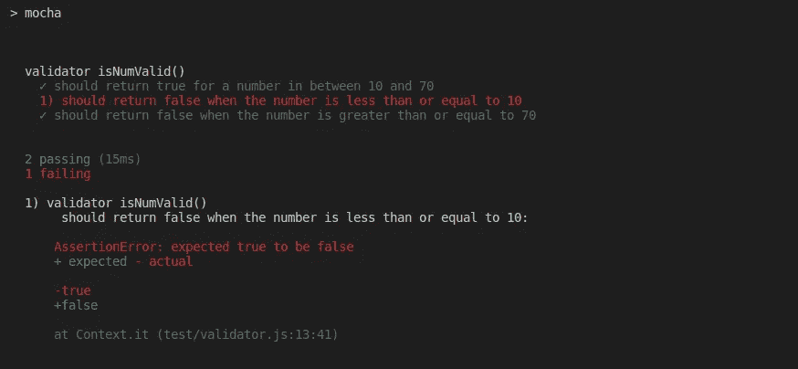

# 使用 Mocha 和 Chai 在 Node.js 中进行测试(第 1 部分)

> 原文：<https://betterprogramming.pub/testing-in-node-js-using-mocha-and-chai-part-1-d5a9e91f4b06>

## 设置您的测试并开始运行


马特·阿特兹在 [Unsplash](https://unsplash.com?utm_source=medium&utm_medium=referral) 上拍摄的照片

Node.js 在 npm 上有许多包，使得编写测试的过程更加容易。在本教程中，我们使用两个最流行的节点模块进行测试: [Mocha](https://mochajs.org/) 和 [Chai](https://www.chaijs.com/) 。

Mocha 是这个测试套件中的主要测试框架。它提供了执行测试和将测试结果记录到终端的功能。Chai 是 Mocha 常用的断言库。我们使用断言来验证被测试的组件是否返回了特定测试用例的预期返回值。

正如你将在本教程编写的单元测试中看到的，像`it`和`describe`这样的函数是 Mocha 的一部分。我们在这些函数内部做的断言，像`expect(isSuccess).to.be.true`，来自柴库。

# 设置测试环境

在继续之前，如果还没有 Node.js 项目，请创建一个新的 node . js 项目。然后安装 Mocha 和 Chai 库，并使用以下命令将它们作为开发依赖项保存到`package.json`文件中:

```
npm install mocha chai --save-dev
```

然后将`package.json`文件的测试脚本改为:

```
"scripts": {
    "test": "mocha"
 },
```

这允许我们在命令行上使用`npm test`命令运行测试。

您还应该创建一个名为`test`的新目录。这是我们所有测试文件将要保存的地方。请注意，您必须为目录使用确切的名称“test ”,因为 Mocha 会查找具有该名称的目录来运行测试。

此时，我们的项目目录具有这样的文件夹结构:

```
|test
|src
|node_modules
package.json
```

# 摩卡的基本测试格式

Mocha 中典型的测试文件采用以下形式:

# 用摩卡挂钩测试格式

Mocha 提供了钩子，我们可以在每个测试用例或所有测试用例之前和之后运行。它们是:

*   `before()`:这个钩子中的逻辑在测试集合中的所有测试用例之前运行。
*   `after()`:这里面的逻辑在所有测试用例之后运行。
*   `beforeEach()`:这个里面的逻辑在集合中的每个测试用例之前运行。
*   `afterEach()`:在每个测试用例之后运行其中的逻辑。

# 编写您的第一个单元测试

要使用 Mocha 和 Chai 编写第一个单元测试，首先让我们创建一个名为`isNumValid`的简单函数，它对 10 到 70 之间的值返回 true，对大于或等于 70 且小于或等于 10 的值返回 false。

现在我们可以编写测试来验证这个函数的行为。我们在测试目录中创建一个新文件，名为`validator.js`，来编写这个测试。

您必须将`validator.js`文件导入到我们的测试文件中，以便访问正在测试的函数。在我们的例子中，函数写在`src`目录下的`validator.js`文件中。

除了我们在这里使用的断言样式`expect`，Chai 还提供了另外两种断言样式`should`和`assert`。您可以在 [Chai 断言风格指南](https://www.chaijs.com/guide/styles/)中了解更多关于这些风格的差异和用例。

## 运行测试

使用 npm test 命令运行这些测试。Mocha 输出测试结果，并在命令行上显示出来。


测试通过成功输出

# 失败的测试案例

假设我们在编写`isNumValid`函数时犯了一个错误。我们忘记了添加带有大于号(>)和小于号(<)运算符的等号条件。

当我们再次运行测试时，由于这个错误，一个测试用例失败了。



测试失败输出

因为有了单元测试，我们能够很容易地捕捉并纠正这样的错误，而不必花费数小时去寻找错误在哪里。

然而，在上面的场景中，只有一个测试用例失败了，尽管我们在两个布尔操作符上都犯了同样的错误。这是一个问题。但是这是单元测试的缺点吗？

不，这是我们测试用例中的一个缺点。我们没有考虑所有的输入场景，也没有为每个场景编写单独的测试用例。我们将边界条件(当数量在 10 到 70 之间时)与其他失败的测试条件结合起来，而不是为每个条件编写单独的测试用例。

因此，当遵循适当的单元测试实践时，我们的测试套件应该总共包含五个测试用例。

# 结论

在本文中，我们简单快速地介绍了测试、单元测试和 Node.js 中的测试。在下一篇文章中，我们将进一步探讨 Node.js 中的测试主题。我们将讨论编写复杂的测试用例、集成测试以及其他测试实践，比如使用 mocks 和 stubs。

感谢阅读！