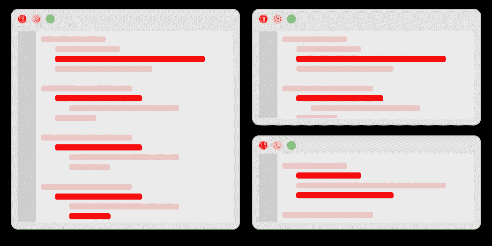

# Python 中的测试:依赖注入与模仿

> 原文：<https://betterprogramming.pub/testing-in-python-dependency-injection-vs-mocking-5e542783cb20>

## 什么时候应该使用依赖注入？什么时候应该使用嘲讽？

[hello queue](https://unsplash.com/@helloquence?utm_source=medium&utm_medium=referral)在 [Unsplash](https://unsplash.com?utm_source=medium&utm_medium=referral) 上拍照。

我喜欢 Python 的一点是它的测试工具。当您需要模拟与外部依赖项的交互时，您可以选择:

*   使用依赖注入用测试 double 替换依赖。
*   使用 Python 的`[mock](https://mock.readthedocs.io/en/latest/)`库劫持实际的函数调用。
*   用模拟响应对一个假服务器进行测试。

有了所有这些可用的测试策略，可能不清楚使用哪种策略。在本文中，我将讨论什么时候选择模拟而不是依赖注入是有意义的，反之亦然。

# 代码

让我们看一些代码来说明模仿和依赖注入之间的区别。假设我正在测试调用`Inventory`服务的代码。`Inventory`服务跟踪用户持有的物品。这是我们用来与`Inventory`服务交互的客户端:

测试中的代码:

## 使用模拟方法的有效测试

虽然这不是关于如何使用`mock`库的教程，但是我将遍历代码来建立上下文:

*   我们不想调用`Inventory`服务，所以我们修补了`get_items`和`add_item`函数。
*   我们已经将对`Inventory`服务的调用的返回值设置为我们期望它返回的值。

## 使用依赖注入的有效测试

在使用依赖注入之前，我们需要建立一个生产/测试环境，以及一种选择在每个环境中运行的代码的方法。让我们改变我们的客户:

*免责声明:这段代码足以说明概念。生产代码库需要更复杂的设置。*

我们定义了两个具体的类。如果我们不在`prod`环境中，我们将使用在内存中保存数据的`InventoryMock`类。不再需要使用`mock`库。我们的新测试看起来像:

# 我应该用什么？

这两种策略都使我们能够在不调用`Inventory`服务的情况下测试代码。在选择最合适的策略时，我会考虑以下几点:

## 范围/成本

根据代码的状态，一种策略会比另一种更便宜。如果您需要模拟一些用例，修补函数可能比创建模拟类更容易/更快。如果您的代码库已经有了支持依赖注入的基础设施和工具，那么编写一个简单的模拟类可能比打补丁更简单。

您还应该考虑您采用的方法的未来后果。如果你所模仿的交互会发生变化，那么考虑选择修改最快的方法。

## 规模经济

依赖注入是扩展嘲讽方法的一种方式。如果许多用例依赖于您想要模仿的交互，那么投资依赖注入是有意义的。容易进行依赖注入的系统:

*   认证/授权服务。
*   负责分布式跟踪和跟踪指标的日志记录解决方案。
*   常用的基础设施，如缓存和消息代理。

这些系统通常在整个代码库中使用:

这就是依赖注入的闪光点——必须修补每个交互将是一件痛苦的事情。如果所讨论的系统跨多个存储库使用，那么您可以更进一步，将依赖注入类正式化为客户端库。

# 结束语

依赖注入和模仿都是值得称赞的测试外部依赖的方法。依赖注入需要更多的工作来设置，但是它非常适合高频率的使用。模仿/修补方法快速/简单，但是随着依赖使用的增加/变化，它开始变成技术债务。还有几件事要记住:

*   一致性:如果代码使用依赖注入(或补丁)来模拟交互，那么没有理由偏离，除非有重大优势。
*   能力:如果工程师精通 Python 的`mock`库，但没有使用面向对象风格的依赖注入的经验(反之亦然)，迁移到依赖注入的数量上的好处可能不会超过质量上的伤害。