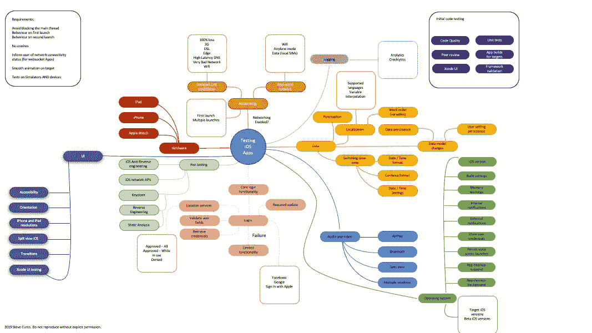
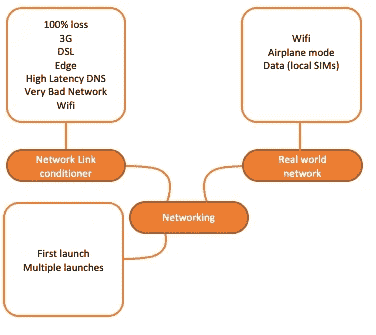
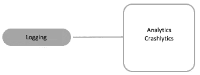
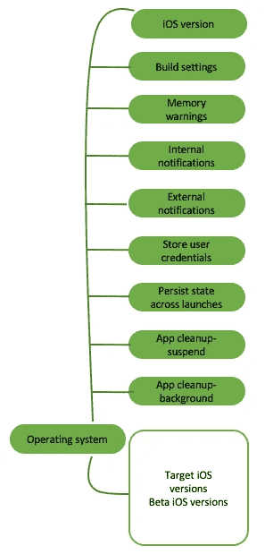
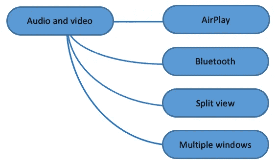
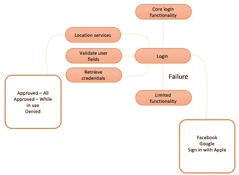
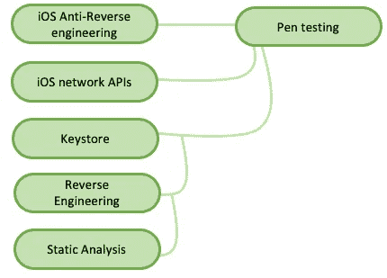
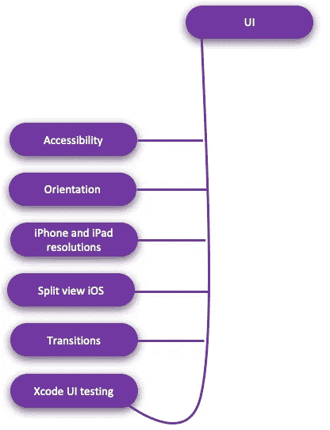
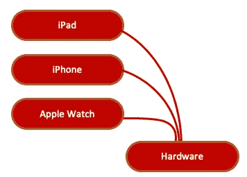

# 测试 iOS 应用——超越基础

> 原文：<https://betterprogramming.pub/testing-ios-apps-beyond-the-basics-2d451766940c>

## 超越单元测试的思考指南

毫无疑问，您会对代码执行单元测试。也许你甚至使用类似 Jenkins 的东西来执行 CI，并确保构建，嗯，构建。但是你还需要确保在你的代码中发生什么呢？

此图显示了您应该考虑的一些问题:

## **先决条件**

iOS 应用程序开发流程的一些知识。

## **术语**

测试:测试应用程序的实际结果和性能是否与输出和质量方面的预期结果相匹配的调查。

# 基础知识

**单元测试**应该是给定的。当你集成一个新的特性时，你会重新运行所有的测试吗？

如果不使用 Xcode UI 测试的特性，你怎么可能测试你的界面呢？

你会惊讶于有多少公司根本不参与任何**代码审查**。或者甚至有编码标准(看看 Google 的标准就知道了)。

如果你的雇主不执行这些标准，你仍然需要达到它们。无论你是自由职业者还是为别人工作，重要的是你的工作有一个最低质量标准。

# 建立工作关系网

## **网络链路调节器**

您可以设置您的设备来模拟延迟。你在用仪器测试，是吗？是的，有一个模拟器，但如果你测试网络，你真的需要一个设备。

然后*你可以衡量并提高*你的应用程序的性能。如果你没有为你的客户(无论是产品负责人还是你的老板)设定性能要求，你可能已经为一个性能不佳的应用创造了空间。专业将确保你永远不会使用它。

你希望你的应用程序有一些最低限度的功能，即使没有连接到网络。你确实考虑过在第一次启动时没有连接，不是吗？

## **现实世界网络**

不同的运营商以不同的方式限制数据，甚至可能禁止各种网站。看看这个。

# 记录

你想过那些讨厌的 dSYM 文件吗？在某种程度上，您可能希望自动上传这些信息，以找出崩溃的原因。假设在你首次发布前没有测试就这样工作会增加不工作的第一次发布的混乱。

不要让那成为你。

# 数据

这不仅仅是数据模型的变化(尽管这些变化很重要)。您将如何确保您的 SQLite 和/或 CoreData 持久层迁移到您精心设计的最新版本？

## 你想过吗？

您是否使用设备时间来标记服务器请求？人们希望不会，因为谁知道你的用户把他们的设备设置在哪个时区。使用服务器设置？它在哪个时区？当转换回本地设备时间时，这对您的应用程序的预订时间(甚至是正确的日期)有什么影响？

## 你知道吗？

法国人在标点符号前加一个空格。

这让事情变得棘手，你知道吗？

除非你做对了，否则你看起来不会很专业。

# 操作系统

iOS 不是什么都管吗？

嗯，一如既往，这要看情况。当你的应用程序被放到后台时，你正在进行 API 调用吗？现在可能是时候考虑一下它是否真的做出了那个决定。

# 音频和视频

显然，您需要确保您的音频不会停止用户的交互或同时播放的其他音频。

但是你测试过那个吗？

Airplay 呢？

在拆分视图中，您的应用程序如何与其他应用程序交互？

# 核心登录功能

您是否将您的登录功能分离到不同的模块中？你测试过并处理过所有的错误吗？

# 笔测试

这确实需要测试团队的投入。

您是如何存储数据的？如果用户默认设置遭到破坏怎么办？您是否应该保护终端用户免受中间人攻击？

# 错误处理

图中没有显示最重要的错误处理。

你在处理错误吗？你向你的 API 和应用程序用户展示了什么？够好吗？

# 用户界面测试

除了前面提到的 Xcode 测试，在 UI 测试方面还有很多要考虑的。

你是否充分考虑了你的用户？一个显而易见的问题是，你是否涵盖了应用程序中的所有路径？

# 五金器具

也许你的应用可以在苹果电视上运行。也许你甚至想让它在 MacOS 上运行。那包括什么？你需要考虑这件事的所有后果。

# 还有什么？

ARKit 是一个大的。你将如何模拟来自摄像机的输入？(提示:简单—模拟输出)。然而你也应该考虑测试团队应该做什么(T2 将如何在真实设备上测试这个)。

这让我们想到了嘲笑…但那是另一天的帖子！