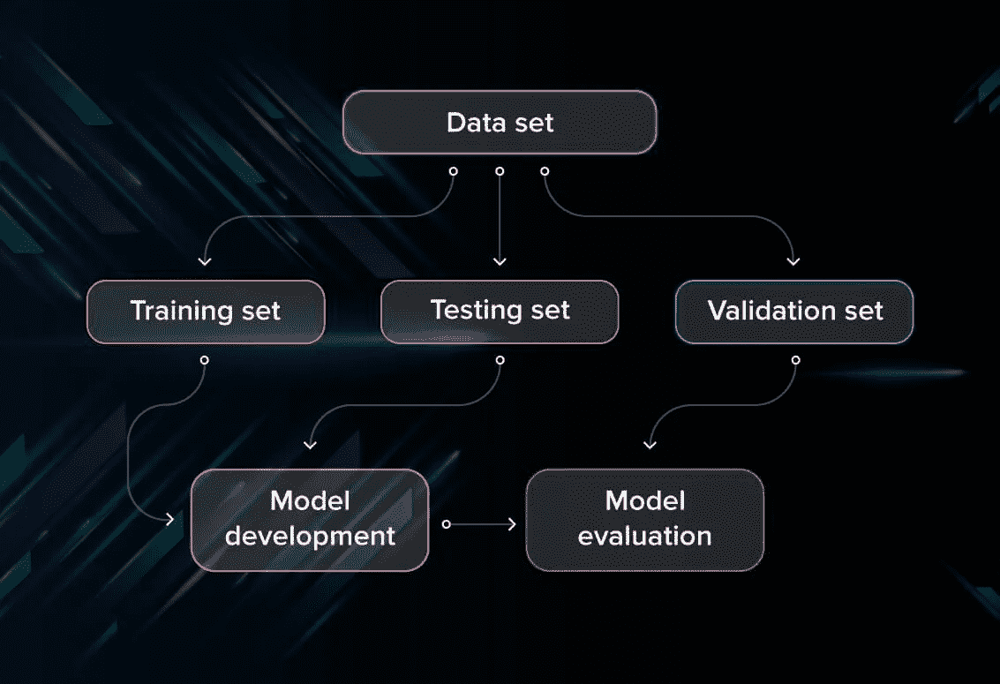
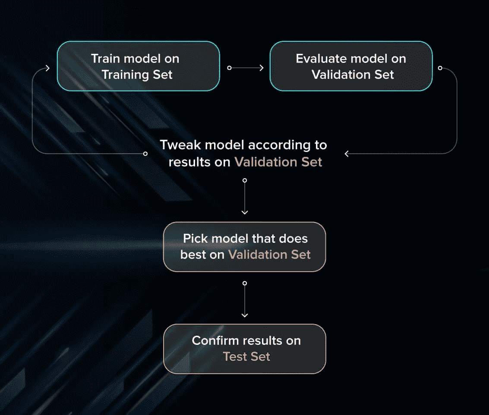
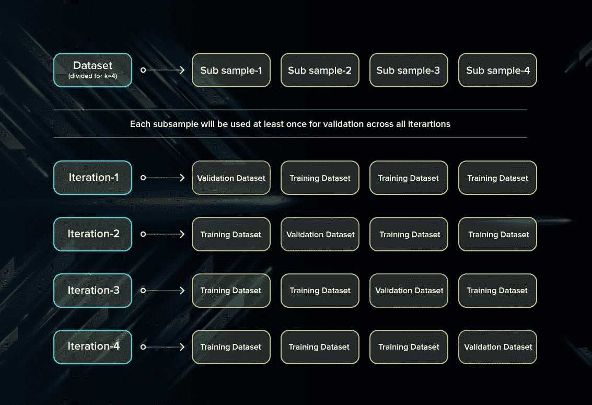
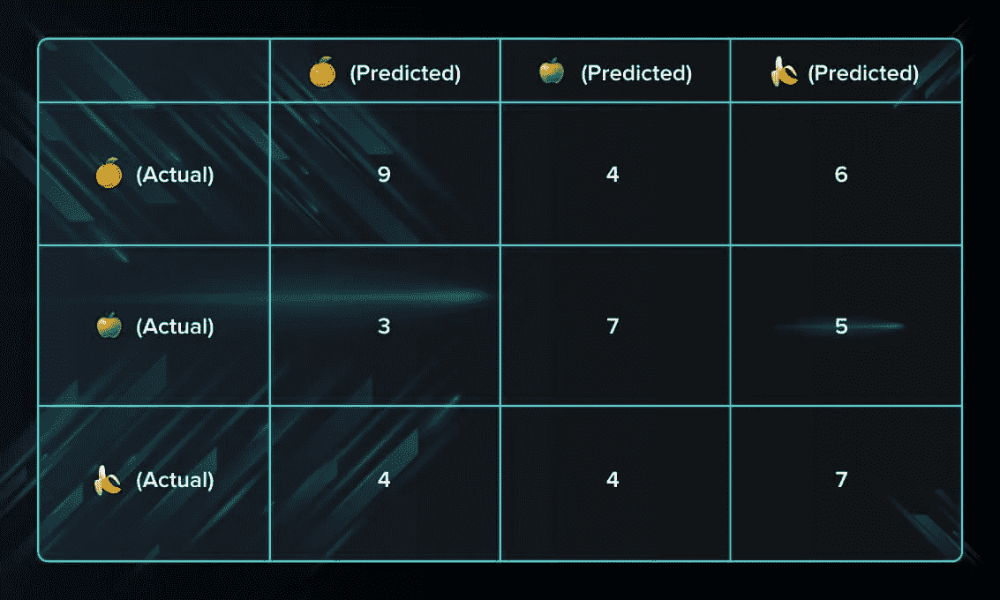
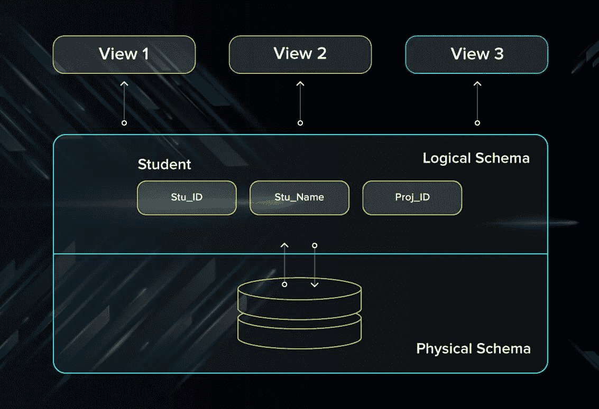
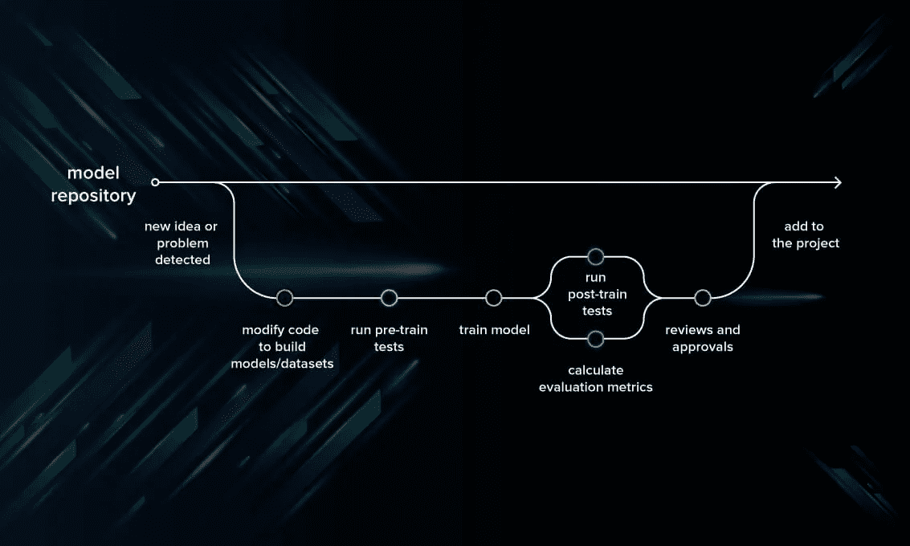

# 测试机器学习模型

> 原文：<https://betterprogramming.pub/testing-machine-learning-models-434e973aa14d>

## 了解可以在机器学习模型上执行的各种测试

在 [Unsplash](https://unsplash.com/s/photos/data?utm_source=unsplash&utm_medium=referral&utm_content=creditCopyText) 上拍摄的 [ThisisEngineering RAEng](https://unsplash.com/@thisisengineering?utm_source=unsplash&utm_medium=referral&utm_content=creditCopyText)

在本文中，我们将讨论一些有效的 ML 测试策略。您将学习如何测试和评估模型，克服常见的瓶颈，等等。

# ML 测试的目标是什么？

首先，当执行 ML 测试以及任何软件测试时，我们试图达到什么目的？

*   需要质量保证来确保软件系统按照要求工作。所有的特性都按照约定实现了吗？程序的行为是否符合预期？测试程序的所有参数都应该在技术规范文档中说明。
*   此外，软件测试有能力指出开发过程中的所有缺陷和瑕疵。你不希望你的客户在软件发布后遇到 bug，挥舞着拳头来找你。不同种类的测试允许我们捕捉只在运行时可见的错误。

然而，在机器学习中，程序员通常输入数据和期望的行为，逻辑由机器来阐述。深度学习更是如此。所以机器学习测试的目的，首先是保证这个学习到的逻辑会保持一致，不管我们调用程序多少次。

# 机器学习测试中的模型评估

通常，软件测试包括:

*   **单元测试。**程序被分解成块，每个元素(单元)单独测试。
*   回归测试。他们覆盖已经测试过的软件，看看它是否不会突然崩溃。
*   **集成测试。这种类型的测试观察程序的多个组件如何一起工作。**

而且，人们遵循一定的规则:在代码通过所有测试之前，不要合并代码；总是测试新引入的代码块:当修复 bug 时，编写一个捕获 bug 的测试。

机器学习给你的待办事项列表增加了更多的动作。你仍然需要遵循 [ML 的最佳实践](https://developers.google.com/machine-learning/testing-debugging/common/overview)。此外，每个 ML 模型不仅需要测试，而且需要评估。你的模型应该能很好地概括。这不是我们通常通过测试所理解的，但需要评估来确保性能令人满意。

首先，您将数据库分成三个不重叠的集合。您使用训练集来训练模型。然后，为了评估模型的性能，使用两组数据:

*   **验证集。**如果您进行多轮超参数调优(通常如此)，仅有一个训练集和一个测试集是不够的。这会导致过度拟合。为了避免这种情况，您可以选择一个小的验证数据集来评估模型。只有在验证集上获得最大的准确性之后，你才能让测试集进入游戏。
*   **测试集(或维持集)。**您的模型可能非常适合训练数据集。但它在现实生活中同样出色的保证在哪里呢？为了确保这一点，您从训练集中为测试集选择样本，这些样本是机器以前没有见过的。在选择和随机抽取样本时保持公正是很重要的。此外，您不应该多次使用同一个集合，以避免对您的测试数据进行训练。您的测试集应该足够大，以提供有统计意义的结果，并代表整个数据集。

但是就像测试集一样，验证集在重复使用时会磨损。您使用相同的数据来决定超参数设置或其他模型改进的次数越多，您就越不相信模型能够很好地概括新的、看不见的数据。所以收集更多的数据来更新测试集和验证集是一个好主意。

## 交叉验证

交叉验证是一种模型评估技术，甚至可以在有限的数据集上执行。训练集被分成小的子集，并且模型在这些样本的每一个上被训练和验证。

## k 倍交叉验证

最常见的交叉验证方法称为 k 倍交叉验证。要使用它，您需要将数据集分成 *k* 个子集(也称为折叠)并使用它们 *k* 次。例如，通过将数据集分成十个子集，您将执行十重交叉验证。每个子集必须至少用作一次验证集。

这种方法对于在看不见的数据上测试机器学习模型的技能是有用的。它之所以如此受欢迎，是因为它应用简单，即使在相对较小的数据集上也能很好地工作，并且您得到的结果通常相当准确。如果您想了解更多关于如何交叉验证模型的信息，[请查看 Medium](https://towardsdatascience.com/why-and-how-to-cross-validate-a-model-d6424b45261f) 上更详细的解释。

## 留一交叉验证

在此方法中，我们在集合中的所有数据样本上训练模型，除了用于测试模型的一个数据点。通过迭代地重复这个过程，每次留下不同的数据点作为测试集，您就可以测试所有数据的性能。

该方法的优点是低偏差，因为使用了所有的数据点。然而，这也导致了测试中更高的变化，因为我们每次只针对一个数据点测试模型。

交叉验证提供了更有效的数据使用，并有助于更好地评估模型的准确性。

# 使用指标评估模型

使用不同的指标评估模型的性能是每个数据科学项目不可或缺的一部分。以下是你必须留意的:

## 准确(性)

准确性是真阳性和真阴性的总和，除以所有预测的数量。

准确性是衡量模型做出的预测有多少是正确的一个指标。精确度越高越好。然而，在评估性能时，这并不是唯一重要的指标。

## 失败

损失描述了错误预测的百分比。如果模型的预测是完美的，损失为零；否则损失更大。

## 精确

精度是真阳性的数量除以真阳性和假阳性的总和。

精度度量标志着模型在识别阳性结果时的正确频率，例如，模型在真正患有癌症的患者中诊断癌症的频率。

## 回忆

召回是真阳性的数量，除以真阳性和假阴性的总和。

此指标衡量正确预测的数量除以本应正确预测的结果数量。它指的是被你的算法正确分类的相关结果总数的百分比。

## 混淆矩阵

混淆矩阵是一个 *NxN* 方桌，其中 *N* 是模型需要分类的类别数。通常，这种方法适用于每列代表一个标签的分类。例如，如果您需要将水果分为三类——橙子、苹果和香蕉——您可以绘制一个 3x3 的表格。一个轴将是实际的标签，另一个轴将是预测的。

# ML 模型调试的最佳实践

评估了性能之后，我们仍然需要找出错误发生的位置和原因。

ML 调试与调试任何其他软件系统都有点不同。ML 模型做出的质量差的预测并不一定意味着有缺陷。您必须调查比传统编程更广泛的原因:可能是包含错误的数据或超参数没有调整好。这使得调试 ML 模型相当具有挑战性。

## 数据调试

首先，你应该从数据调试开始，因为模型做出的预测的准确性不仅取决于算法，还取决于数据本身的质量。

## 数据库模式

帮助您检查数据是否包含预期统计值的一个工具是数据模式。

数据库架构就像描述数据库逻辑的地图:数据是如何组织的，样本之间的关系是什么。它可能包括某些规则，如:

*   确保提交的值在 1–5 的范围内(例如，以等级为单位)。
*   检查所有图像是否都是 JPEG 格式。

该方案可以有两种类型:

*   **身体。**它描述了数据的存储方式、格式等。
*   **合乎逻辑。**这种类型以表格、标签或模式的形式表示数据库的逻辑组件。

工程数据应单独检查。虽然原始数据可能没问题，但工程数据经历了一些变化，看起来可能完全不同。例如，您可以编写测试来检查异常值是否被处理，或者缺失值是否被平均值或默认值替换。

## 模型调试

一旦测试了数据，就可以继续进行模型调试了。

## 建立基线

当您设置一个基线并将您的模型与它进行比较时，您可以快速测试模型的质量。建立基线意味着您使用简单的启发式方法来预测标签。如果您的训练模型的表现比基线差，您需要改进您的模型。例如，如果您的模型解决了一个分类问题，基线就是预测最常见的标签。

一旦您验证并更新了您的模型，您就可以使用它作为模型的新版本的基线。更新的、更复杂的模型必须比不太复杂的基线表现得更好。

## 编写 ML 单元测试

这种 ML 测试更类似于传统测试:您编写并运行测试来检查程序的性能。通过应用测试，您可以在 ML 程序的不同组件中捕获 bug。例如，您可以测试神经网络中的隐藏层配置是否正确。如果你有兴趣深入不同模型的单元测试，在[数据营](https://www.datacamp.com/community/news/how-to-unit-test-machine-learning-code-pq1gpl08mk)学习如何做。

## 调整超参数

超参数调整不当可能是模型性能不佳的原因。以下是您通常应该检查的指标:

*   **学习速度。**通常，ML 库会预设一个学习速率。例如，在张量流中，它是 0.05。但是，对于您的模型来说，这可能不是最佳的学习速率。所以最好的选择是手动将其设置在 0.0001 到 1.0 之间，然后玩玩它，看看什么能给你最好的损失，而不用花几个小时来训练。
*   **正规化。**只有在确保模型可以在不进行正则化的情况下对训练数据进行预测之后，才应该进行正则化。如果需要减小模型的大小，L1 正则化非常有用。如果您喜欢增加模型稳定性，请应用 L2 正则化。在神经网络的情况下，使用退出正则化。
*   **批量大小。**在小批量上训练的模型通常概括得更好。一批通常应该包含 10 到 1000 个样品，其中最小数量[取决于您的型号](https://stats.stackexchange.com/questions/164876/tradeoff-batch-size-vs-number-of-iterations-to-train-a-neural-network)。
*   **层的深度。**深度描述了神经网络的层数:层数越多，就越深。从一层开始，如果你觉得模型应该更深一层来解决你的问题，就逐渐增加层数。这种方法有助于避免模型从一开始就过于复杂。

# 如何编写模型测试

因此，要编写模型测试，我们需要涵盖几个问题:

*   检查模型的一般逻辑(在深度神经网络的情况下不可能，因此如果使用 DL 模型，则转到下一步)。
*   通过手动测试一对随机数据点来控制模型性能。
*   评估 ML 模型的[精度。](https://stackoverflow.com/questions/34518656/how-to-interpret-loss-and-accuracy-for-a-machine-learning-model)
*   确保实现的损失对于您的任务来说是可接受的。
*   如果您得到了合理的结果，那么就跳到单元测试来检查真实数据上的模型性能。

阅读如何在介质上进行单元测试[的详细解释。](https://medium.com/@keeper6928/how-to-unit-test-machine-learning-code-57cf6fd81765)

有两种常见的测试:

## 训练前测试

这种类型的测试是在早期执行的，它允许您在运行模型之前发现错误。他们不需要训练参数来运行。训练前测试的一个示例是检查训练和验证数据集中是否有任何标签缺失的程序。

## 训练后测试

*   不变性测试。使用不变性测试，我们可以检查在不影响模型性能的情况下，我们可以在多大程度上改变输入。我们可以将输入示例配对，并检查预测的一致性。例如，如果我们对两张不同的红苹果照片运行模式识别模型，我们预计结果不会有太大变化。
*   方向性期望测试。与不变性测试不同，方向期望测试需要检查输入中的扰动将如何改变模型的行为。例如，当建立一个估计房屋价格的回归模型，并将平方米作为参数之一时，我们希望看到增加额外的空间使价格上升。
*   最低功能测试。这些测试使我们能够单独测试程序的组件，就像传统的单元测试一样。例如，您可以在数据中找到的特定案例上评估模型。

这些测试是在经过训练的模型上执行的，并检查它是否正确执行。它们允许我们调查算法背后的逻辑，看看是否有任何错误。

# 模型开发管道

模型开发的议程应该包括评估、训练前测试和训练后测试。这些阶段应该组织在一个管道中，如下所示:

# 结论

如果你关心模型的质量，执行 ML 测试是必要的。ML 测试有几个特点:它要求您测试数据的质量，而不仅仅是模型，并通过几次迭代调整超参数来获得最佳结果。但是，如果你执行所有必要的程序，你可以肯定它的性能。