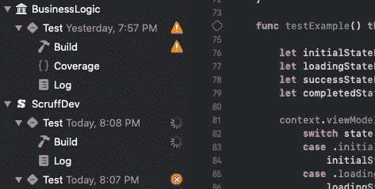
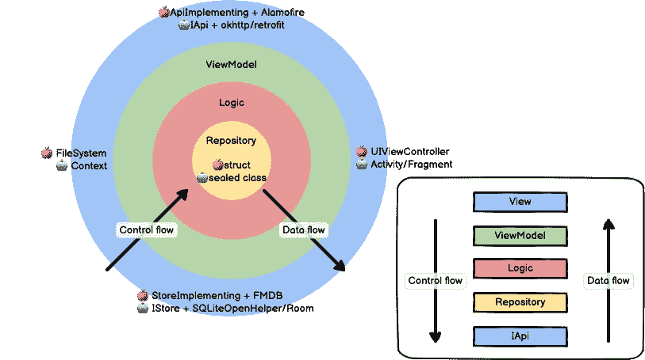
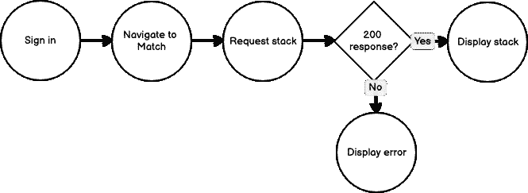

# 在斯威夫特和科特林测试 MVVM

> 原文：<https://betterprogramming.pub/testing-mvvm-in-swift-and-kotlin-ccb55e462760>

## 编写测试的最佳方法并不明显

杰森·库德里特在 [Unsplash](https://unsplash.com?utm_source=medium&utm_medium=referral) 上拍摄的照片。

在移动的早期，客户端测试主要围绕 UI 测试。苹果推出了一项名为 UIAutomation 的技术，最终在 2016 年随着 Xcode 8 的发布[彻底抛弃了这项技术。Android](https://stackoverflow.com/a/34079537) [测试样本](https://github.com/android/testing-samples)库直到 2014 年才创建。

因为 UI 测试需要自上而下的方法，如果你大量地重新设计你的 UI，测试将会中断。此外，UI 测试本身并不处理从相关系统中产生的各种逻辑状态，例如网络故障响应。确认一个按钮在点击时改变颜色通常不如确认应用程序在收到服务器的 500 响应时正确响应有价值。UI 测试还需要一个模拟器来运行，在笔记本电脑上启动通常需要几十秒，在网络上运行时甚至需要更长时间(比如像 AWS [Device Farm](https://aws.amazon.com/device-farm/) 这样的服务)。

我花了多少时间看这个屏幕？

虽然 Android 最终发布了 [Espresso](https://developer.android.com/training/testing/espresso) 和 Apple 发布了 [XCTest](https://developer.apple.com/documentation/xctest?language=objc) ，但是我们在[干净的 MVVM 架构](https://medium.com/perry-street-software-engineering/kotlin-in-xcode-swift-in-android-studio-26a4ace6fc72)中的测试方法不重视 UI 测试，而是专注于 ViewModel 层的测试。

一般来说，我们首先为存储库编写测试，然后为视图模型编写测试，如果有必要的话(因为视图模型层无法测试所有条件)，还有逻辑层。

图片来源:作者

通过将测试首先集中在 ViewModel 上，可以在不依赖模拟器的情况下非常快速地运行测试。在 Android 上，我们通过使用[本地单元测试](https://developer.android.com/studio/test)实现了这一点，这些测试运行在您机器的本地 Java 虚拟机上，没有 Android 框架依赖性。在 iOS 上，我们正在将视图模型、逻辑和存储库类迁移到 [Swift 包](https://developer.apple.com/documentation/swift_packages)中。

# 胜利的依赖注入

无论你是否进行 BDD 或 TDD 测试，你都要考虑在你的测试中使用[依赖注入](https://www.freecodecamp.org/news/a-quick-intro-to-dependency-injection-what-it-is-and-when-to-use-it-7578c84fa88f/)。如果你不这样做，那么在每个测试的开始，你将需要调用一个方法(可能被命名为类似于`buildContext`的东西)来有效地构造所有必要的视图模型、逻辑和存储库类，从而作为一个轻量级的 DI 系统。

下面是阿迪系统的一个基本用法:

下面是我们如何在测试文件的开头设置测试:

# 模仿呢？

使用干净 MVVM 架构的一个主要好处是，如果你遵循了这个模式，你应该只需要模仿[外层干净组件](https://blog.cleancoder.com/uncle-bob/2012/08/13/the-clean-architecture.html)——所有的 API，以及可选的本地存储类。

用 [mockito](https://site.mockito.org/) 在 Android 上嘲讽很直接。下面是如何在 [Koin](https://insert-koin.io/) 中定义一个模拟 API，注入它，然后在测试开始时覆盖您的模拟:

Swift 是唯一缺少模仿库的现代语言之一。因此，您需要为每个 API 类定义具体的类，并公开一个可以直接分配的`var`来控制响应。

# 更好的 BDD 结构

移动应用可以被认为是用户导航的一系列状态转换。例如，设想约会应用程序的匹配功能:

通过匹配特征的示例流。作者照片。

一旦您的应用程序达到给定的复杂程度，测试中可能会有一个重要的初始设置，以达到您试图评估的状态。为了清理我们的测试并减少冗余代码，我们可以编写 BDD 测试，利用代码嵌套来重用初始化和设置块。我们可以在 Java 中使用 [JUnit](https://junit.org/junit5/) 和在 Swift 中使用 [Quick](https://github.com/Quick/Quick) 来获得特定于领域的语言，这将帮助我们编写更短的 BDD 风格的测试。

如果我们想测试我们的指令卡是否显示在匹配堆栈的开头，那么在 Quick 中可能是这样的:

下面是使用 Junit 在 BDD 中构建的相同测试:

# 接下来

让我们来谈谈我们[如何在 Swift 和 Kotlin 中测试异步性](https://itnext.io/testing-asynchronicity-in-swift-kotlin-4926936eae28)。

# 本系列的更多内容

*   [在斯威夫特&科特林](https://medium.com/perry-street-software-engineering/kotlin-in-xcode-swift-in-android-studio-26a4ace6fc72)清洗 MVVM
*   [Swift 中的视图模型& Kotlin](https://medium.com/p/721bbc6f8c07)
*   [Swift 中的逻辑类& Kotlin](https://itnext.io/logic-classes-in-swift-kotlin-f7ac1f295839#4bdb-3e583789601)
*   [Swift 中的存储库和域模型& Kotlin](https://medium.com/perry-street-software-engineering/repositories-and-models-in-swift-kotlin-df9ae2c84cb7)
*   [Swift 中的 API 类& Kotlin](https://medium.com/perry-street-software-engineering/api-classes-in-swift-kotlin-a2cb90d3906d)
*   [Swift 中的视图& Kotlin](https://medium.com/p/f5416dec42ea)
*   在 Swift & Kotlin 测试 MVVM←*你在这里*
*   [测试 Swift 中的异步性&科特林](https://itnext.io/testing-asynchronicity-in-swift-kotlin-4926936eae28)
*   [清洁 MVVM 总结](https://medium.com/p/7057230600aa)

# 你可能喜欢的其他系列

[**清理 API 架构(2021)**](https://itnext.io/a-visual-history-of-web-api-architecture-c36044df2ac7)构建现代 API 端点时的类、执行模式、抽象。

[**Android 活动生命周期被认为有害**](https://proandroiddev.com/android-activity-lifecycle-considered-harmful-98a5b00d287)**(2021)** Android 进程死亡，不可解释的 NullPointerExceptions，以及你现在就需要的 MVVM 生命周期

# 关于作者

埃里克·西尔弗伯格(Eric Silverberg)是佩里街软件公司(Perry Street Software)的首席执行官，发行 LGBTQ+约会应用程序(LGBTQ+ dating apps)和 SCRUFF，在全球拥有 2000 多万会员。