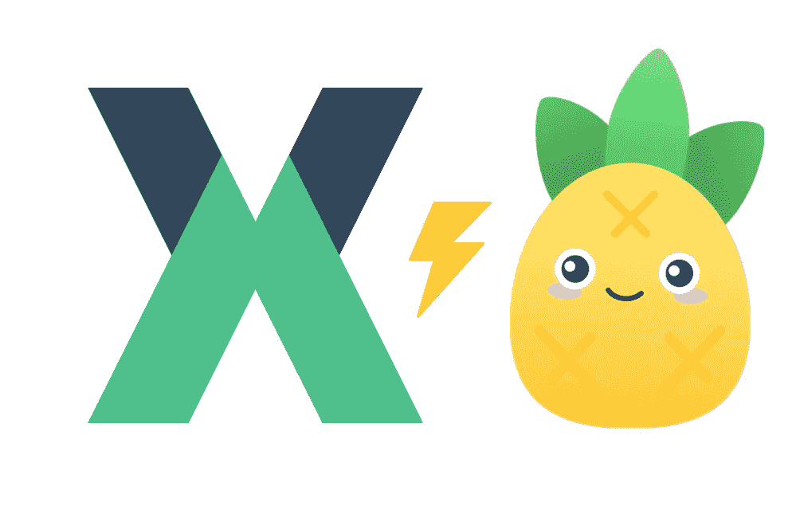
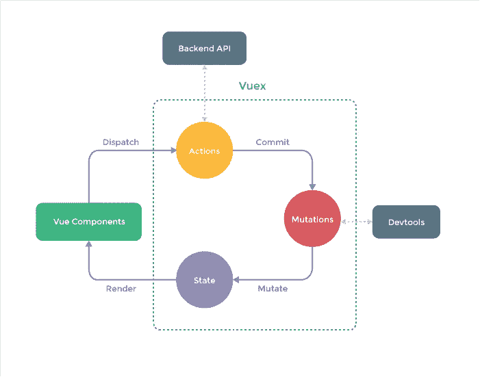
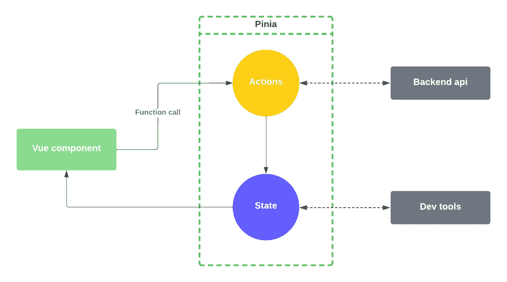

# 测试皮尼亚 Vuex 出局了吗？

> 原文：<https://betterprogramming.pub/testing-pinia-is-vuex-out-43e0531824f5>

## Vue 3 哪个状态管理最好？我想可能是皮尼亚

Vuex 和 Pinia

自从我开始使用 Vue 3 和 composition API 以来，我还尝试使用 [Pinia](https://pinia.vuejs.org/) 作为状态管理库。

来自一个使用 Vue 2.x 和 Vuex 的更大的项目，当你开始使用它时，已经有了明显的变化。

老实说，我从未对 Vuex 感到完全舒服。最初，有“很多”样板代码只是减少了对 store 的使用。也许这只是我的懒惰，但是状态管理真的应该是一种乐趣，所以当你有一小段应该在组件间共享的状态时，你更倾向于使用它。

# API 差异

让我们来看看两家商店的整体设计，看看我们是否能发现一些特点和差异，这些特点和差异可能会说服我们使用其中一家而不是另一家。

# Vuex

下面是 Vuex 如何工作的官方示意图。这有点令人困惑，但是一旦你使用它，你就会掌握它的窍门。

Vuex 架构

在 Vuex 商店中，有 4 个主要组件:

## 1.状态

这只是一个包含实际状态的对象。您将能够在您的开发工具中看到该状态，并且如果您想要保存该状态以用于缓存或其他目的，您也可以保存该对象。

## 2.行动

动作是执行异步任务的功能。它们由关键字`dispatch`发起。动作通常会请求一个外部 API 或者做一些其他的异步工作。该动作还负责调用适当的突变来实际改变状态。这意味着动作本身并没有改变状态，但是`commit`发生了变化，所以突变可以改变状态。

## 3.突变

突变是唯一会同步改变状态的函数。变异使用关键字`commit`

## 4.吸气剂

Getters 可以被认为是计算的属性，应该用来从您的状态获得修改后的响应。

Vuex 商店的一个简单示例如下:

## 使用商店

当使用上述组件时，组件通常会调用`dispatch`来启动异步任务(比如从外部 API 获取)。如果你需要改变状态，比如一个简单的计数器，你可以调用`commit`。

这意味着一个组件可以通过调用`dispatch`或`commit`与商店交互。我不知道你怎么想，但对我来说，这增加了一些我真的不需要的大脑超载。
在使用 Vuex 之前，我对前端环境中的术语“提交”和“分派”并不熟悉。因此，用它们来改变状态对我来说并不直观。对于一些人来说，这可能是不同的，但使用一个动作或一个突变让我感到有点不舒服。

同样值得注意的是，使用 Vuex 一个组件可以访问整个存储，即使你可以在逻辑上将你的 Vuex 存储分成不同的文件。

# 皮尼亚

与 Vuex 相比，Pinia 图如下所示:

皮尼亚建筑

正如你在上面看到的，整体架构更简单，更容易理解。

皮尼亚商店有 3 个主要组成部分

## 1.状态

和 Vuex 的情况一模一样

## 2.行动

这里的动作与 Vuex 中的动作和突变做同样的工作。这意味着这些函数应该是改变状态的唯一方法。如果您想从外部 API 获取数据并更新状态，也可以使用这些操作。
与 Vuex 设置的另一个区别是 Pinia 动作被称为正常功能。当必须使用它们时，这给了最小的认知负荷！

## 3.吸气剂

这些作为您所在州的计算属性。例如，你可以在 blow store 中获得计数+ 5。

一个简单的 Pinia 商店可能是这样的:

Pinia 商店示例

## 使用商店

与 Vuex 不同的是，Pinia 商店被分隔成完全不同的商店。这意味着每个组件必须包括它想要使用的特定商店。另一个区别是我们与商店互动的方式。API 比 Vuex 简单很多。

这可以部分地从我们如何执行行动中看出。在 Vuex 中，我们必须使用关键字`dispatch`，在 Pinia 中，我们只是将动作称为普通方法。`dispatch`调用的一个大“问题”是参数通常是一个字符串，这感觉是错误的。

> 参数一般是字符串，感觉不对。

# 结论

现在，我想说 Pinia 更容易理解和使用。可能有一些东西可以让 Vuex 在更大的项目中更好地扩展，但是我还没有遇到过。对我来说，另一件重要的事情是我们可以用普通的参数调用普通的方法。

Pinia 还支持 Vue 2 和 3，这使得迁移变得更加容易。

保持简单！