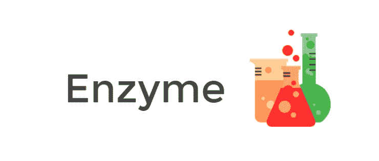
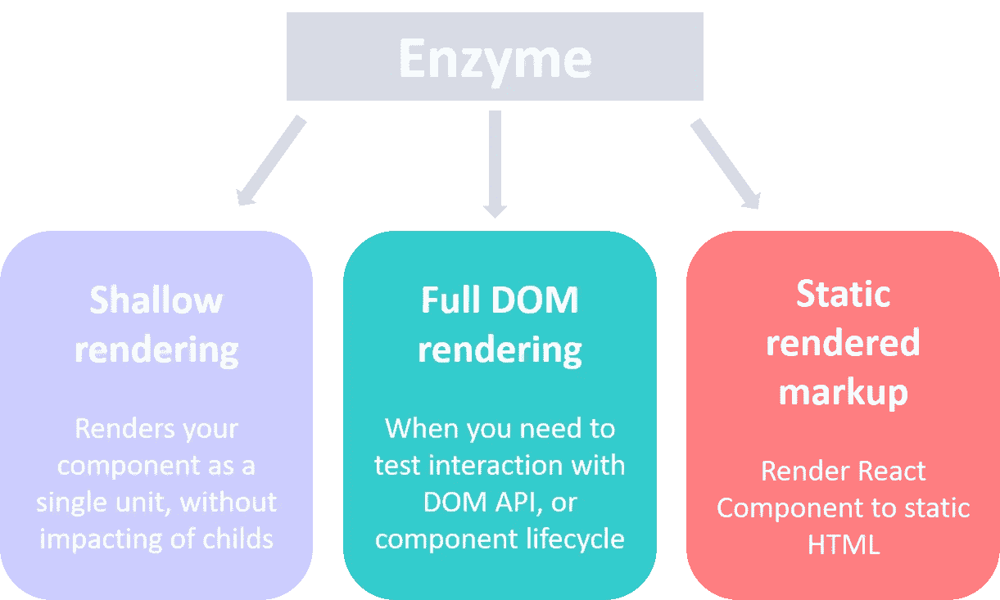
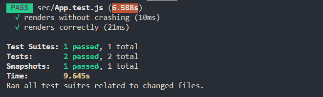
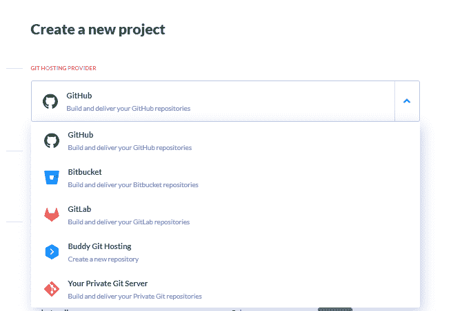
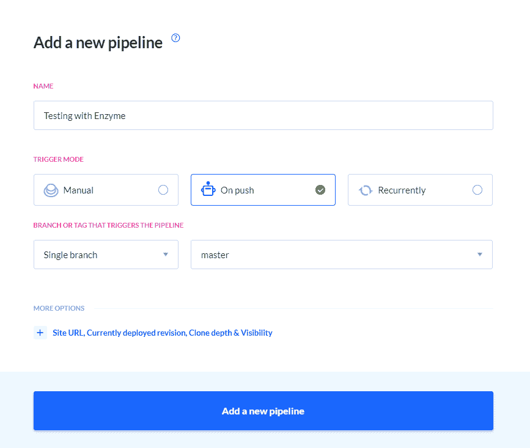
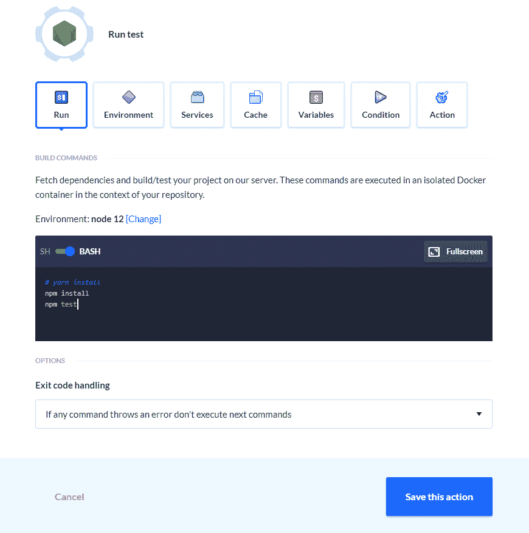
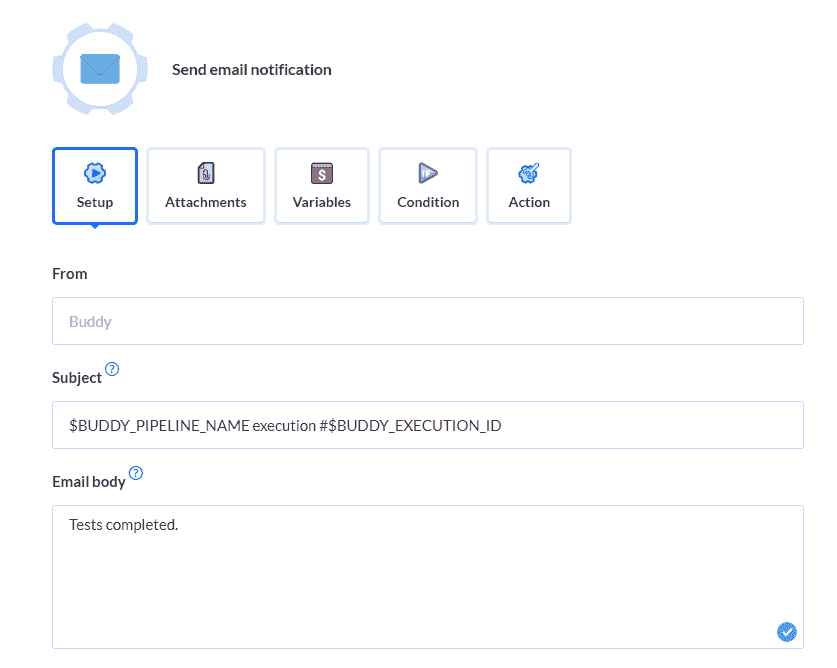
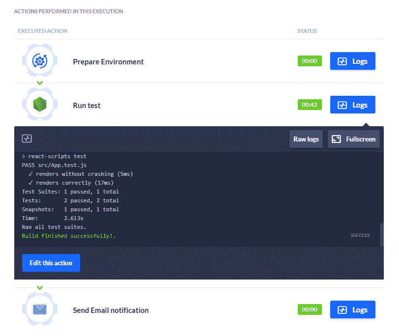

# 用酵素测试你的 React 应用

> 原文：<https://betterprogramming.pub/testing-react-apps-with-enzyme-d3fad145b331>

## Enzyme 让测试 React 应用程序变得更加容易


Amy Lister 在 [Unsplash](https://unsplash.com?utm_source=medium&utm_medium=referral) 上拍摄的照片。

测试前端应用程序可能是一件痛苦且耗时的事情。在本文中，让我们讨论一下 Enzyme，以及如何使用它来使 UI 测试变得更加容易。

# 酶是什么？

[Enzyme](https://enzymejs.github.io/enzyme/) 是 React 的 JavaScript 测试工具。它通过断言、操作和遍历每个组件的输出，使测试 React 组件变得容易。目前，它是开源的，由 Airbnb 维护。



图片来自[酵素](https://enzymejs.github.io/enzyme/)。

# 为什么是酵素？

在测试方面，你可能听说过摩卡和柴。这个 JavaScript 测试框架和断言库经常被用于编写单元和功能测试。

但是测试 React 组件呢？酶是解决方案，原因如下:

*   直观灵活的 API
*   兼容主要和常见的测试跑步者
*   支持浅层呈现、DOM 呈现和静态呈现标记



作者照片。

# 酶实施

现在让我们学习如何使用带有 Jest 的酶来编写测试，Jest 是 React 中的一个测试运行程序。

## 第一步:安装酵素

首先，我们安装软件包:

```
npm install enzyme enzyme-adapter-react-16
```

## 第二步:setupTests.js

当你创建一个新的 React 应用时，应该有一个默认初始化的`setupTests.js`文件。

在该文件中添加以下代码以导入酶:

```
import { configure } from "enzyme";
import Adapter from "enzyme-adapter-react-16";configure({ adapter: new Adapter() });
```

## 第三步:App.test.js

在这个例子中，让我们测试一下我们的`App.js`文件。Jest，我们的测试运行器，将自动运行测试文件，如果文件是:

1.  任何。js 文件放在一个名为`tests`的文件夹中。
2.  任何。文件名类似`[name].spec.js`的 js 文件。
3.  任何。文件名类似`[name].test.js`的 js 文件。

所以让我们用一个`App.test.js`文件来测试我们的`App.js`。在该文件中，我们将编写一些简单测试，如下所示:

在我们的第一个测试中，我们使用浅层渲染来隔离一个单独的组件，比如`<App/>`，并确保它能够渲染。

我们的下一个测试是快照测试，以测试 UI 是否正确呈现。根据 [Jest 的文档](https://jestjs.io/docs/en/snapshot-testing):

> *“一个典型的快照测试用例呈现一个 UI 组件，获取一个快照，然后将它与存储在测试旁边的一个参考快照文件进行比较。”*

# 运行测试

让我们用以下代码运行这两个简单的示例测试:

```
npm test
```

如果所有测试都通过，终端应显示:



# 自动化您的测试

所以现在我们知道如何用 Enzyme 编写简单的 UI 测试。更多详情，请访问他们的[文档](https://enzymejs.github.io/enzyme/)。

保持测试自动化总是好的，而不是每次都手动运行`npm test`。Buddy CI/CD 是我用来轻松自动化测试的工具，它对 React 应用程序很有效。

## 步骤 1:添加管道

要开始，只需在 [buddy.works](https://buddy.works/?utm_source=medium&utm_medium=referral&utm_campaign=content_victoria_lo&utm_content=react_enzyme) 上创建一个帐户，并通过选择您使用的 Git 提供者来添加您的项目。



然后，添加一个管道，我们可以在 React 应用程序中自动化我们的测试。确保‘Trigger Mode’被设置为 On Push，并且分支是`master`,这样我们的测试将在每次我们对项目进行更改时自动运行。



## 步骤 2:添加节点操作

因为我们使用命令`npm test`来运行我们的测试，我们可以添加一个节点动作到我们的管道中。

在我们的操作中，我们运行命令来安装我们的包并运行我们的测试:



## 步骤 3:添加通知

最后，我们可以发送一个电子邮件通知，以便我们知道测试何时结束。



# 跑管道！

如果我们运行我们的管道，我们的测试将是自动化的，并且每次我们推进到我们的`master`分支时都会运行。



# 结论

Enzyme 使得测试 React 应用程序的组件和 UI 变得简单。对于编写测试来说，自动化测试有助于尽早发现错误并节省开发时间。

有关如何为 React 应用和 Buddy 创建交付渠道的更多资源，请查看以下内容:

*   [好友部署 React 应用网络研讨会](https://youtu.be/mmexLa-o6E8)
*   [构建和部署 React 应用，无需停机](https://buddy.works/guides/reactjs-zero-downtime-deployment?utm_source=medium&utm_medium=referral&utm_campaign=content_victoria_lo&utm_content=react_enzyme)

感谢阅读！干杯！