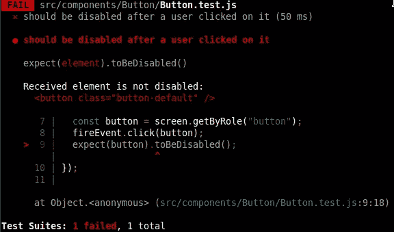
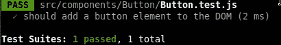
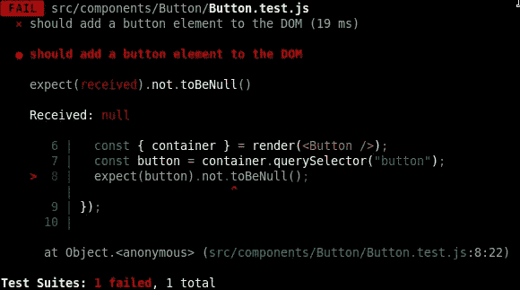

# 为初学者解释的测试 React 组件

> 原文：<https://betterprogramming.pub/testing-react-components-explained-for-beginners-4c61029e752e>

## 如果你不知道代码是如何工作的，测试代码可能会令人生畏。我们将从基础开始


由[像素](https://www.pexels.com/photo/colorful-toothed-wheels-171198/)上的[数码 Buggu](https://www.pexels.com/@digitalbuggu/) 拍摄。

## 介绍

见见詹姆斯。James 是一个大型开发团队的成员。他专门创建令人敬畏的 React 组件，并与许多同事一起构建了一个大型前端。

现在，他正在制作一个全新的按钮。

这个按钮有一个重要的功能需求:在用户点击它之后，它需要被禁用。创建它没有问题，James 将他的代码放入存储库，这样当其他开发人员引入最新的更改时，它就可供他们使用了。

但是等等。那是相当可怕的，不是吗？如果团队中的另一个开发人员更改了代码怎么办？如果用户点击后按钮不再被禁用会怎样？

这就是测试发挥作用的地方。



James 可以为他的新按钮组件添加一个测试，该测试断言按钮在被点击后被禁用(我们将在下面进一步描述测试实际上是如何做到这一点的)。每当有人修改了按钮组件的代码，并且(不管是不是有意的)以某种方式修改了它，使得用户点击后按钮不再被禁用，测试就会失败。

红色大警报。系统和管道会停止，断裂，尖叫和哭泣。电子邮件会自动发送，声明用户点击后该按钮不再被禁用！

这当然是一个有点幼稚的例子。但希望它解释了测试的概念。事实上，这正是大型项目确保不出任何问题的方法

自己看吧:测试的例子可以在 [React](https://github.com/facebook/react/tree/main/packages/react/src/__tests__) 、 [lodash](https://github.com/lodash/lodash/tree/master/test) 、 [date-fns](https://github.com/date-fns/date-fns/tree/master/test) 以及几乎所有其他尊重自己的项目中找到。这是多少开发人员可以在一个项目中一起工作，并确保他们不会破坏彼此的代码和功能。

让我们更深入地研究一下测试！

我们会一路上解释所有的细节。上面的抽象例子用一个简单的问题解释了，但是还有几个问题需要回答。

## 非常基础的测试

在我们看如何运行测试之前，让我们看一个非常简单的代码示例:

按钮组件是一个非常简单的 React 组件。它在呈现时向 DOM 添加一个 HTML 按钮元素。

但是让我们来看看测试本身。首先，我们从 [React 测试库](https://github.com/testing-library/react-testing-library)和按钮组件(第 7-8 行)导入一个`render`函数。

然后我们调用一个名为`it`的函数(这是一个名为“test”的函数的别名，它是 Jest 中的一个全局函数[)。我们描述我们正在测试的东西(这个小测试的`name`，并且我们传入一个包含测试逻辑的箭头函数。](https://jestjs.io/docs/api#testname-fn-timeout)

逻辑可以在第 11–13 行找到。在第 11 行，我们呈现了我们的`Button`组件。请注意，render 函数返回了一个容器。容器是一个 HTML 元素，包含 render 函数返回的元素。它是我们执行测试的文档的根(参见下面关于这个容器的注释)。

按钮在容器中呈现后(第 11 行)，我们在容器中查询按钮元素(第 12 行)。最后，在第 13 行，我们做出第一个断言:

```
expect(button).not.toBeNull();
```

阅读这一行本身就说明了 Jest 的可读语法。在我们的测试中，我们期望变量`button`的值不为空。并且当测试运行时(更多关于如何很快运行测试)，它成功了，每个人都很高兴！



> **注意**:正常情况下，你不必使用渲染函数的容器引用。我们将很快看到几个使用起来更方便的助手函数。当您使用与本机节点相关的函数(如 querySelector)时，CRA (Create React App)中的默认 ESLint 配置甚至会抱怨。但是我们想说明一个非常简单的例子，大多数开发人员一看就明白。

但是现在，如果一个初级开发人员将我们的按钮组件的代码更改为以下代码会怎么样呢？假设他们用按钮组件中的 div 元素替换了 HTML 按钮元素(第 2 行):

当测试再次运行时，现在它将失败。因为它没有找到 HTML 按钮元素，所以`button`变量的值将为空:



有希望的是，初级开发人员现在开始与失败测试的作者对话，他们将一起找到该做什么。他们要么必须更改测试，要么同意不会将 button 元素更改为 div 元素。

如果这个测试不存在，没有人会注意到`button`元素被改成了 div。这又是一个过于简单的例子。但是希望你慢慢开始理解对我们的组件和代码的好的测试如何能让我们的生活变得更好，尤其是当我们与其他人合作的时候。

> **注意**:测试不仅在你与其他人一起工作时有用。即使你有自己的私人项目，编写好的测试(至少对你代码的关键部分)也可以防止你在将来遇到一些头疼的事情，当你忘记了你为什么要以那种方式编写某些逻辑的时候。我们可以说，测试保护着你的代码。没有它们，你很容易在不知不觉中引入 bug！

## 笑话世界

在我们研究如何运行测试之前，值得一提的是，当我们编写测试时，我们会经常使用 DOM 中的元素。testing-library 项目包含一个名为 [jest-dom](https://github.com/testing-library/jest-dom) 的很棒的包，它提供了一组助手函数，用于生成与 dom 相关的断言。

您可以在 jest-dom [自述文件](https://github.com/testing-library/jest-dom#table-of-contents)中查看所有匹配器(如它们所称)。

当你用 CRA ( [Create React App](https://create-react-app.dev) )创建一个新的应用程序时，Jest-dom 是默认包含的。

## 使用 CRA 运行测试(创建 React 应用程序)

使用 CRA 创建新应用程序:

```
$ npx create-react-app MyTestApplication
```

安装完成后，进入目录并运行该项目的测试:

```
$ cd MyTestApplication
$ yarn run test --watchAll
```

> **注意**:我们如何使用`watchAll`标志来确保所有的测试都被执行。如果我们不提供这个标志，那么只有您更改的测试才会运行。

有一次试验(`src/App.test.js`)，成功了！让我们看看该文件的内容:

在我们讨论了所有这些之后，这个测试现在应该有意义了。除了一件事。

我们不再使用容器引用。相反，我们可以利用在第 1 行导入的屏幕引用。这个屏幕实例有几个助手函数(比如`getByText`)，我们可以用它们在我们的虚拟“屏幕”(比如 DOM)上寻找元素。在这种情况下，我们查询任何包含文本“learn react”的 HTML 元素。

最后，我们希望该元素在文档(DOM)中。

这就是我们在任何 CRA 项目中手工运行测试的方式。这是第一次接触 Jest 的好方法，因为您不必安装和配置 Jest。

如果你有兴趣，你可以在这里阅读更多关于安装和配置 Jest [的信息。没那么复杂。](https://jestjs.io/docs/getting-started)

最后一件事值得一提。Jest 为 CRA 项目配置的方式是，它将执行以下测试:

*   `__tests__`目录中带有`.js`后缀的文件
*   带有`.test.js`或`.spec.js`后缀的文件

你可以在这里阅读更多关于设置[的信息。当然，也可以定制。](https://create-react-app.dev/docs/running-tests)

# 最后的话

可以说，向您的存储库中添加测试可以保护您的代码。它可以断言并检查您的代码正在做您期望它做的事情。如果没有，测试就会失败。

在本文中，我们手动执行测试。但是如果您有一个[持续集成](https://en.wikipedia.org/wiki/Continuous_integration)设置，它们可以(并且应该)被添加到您的管道中，以防止任何测试失败时代码被部署。

我记得许多个月前，当我第一次了解到测试时，我对它非常怀疑。但是慢慢地，我明白了它有多强大。让他们“看着你的代码”是多么好啊

在这篇文章中，我们只是触及了表面，所以我可能很快会深入到一些更高级的主题。

感谢您的宝贵时间！

杰勒德