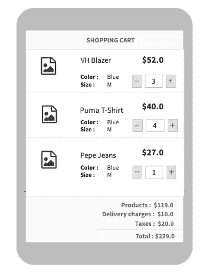

# 使用 Rxjava、Live Data 和 Kotlin 协同例程在 Android Room 中测试数据层

> 原文：<https://betterprogramming.pub/testing-the-data-layer-in-android-room-with-rxjava-live-data-and-kotlin-coroutines-62d20a8f977a>

## 单元测试房间数据库以构建健壮的应用程序

斯蒂芬·弗兰克在 [Unsplash](https://unsplash.com?utm_source=medium&utm_medium=referral) 上的照片

## 内容

*   为什么要从数据库层开始测试？
*   数据层概述
*   对数据库系统中的数据类型进行分类，并
*   使用流行的现有库(Jetpack、Rx 和 Coroutines)测试它们。

# 首先，为什么从数据库层开始测试？

无论您选择哪种架构，无论是 MVVM、MVP、MVC 还是 MVI，数据层都是变化最小的一层。在架构迁移期间，它几乎保持不变。

数据层具有最小的依赖性，这使得它非常容易测试。可以使用 Robolectric 对其进行单元测试(节省时间)

# 什么是数据层？

该层负责在网络请求和本地持久性(即房间数据库)的帮助下为应用程序提供数据。它构成了**表示/业务-** 层的基础。

## 数据层中的数据类型？

*   业务层可以通过两种方式请求数据:一次性数据和数据流。
*   一次性—您向数据库请求数据，它会返回一个值给您。
*   流——这基本上是一种*发布-订阅模式。*您没有向数据库请求数据，而是订阅了数据。数据库将通知您(*观察者*)特定数据值的任何变化。

我们将为 RxJava/RxKotlin、Coroutine 和 LiveData 添加测试用例。您可以直接跳到应用程序中正在使用的部分。

# **演示**

我们将考虑购物应用程序的一个部分，在这里您可以获得产品列表。您可以增加/减少购物车中产品的数量。实时*购物车数量*也被显示。

*   产品列表→一键操作。
*   实时购物车数量→数据流。当项目数量改变(增加/减少)时，它也会改变。

演示示例

# 使用 Rxjava 的房间数据库

## 正在创建 DAO(数据访问对象):

1.  插入是一个`Completable` 操作。
2.  产品检索的一次性操作是一个 `Single`操作。
3.  购物车金额的数据流是一个`Observable`

## **2。RxJava 中的测试**

RxJava test utils 提供了一个`.test()`方法。它在数据源上创建一个`TestObserver`并订阅它。因此，在订阅时，您可以立即从数据源获取值，因此，您可以检查该值。下面的例子说明了这一点。

**2.1 测试提取产品列表的一次性操作**

(请遵循代码中的注释)

**2.2 测试实时车载系统的数据流**

(请遵循代码中的注释)

# 使用协程的房间数据库

`Room`支持协同程序。查询在自定义调度程序上运行。协程以其顺序性而闻名。但是唯一的条件是函数必须是`suspend`函数。

## **创建 DAO(数据访问对象)**

1.  取出产品的一次性操作是一种`suspend function`。
2.  作为数据流的购物车金额被声明为`Double`的`Flow`。

## 2.室内测试-ktx

运行一个新的协程并阻塞当前线程，直到它完成。因此，所有的测试都应该封装在这个块中，以确保测试运行完成。

## 2.1 测试单次操作

代码如下:

## 2.2 测试数据流

代码如下:

# 使用 LiveData

## 创建 DAO(数据访问对象)

1.  插入和取出产品是正常的功能。确保在主线程上运行它。
2.  作为数据流的购物车金额被声明为`LiveData`

## 2.测试 LiveData

2.1 对于一次性操作，进行正常调用，确保运行主线程。

2.2 对于数据流，我们需要订阅实时数据。因为它不会发出值，除非它上面有活跃的观察者。我们在`LiveData`上有一个名为`getOrAwait()`的扩展函数，它可以即时给出 LiveData 的值。它是从[这个 GitHub 库](https://github.com/android/architecture-components-samples/blob/master/GithubBrowserSample/app/src/test-common/java/com/android/example/github/util/LiveDataTestUtil.kt)借来的。

代码如下:

感谢您阅读我的文章。