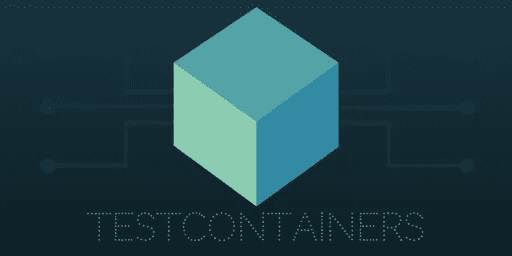

# 测试不可测试性——与遗留代码的斗争

> 原文：<https://betterprogramming.pub/testing-the-untestable-the-battle-with-legacy-code-fdc653847950>

## 遗留代码是现实生活的一部分。让我们看看一些策略来帮助我们驯服它。

[GR Stocks](https://unsplash.com/@grstocks?utm_source=medium&utm_medium=referral) 在 [Unsplash](https://unsplash.com?utm_source=medium&utm_medium=referral) 上拍照

遗留代码是现实生活的一部分。如此多的项目充斥着古老的构建工具、废弃的特性和最有问题的缺乏光泽的测试套件。通常情况下，遗留软件是一个成功项目的标志，一个带有许多来之不易的战斗的伤疤的项目。这也可能是不良实践的标志，一种没有给予足够时间或关心来健康成长的努力。

不管属于哪个阵营，遗留代码都是很难处理的。这令人沮丧，可能有风险，缺乏测试会让你焦虑得汗流浃背——你怎么知道你没有打破什么东西？你会尽可能少的改变，祈祷纸牌屋不会倒塌吗？

# 恢复理智的第一步

当面对遗留代码时，你可以采取一些步骤来恢复正常。第一步是找出软件的行为方式。这包括阅读文档和任何规范，对吗？根据赫鲁姆定律，情况可能并非如此。

> 有了足够数量的 API 用户，
> 你在合同中承诺什么并不重要:
> 你系统的所有可观察到的行为
> 都将依赖于某人。—赫鲁姆定律

软件做什么比它应该做什么更重要。在任何系统中，尤其是遗留系统，都会渗透出一些怪癖和“特征”。最后一分钟的需求被挤进来，从未被记录，随后被遗忘。在程序变得更好之前，我们需要确定我们知道它在做什么。

# 表征测试

在我职业生涯的早期，我很高兴(或不高兴)为一个以前由“摇滚明星”工程师开发的应用程序工作。该产品已成为该公司产品线的关键，但开发商已不再抱有幻想，转而去玩其他玩具。该应用程序没有测试——没有测试！——到处都是各种各样的黑客。这导致代码高度耦合，难以分解。在我们修复软件之前，我们需要一个坚实的基础。

在 Michael Feathers 的书*有效地使用遗留代码*中，他提出了一种发现和保存系统真实行为的策略。

这涉及到书中的几个步骤:

> 1.在测试工具中使用一段代码。
> 
> 2.写一个你知道会失败的断言。
> 
> 3.让失败告诉你行为是什么。
> 
> 4.更改测试，使其预期代码产生的行为。
> 
> 5.重复

随着您添加越来越多的特性测试，您对代码的理解和确定性会增加，您对更改代码的信心也会增加。您可能会产生揭示错误或奇怪行为的测试——这很好，将它们标记为可疑的，以便以后审查。值得注意的是，我们并没有在这里编写黑盒测试。我们可以把测试的目标放在特定的代码区域，我们没有完全掌握的部分，以增加我们在那个区域的确定性。

特征化测试可以在单元测试或“可社交的单元测试”级别有效地使用，这样做可以获得速度、简洁、简单等通常的好处。然而，当单元被组合时，许多行为经常被揭示。而且，与经过良好测试的代码不同，遗留代码很可能是依赖关系和模糊职责的混合体，因此可能更难以隔离用于单元测试。

# 盒子中的遗产+测试容器

[Thoughtworks 技术雷达](https://www.thoughtworks.com/radar)始终是了解不断变化的行业趋势的绝佳信息源。几年前，他们包括了“盒子里的遗产”的想法——一种帮助开发者使用遗产软件的策略。

> 对于开发人员来说，处理遗留代码，尤其是大型的整体代码，是最不令人满意的、高摩擦的[体验之一。为了帮助减少摩擦，开发人员已经使用](https://thoughtworks.wistia.com/medias/ogq5b8d80y) [Docker](https://www.thoughtworks.com/en-gb/radar/platforms/docker) 容器来创建遗留系统及其配置的不可变映像。目的是将**遗产包含在一个盒子**中，供开发人员在本地运行，并消除重建、重新配置或共享环境的需要。— [Thoughtworks](https://www.thoughtworks.com/en-gb/radar/techniques/legacy-in-a-box) (我的编辑)

使用这种策略，我们在一个容器化的环境中捕获了一个由依赖关系支持的遗留应用程序的活版本。更重要的是，这些是不可变的映像，我们可以随意旋转和销毁——设置在任何地方看起来都一样，所以不再有“在我的机器上工作”

拼图的最后一块是我们如何成功地与这些容器互动。当然，您可以发出 shell 命令(docker/docker-compose ),但是还有更方便的方法。

Test Containers 是一个 Java 库，它简化了 docker 容器作为集成测试环境的使用。作为测试套件的一部分，它提供了方便的绑定来控制、戳/戳和观察正在运行的容器。事实证明，这是一个让事情变得简单的无价工具。

# 个案研究

让我们看一个简短的案例研究。首先，我们需要一个示例应用程序作为候选程序——请上前一步 [Spring Petclinic Rest 客户端](https://github.com/spring-petclinic/spring-petclinic-rest)。

现在，我并不是说示例 petclinic 应用程序是一个遗留应用程序，它会困扰您醒着的每一分钟——事实恰恰相反。但是，它确实有几个属性非常适合作为介绍性示例。

1.  这是一个有些复杂的应用程序(它不仅仅是一个微不足道的*【你好世界】*的逃避)。
2.  它有依赖关系和状态——一个 SQL 数据库。
3.  这是一个由别人编写的软件，所以我们可以从对项目知之甚少的基本原则开始集成它。

## 第一部分——把遗产装进盒子里

回想一下电影《捉鬼敢死队》的开头。捉鬼敢死队被召唤去调查一个喜欢美食的幽灵，它威胁着五星级 Sedgewick 酒店的 12 楼。在这里，它们遇到了第一个潜在的猎物——更苗条的。令酒店管理层惊恐的是，他们用质子束破坏了这个地方，但成功地缠住了鬼魂，并把它封在陷阱里。Slimer 被吞噬，被包容。

我们需要奋力一搏，将我们的遗留应用程序捕获到一个容器中，并防止它继续肆虐下去。这可能是这项任务中最困难的部分，但却是值得的。

在这种情况下，我们需要采取 3 个步骤来捕获陷阱中的应用程序。

1.  **将应用程序及其所有依赖项添加到 docker-compose**

我们需要在 docker-compose 文件中包含应用程序的所有依赖项。这表示允许应用程序运行的最小依赖集。

**2。了解应用程序并配置它及其依赖关系**

在这个阶段，我们有一个环境，其中有几个相互忽略的独立进程。我们需要了解如何配置应用程序，以便它连接到它的依赖项。这可能完全通过环境变量来实现，如下例所示，也可能需要将配置文件装入容器中。

**3。协调启动**

我们仍然有一个关于启动的竞争条件。如果应用程序的启动速度比数据库快，它很可能会失败，这里就是这种情况。

我们必须引入一个 shim 来帮助我们编排正确的启动顺序。这项工作的一个绝佳工具就是[*wait-it . sh*](https://github.com/vishnubob/wait-for-it)*。*我们可以将它注入到现有的映像中，以阻止应用程序的启动，直到 MySQL 启动并运行。在这种情况下，这就足够了，但是您可能需要添加其他设置脚本。

## 第 2 部分—用测试容器连接到您的测试装具

现在我们已经成功地创建了我们的测试工具，我们可以开始连接测试了。这就是测试容器发挥作用的地方。我们所要做的就是将它指向我们刚刚创建的`docker-compose.yml`，它会处理与 docker 本身的所有交互。这包括等待，直到所需的端口可供使用。

我们可以开始使用这个库来检查我们正在运行的应用程序的环境。在下面的例子中，我们得到了每个服务运行的主机/端口。注意—这些是映射端口，以避免服务器上的冲突，因此在每次后续运行时都会发生变化。

## 生产性测试开发侧记

Test Containers 在每次测试运行时都会产生一个新的测试工具。然而，每次运行测试时都创建一套全新的容器是不可取的。这样做将导致每次测试执行有 20-30 秒的启动延迟。我们希望对我们所做的改变有快速的、几乎是即时的反馈——其他任何事情都可能导致挫败感。

在过去，我使用一个简单的模式来获得两个世界的好处。通过将任何容器逻辑封装在一个*环境*接口之后，我们能够支持两种不同风格的容器交互。

`**TestEnvironment**`——这是默认的环境，将所有的责任卸载到测试容器上，就像我们之前看到的那样。

`**DevEnvironment**` —一旦打开，它将查找符合特定标准(名称、港口等)的现有集装箱。然后，测试将使用这些容器，而不是启动一组新的容器，并在这个过程中节省大量的引导成本。这里的责任是让您在开发过程中使用 docker-compose 客户机自己管理环境。

如果你对此感兴趣，请点击[链接查看工作示例](https://github.com/lucas-matt/blog-legacy-in-a-box/tree/main/src/test/groovy/com/notmattlucas/box/part2b/env)。

## 第 3 部分—编写测试

我们有一个工作环境，并且可以连接到它，现在是时候写一个测试了，这真的很简单。

使用一些 Spock，我们简单地将 REST 客户机指向测试容器提供的环境，然后我们就可以开始了。

我们甚至可以通过回调应用程序来检查状态，从而做出断言。

哦，但是等等，如果我们运行测试不止一次，我们会失败。状态在测试之间进行，我们需要给套件增加一些隔离。

## 第 4 部分—夹具和测试隔离

添加测试隔离同样微不足道。就像我们将 REST 客户端连接到应用程序一样，我们也可以对数据库进行同样的操作。在每次测试之前，我们可以将数据库重置为已知状态。

为了实现这一点，让我们让*环境*接口返回一个 MySQL 实用程序对象来封装常见的数据库功能。该实用程序有一个简单的`#clear`函数，它遍历少量的数据库表，并在测试执行之前将其分解。

# 一锤定音

这里有许多其他模式可以用来提供帮助，例如如何处理异步调用，但是我们将把这些留到下一次讨论。希望这已经让你很好地体会到了什么是可以实现的。

使用这种整体策略，有可能为遗留项目增加重要的测试覆盖和理解。一旦你有了一个基线，那么是时候引入其他的软件开发实践来重构应用程序了，你会有新的信心，你不会破坏任何东西。目标是使应用程序足够规范化，这样您就可以开始更多地依赖标准实践，更少地进行特性测试。当你到达那一点时，你可以开始剥去挽具，它已经完成了它的工作。

Test Containers 本身是一个丰富的库，不仅仅在这个场景中使用。我鼓励您看一下文档，更深入地了解它所提供的功能。

感谢阅读！

# 进一步阅读

*   [有效地使用遗留代码](https://www.oreilly.com/library/view/working-effectively-with/0131177052/)
*   [测试容器](https://www.testcontainers.org/)
*   [遗留在盒子里的东西](https://www.thoughtworks.com/radar/techniques/legacy-in-a-box)
*   [等一下](https://github.com/vishnubob/wait-for-it)