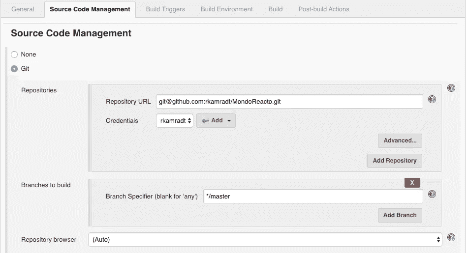
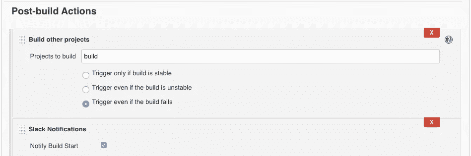
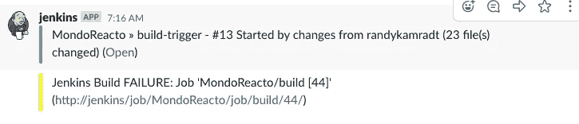

# 管道测试

> 原文：<https://betterprogramming.pub/testing-with-pipelines-bd8c5422430a>

## 找出漏洞并拧紧螺栓


照片由[金奎大·穆伊吉](https://unsplash.com/@daanmooij?utm_source=unsplash&utm_medium=referral&utm_content=creditCopyText)在 [Unsplash](https://unsplash.com/s/photos/leak?utm_source=unsplash&utm_medium=referral&utm_content=creditCopyText) 上拍摄

在我的[上一篇文章](https://medium.com/better-programming/more-playing-with-pipelines-24a97f136722)中，我整合了一个构建和部署三个独立微服务的管道。但是我作弊了:所有的测试阶段都是占位符。让我们增加一些测试。

在您开始之前，我们最终将标记 GitHub repo，因此如果您想继续，并且您还没有使用过自己的 repo，您可能想要分叉我的 repo，以便您可以包括标记步骤。到这两个库的链接在文章的底部。

这些年来，我对考试的看法有了很大的变化。我曾经热衷于单元测试。当构建 monoliths 时，单独测试每个部分对于尽早发现错误非常重要，并且单独测试每个部分的唯一方法是通过单元测试。现在在微服务领域，每个组件都能够单独运行，并且可以在(半)真实环境中单独自动测试。不再模拟数据库或 HTTP 调用；只需部署到环境中，并在每次推送代码时自动进行测试。

我认为单元测试仍然很重要，尤其是对于可重用的库。没有人愿意使用没有经过彻底测试的代码库。但是在我一直从事的 MondoReacto 项目中，绝大多数代码是由 [Spring](https://spring.io/) 和其他第三方库提供的。唯一留给我测试的就是手头微服务的独特逻辑。

我还没有真正谈过 MondoReacto 项目。这是我在使用反应式 Java 时的实验，具体来说就是 [projectreactor.io](https://projectreactor.io/) (因此得名，MondoReacto)。反应式编程是一种非阻塞的、事件驱动的、流畅的编程风格。任何熟悉 Java 8 中引入的 [Java 流库的人都应该对这种风格如鱼得水。下面是读取 HTTP POST 调用并将其写入消息总线的片段(在本例中是](https://www.oracle.com/technetwork/java/javase/8-whats-new-2157071.html) [Kafka](https://kafka.apache.org/) )。

这是怎么回事？在反应式编程中，我们处理`Flux` es 和`Mono` s，但是它们非常类似于`Stream` s。在上面的代码片段中，我们只看到了`Mono` s，它是最多只能处理一个元素的`Flux` es 的特例。

由于这段代码采用单个元素`payload`，对其进行转换，将其发送给 Kafka，并返回 Kafka 的状态代码，因此我们可以使用`Mono<Input>`和`Mono<String>`作为我们的输入和输出。Spring 的 [WebFlux 库](https://docs.spring.io/spring/docs/current/spring-framework-reference/web-reactive.html)处理`Flux`和`Mono`的输入和输出，并将它们映射到一个非阻塞的 HTTP 服务器(在本例中是 [Netty](https://netty.io/) )。

我们的逻辑只是将数据从输入转换到输出，所以相对简单。我们将`Input`转换为`String`，将`String`转换为`ProducerRecord`，最后将`ProducerRecord`转换为`SenderRecord`。我们将它作为最后的转换传递给 Kafka sender，一个`Mono<SenderRecord>`，它返回一个`Flux<SenderResult>`。因为我们知道我们只有一个记录，我们可以通过`publishNext`操作符将它从`Flux<SenderResult>`转换为`Mono<SenderResult>`，并将`SenderResult`转换为适合从我们的岗位返回的`String`。

熟悉 Java 流库的人都知道，除非有终端操作符，否则什么都不会发生。构建的流只是简单地获取添加到流中的函数(转换或过滤器),并保存它们以供以后处理。反应堆库也是如此。它保存一个转换或过滤器列表，然后一旦订阅了`Flux`或`Mono`，它就将数据单元从一个传递到下一个。在我们的例子中，订阅发生在 Kafka 接收方的 send 方法中，该方法终止第一个流并返回第二个流，该流是在 Netty 的内部深处订阅的，因此我们从未看到任何一个订阅。

使这一切顺利运行的关键是管道中的 map 或 filter 方法都不允许阻塞:没有可能阻塞 I/O 的数据库调用或文件读取。所有调用必须是异步的，为了等待响应，我们需要产生一个发布者，反应式系统知道如何处理它。幸运的是，有很多使用这种范式的库，比如上面代码片段中的 WebFlux HTTP 控制器和 Kafka 接口。在大多数情况下，我们需要做的就是把这些片段连接起来。

让我们来看一个测试片段。我正在使用 [Cucumber.io](https://cucumber.io/) 作为使用小黄瓜语言的测试平台。我要测试 MonodoReacto 项目的第一阶段，上面已经描述过了，取一个 HTTP POST，把数据发给 Kafka。以下是我对小黄瓜的描述:

```
Feature: Incoming input is passed to message queue

  Scenario: Good input is passed to message queue
    Given a good input value
    When the incoming service post is called
    Then the return value should be 202
    And the input value should be found on the message queue
```

每个步骤都应该有一个底层代码来执行它。以下是“当呼叫服务岗时”的步骤代码:

下面是执行“应该在消息队列中找到输入值”步骤时调用的代码:

同样，这是一个过滤器和地图的组合。我真希望有一个过滤器/贴图的组合，我经常用它来去掉空的`Optionals`。末尾的`publishNext`暗示我们只寻找下一个匹配的项目，而`.filter(i -> i.equals(inputValue))`确保只有匹配的项目通过。其余的被丢弃，并且在第一个发布后订阅被终止。

我真正想要的是一个反应式的测试平台，这样每一步都会返回一个带有数据的`Mono`，这些数据将被发送到下一步。因为我没有，所以我不得不进行大量的阻塞，并猜测每个阻塞的超时时间。

所以我们都准备好了。(我将在本文底部链接实际代码。)现在我们需要在上一篇文章中创建的管道中运行它。我们将把构建测试添加到 [Jenkins](https://jenkins.io/) 构建管道中。我将在一个步骤中构建应用程序和测试，然后启动部署管道。但是首先，我想要一种在代码以真正的 CI/CD 方式改变时触发构建的方法。

不过，有个问题。Jenkins 通常会触发为其设置的存储库的更改。我们的构建管道是为构建存储库设置的。我们可以合并我们的构建库和代码库，但是我喜欢关注点的清晰分离。因此，我将创建一个新的管道来查看代码回购，但除了启动构建管道之外什么也不做。我还将向自己发送一个 Slack 通知，告知构建已被触发。这是供应链管理部分:



下面是构建触发器部分:


注意，我必须轮询 SCM。我的 Jenkins 主机在我的防火墙后面，所以我无法让 GitHub 自动触发它。在我积极开发的时候，它被设置为大约每五分钟一次，但是一旦我的繁重开发工作完成，我会把它放下或者移除。我敢肯定，如果世界上每个 GitHub 用户每五分钟进行一次投票，这将构成 DDOS 攻击。

最后，我将触发构建管道，并在构建被触发时给自己发送一个 Slack 通知。(您需要安装和配置 Slack 插件才能工作)。



接下来，我将修改构建管道，以便它构建应用程序和测试映像，然后触发部署管道。这是第一部分:

构建…映像和启动…服务阶段将为其他每个微服务复制:`incoming-persist`和`incoming-read-service`。我还必须复制`desc/incoming-service-test.yaml`来描述`incoming-persist-test`和`incoming-read-service-test`微服务的 yamls。最后，在`Jenkinsfile`的末尾，我将添加另一个延迟通知。

```
post {
        always {
            slackSend (color: '#FFFF00', message: "Jenkins Build ${currentBuild.currentResult}: Job '${env.JOB_NAME} [${env.BUILD_NUMBER}]' (${env.BUILD_URL})")
        }
    }
```

现在，我将对 MondoReacto 项目进行更改，并在构建开始和停止时得到通知:



哎呀！(*悲伤的长号声*)至少你有一个失败构建的链接。原来我不小心将 git 命令复制到了每个阶段，它失败了，因为它拒绝覆盖旧的 repo。我删除了除第一个 git 命令之外的所有命令，但是这带来了另一个问题。这些工作节点会逗留一段时间，并保持存储库的存在。我们应该能够删除管道末端的存储库来防止这种情况发生。但是现在，在重启管道之前，我将删除多余的 git 命令并删除 maven worker pod。再跑一次就成功了！


此外，它还启动了三条部署管道，每条管道大约错开一分钟。


只有传入服务测试有效。正如我在上一篇文章中所说，MondoReacto 是 WIP。我会在其他测试中解决这些问题，不会用细节来烦你。MondoReacto 项目对我来说是一个了解反应式编程的学习项目，在测试中可能有一些幼稚的用法。

接下来:我想在存储库和图像通过管道时对其进行标记，这样我就知道哪个版本是最后通过不同阶段的。我还希望在不同阶段之间进行更多的测试，也许是一些性能测试。我希望有一个像[基巴纳](https://www.elastic.co/kibana)好前端更好的日志记录。

但是，现在，我有一个管道来为三个不同的环境构建、测试和部署三个独立的微服务，所有这些都是通过推送 GitHub 来触发的。本文的管道脚本可以在这里找到:[https://github.com/rkamradt/MondoReactoBuild/tree/v1.2](https://github.com/rkamradt/MondoReactoBuild/tree/v1.2)，代码可以在这里找到:[https://github.com/rkamradt/MondoReacto/tree/1.1](https://github.com/rkamradt/MondoReacto/tree/1.1)