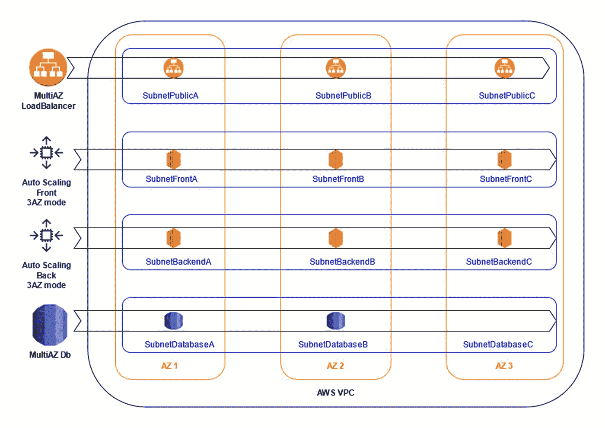
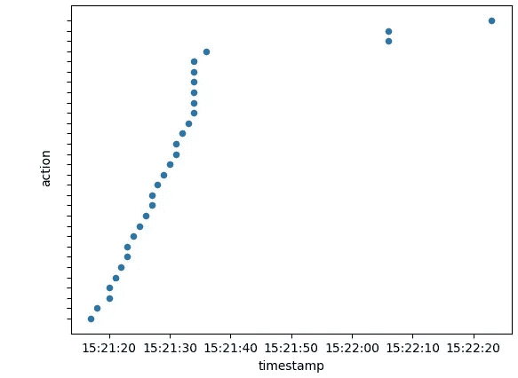

# 使用 DRP 测试您的 AWS 基础设施

> 原文：<https://betterprogramming.pub/testing-your-aws-infrastructure-with-a-drp-d723cf27d59e>

## 让我们构建一个强大而稳健的体系结构来达到您的服务级别协议


亚历克斯·库利科夫在 [Unsplash](https://unsplash.com?utm_source=medium&utm_medium=referral) 上拍摄的照片。

您几乎已经准备好将您的应用程序投入生产，但是每个人都在问一个问题:该应用程序能够抵御灾难吗？

假设您熟悉 AWS 和 Python，今天我将讨论如何在 AZ 失败时快速测试您的应用程序。

# 1.体系结构

对于此示例，我选择了三层(前/后/数据库)的三 AZ infra-super classic。使用的技术有:

*   VPC
*   EC2 自动缩放组
*   EC2 负载平衡器
*   RDS 多 AZ 数据库



基础设施概述

正如你在上面看到的，所有的物品都通过所有的区域 az 退回。理论上，我们有一个健壮的架构，可以随时处理 AZ 故障。

# 2.方案

你可能知道，我们不能要求 AWS 关闭整个数据中心。因此，我们需要找到某种替代方案来虚拟地终止一个可用性区域。

假设你有一些其他产品链接到你的主应用，比如监控工具，日志集中系统等。，首先要做的就是阻止所有进出我们 AZ 的网络流量。一个简单的解决方案是创建一个新的网络 ACL，拒绝所有的入/出流量，并将其与我们的子网相关联。

然后，你想终止，不要在堕落 AZ 中产生任何实例。终止实例很简单。对于 ASG，您还需要修改所有项目的配置，以便删除请求的子网。

最后，如果有一些数据库实例在不需要的数据库子网上运行，您需要强制进行数据库实例的故障转移…

蛋糕上的糖衣将是测试后的自动回滚。为什么没有一个所有行动的时间表呢？

这些是我们创建自己的虚拟 DRP 所需的项目:

*   NACL
*   ASG 配置修改
*   数据库故障转移
*   反转
*   动作跟踪

# 3.工具

由于 AWS 为您提供了大量的 SDK，您或多或少可以自由选择执行上述任务的语言。我的建议是选择一个你熟悉的并且适合脚本的。就我而言，我会选择 Python，原因如下:

*   对于几乎所有习惯编写脚本的人来说，它更容易阅读。
*   它有一些强大的库，在这里很有用(pandas，matplotlib)。
*   与 shell 脚本相比，使用 AWS API 响应非常方便。
*   Boto3 是一个很好的工作框架。

# 4.IAM 权限

在这里，我强烈建议为您的 DRP 使用专门的 IAM 角色。为什么？

1.  在 CloudTrail 中可以很容易地跟踪 API 调用，作为测试的证据。
2.  该角色可以根据需要打开/关闭，只是为了执行 DRP。
3.  你控制着所有的强制许可。

说到权限，下面是使用脚本时需要的权限:

```
**EC2**: describe_availability_zones / describe_instances / terminate_instances / describe_subnets / describe_vpcs / describe_network_acl / create_network_acl / create_network_acl_entry / replace_network_acl_association / delete_network_acl**RDS**: describe_db_instances / reboot_db_instance**ASG**: describe_auto_scaling_groups / update_auto_scaling_group
```

现在让我们来谈谈脚本。GitHub 上提供了全部内容(文章底部的链接)，所以我将在这里总结一下它的关键概念。

脚本主要是一个 Python 类，允许您与 AWS APIs 进行交互。

## 关键概念

每次你调用一个方法，你初始化一个新的客户端。例如，如果我调用`describeASG()`方法，我用一个关联的会话名初始化一个 ASG 客户端(从下到上阅读要点):

我们如何通过使用自定义名称创建会话来轻松跟踪我们的操作

每个动作都被登录到一个熊猫`DataFrame`中。`DataFrame`给了我们一些很好的灵活性来画出我们行动的时间表。在`__main__`中，每当我们执行一个动作，我们就增加我们的`DataFrame`。最后，我们绘制了一个基本图，包括执行的操作和时间表。



请注意，该示例中的操作已被删除。

该脚本遍历所有可用的 az。它首先执行所有“关闭”操作。然后，当准备就绪时，它也会为您回滚到初始配置。

因为这个脚本有很多方法，我将在后面简要描述它们，给你所有可能的方法。为了让您更好地理解每个项目，每个功能都添加了简短描述:

通过 DRP 类公开的方法

现在您已经拥有了几乎所有的东西(类、工具、逻辑、IAM 权限、要测试的基础设施)，您只需要使用脚本场景中的所有东西，正如在`__main__`函数中所描述的:

DRP 场景

正如您在上面看到的，我们正在遍历我们区域的所有 AZ。然后我们应用下一个场景:

*   我们首先创建一个网络 ACL，拒绝来自 AZ 子网的所有流量。这有两个主要后果:首先，您的实例将无法与“外部”通信这意味着您应该在外部工具中看到它们离线。第二，在这个 AZ 上无法平衡流量，这基本上会迫使负载平衡器将流量路由到其他 AZ 实例。
*   然后我们编辑所有 ASG 配置。我们还保存配置，以便在回滚时能够将一切恢复到正常状态。
*   我们终止所有 AZ 实例。即使您应该总是使用自动缩放，您也可以运行一些额外的 EC2 实例。他们也会被终结。
*   灾难通过强制数据库故障切换结束(如果数据库处于多 az 模式)。
*   最后，我们回滚我们的修改(删除 NACL 并恢复 ASG 配置)。

# 结论

本文到此为止。我希望你喜欢它。如果您有任何建议/改进，请随时评论。下面，你可以看到完整的 GitHub 项目和 AWS 架构良好的实验室，作为所有工作的参考。

[](https://github.com/gmariette/aws_drp) [## gmariette/aws_drp

### 使用这个 drp 脚本测试您的基础结构，从 DRP 类更改您想要到达的 aws_account。第一个…

github.com](https://github.com/gmariette/aws_drp)  [## 级别 300:测试 EC2、RDS 和 AZ 的弹性

### 您的浏览器不支持视频，或者如果您在 GitHub head 上…

www.wellarchitectedlabs.com](https://www.wellarchitectedlabs.com/reliability/300_labs/300_testing_for_resiliency_of_ec2_rds_and_s3/) 

感谢阅读。下一篇文章再见！