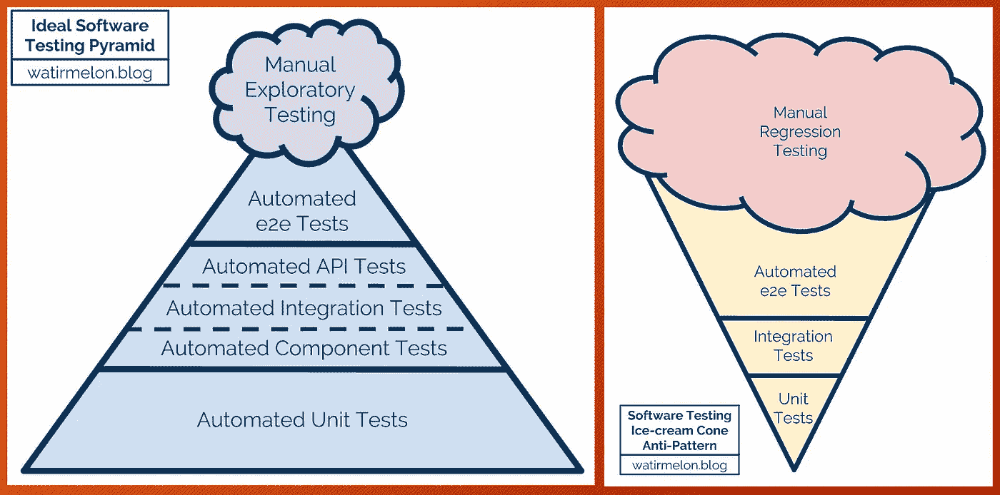
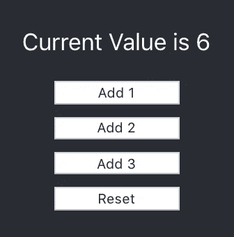

# 在 React 中测试您的组件

> 原文：<https://betterprogramming.pub/testing-your-components-in-react-967abda02396>

## **测试工具、测试渲染器和 React 测试库的演练**



图片由 watirmelon.blog 提供

软件测试提供了关于被测试软件质量的信息。

测试有很多种。单元测试隔离程序的每个部分，并验证各个部分是正确的——它具有最窄的范围和最大数量的测试用例。集成测试是将单个软件模块作为一个组进行组合和测试的阶段——它的范围最广，测试用例最少。

在上图的[中，左边是推荐测试金字塔，右边是测试雪糕筒，要避开。](https://watirmelon.blog/melon-of-knowledge/testing-pyramids/)

我们已经写了一个关于如何测试和模拟异步调用的单元测试用例的指南。本文重点介绍如何用 React 测试库测试 React 组件，它涵盖了单元测试和集成测试。

# **历史**

[Jest](https://github.com/facebook/jest) 是一个 JavaScript 测试框架，确保任何 JavaScript 代码库的正确性。因为 Jest 和 React 都是由脸书创建和维护的，所以使用 Jest 测试框架来测试 React 代码是一种常见的做法。

React 团队提供了两种测试 React 组件的方法:[测试工具](https://reactjs.org/docs/test-utils.html) ( `react-dom/test-utils`)和[测试呈现器](https://reactjs.org/docs/test-renderer.html) ( `react-test-renderer`)。这些包不足以进行生产级测试，但是它们是更高级的测试库和框架的良好基础。

React 团队推荐[酶](https://airbnb.io/enzyme/)和 [React 测试库](https://testing-library.com/react)。

*   Enzyme 是一个 JavaScript 测试工具，用于测试 React 组件。它促进了单元和集成测试。它有内置的方法来操作和遍历虚拟 DOM，以及模拟动作和事件。它允许我们断言呈现的组件按预期工作。它提供了三种测试方式:浅层、挂载和渲染。
*   React 测试库通过软件的使用方式来测试 React 组件。它促进了单元和集成测试。测试用例对代码变化是健壮的。由于 React 测试库没有为独立的测试提供 API，所以模仿通常是浅层测试的方式。[创建 React App](https://medium.com/better-programming/10-fun-facts-about-create-react-app-eb7124aa3785) 预配置了 React 测试库。

# 测试实用程序

以下是 Create React App 提供的`App.test.js`:

Test utilities ( `react-dom/test-utils`)提供了 16 个实用 API 来帮助测试。在下面的代码中，我们在第六行使用`renderIntoDocument`来替换上面`App.test.js`中的第六到第七行。第七行验证`<App />`是否为元素，第八行验证`<App />`是否为元素，类型是否为`App`。

如果您的代码执行状态更新，您必须将代码包装在`act()`中:

```
act(() => {
  renderIntoDocument(<App />, div);
});
```

# 测试渲染器

测试渲染器(`react-test-renderer`)用于将 React 组件渲染为纯 JavaScript 对象，而不依赖于 DOM 或原生移动环境。它提供了 19 个 API。

为了使用测试渲染器，`react-test-renderer`需要作为`[devDependencies](https://medium.com/better-programming/package-jsons-dependencies-in-depth-a1f0637a3129)`安装在`package.json`中:

```
"devDependencies": {
  "react-test-renderer": "^16.13.1"
}
```

这是修订后的 App.test.js，带有测试渲染器:

第七行打印出呈现的树:

第八行打印出代表被渲染的树的对象:

```
{ type: 'div',
  props: { className: 'App' },
  children: [{ type: 'header', props: [Object], children: [Array] }]
}
```

测试渲染器是快照测试的基础。一个典型的快照测试用例渲染一个 UI 组件，拍摄快照，保存在`__snapshots__`目录下作为引用。一个测试用例将新的快照与引用进行比较，并验证 UI 没有意外更改。

# 反应测试库

React 测试库建立在`react-test-renderer`之上。比较快照的测试，以下语法比测试渲染器略简单:

为了使用 React 测试库，`@testing-library/react`和`@testing-library/jest-dom`通常被添加到`package.json`文件中的`devDependencies`中。

```
"devDependencies": {
  "@testing-library/jest-dom": "^5.5.0",
  "@testing-library/react": "^10.0.2",
}
```

*   `@testing-library/react`在`react-dom`和`react-dom/test-utils`之上提供照明实用功能。
*   `@testing-library/jest-dom`提供了一组自定义的笑话匹配器，如`toBeDisabled`、`toHaveAttribute`、`toHaveFormValues`。这些匹配器关注元素的属性、文本内容、CSS 类等等。它使得 expect 语句更具声明性、可读性和可维护性。

## 例子

我们创建一个例子来说明如何使用 React 测试库。

以下是 UX 的设计为例。最初，当前值为 0。如果点击`Add 1`按钮，当前值增加 1。如果点击`Add 2`按钮，当前值增加 2。如果点击`Add 3`按钮，当前值上升 3。如果点击`Reset`按钮，当前值被重置为 0。



## 源代码

我们修改了`App.js`来实现这个例子。

在上面的代码中，按钮和实用程序被定义在单独的文件中，以模拟真实世界的复杂性。

`AddButton.js`导出默认组件:

`ResetButton.js`使用命名导出:

Utils.js 还使用命名导出:

## 快照测试

我们为修改后的`App.js`写一个快照测试。

以下是生成的快照内容，包含所有 DOM 元素:

然后，我们添加了`AddButton`和`ResetButton`的模拟:

从下面生成的快照内容中，我们可以看到内容已经从 34 行缩短到 22 行。这就是我们如何做浅层渲染来隔离测试。你可以想象如果`AddButton`和`ResetButton`都是复杂的组件，我们会节省多少时间。

## 互动测试

React 测试库测试代码的方式与用户使用代码的方式相同。它提供 API 来模拟操作。下面的测试用例点击`Add 1`、`Add 2`和`Add 3`按钮，并验证结果为`6`。

在上面的测试用例中，它使用`getByTestId`来检索`resultDiv`。按钮是在其他 JavaScript 源代码中定义的，其中可能没有提供测试 id。`getByText`用于检索元素。

这里，`getByTestId`和`getByText`从渲染结果中被析构。

在下面的测试用例中，我们从`@testing-library/react`模块中导入`getByTestId`和`getByText`。然后调用需要指定确切的容器。这个测试用例点击`Add 2`和`Reset`按钮，并验证结果为`0`。

在上面的例子中，我们嘲讽了`AddButton`和`RestButton`。`Utils`功能怎么样？也可以嘲笑它们来简化逻辑:

# 结论

React 附带了测试实用程序和测试渲染器。React 测试库是 React 团队推荐的。我们修改了 Create React 应用程序，以提供快照测试用例和交互式测试的示例。这些测试用例在 Create React 应用程序存储库中运行。您可以用调用`react-scripts test`的`npm run test`来执行它们。

享受 React 测试库的乐趣！

感谢阅读。我希望这有所帮助。你可以在这里看到我的其他媒体出版物[。](https://medium.com/@jenniferfubook/jennifer-fus-web-development-publications-1a887e4454af)