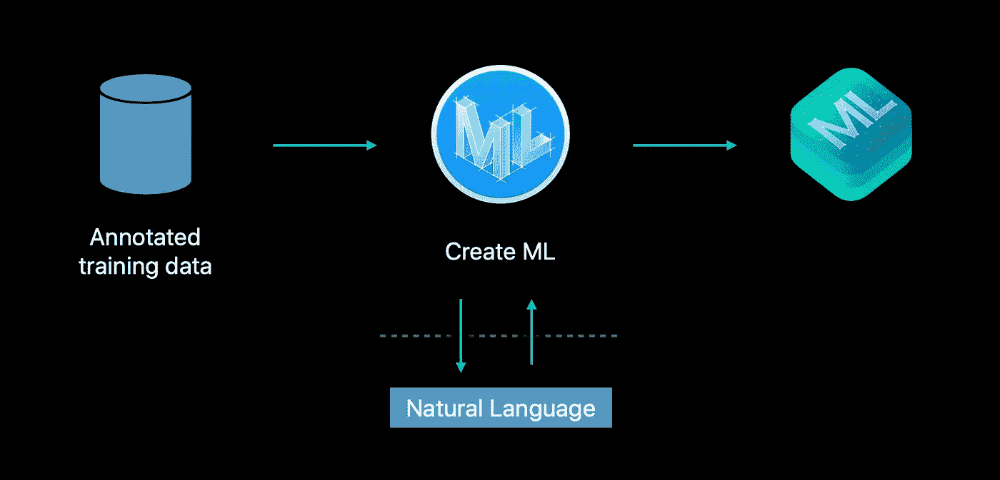
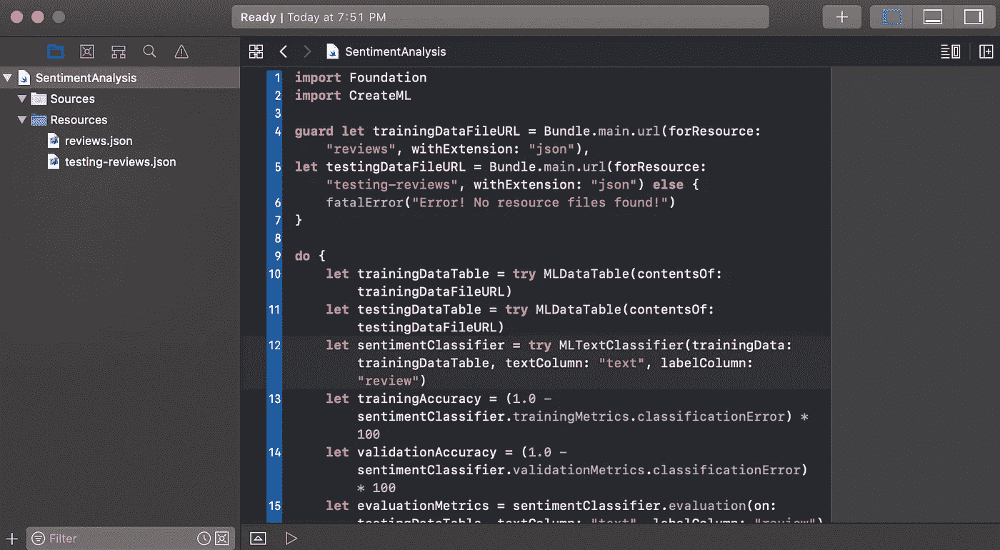
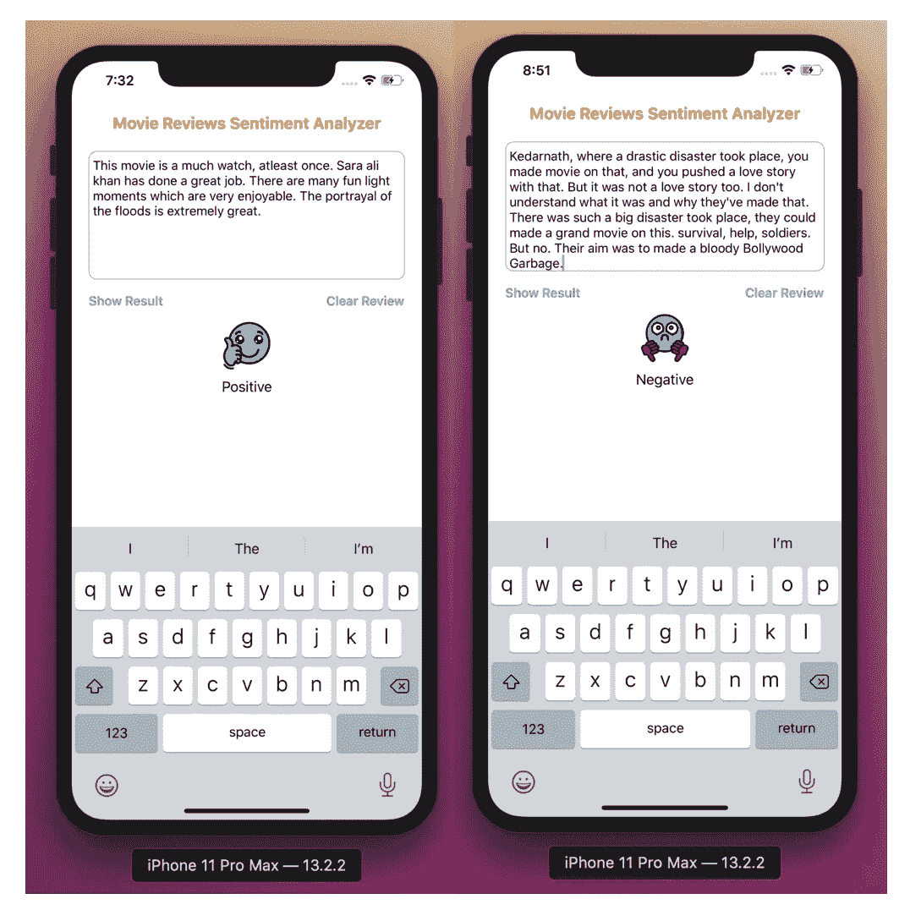

# 使用核心 ML 2、NLP 创建文本分类器，并在 Swift 中创建 ML

> 原文：<https://betterprogramming.pub/text-classifier-using-coreml-2-nlp-and-createml-6d5c9f456b35>

## 影评的情感分析


查尔斯·🇵🇭在 [Unsplash](https://unsplash.com/s/photos/movie?utm_source=unsplash&utm_medium=referral&utm_content=creditCopyText) 上拍摄的照片

首先，一些定义:

*   自然语言:分析自然语言文本，并推断其特定于语言的元数据。
*   [创建 ML](https://developer.apple.com/documentation/createml) :让你构建、训练和部署机器学习模型，不需要机器学习专业知识。
*   [Core ML](https://developer.apple.com/documentation/coreml) 型号捆绑到应用中，有助于推动智能特性。



我们将训练一个可用于对电影评论进行情感分析的模型。

我们将使用 Create ML 在使用 Xcode 和 Swift 的计算机上训练机器学习模型。我们将在 iOS 应用程序中使用训练好的模型。这个应用程序告诉我们一个电影评论是积极的还是消极的。

# 训练模型

分类器应该用大量标记的文本数据来训练。Create ML 可以处理来自 JSON 或 CSV 文件并标记为文件夹结构的训练文本数据。

Create ML 在移动设备上不起作用，我们需要创建一个 macOS 游乐场。

*   打开 Xcode，*文件→新建→游乐场→ macOS →空白*。点击*下一步。*
*   给它起一个合适的名字，点击*创建*。

## 使用 JSON

*   训练数据由来自 IMDB 的电影评论及其对应的情感标签组成。
*   我们将建立两个`MLDataTable`实例:一个训练数据表，保存训练数据集的内容；一个测试数据表，保存用于测试训练好的分类器的数据。
*   取消隐藏游乐场中的导航器，并将`reviews.json`和`testing-reviews.json`文件拖到`Resources`文件夹中。



*   我们将从主包中加载`trainingDataFileURL`和`testingDataFileURL`。
*   在我们的 JSON 文件中，我们有包含文本和评论的条目。正文就是复习正文，结果告诉我们复习是负面的还是正面的。

*   我们将创建一个`MLDataTable`实例来开始训练过程。`MLDataTable`初始化器获取训练数据文件的 URL，并用训练 JSON 文件的内容创建一个数据表。
*   以类似的方式为测试数据创建一个数据表。
*   训练过程从创建文本分类器实例开始。初始化器需要训练数据表作为输入，我们还需要提供文本和结果列的名称。

## 使用带标签的文件夹结构

*   这里，我们将使用带标签的文件夹结构，即在名为`positive`和`negative`的文件夹中使用单独的文本文件。如果我们有一个文本文件的集合，这就很好了。
*   我们将通过提供目录文件夹的路径来加载`trainingDataDirectory` URL。

*   训练过程从创建文本分类器实例开始。初始化器需要存储在一组目录中的训练集。

# 后续步骤

对于这两种方法中的任何一种，请在上述步骤之后执行以下步骤。

*   让我们建造并经营操场。用提供的训练数据创建一个`MLTextClassifier`只需要几秒钟。我们可以在控制台日志中跟踪进度。
*   我们必须创建一个核心 ML 模型文件，这样我们就可以在我们的应用程序中使用分类器模型。我们可以通过调用`MLTextClassifier`的`write(to:, metadata:)`实例方法来实现。该方法接受核心 ML 模型文件的路径和文件名，以及包含模型附加信息的元数据实例。
*   请确保更新路径，使其成为您计算机上的有效路径。

# iOS 演示应用

让我们开始在 Swift 中开发 iOS 应用程序的 Xcode 项目。

1.  将`MovieReviewsClassifier.mlmodel`拖到 Xcode 项目中。
2.  在故事板中，创建一个视图，用`UITextView`表示回顾文本，`UIButtons`表示结果和清除文本，`UIImageView`和`UILabel`表示结果。
3.  ``MovieReviewsClassifier``类是为相应的模型自动生成的。
4.  导入[自然语言](https://developer.apple.com/documentation/naturallanguage)框架。
5.  创建一个类型为`NLModel`的惰性属性，并传入`MovieReviewsClassifier`的模型
6.  通过调用`predictedLabel(for:)` 实例方法获得预测。该方法可能返回训练数据中使用的情感标签之一。使用 switch 语句找出情感标签。

```
**if** **let** label = sentimentClassifier?.predictedLabel(for:        **self**.movieReviewText.text) {
   **switch** label {
     **case** "pos":
          //Positive
     **case** "neg":
          //Negative"
     **default**:
          //Neutral
}}
```

参考 GitHub 上的[完整 Xcode 项目。](https://github.com/talreja-priya/SentimentAnalyzer-Swift)

运行应用程序，编写/粘贴评论，点击*显示结果*评估评论。



谢谢你。希望这有帮助！