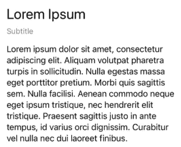
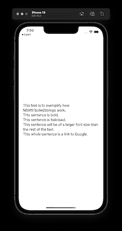
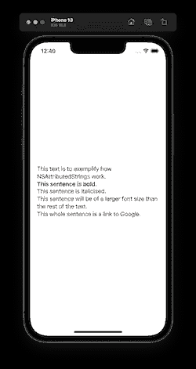
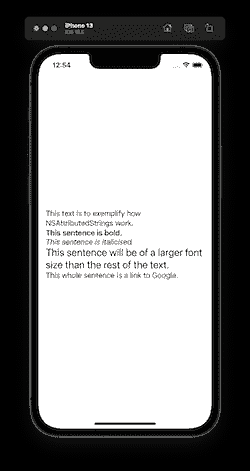
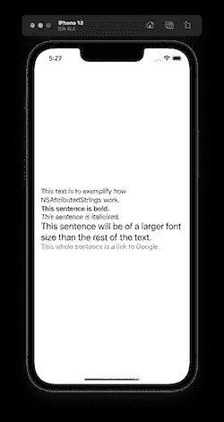
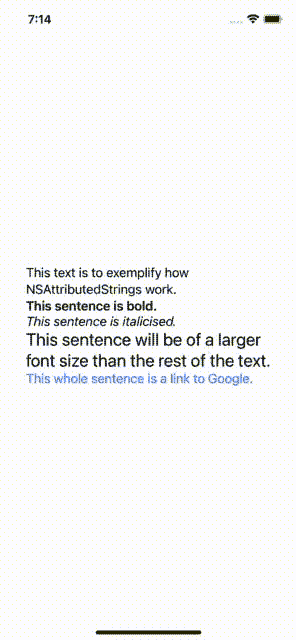

# 带有 AttributedString 的 iOS 和 SwiftUI 中的文本格式

> 原文：<https://betterprogramming.pub/text-formatting-in-ios-and-swift-with-attributedstring-e821536fbdec>

## 斯威夫特伊

## 了解如何在 iOS 上对文本进行加粗、斜体、高亮显示等操作


桑迪·米勒在 [Unsplash](https://unsplash.com?utm_source=medium&utm_medium=referral) 上拍摄的照片

我们的 iOS 屏幕上通常会有多个不同属性的标签。有的会加粗，用大字号；我们称这些标题为我们的屏幕。有些字体会更小，可能是灰色的，比普通字体更薄(或更浅)；我们称之为字幕。这些属性适用于单个标签中的所有文本。



一个屏幕中多个标签的示例

如果你想**强调文本中间的一个单词**(使**加粗**)该怎么办？我们应该创建多个标签吗？每一种都有自己的属性并一起使用？如果我们想将整个链接中的一段文字变成一个链接，以便在我们的应用程序中打开网络浏览器，该怎么办？我们应该开始把按钮和标签放在一起使用吗？


带链接、强调和斜体的文本示例

你可以想象，这可能会变得非常复杂。那么有没有更好的办法呢？是的有！AttributedStrings 允许我们在一个标签中的一段文本上做所有的和更多的事情。

在本教程中，我将向您展示如何在 [SwiftUI](https://developer.apple.com/documentation/swiftui/) 中属性化字符串并在标签(文本视图)上显示它们。我假设您熟悉 Swift 和 [SwiftUI](https://developer.apple.com/documentation/swiftui/) 的基础知识。

*我在本文中使用了 Swift 5.6.1 和 Xcode 13.4.1。*

# 如何使用 AttributedString 格式化和显示格式化文本

在本节中，我们将从下载一个已经存在的 iOS 应用程序项目开始。该项目是一个简单的应用程序，有一段需要格式化的文本。然后，我们将格式化文本，并使用 [AttributedStrings](https://developer.apple.com/documentation/foundation/attributedstring) 添加属性，并显示这些属性。

以下是我们将要采取的步骤:

1.  下载入门包
2.  使用[属性字符串](https://developer.apple.com/documentation/foundation/attributedstring)显示字符串
3.  将字体属性添加到[属性字符串](https://developer.apple.com/documentation/foundation/attributedstring)
4.  将链接属性添加到[属性字符串](https://developer.apple.com/documentation/foundation/attributedstring)

我们开始吧！

# 1.下载入门包

在本教程中，我们将使用一个现有的 iOS 应用程序项目来举例说明如何使用[attributed string](https://developer.apple.com/documentation/foundation/attributedstring)。让我们下载一个已经存在的 iOS 应用程序项目。打开终端并运行以下命令:

```
cd $HOME
curl [https://github.com/anuragajwani/attributed_string_intro/archive/starter.zip](https://github.com/anuragajwani/attributed_string_intro/archive/starter.zip) -L -o starter.zip -s
unzip -q starter.zip
cd attributed_string_intro-starter/AttributedStringTut
open -a Xcode AttributedStringTut.xcodeproj
```

在`ContentView.swift`运行应用程序或预览。这是应用程序的当前状态:



请注意，像“这个句子是粗体的”这样的句子目前不会以粗体显示。我们将通过本教程解决这个问题。

# 2.使用 AttributedString 显示字符串

在这一步，我们将把显示的文本从一个简单的[字符串](https://developer.apple.com/documentation/swift/string)转换成一个[属性字符串](https://developer.apple.com/documentation/foundation/attributedsubstring)。打开`ContentView.swift`。将`myText`房产替换为:

```
**let** myText: AttributedString = {
    **let** text = """
               This text is to exemplify how NSAttributedStrings work.
               This sentence is bold.
               This sentence is italicised.
               This sentence will be of a larger font size than the rest of the text.
               This sentence is a link to Google.
               """
    **var** attributedString = AttributedString(text)
    **return** attributedString
}()
```

上面我们已经将`myText`的房产类型从`String`变更为`AttributedString`。在`ContentView`初始化时，将执行[关闭](https://docs.swift.org/swift-book/LanguageGuide/Closures.html)，结果将存储在`myText`属性中。

运行应用程序或重新运行预览，您将不会看到应用程序的任何视觉变化。这是因为我们已经将我们的[字符串](https://developer.apple.com/documentation/swift/string)包装在 AttributedString 中，但是我们没有为它提供任何属性。我们将在下一步中这样做。

**注意**我们不需要在`ContentView`内对`body`做任何修改。 [SwiftUI](https://developer.apple.com/documentation/swiftui/) 中的[文本](https://developer.apple.com/documentation/swiftui/text)视图接受[字符串](https://developer.apple.com/documentation/swift/string)和[属性字符串](https://developer.apple.com/documentation/foundation/attributedstring)而无需对代码进行任何修改。

# 3.向 AttributedString 添加字体属性

在这一步中，我们将在需要的地方给我们的`myText`属性添加粗体、斜体和大字体属性。让我们从课文的第二句开始。我们会把这句话加粗。

为了使第二个句子加粗，我们需要知道句子开始的索引和句子结束的索引。一种方法是在[属性字符串](https://developer.apple.com/documentation/foundation/attributedstring)中使用`[range(of: _)](https://developer.apple.com/documentation/foundation/attributedstring/3813128-range)`函数。在行`**var** attributedString = AttributedString(text)`和`**return** attributedString`之间添加以下行:

```
**let** rangeOfBold = attributedString.range(of: "This sentence is bold.")!
```

在“应用粗体属性”旁边，在上一行之后添加以下行:

```
attributedString[rangeOfBold].font = .boldSystemFont(ofSize: 17)
```

重新运行应用程序或预览，你会注意到第二句现在是粗体。



我们现在将对斜体和更大的字体属性重复这个过程。在应用粗体属性的行之后添加以下行:

```
**let** rangeOfItalic = attributedString.range(of: "This sentence is italicised.")!
attributedString[rangeOfItalic].font = .italicSystemFont(ofSize: 17)**let** rangeOfLargeFont = attributedString.range(of: "This sentence will be of a larger font size than the rest of the text.")!
attributedString[rangeOfLargeFont].font = .systemFont(ofSize: 23)
```



# 4.向 AttributedString 添加链接属性

在这一节中，我们将只链接文本的最后一句话，用 Google 打开浏览器。

应用大字体大小属性后，添加以下行:

```
**let** rangeOfLink = attributedString.range(of: "This sentence is a link to Google.")!
attributedString[rangeOfLink].link = URL(string: "https://www.google.com")
```

上面我们做了类似的操作，当我们应用粗体，斜体和大字体时。我们首先找到想要应用链接的文本的[范围](https://developer.apple.com/documentation/swift/range)，然后为其设置[链接](https://developer.apple.com/documentation/foundation/attributescopes/foundationattributes/3764633-link)属性。链接属性接受一个 [URL](https://developer.apple.com/documentation/foundation/url) 值。



重新运行应用程序，点击蓝色文本。它将在 Safari 中打开 Google。



# 摘要

在这篇文章中，我们了解到:

*   如何将不同的属性应用于同一标签中文本的不同部分

# 最后的想法

你可以在我的报告中找到本教程的源代码:

[](https://github.com/anuragajwani/attributed_string_intro) [## GitHub-anuragajwani/attributed _ string _ intro

### 此时您不能执行该操作。您已使用另一个标签页或窗口登录。您已在另一个选项卡中注销，或者…

github.com](https://github.com/anuragajwani/attributed_string_intro) 

你也可以在苹果的文档中找到适用的[属性的完整列表。](https://developer.apple.com/documentation/foundation/attributescopes)

在这篇文章中，我向你展示了`[AttributedStrings](https://developer.apple.com/documentation/foundation/attributedstring)`允许我们简化[字符串](https://developer.apple.com/documentation/swift/string)不同部分的属性。但是，如果您不知道需要归属的确切文本，该怎么办呢？例如，你从网上检索一段可能是 HTML 格式的文本；或者可能是一段降价格式的文本。在这些情况下，苹果会为你提供保障。我将在以后的文章中讨论这些内容。

如果你在文本上使用自定义标记，那么你可能需要使用[正则表达式](https://en.wikipedia.org/wiki/Regular_expression)。这将允许您确定需要标记的文本范围，并应用必要的属性。我将在以后的帖子中介绍 Swift 中的[正则表达式](https://en.wikipedia.org/wiki/Regular_expression)。

```
**Want to Connect?**For more on iOS development follow me on [Twitter](https://twitter.com/anuragajwani?source=post_page---------------------------)!
```