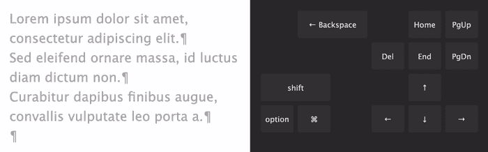
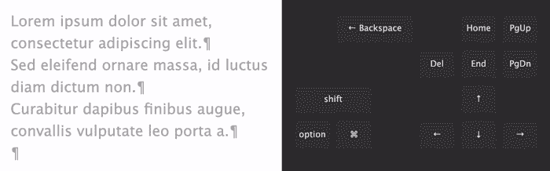
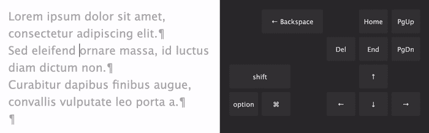
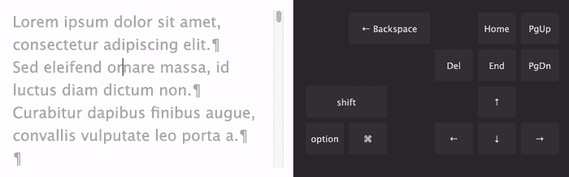
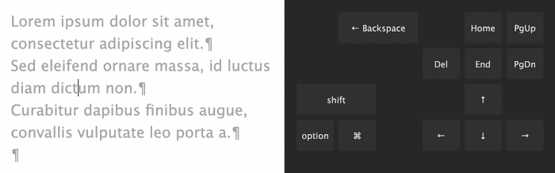
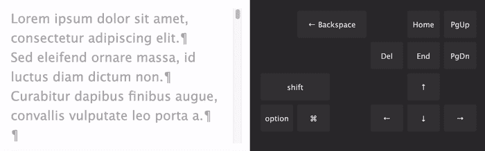
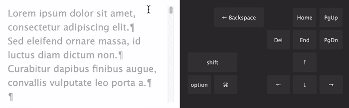
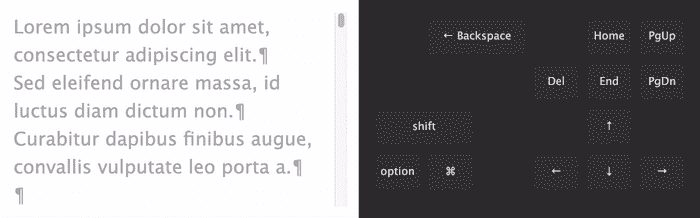

# 每个计算机用户都应该知道的文本操作快捷键

> 原文：<https://betterprogramming.pub/text-manipulation-shortcuts-that-every-computer-user-should-know-6064e5b3fa9>

## 当你打字的时候放下你的鼠标

照片由[艾莉·史密斯](https://unsplash.com/@creativegangsters?utm_source=medium&utm_medium=referral)在 [Unsplash](https://unsplash.com?utm_source=medium&utm_medium=referral) 上拍摄

如果你在写作的时候不停地触摸鼠标，请停下来。

您可以轻松删除一行或选择一个单词，而无需将手离开键盘。这有便捷的捷径。学习它们，提高你的生产力。

我将向您展示基本文本编辑器和 web 中可用的组合，包括 Medium 的故事编辑器。

动画显示特定于 Mac 的键。

Windows/Linux 用户:请使用`control`键代替`option`键(除非另有说明)。

# 选择文本— Shift +箭头

只要您按住`shift`键，它就会选择插入符号开始和结束位置之间的文本。

# 在单词之间移动插入符号— Option +左/右箭头

与左/右箭头结合的`option`键在单词的开头和结尾之间移动插入符号。

# 在行与行之间移动插入符号— Option +向上/向下箭头

*   Windows/Linux: 列位置被保留。
*   Mac: 它在行首和行尾之间移动插入符号。

带有上/下箭头的`option`键在实际的行之间跳转(换行符是分隔符)。

# 选择单词/行— Option + Shift +箭头键

使用`option`和`shift`来逐字或逐行选择文本。

# 将插入符号移动到“可见”行的开始/结尾— CMD +左/右箭头

Windows/Linux: `home/end`。

类似于`option`键，但指的是可见行(不管换行位置)。对于展开的线，`cmd(⌘)`和`option`的行为相同。

# 删除插入符号后面的单词— Option +退格

# 删除插入符号前面的单词— Option + Delete

# 在页面间移动插入符号

*   视窗:`pageup/pagedown`
*   Mac: `option+pageup/pagedown`

在 Mac 上，`pagedown`和`pageup`仅滚动视图。按住`option`键也可以移动插入符号。

# 选择整个页面— Shift + Pageup/Pagedown

# 将插入符号移动到文档的开头或结尾— CMD +向上/向下箭头

Windows/Linux: `control+home/end`

# 选择文档开头或结尾的文本

只需在前面的例子中添加一个`shift`。

愿捷径与你同在。